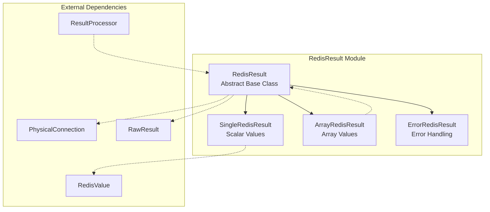
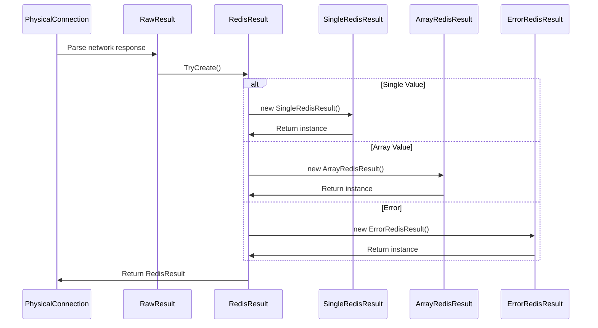
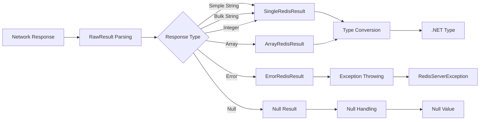
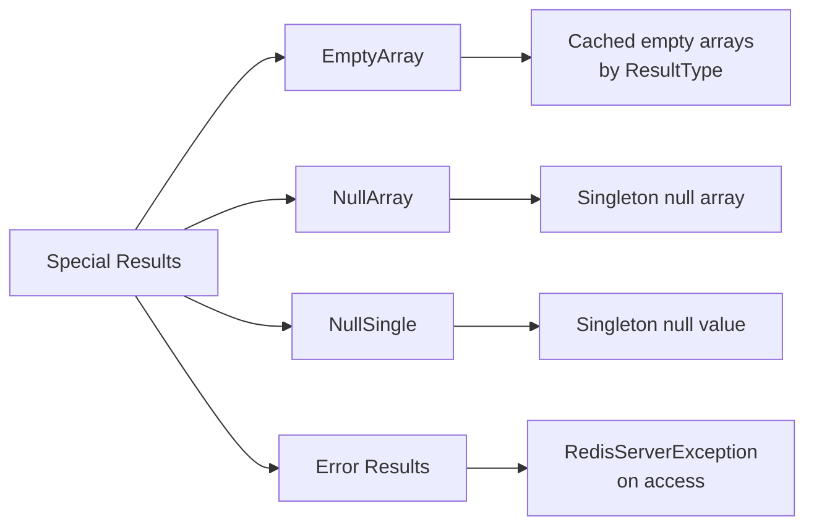
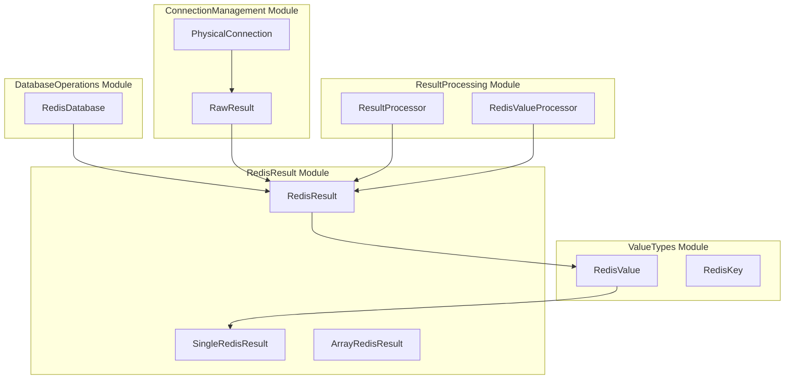
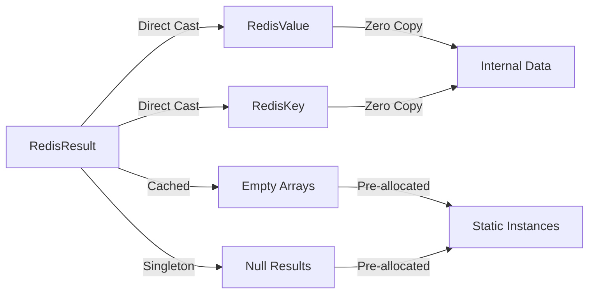

# RedisResult Module Documentation

## Overview

The RedisResult module is a fundamental component of the StackExchange.Redis library that provides a unified representation of Redis command responses. It serves as the primary abstraction for handling the diverse range of data types and structures returned by Redis operations, offering seamless type conversion and data access capabilities.

## Purpose and Core Functionality

The RedisResult module addresses the critical need for a flexible, type-safe way to handle Redis responses that can vary from simple strings and integers to complex arrays and nested data structures. It provides:

- **Unified Response Handling**: A single abstraction for all Redis response types
- **Type-Safe Conversions**: Implicit and explicit casting to .NET primitive types and collections
- **Protocol Compatibility**: Support for both RESP2 and RESP3 Redis protocols
- **Memory Efficiency**: Optimized internal representations for different data types
- **Error Handling**: Graceful handling of Redis errors and null responses

## Architecture and Component Relationships

### Core Components

The module consists of three primary components:

1. **RedisResult** (abstract base class)
2. **SingleRedisResult** (concrete implementation for scalar values)
3. **ArrayRedisResult** (concrete implementation for array values)
4. **ErrorRedisResult** (internal error handling implementation)

### Architecture Diagram



### Component Interactions



## Data Flow and Processing

### Response Processing Pipeline



### Type Conversion Flow

```mermaid
graph TD
    RedisResult[RedisResult] --> String[string]
    RedisResult --> ByteArray[byte[]]
    RedisResult --> Int32[int]
    RedisResult --> Int64[long]
    RedisResult --> UInt64[ulong]
    RedisResult --> Double[double]
    RedisResult --> Boolean[bool]
    RedisResult --> RedisValue[RedisValue]
    RedisResult --> RedisKey[RedisKey]
    
    RedisResult --> StringArray[string[]]
    RedisResult --> ByteArrayArray[byte[][]]
    RedisResult --> Int32Array[int[]]
    RedisResult --> Int64Array[long[]]
    RedisResult --> DoubleArray[double[]]
    RedisResult --> BooleanArray[bool[]]
    RedisResult --> RedisValueArray[RedisValue[]]
    RedisResult --> RedisKeyArray[RedisKey[]]
    RedisResult --> RedisResultArray[RedisResult[]]
```

## Key Features and Capabilities

### 1. Factory Methods

The RedisResult class provides static factory methods for creating instances:

```csharp
// Create from single value
RedisResult.Create(RedisValue value, ResultType? resultType = null)

// Create from array of values
RedisResult.Create(RedisValue[] values)
RedisResult.Create(RedisValue[] values, ResultType resultType)
RedisResult.Create(RedisResult[] values)
RedisResult.Create(RedisResult[] values, ResultType resultType)

// Create from specialized types
RedisResult.Create(RedisKey key)
RedisResult.Create(RedisChannel channel)
```

### 2. Type Conversion Operators

Comprehensive set of explicit conversion operators:

**Scalar Types:**
- `string?`, `byte[]?`, `double`, `long`, `ulong`, `int`, `bool`
- `double?`, `long?`, `ulong?`, `int?`, `bool?`
- `RedisValue`, `RedisKey`

**Array Types:**
- `string?[]?`, `byte[]?[]?`, `double[]?`, `long[]?`, `ulong[]?`
- `int[]?`, `bool[]?`, `RedisValue[]?`, `RedisKey[]?`, `RedisResult[]?`

### 3. Protocol Support

- **RESP2 Compatibility**: Traditional Redis protocol support
- **RESP3 Support**: Next-generation Redis protocol with extended types
- **Type Detection**: Automatic protocol type detection and handling

### 4. Special Result Types



## Integration with System Architecture

### Relationship to Other Modules



### Usage in Database Operations

The RedisResult module is extensively used throughout the DatabaseOperations module:

- **Command Execution**: All Redis commands return RedisResult instances
- **Result Processing**: [ResultProcessor](ResultProcessing.md) components convert RedisResult to specific types
- **Transaction Support**: Transaction results are wrapped in RedisResult
- **Script Operations**: Lua script execution results use RedisResult

### Connection Layer Integration

The PhysicalConnection class uses RedisResult for:
- **Response Parsing**: Converting network responses to RedisResult
- **Error Handling**: Wrapping Redis errors in ErrorRedisResult
- **Protocol Handling**: Supporting both RESP2 and RESP3 protocols

## Performance Considerations

### Memory Optimization

1. **Cached Instances**: Empty arrays and null results are cached to reduce allocations
2. **Lazy Evaluation**: Type conversions are performed on-demand
3. **Struct Usage**: RedisValue is a struct to minimize heap allocations
4. **Array Pooling**: Internal arrays use ArrayPool for memory efficiency

### Conversion Efficiency



## Error Handling

### Error Result Processing

The ErrorRedisResult class provides specialized error handling:

- **Exception Throwing**: All type conversions throw RedisServerException
- **Error Preservation**: Original error message is maintained
- **Type Safety**: Prevents accidental use of error results

### Null Handling

- **Null Arrays**: Distinguished from empty arrays
- **Null Values**: Proper null propagation in conversions
- **Default Values**: Appropriate defaults for value types

## Best Practices

### 1. Type Checking

Always check result types before conversion:

```csharp
if (!result.IsNull)
{
    var value = (string)result;
}
```

### 2. Array Handling

Use Length property to check array results:

```csharp
if (result.Length > 0)
{
    var array = (string[])result;
}
```

### 3. Error Handling

Wrap conversions in try-catch for potential Redis errors:

```csharp
try
{
    var value = (long)result;
}
catch (RedisServerException ex)
{
    // Handle Redis error
}
```

### 4. Protocol Awareness

Use appropriate protocol properties:

```csharp
var resp2Type = result.Resp2Type;
var resp3Type = result.Resp3Type;
```

## Extension Points

### Custom Result Processors

Implement custom processors by extending ResultProcessor:

```csharp
public class CustomProcessor : ResultProcessor<MyType>
{
    protected override bool SetResultCore(PhysicalConnection connection, 
        Message message, in RawResult result)
    {
        // Custom processing logic
    }
}
```

### Dictionary Conversion

Use ToDictionary for key-value pair results:

```csharp
var dict = result.ToDictionary(StringComparer.OrdinalIgnoreCase);
```

## Related Documentation

- [RedisValue](RedisValue.md) - Core value type used by RedisResult
- [ResultProcessing](ResultProcessing.md) - Result processing components
- [PhysicalConnection](PhysicalConnection.md) - Network connection handling
- [DatabaseOperations](DatabaseOperations.md) - Database operation implementations
- [ValueTypes](ValueTypes.md) - Value type system overview