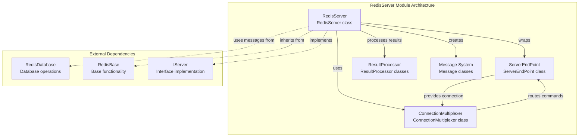
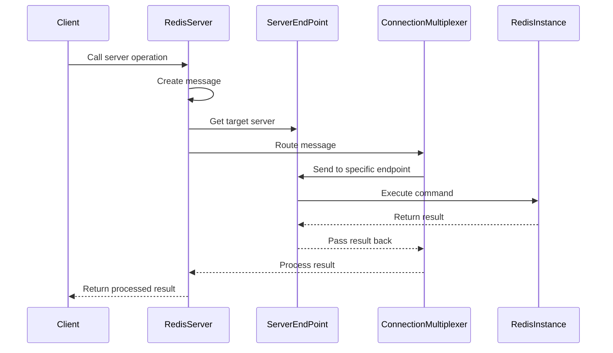
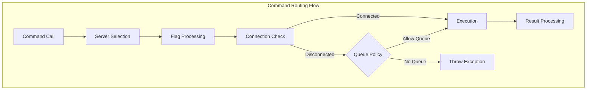

# RedisServer Module Documentation

## Introduction

The RedisServer module provides comprehensive server-level operations and management capabilities for Redis instances within the StackExchange.Redis client library. It serves as the primary interface for executing administrative commands, monitoring server health, managing replication, and performing cluster operations. This module implements the `IServer` interface and provides both synchronous and asynchronous APIs for all server-level Redis operations.

## Architecture Overview

The RedisServer module is built around the `RedisServer` class, which acts as a wrapper around a specific `ServerEndPoint` instance. It provides a rich set of server management operations while maintaining connection state and handling command routing through the underlying connection multiplexer.



## Core Components

### RedisServer Class

The `RedisServer` class is the main implementation of the `IServer` interface. It provides server-level operations including:

- **Server Information**: Version, features, connection status
- **Client Management**: Client listing, killing, and monitoring
- **Configuration Management**: Config get/set operations
- **Database Operations**: Flush operations, database size queries
- **Replication Management**: Master/slave operations, role management
- **Cluster Operations**: Cluster node information and management
- **Monitoring**: Info commands, slowlog, latency monitoring
- **Scripting**: Script loading and execution
- **Sentinel Support**: Sentinel operations for high availability

### KeysScanEnumerable Class

A specialized enumerable implementation for scanning keys across databases. It provides:

- **Cursor-based Scanning**: Implements Redis SCAN command with cursor support
- **Pattern Matching**: Supports key pattern matching during scans
- **Pagination**: Handles large key sets with configurable page sizes
- **Async Enumeration**: Supports both synchronous and asynchronous enumeration

### ScanResultProcessor Class

A specialized result processor for handling SCAN command results:

- **Result Parsing**: Parses SCAN command responses into structured data
- **Cursor Extraction**: Extracts and processes cursor information
- **Key Array Processing**: Handles variable-length key arrays from scan results

## Data Flow Architecture



## Key Features and Capabilities

### Server Management

The RedisServer module provides comprehensive server management capabilities:

```mermaid
graph LR
    subgraph "Server Management Features"
        A[Server Information]
        B[Client Management]
        C[Configuration]
        D[Database Operations]
        E[Replication]
        F[Clustering]
        G[Monitoring]
        H[Scripting]
        
        A --> A1[Version Info]
        A --> A2[Features]
        A --> A3[Connection Status]
        
        B --> B1[Client List]
        B --> B2[Client Kill]
        B --> B3[Connection Tracking]
        
        C --> C1[Config Get/Set]
        C --> C2[Config Rewrite]
        C --> C3[Statistics Reset]
        
        D --> D1[Database Size]
        D --> D2[Flush Operations]
        D --> D3[Key Scanning]
        
        E --> E1[Role Management]
        E --> E2[Replication Setup]
        E --> E3[Master/Slave Operations]
        
        F --> F1[Cluster Nodes]
        F --> F2[Slot Information]
        F --> F3[Cluster Configuration]
        
        G --> G1[Info Commands]
        G --> G2[Slowlog]
        G --> G3[Latency Monitoring]
        G --> G4[Memory Stats]
        
        H --> H1[Script Load]
        H --> H2[Script Execute]
        H --> H3[Script Management]
    end
```



### Connection and Command Routing

The module implements sophisticated connection management and command routing:



## Integration with Other Modules

The RedisServer module integrates with several other modules in the StackExchange.Redis library:

### ConnectionManagement Module
- **ServerEndPoint**: Provides the underlying server connection and state
- **ConnectionMultiplexer**: Handles message routing and connection pooling
- **PhysicalBridge**: Manages physical connection to Redis instances

### DatabaseOperations Module
- **RedisDatabase**: Shares message creation and execution patterns
- **ScriptLoadMessage**: Reuses database message types for script operations

### ResultProcessing Module
- **ResultProcessor**: Uses specialized processors for different result types
- **Custom Processors**: Implements server-specific result processing (e.g., ClusterNodes, Info)

### MessageSystem Module
- **Message Creation**: Creates appropriate messages for server commands
- **Command Routing**: Uses message system for command execution

## Usage Patterns

### Basic Server Operations

```csharp
// Get server instance
var server = connectionMultiplexer.GetServer("localhost:6379");

// Server information
var version = server.Version;
var features = server.Features;
var isConnected = server.IsConnected;

// Client management
var clients = server.ClientList();
server.ClientKill(endpoint);

// Configuration
var config = server.ConfigGet("maxmemory");
server.ConfigSet("maxmemory", "1gb");
```

### Database Management

```csharp
// Database operations
var dbSize = server.DatabaseSize(0);
server.FlushDatabase(0);
server.FlushAllDatabases();

// Key scanning
var keys = server.Keys(0, "user:*", 100);
await foreach (var key in server.KeysAsync(0, "user:*", 100))
{
    // Process key
}
```

### Replication and Clustering

```csharp
// Replication management
var role = server.Role();
server.ReplicaOf(masterEndpoint);
await server.ReplicaOfAsync(null); // Become master

// Cluster operations
var clusterConfig = server.ClusterNodes();
```

### Monitoring and Diagnostics

```csharp
// Server information
var info = server.Info();
var slowlog = server.SlowlogGet(10);
var latency = await server.LatencyLatestAsync();

// Memory and performance
var memoryStats = server.MemoryStats();
var allocatorStats = server.MemoryAllocatorStats();
```

## Error Handling and Resilience

The RedisServer module implements several resilience patterns:

### Connection Failure Handling
- **Graceful Degradation**: Handles disconnected servers based on configuration
- **Queue Policies**: Configurable behavior when connections are unavailable
- **Retry Logic**: Built-in retry mechanisms for transient failures

### Command Validation
- **Feature Detection**: Validates command availability based on server features
- **Permission Checks**: Enforces admin permissions for sensitive operations
- **Parameter Validation**: Validates input parameters before execution

### Result Processing
- **Safe Defaults**: Provides safe default values for failed operations
- **Exception Translation**: Converts Redis errors to appropriate .NET exceptions
- **Result Validation**: Validates and processes results safely

## Performance Considerations

### Efficient Scanning
- **Cursor-based Operations**: Uses SCAN instead of KEYS for large datasets
- **Configurable Page Sizes**: Allows tuning of scan operation batch sizes
- **Memory Pooling**: Uses array pooling for temporary allocations

### Connection Optimization
- **Server-specific Routing**: Routes commands directly to target servers
- **Flag Optimization**: Adjusts command flags based on server state
- **Connection Reuse**: Leverages existing connections through multiplexer

### Async Operations
- **True Async I/O**: Provides genuine asynchronous operations
- **Task Optimization**: Uses efficient task completion patterns
- **Cancellation Support**: Supports cancellation tokens for long-running operations

## Security Considerations

### Admin Operations
- **Permission Enforcement**: Requires admin mode for sensitive operations
- **Command Validation**: Validates commands against security policies
- **Audit Logging**: Supports logging of administrative operations

### Connection Security
- **Endpoint Validation**: Validates server endpoints before connection
- **Authentication**: Leverages multiplexer authentication mechanisms
- **SSL/TLS Support**: Supports secure connections through configuration

## Extensibility Points

The RedisServer module provides several extensibility points:

### Custom Result Processors
- **Processor Registration**: Allows custom result processors for new commands
- **Type Safety**: Maintains type safety with generic processors
- **Error Handling**: Provides consistent error handling patterns

### Command Extensions
- **Raw Command Execution**: Supports execution of custom Redis commands
- **Parameter Flexibility**: Accepts various parameter types
- **Result Flexibility**: Returns flexible result types

### Monitoring Integration
- **Counter Access**: Provides access to server performance counters
- **Event Subscription**: Supports subscription to server events
- **Metrics Collection**: Enables collection of server metrics

## Related Documentation

- [ConnectionManagement](ConnectionManagement.md) - Connection and multiplexer management
- [DatabaseOperations](DatabaseOperations.md) - Database-level operations
- [ResultProcessing](ResultProcessing.md) - Result processing and type conversion
- [MessageSystem](MessageSystem.md) - Message creation and routing
- [Configuration](Configuration.md) - Configuration options and providers
- [CoreInterfaces](CoreInterfaces.md) - Interface definitions and contracts