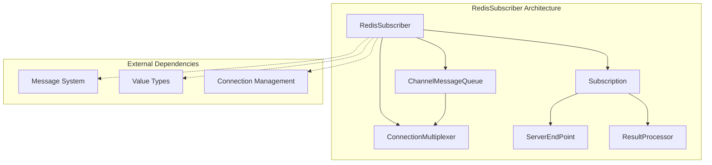
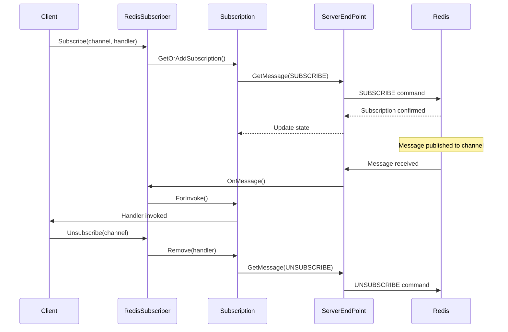
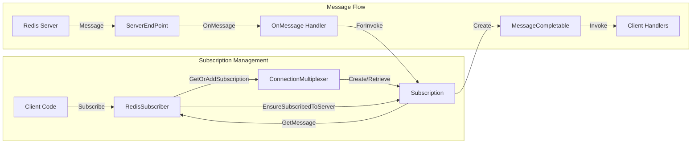
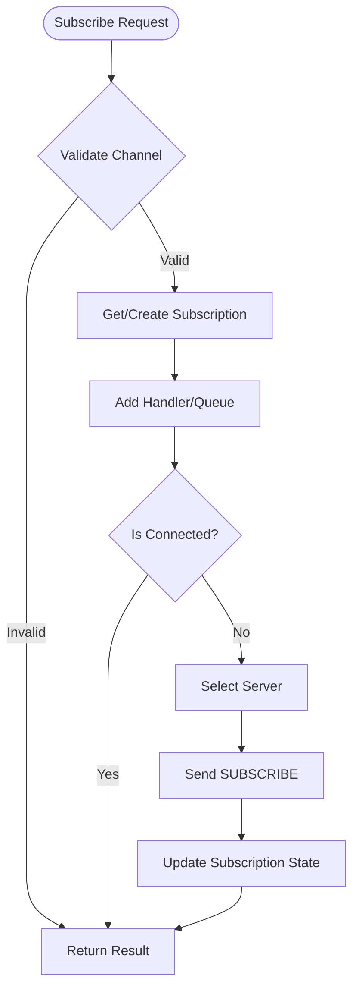
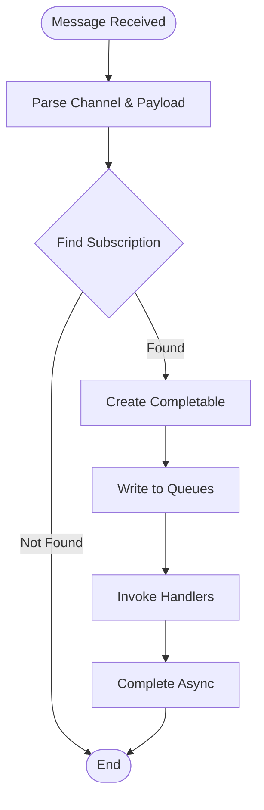

# RedisSubscriber Module Documentation

## Introduction

The RedisSubscriber module is a core component of the StackExchange.Redis library that implements Redis Pub/Sub (Publish/Subscribe) functionality. It provides a robust, high-performance implementation for real-time message broadcasting and subscription management in Redis-based applications. The module handles channel subscriptions, message routing, and connection management while supporting various Redis Pub/Sub commands including pattern-based subscriptions and sharded pub/sub operations.

## Architecture Overview

The RedisSubscriber module is built around a sophisticated architecture that separates subscription state management from message processing, enabling efficient multi-handler support and reliable connection handling.



## Core Components

### RedisSubscriber Class

The `RedisSubscriber` class is the primary implementation of the `ISubscriber` interface, providing both synchronous and asynchronous methods for Pub/Sub operations. It acts as a wrapper around the `ConnectionMultiplexer` and manages subscription state through a collection of `Subscription` objects.

**Key Responsibilities:**
- Channel subscription and unsubscription management
- Message publishing to channels
- Subscription state tracking and connection management
- Pattern-based and sharded subscription support
- Message queue management for async consumption

### Subscription Class

The `Subscription` class represents a single channel subscription and manages the relationship between Redis channels and their handlers. It supports multiple handlers per channel and maintains connection state to ensure reliable message delivery.

**Key Features:**
- Multi-handler support per channel
- Connection state management with `ServerEndPoint` tracking
- Command generation for SUBSCRIBE/UNSUBSCRIBE operations
- Support for pattern-based (PSUBSCRIBE) and sharded (SSUBSCRIBE) subscriptions
- Thread-safe handler management

### ChannelMessageQueue Class

The `ChannelMessageQueue` provides an async enumerable interface for consuming messages from subscribed channels. It implements `IAsyncEnumerable<ChannelMessage>` and supports both synchronous and asynchronous message processing patterns.

**Capabilities:**
- Async message consumption with `ReadAsync()`
- Synchronous message retrieval with `TryRead()`
- Message loop processing with `OnMessage()` handlers
- Thread-safe queue management with linked-list structure
- Automatic completion and cleanup support

## Data Flow Architecture



## Component Interactions



## Process Flows

### Subscription Process



### Message Processing Flow



## Key Features and Capabilities

### Multi-Handler Support
The module supports multiple handlers per channel, allowing different components to subscribe to the same channel independently. Handlers are managed through a thread-safe delegate combination mechanism.

### Pattern-Based Subscriptions
Supports Redis pattern-based subscriptions using the `PSUBSCRIBE` command, enabling wildcard channel matching for flexible message routing.

### Sharded Pub/Sub
Implements Redis 7.0+ sharded pub/sub functionality with `SSUBSCRIBE` commands, providing better scalability in cluster environments.

### Connection Resilience
Automatically manages connection state and reconnection logic, ensuring subscriptions remain active across connection disruptions.

### Async Enumerable Support
Provides modern async enumerable patterns for message consumption, supporting both pull-based (`await ReadAsync()`) and push-based (`OnMessage()`) processing models.

## Integration with Other Modules

### ConnectionManagement Integration
The RedisSubscriber relies heavily on the [ConnectionManagement](ConnectionManagement.md) module for:
- Server selection and connection establishment
- Command execution through `ServerEndPoint` instances
- Connection state monitoring and reconnection logic

### MessageSystem Integration
Utilizes the [MessageSystem](MessageSystem.md) module for:
- Command message creation and formatting
- Protocol-specific message handling
- Command flag management

### ResultProcessing Integration
Integrates with [ResultProcessing](ResultProcessing.md) for:
- Subscription confirmation processing via `TrackSubscriptionsProcessor`
- Connection identity resolution for `IdentifyEndpoint()` operations
- Response timing and monitoring

### ValueTypes Integration
Depends on [ValueTypes](ValueTypes.md) for:
- `RedisChannel` and `RedisValue` type handling
- Channel pattern matching and validation
- Value serialization and deserialization

## Performance Considerations

### Memory Management
- Uses `Channel<ChannelMessage>` for efficient async message queuing
- Implements linked-list structure for queue management to minimize allocations
- Employs `Volatile.Read` for thread-safe state access without locking

### Thread Safety
- Subscription collections use `ConcurrentDictionary` for thread-safe access
- Handler management uses lock-based synchronization for delegate operations
- Queue operations use atomic compare-exchange patterns

### Scalability
- Supports thousands of concurrent subscriptions per connection
- Efficient message routing through dictionary-based channel lookup
- Minimal overhead for inactive subscriptions

## Error Handling and Resilience

### Connection Failures
- Automatically clears server references on disconnections
- Implements reconnection logic in `EnsureSubscriptions()`
- Provides connection state checking through `IsConnected()`

### Message Processing Errors
- Handler exceptions are caught and logged without affecting other handlers
- Queue processing errors trigger completion with error state
- Internal errors are reported through the multiplexer error handling system

## Usage Examples

### Basic Subscription
```csharp
var subscriber = connectionMultiplexer.GetSubscriber();
subscriber.Subscribe("notifications", (channel, message) => {
    Console.WriteLine($"Received: {message}");
});
```

### Async Enumerable Consumption
```csharp
var queue = await subscriber.SubscribeAsync("events");
await foreach (var message in queue)
{
    Console.WriteLine($"Channel: {message.Channel}, Message: {message.Message}");
}
```

### Pattern-Based Subscription
```csharp
subscriber.Subscribe(new RedisChannel("user:*", RedisChannel.Pattern), 
    (channel, message) => {
        Console.WriteLine($"User event on {channel}: {message}");
    });
```

## API Reference

For detailed API documentation, refer to the [CoreInterfaces](CoreInterfaces.md) module documentation for the `ISubscriber` interface specification and method signatures.