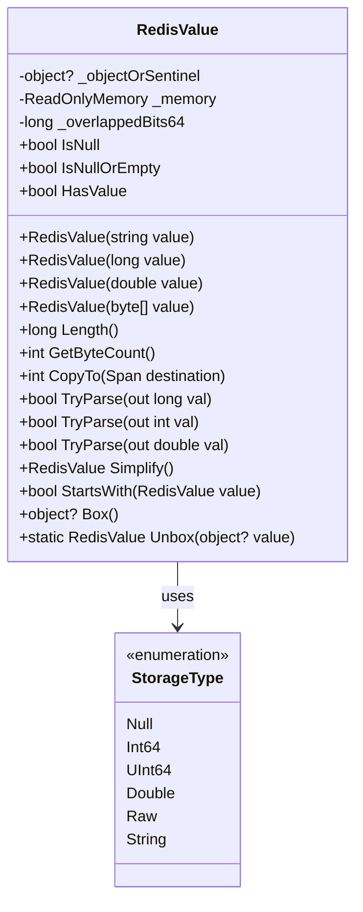
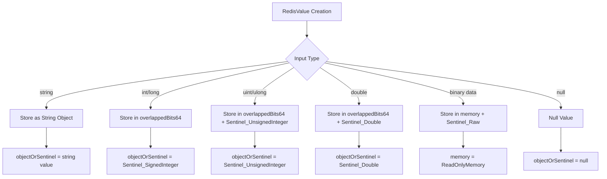
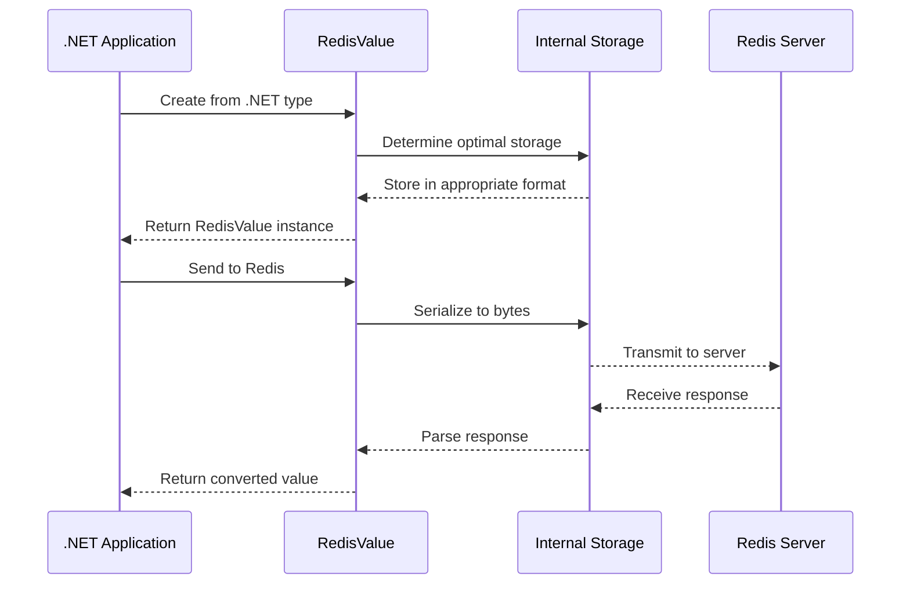
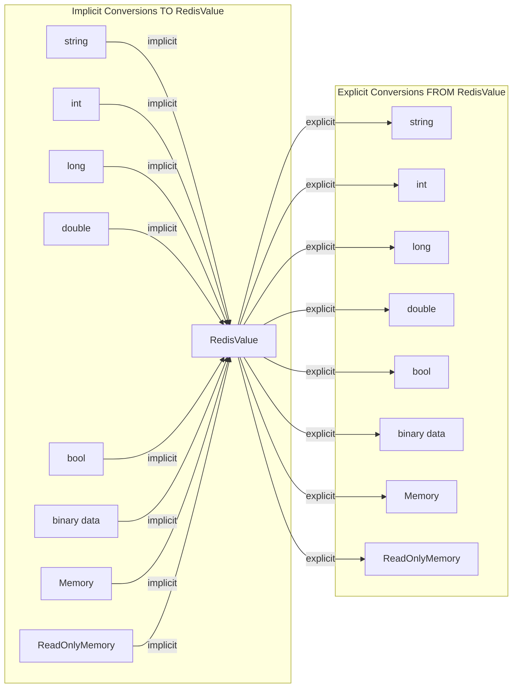
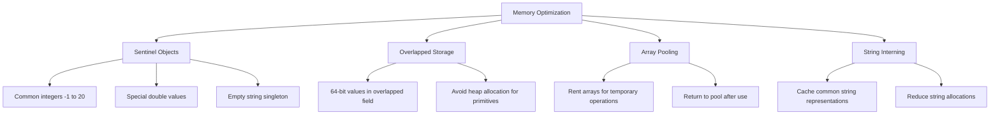
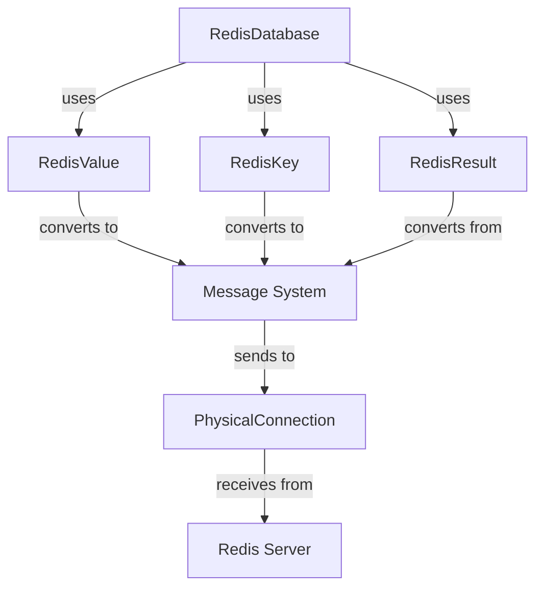
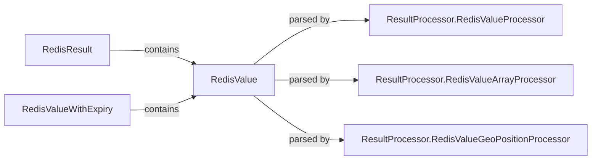

# RedisValue Module Documentation

## Introduction

The RedisValue module is a fundamental component of the StackExchange.Redis library that provides a unified representation of values that can be stored in and retrieved from Redis. It serves as the primary data type for all Redis operations, offering seamless conversion between .NET types and Redis-compatible formats while maintaining optimal performance and memory efficiency.

## Overview

RedisValue is a readonly struct that encapsulates the complexity of Redis data types, providing a type-safe wrapper around Redis's string-based protocol. It supports implicit conversions from and to various .NET primitive types, collections, and binary data, making it the central abstraction for data exchange between .NET applications and Redis servers.

## Architecture

### Core Components



### Internal Storage Strategy



## Data Flow and Processing

### Value Conversion Pipeline



### Type Conversion Matrix



## Key Features and Capabilities

### 1. Multi-Type Support
RedisValue seamlessly handles multiple data types through a unified interface:

- **Primitive Types**: int, long, uint, ulong, double, float, bool
- **String Types**: string, char
- **Binary Types**: byte[], Memory<byte>, ReadOnlyMemory<byte>
- **Nullable Types**: All primitive nullable types are supported

### 2. Memory Efficiency
The implementation uses several optimization strategies:



### 3. Performance Optimizations

#### Value Comparison
- Type-aware comparison with fast-path for same-type comparisons
- Optimized byte array comparison using unsafe pointer operations
- String comparison using ordinal comparison for performance

#### Parsing and Conversion
- Lazy parsing with `Simplify()` method
- Fast-path for integer parsing when possible
- Avoids unnecessary string allocations

#### Hash Code Generation
- Type-specific hash code generation
- Efficient byte array hashing using span operations

## Integration with Other Modules

### Relationship to Database Operations



### Connection to Result Processing



## Usage Patterns

### 1. Basic Value Creation
```csharp
// From primitives
RedisValue value1 = 42;
RedisValue value2 = "hello";
RedisValue value3 = 3.14;
RedisValue value4 = true;

// From binary data
byte[] data = { 1, 2, 3, 4 };
RedisValue value5 = data;

// Null values
RedisValue value6 = RedisValue.Null;
```

### 2. Value Conversion
```csharp
RedisValue value = "123";

// Safe conversion with TryParse
if (value.TryParse(out int intValue))
{
    Console.WriteLine($"Integer: {intValue}");
}

// Explicit conversion
string stringValue = (string)value;
long longValue = (long)value;
```

### 3. Comparison Operations
```csharp
RedisValue a = "hello";
RedisValue b = "hello";
RedisValue c = "world";

bool areEqual = a == b; // true
int comparison = a.CompareTo(c); // negative value
bool startsWith = a.StartsWith("hel"); // true
```

## Performance Characteristics

### Memory Allocation
- **Primitive values**: Zero heap allocation (stored in overlapped field)
- **String values**: Single string reference allocation
- **Binary data**: Single ReadOnlyMemory<byte> allocation
- **Large values**: May use array pooling for temporary operations

### Conversion Performance
- **Implicit conversions**: O(1) for primitives, O(n) for strings/byte arrays
- **Explicit conversions**: Optimized with type-specific fast paths
- **Parsing operations**: Lazy evaluation with caching

### Comparison Performance
- **Same type**: O(1) for primitives, O(n) for strings/byte arrays
- **Different types**: O(n) due to normalization requirements
- **Hash code**: O(n) for strings/byte arrays, O(1) for primitives

## Error Handling

### Conversion Errors
- Invalid cast exceptions for incompatible type conversions
- Overflow exceptions for numeric conversions that exceed target type ranges
- Format exceptions for string parsing failures

### Null Handling
- Null values are explicitly supported and handled consistently
- Null coalescing behavior follows Redis conventions (null ≈ 0 for numeric operations)
- IsNull and IsNullOrEmpty properties for null checking

## Thread Safety

RedisValue is immutable and thread-safe:
- All fields are readonly
- No mutable state after construction
- Safe for concurrent access across multiple threads
- Comparison operations are atomic

## Best Practices

### 1. Use Implicit Conversions
Prefer implicit conversions when creating RedisValue instances:
```csharp
// Good
RedisValue value = 42;

// Avoid
RedisValue value = new RedisValue(42, default, Sentinel_SignedInteger);
```

### 2. Check for Null Values
Always check for null values before operations:
```csharp
if (!value.IsNullOrEmpty)
{
    // Process value
}
```

### 3. Use TryParse for Safe Conversion
Use TryParse methods instead of explicit casts when conversion might fail:
```csharp
// Safe
if (value.TryParse(out int intValue))
{
    // Use intValue
}

// May throw
int intValue = (int)value; // Throws if not convertible
```

### 4. Leverage Type Information
Use the Type property for type-specific optimizations:
```csharp
switch (value.Type)
{
    case StorageType.Int64:
        // Fast integer processing
        break;
    case StorageType.String:
        // String-specific processing
        break;
}
```

## Related Documentation

- [RedisKey Module](RedisKey.md) - Key representation and operations
- [RedisResult Module](RedisResult.md) - Result processing and type conversion
- [RedisDatabase Module](RedisDatabase.md) - Database operations using RedisValue
- [MessageSystem Module](MessageSystem.md) - Message serialization and protocol handling
- [ResultProcessing Module](ResultProcessing.md) - Result parsing and conversion utilities

## Conclusion

The RedisValue module provides a robust, efficient, and type-safe foundation for all Redis data operations in the StackExchange.Redis library. Its unified interface abstracts the complexity of Redis's string-based protocol while maintaining excellent performance through careful memory management and optimization strategies. Understanding RedisValue is essential for effectively working with any other module in the library, as it serves as the primary data exchange format between .NET applications and Redis servers.