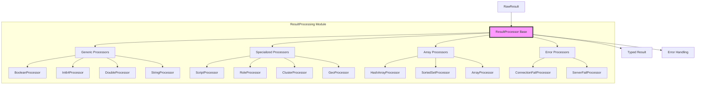
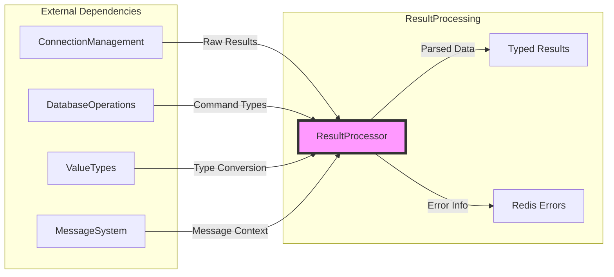
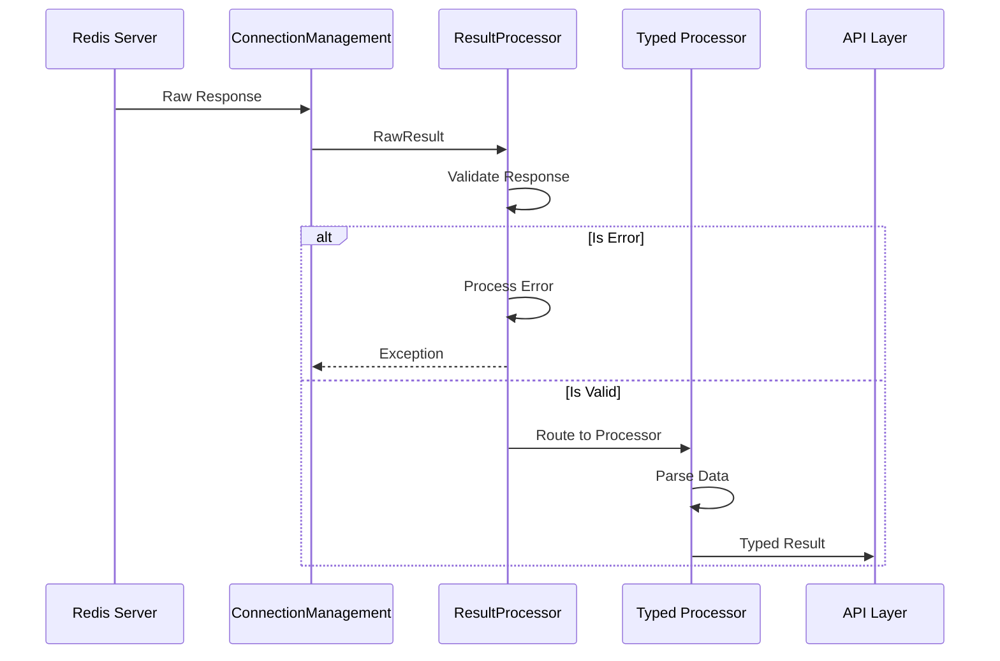
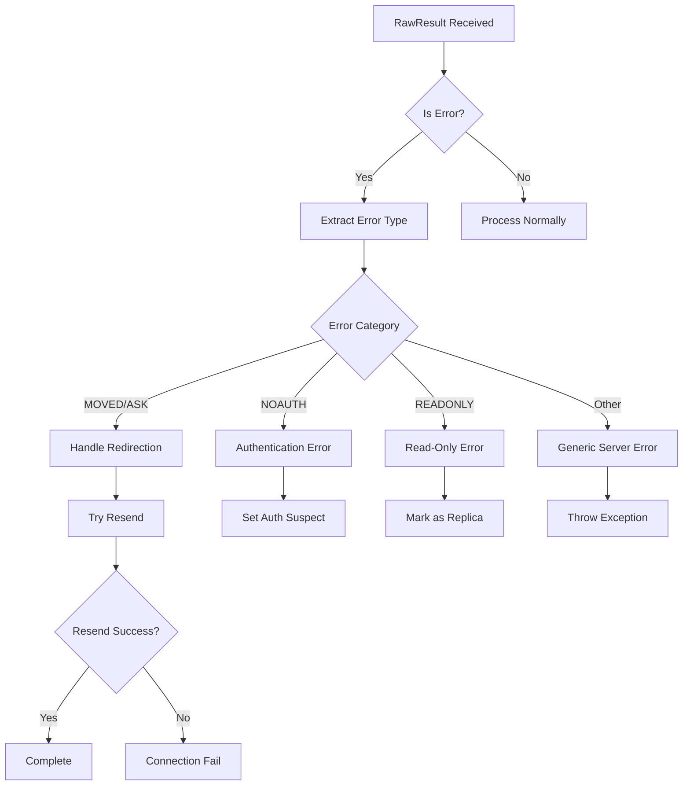

# ResultProcessing Module Documentation

## Introduction

The ResultProcessing module is a critical component of the StackExchange.Redis library responsible for parsing and converting raw Redis server responses into strongly-typed .NET objects. This module acts as the bridge between Redis protocol responses and the high-level API types that developers interact with, ensuring type safety and proper data transformation.

## Module Purpose and Core Functionality

The ResultProcessing module serves as the response processing engine of the Redis client library. Its primary responsibilities include:

- **Protocol Response Parsing**: Converting raw Redis protocol responses (RESP2/RESP3) into structured data
- **Type Conversion**: Transforming Redis data types into appropriate .NET types
- **Error Handling**: Processing server errors and connection failures
- **Data Validation**: Ensuring response integrity and format compliance
- **Specialized Processing**: Handling complex Redis data structures like streams, geospatial data, and cluster information

## Architecture Overview

### Core Architecture



### Component Relationships



## Core Components

### Base ResultProcessor Class

The `ResultProcessor` abstract class serves as the foundation for all result processing operations. It provides:

- **Error Handling Infrastructure**: Centralized error processing for connection and server failures
- **Result Validation**: Base validation logic for all response types
- **Message Integration**: Integration with the message system for context-aware processing
- **Protocol Support**: Support for both RESP2 and RESP3 protocols

### Generic Type Processors

#### BooleanProcessor
Handles boolean value conversions from Redis responses, supporting multiple response formats including integers, strings, and arrays.

#### Numeric Processors
- **Int64Processor**: Processes 64-bit integer values
- **DoubleProcessor**: Handles floating-point number conversions
- **Nullable Processors**: Support for nullable numeric types

#### String Processors
- **StringProcessor**: Basic string value processing
- **ByteArrayProcessor**: Binary data handling
- **ScriptLoadProcessor**: Specialized SHA1 hash processing for Lua scripts

### Specialized Data Structure Processors

#### Stream Processors
The module includes comprehensive support for Redis Streams:

- **SingleStreamProcessor**: Processes single stream read operations
- **MultiStreamProcessor**: Handles multiple stream reads
- **StreamInfoProcessor**: Parses stream metadata and statistics
- **StreamConsumerInfoProcessor**: Consumer group information processing
- **StreamPendingInfoProcessor**: Pending message queue processing
- **StreamAutoClaimProcessor**: Message claiming operations

#### Geospatial Processors
- **GeoRadiusResultArrayProcessor**: Processes geospatial radius queries with configurable options
- **RedisValueGeoPositionProcessor**: Individual geospatial position handling

#### Cluster Processors
- **ClusterNodesProcessor**: Parses cluster topology information
- **ClusterNodesRawProcessor**: Raw cluster node data processing

### Array and Collection Processors

#### ValuePairInterleavedProcessorBase
Abstract base for processing interleaved key-value pairs, used by:
- **HashEntryArrayProcessor**: Redis hash field-value pairs
- **SortedSetEntryArrayProcessor**: Sorted set member-score pairs
- **StringPairInterleavedProcessor**: String key-value pairs

#### ArrayResultProcessor
Generic base for array processing with type-specific implementations.

## Data Flow Architecture

### Response Processing Flow



### Error Handling Flow



## Integration with Other Modules

### ConnectionManagement Integration
The ResultProcessing module works closely with ConnectionManagement to:
- Handle connection state changes based on server responses
- Process authentication responses and manage authentication state
- Handle cluster redirections (MOVED/ASK responses)
- Update server capabilities based on INFO responses

### DatabaseOperations Integration
ResultProcessing provides the response parsing for all database operations:
- Command-specific result processors for complex operations
- Array and collection result handling for scan operations
- Stream operation result processing
- Transaction result handling

### ValueTypes Integration
The module converts between Redis protocol types and ValueTypes:
- RedisValue conversions for flexible type handling
- RedisKey processing for key operations
- Specialized type conversions for geospatial and stream data

## Key Features and Capabilities

### Protocol Version Support
- **RESP2 Compatibility**: Full support for Redis Protocol version 2
- **RESP3 Support**: Enhanced support for Redis Protocol version 3
- **Auto-detection**: Automatic protocol version detection and handling

### Performance Optimizations
- **Array Pooling**: Efficient memory management for large arrays
- **Span-based Processing**: Minimal allocations for string and binary data
- **Type-specific Processors**: Optimized processors for common data types

### Error Recovery
- **Redirection Handling**: Automatic handling of cluster redirections
- **Authentication Recovery**: Graceful handling of authentication failures
- **Connection State Management**: Updates connection state based on server responses

## Usage Patterns

### Basic Type Processing
```csharp
// Boolean processing
var boolProcessor = ResultProcessor.Boolean;

// Numeric processing
var intProcessor = ResultProcessor.Int64;
var doubleProcessor = ResultProcessor.Double;

// String processing
var stringProcessor = ResultProcessor.String;
```

### Specialized Processing
```csharp
// Stream processing
var streamProcessor = ResultProcessor.SingleStream;
var multiStreamProcessor = ResultProcessor.MultiStream;

// Geospatial processing
var geoProcessor = ResultProcessor.GeoRadiusArray(options);

// Cluster processing
var clusterProcessor = ResultProcessor.ClusterNodes;
```

## Error Handling and Recovery

### Connection Failures
The module handles various connection failure scenarios:
- **Authentication Failures**: NOAUTH and WRONGPASS responses
- **Loading State**: Server loading responses
- **Protocol Failures**: Unexpected response formats
- **Unable to Connect**: Network and timeout issues

### Server Errors
Comprehensive server error processing:
- **Command Errors**: Invalid command syntax and parameters
- **State Errors**: Operation attempted in wrong server state
- **Resource Errors**: Memory and configuration issues

## Testing and Validation

The ResultProcessing module includes extensive validation:
- **Response Format Validation**: Ensures responses match expected formats
- **Type Safety**: Strong typing for all processed results
- **Error Scenario Coverage**: Comprehensive error condition handling
- **Protocol Compliance**: Adherence to Redis protocol specifications

## References

- [ConnectionManagement Module](ConnectionManagement.md) - For connection state management
- [DatabaseOperations Module](DatabaseOperations.md) - For command execution context
- [ValueTypes Module](ValueTypes.md) - For type system integration
- [MessageSystem Module](MessageSystem.md) - For message context and routing