# RetryPolicies Module Documentation

## Introduction

The RetryPolicies module provides the retry policy infrastructure for handling connection reconnects in StackExchange.Redis. It defines the `IReconnectRetryPolicy` interface that allows custom retry strategies to be implemented and used by the connection multiplexer when dealing with connection failures and reconnection attempts.

## Core Architecture

### Component Overview

The RetryPolicies module is built around a single core interface that serves as the foundation for all retry policy implementations:

- **IReconnectRetryPolicy**: The primary interface that defines the contract for retry policies

### Architecture Diagram


## Core Components

### IReconnectRetryPolicy Interface

The `IReconnectRetryPolicy` interface is the cornerstone of the retry policy system. It provides a simple yet flexible contract for implementing custom retry strategies.

```csharp
public interface IReconnectRetryPolicy
{
    /// <summary>
    /// This method is called by the multiplexer to determine if a reconnect operation can be retried now.
    /// </summary>
    /// <param name="currentRetryCount">The number of times reconnect retries have already been made by the multiplexer while it was in connecting state.</param>
    /// <param name="timeElapsedMillisecondsSinceLastRetry">Total time elapsed in milliseconds since the last reconnect retry was made.</param>
    bool ShouldRetry(long currentRetryCount, int timeElapsedMillisecondsSinceLastRetry);
}
```

#### Key Features:
- **Stateless Design**: The interface is designed to be stateless, allowing for easy implementation and testing
- **Flexible Parameters**: Provides both retry count and time elapsed since last retry for informed decision-making
- **Simple Return**: Returns a boolean indicating whether a retry should be attempted

## Integration with System Components

### Connection Management Integration

The retry policy integrates deeply with the [ConnectionManagement](ConnectionManagement.md) module, particularly with:

- **ConnectionMultiplexer**: Uses the retry policy to determine when reconnection attempts should be made
- **PhysicalBridge**: Applies retry logic at the bridge level for individual connection attempts

### Configuration Integration

The retry policy is configured through the [Configuration](Configuration.md) module's `ConfigurationOptions`, allowing users to specify custom retry strategies when setting up their Redis connections.

## Data Flow

### Retry Decision Flow

```mermaid
sequenceDiagram
    participant CM as ConnectionMultiplexer
    participant RP as IReconnectRetryPolicy
    participant PB as PhysicalBridge
    
    CM->>CM: Connection fails
    CM->>RP: ShouldRetry(retryCount, timeElapsed)
    RP-->>CM: true/false
    alt ShouldRetry = true
        CM->>PB: Attempt reconnection
        PB-->>CM: Connection result
    else ShouldRetry = false
        CM->>CM: Stop retrying
    end
```



## Usage Patterns

### Built-in Retry Policies

While the interface itself is simple, implementations can provide various retry strategies:

1. **Linear Retry**: Retry after fixed intervals
2. **Exponential Backoff**: Increase delay between retries exponentially
3. **Circuit Breaker**: Stop retrying after certain failure threshold
4. **Custom Logic**: Application-specific retry strategies

### Implementation Example

```csharp
public class ExponentialBackoffRetryPolicy : IReconnectRetryPolicy
{
    private readonly int _maxDelayMilliseconds;
    
    public ExponentialBackoffRetryPolicy(int maxDelayMilliseconds = 30000)
    {
        _maxDelayMilliseconds = maxDelayMilliseconds;
    }
    
    public bool ShouldRetry(long currentRetryCount, int timeElapsedMillisecondsSinceLastRetry)
    {
        // Exponential backoff: 100ms, 200ms, 400ms, 800ms, etc.
        var requiredDelay = Math.Min(100 * Math.Pow(2, currentRetryCount - 1), _maxDelayMilliseconds);
        return timeElapsedMillisecondsSinceLastRetry >= requiredDelay;
    }
}
```

## Dependencies

### Upstream Dependencies

The RetryPolicies module has minimal dependencies:
- **CoreInterfaces**: The `IReconnectRetryPolicy` interface is part of the core interfaces module

### Downstream Dependencies

The module is used by:
- **[ConnectionManagement](ConnectionManagement.md)**: For connection retry logic
- **[Configuration](Configuration.md)**: For policy configuration

## Best Practices

### Policy Design

1. **Consider Network Conditions**: Account for typical network latency and Redis server response times
2. **Avoid Aggressive Retries**: Implement appropriate delays to prevent overwhelming the server
3. **Monitor Retry Counts**: Log retry attempts for debugging and monitoring
4. **Test Thoroughly**: Ensure policies work correctly under various failure scenarios

### Performance Considerations

- The `ShouldRetry` method is called frequently during connection failures
- Keep implementations lightweight and avoid expensive operations
- Consider caching calculations if they don't need to be performed on every call

## Error Handling

The retry policy itself doesn't handle errors but provides the framework for determining when retries should occur. Actual error handling is managed by the components that use the retry policy.

## Thread Safety

Implementations of `IReconnectRetryPolicy` should be thread-safe as they may be called from multiple threads simultaneously during connection attempts.

## Testing

When implementing custom retry policies:

1. **Unit Test Logic**: Test the retry decision logic with various inputs
2. **Integration Test**: Test with actual connection failures
3. **Performance Test**: Ensure the policy doesn't introduce significant overhead
4. **Stress Test**: Test under high failure rates

## Related Documentation

- [ConnectionManagement](ConnectionManagement.md) - For understanding how retry policies are used in connection management
- [Configuration](Configuration.md) - For configuring retry policies
- [CoreInterfaces](CoreInterfaces.md) - For the complete interface hierarchy