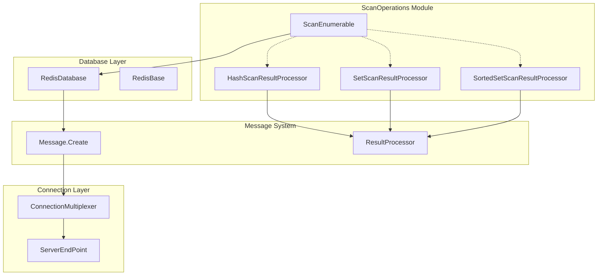
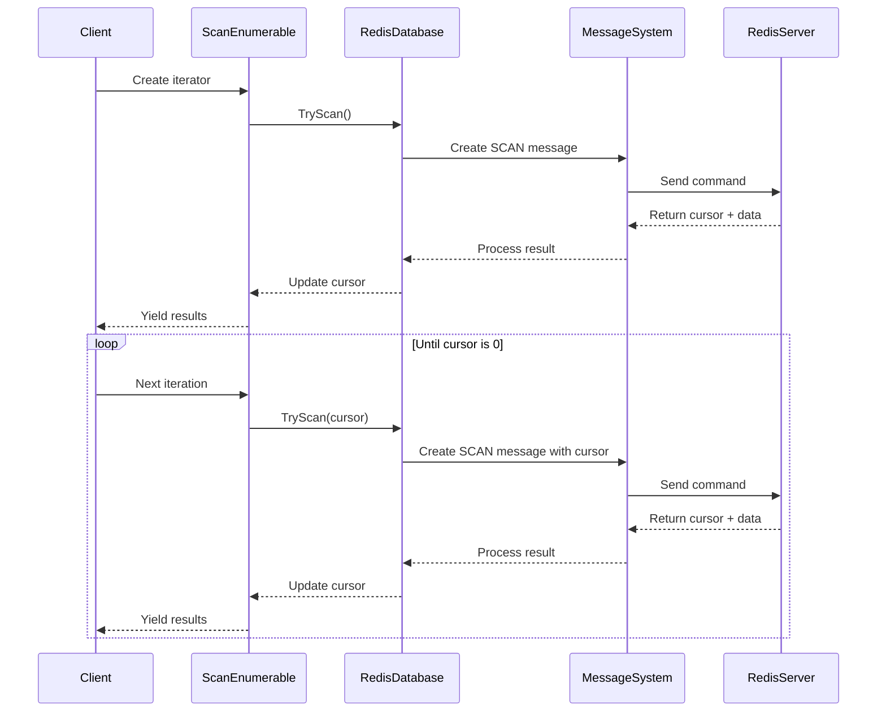
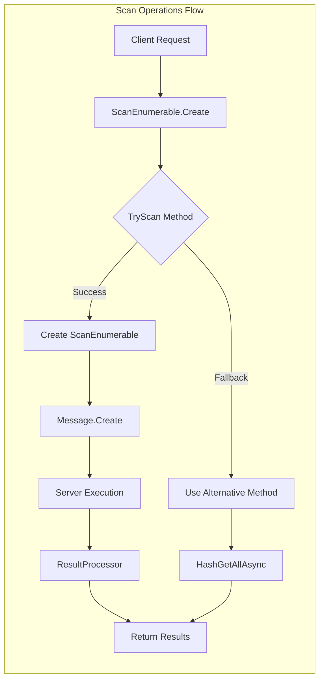
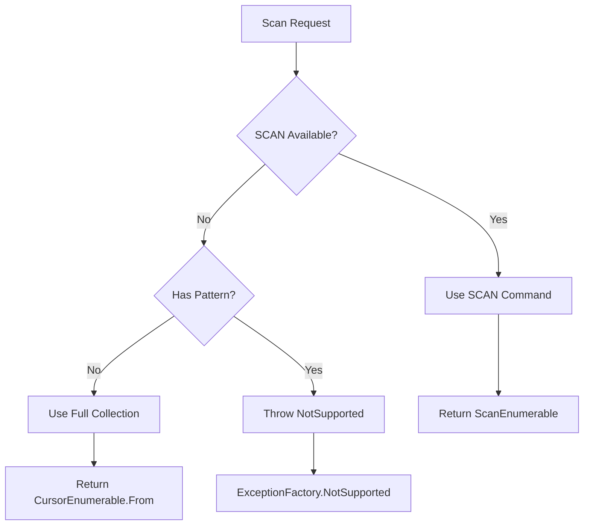
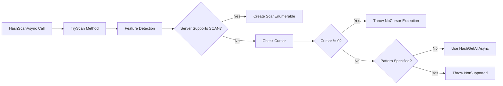
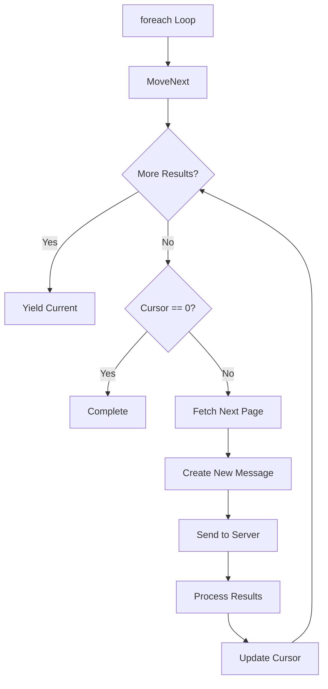

# ScanOperations Module Documentation

## Introduction

The ScanOperations module provides efficient, non-blocking iteration capabilities for Redis data structures. It implements the SCAN family of commands (SCAN, SSCAN, HSCAN, ZSCAN) that allow clients to incrementally iterate over collections of keys, sets, hashes, and sorted sets without blocking the server or causing memory spikes.

## Purpose and Core Functionality

The ScanOperations module serves as the primary interface for:

- **Incremental Data Access**: Provides memory-efficient iteration over large datasets
- **Non-blocking Operations**: Prevents server blocking during large collection scans
- **Pattern Matching**: Supports glob-style patterns for filtering results
- **Cursor-based Navigation**: Uses cursors for resumable iteration across multiple calls
- **Multi-type Support**: Handles scanning across different Redis data types (keys, sets, hashes, sorted sets)

## Architecture Overview



## Core Components

### 1. ScanEnumerable<T>

The primary iterator implementation that provides cursor-based enumeration over Redis collections.

**Key Features:**
- Generic type support for different data types (HashEntry, RedisValue, SortedSetEntry)
- Cursor state management for resumable iteration
- Automatic pagination handling
- Pattern matching support
- Page size configuration

**Usage Pattern:**
```csharp
// Hash scanning example
var hashScanner = database.HashScan(key, pattern, pageSize);
foreach (var entry in hashScanner)
{
    // Process hash entry
}
```

### 2. ScanResultProcessor Implementations

Specialized processors for different data types:

#### HashScanResultProcessor
- Processes HSCAN command results
- Converts raw Redis responses to HashEntry arrays
- Handles key-value pair extraction

#### SetScanResultProcessor
- Processes SSCAN command results
- Converts raw Redis responses to RedisValue arrays
- Handles set member extraction

#### SortedSetScanResultProcessor
- Processes ZSCAN command results
- Converts raw Redis responses to SortedSetEntry arrays
- Handles score-member pair extraction

## Data Flow Architecture



## Component Interactions



## Scan Command Implementation

### Command Mapping

| Redis Command | .NET Method | Result Processor | Return Type |
|---------------|-------------|------------------|-------------|
| SCAN | KeyScan | ScanResultProcessor | RedisValue[] |
| SSCAN | SetScan | SetScanResultProcessor | RedisValue[] |
| HSCAN | HashScan | HashScanResultProcessor | HashEntry[] |
| ZSCAN | SortedSetScan | SortedSetScanResultProcessor | SortedSetEntry[] |

### Fallback Mechanism

When SCAN commands are not available (older Redis versions or specific configurations), the module implements fallback strategies:



## Process Flow

### 1. Iterator Creation



### 2. Iteration Process



## Integration with Other Modules

### ConnectionManagement Integration

The ScanOperations module relies on [ConnectionManagement](ConnectionManagement.md) for:
- Server capability detection
- Command availability checking
- Server selection and routing
- Connection state management

### MessageSystem Integration

Scan operations integrate with [MessageSystem](MessageSystem.md) through:
- Custom message creation for SCAN commands
- Result processing pipeline
- Command routing and execution

### ResultProcessing Integration

Specialized result processors extend the [ResultProcessing](ResultProcessing.md) module:
- Type-safe result conversion
- Error handling and validation
- Performance optimization

## Performance Considerations

### Memory Efficiency
- Streaming iteration prevents memory spikes
- Array pooling for temporary allocations
- Cursor-based state management

### Network Optimization
- Configurable page sizes
- Batched result processing
- Connection reuse

### Server Impact
- Non-blocking operations
- Incremental processing
- Reduced server load

## Error Handling

### Common Scenarios

1. **Unsupported Commands**: Graceful fallback or clear error messages
2. **Invalid Cursors**: Proper exception handling with meaningful messages
3. **Server Limitations**: Feature detection and alternative approaches
4. **Network Issues**: Connection management and retry logic

### Exception Types

- `NotSupportedException`: When SCAN is not supported and pattern is specified
- `ArgumentException`: Invalid parameters (page size, cursor values)
- `RedisServerException`: Server-side errors during execution

## Usage Examples

### Basic Hash Scanning
```csharp
// Scan all hash entries
foreach (var entry in database.HashScan("myhash"))
{
    Console.WriteLine($"{entry.Name}: {entry.Value}");
}

// Scan with pattern matching
foreach (var entry in database.HashScan("myhash", "user:*"))
{
    // Process matching entries
}
```

### Set Scanning with Pagination
```csharp
// Scan set members with custom page size
foreach (var member in database.SetScan("myset", pageSize: 100))
{
    // Process set member
}
```

### Sorted Set Scanning
```csharp
// Scan sorted set entries
foreach (var entry in database.SortedSetScan("myzset"))
{
    Console.WriteLine($"Member: {entry.Element}, Score: {entry.Score}");
}
```

## Advanced Features

### Cursor Management
- Manual cursor control for advanced scenarios
- Resume interrupted scans
- Parallel scanning support

### Pattern Matching
- Glob-style patterns (*, ?, [])
- Performance optimization for simple patterns
- Fallback for complex patterns

### Configuration Options
- Page size tuning
- Command timeout configuration
- Server selection preferences

## Best Practices

1. **Page Size Selection**: Balance between network round-trips and memory usage
2. **Pattern Usage**: Use simple patterns when possible for better performance
3. **Error Handling**: Always handle unsupported command scenarios
4. **Resource Management**: Dispose of enumerators properly
5. **Cursor Persistence**: Store cursors for long-running operations

## Related Documentation

- [DatabaseOperations](DatabaseOperations.md) - Core database operation patterns
- [ConnectionManagement](ConnectionManagement.md) - Server connection and capability management
- [MessageSystem](MessageSystem.md) - Command message creation and processing
- [ResultProcessing](ResultProcessing.md) - Result processing and type conversion