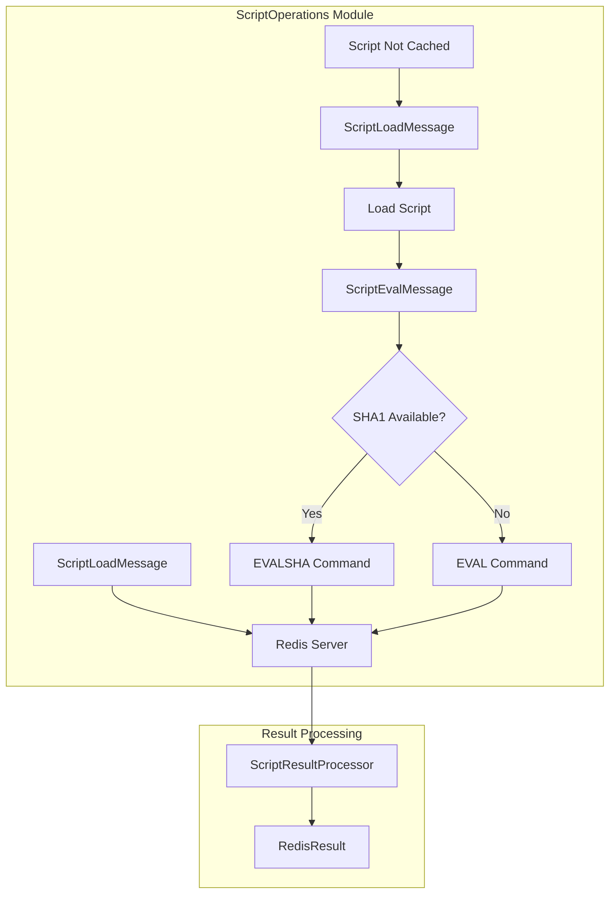
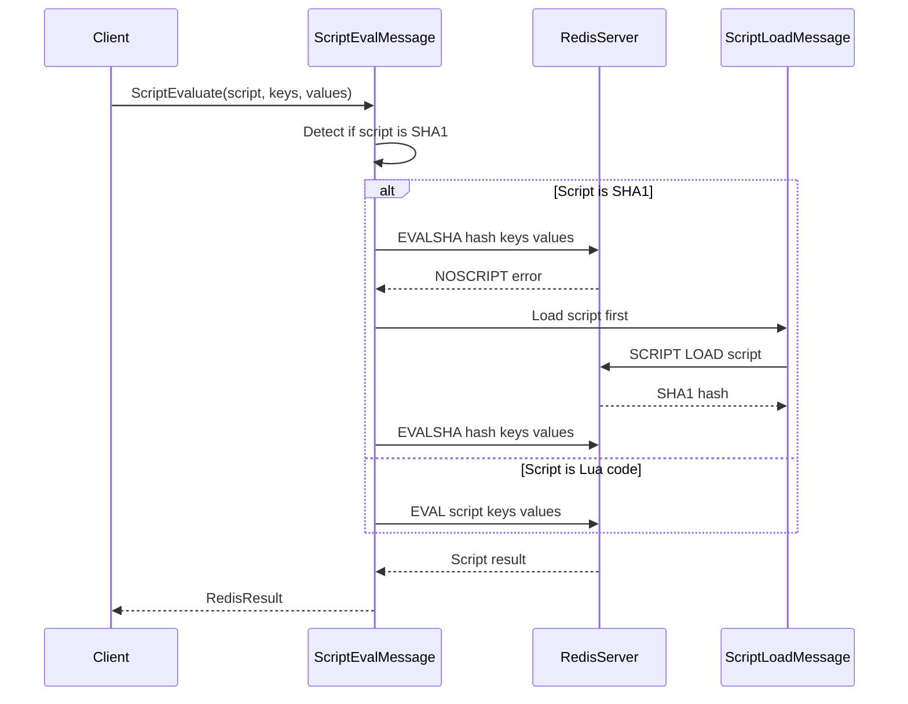
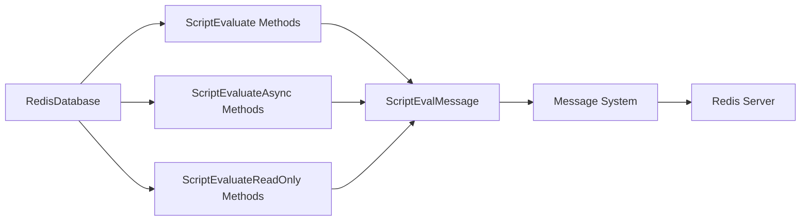

# ScriptOperations Module Documentation

## Overview

The ScriptOperations module provides comprehensive Lua scripting capabilities for Redis operations within the StackExchange.Redis library. This module enables server-side script execution, script loading, and evaluation with automatic SHA1 hash management and fallback mechanisms.

## Purpose and Core Functionality

The ScriptOperations module serves as the primary interface for executing Lua scripts in Redis, offering:

- **Script Evaluation**: Execute Lua scripts with automatic EVAL/EVALSHA command selection
- **Script Loading**: Load scripts into Redis script cache with SHA1 hash management
- **Read-Only Script Execution**: Support for EVAL_RO and EVALSHA_RO commands
- **Automatic Fallback**: Seamless fallback from EVALSHA to EVAL when scripts are not cached
- **Script Hash Management**: Automatic SHA1 hash generation and validation

## Architecture and Component Relationships

### Core Components

The module consists of two primary message types that handle script operations:

#### ScriptLoadMessage
- **Purpose**: Loads Lua scripts into Redis script cache
- **Command**: `SCRIPT LOAD`
- **Features**: 
  - SHA1 hash generation on the server side
  - Script persistence in Redis memory
  - Returns SHA1 digest for future reference

#### ScriptEvalMessage  
- **Purpose**: Evaluates Lua scripts with automatic EVAL/EVALSHA selection
- **Commands**: `EVAL`, `EVALSHA`, `EVAL_RO`, `EVALSHA_RO`
- **Features**:
  - Automatic SHA1 detection and command selection
  - Multi-message support for script loading when needed
  - Read-only script execution support
  - Key and argument parameter handling

### Architecture Diagram



## Data Flow and Process Flows

### Script Evaluation Flow



### Script Loading Process


## Component Interactions

### Integration with RedisDatabase

The ScriptOperations module integrates seamlessly with the [RedisDatabase](DatabaseOperations.md) class:



### Message System Integration

Script operations integrate with the broader [MessageSystem](MessageSystem.md) through:

- **IMultiMessage Interface**: ScriptEvalMessage implements IMultiMessage for complex operations
- **Message Base Class**: Inherits from Message for standard Redis communication
- **Command Mapping**: Uses CommandMap for command availability checking
- **PhysicalConnection**: Writes protocol-specific data to Redis connections

## Key Features and Capabilities

### Automatic Command Selection
The module automatically determines whether to use EVAL or EVALSHA based on input:
- SHA1 strings (40 hex characters) trigger EVALSHA commands
- Lua script code triggers EVAL commands
- Automatic fallback from EVALSHA to EVAL on NOSCRIPT errors

### Script Caching Management
- Scripts are automatically loaded into Redis cache when needed
- SHA1 hashes are cached locally to avoid redundant loads
- Support for script cache invalidation and refresh

### Read-Only Script Support
- Dedicated methods for read-only script execution (EVAL_RO, EVALSHA_RO)
- Enables execution on Redis replicas for better performance
- Automatic fallback to standard commands when read-only versions unavailable

### Parameter Handling
- Support for key parameters (affects Redis cluster slot calculation)
- Value parameters for script arguments
- Automatic null handling and validation

## Error Handling and Resilience

### NOSCRIPT Error Recovery
When EVALSHA fails with NOSCRIPT error:
1. Script is automatically loaded using SCRIPT LOAD
2. Operation is retried with the newly loaded script
3. Client receives seamless experience without manual intervention

### Command Availability
- Checks CommandMap for script command availability
- Graceful degradation when script commands are disabled
- Server capability detection for read-only script support

## Performance Considerations

### Network Optimization
- EVALSHA reduces network traffic by using SHA1 hashes instead of full scripts
- Automatic script loading minimizes round trips
- Multi-message support for complex operations

### Memory Management
- Script caching reduces memory usage on Redis server
- Local SHA1 cache prevents redundant script loads
- Efficient parameter serialization and deserialization

### Cluster Support
- Proper slot calculation for keys used in scripts
- Multi-key script execution with cluster awareness
- Hash tag support for related key grouping

## Usage Examples

### Basic Script Evaluation
```csharp
// Evaluate a simple script
var result = db.ScriptEvaluate("return redis.call('GET', KEYS[1])", 
    new RedisKey[] { "mykey" }, 
    new RedisValue[] { });
```

### Script with Parameters
```csharp
// Script with keys and values
var script = @"
    local key = KEYS[1]
    local value = ARGV[1]
    redis.call('SET', key, value)
    return redis.call('GET', key)
";
var result = db.ScriptEvaluate(script, 
    new RedisKey[] { "mykey" }, 
    new RedisValue[] { "myvalue" });
```

### Read-Only Script Execution
```csharp
// Execute script on replica if available
var result = db.ScriptEvaluateReadOnly("return redis.call('GET', KEYS[1])", 
    new RedisKey[] { "mykey" });
```

### Using Loaded Scripts
```csharp
// Load script first
var hash = db.ScriptLoad("return redis.call('GET', KEYS[1])");

// Use SHA1 for subsequent calls
var result = db.ScriptEvaluate(hash, 
    new RedisKey[] { "mykey" });
```

## Dependencies and Related Modules

### Direct Dependencies
- **[MessageSystem](MessageSystem.md)**: Base message infrastructure and command protocols
- **[ResultProcessing](ResultProcessing.md)**: ScriptResultProcessor for handling script execution results
- **[ValueTypes](ValueTypes.md)**: RedisValue and RedisKey types for parameter handling

### Integration Points
- **[DatabaseOperations](DatabaseOperations.md)**: Parent module containing script operation methods
- **[ConnectionManagement](ConnectionManagement.md)**: Server connection and command mapping
- **[CoreInterfaces](CoreInterfaces.md)**: IDatabase and IDatabaseAsync interfaces

## Advanced Features

### Script Compilation and Optimization
- Lua script compilation on Redis server
- Automatic optimization by Redis Lua engine
- Support for complex Lua operations and Redis commands

### Transaction Integration
- Script execution within Redis transactions
- Atomic script execution guarantees
- Multi/Exec wrapper support

### Monitoring and Debugging
- Script execution time tracking
- Error reporting with script context
- Performance metrics collection

## Security Considerations

### Script Injection Prevention
- Parameterized script execution
- Input validation and sanitization
- Protection against malicious script injection

### Access Control
- Integration with Redis ACL system
- Command-level permission checking
- Script execution authorization

## Conclusion

The ScriptOperations module provides a robust, efficient, and user-friendly interface for Redis Lua scripting operations. Its automatic command selection, error recovery mechanisms, and seamless integration with the StackExchange.Redis ecosystem make it an essential component for advanced Redis operations requiring server-side script execution.