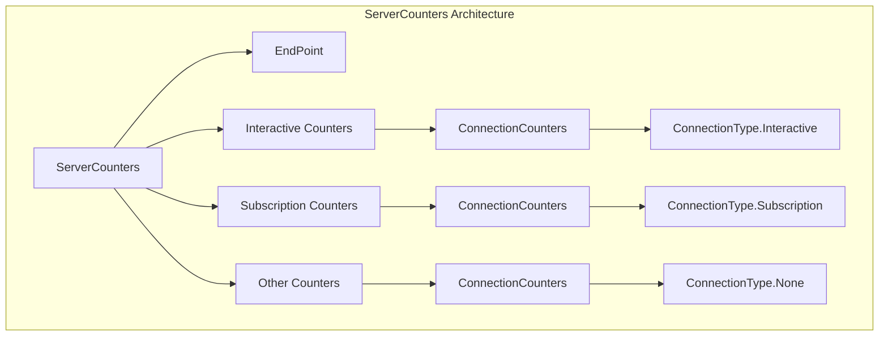
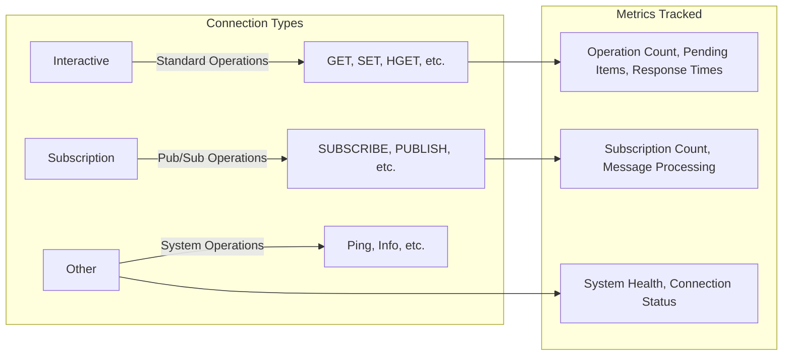
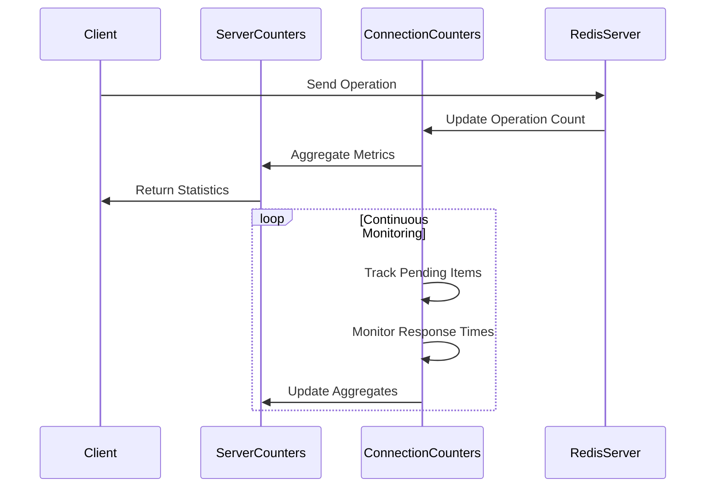
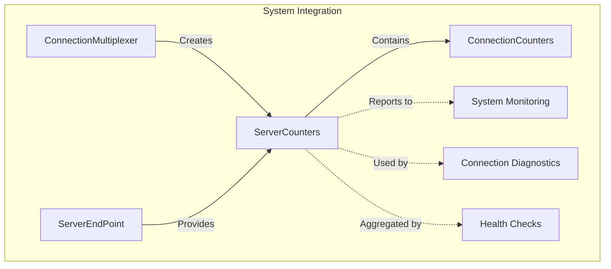

# ServerCounters Module Documentation

## Introduction

The ServerCounters module provides comprehensive monitoring and statistics tracking for Redis server connections within the StackExchange.Redis library. It serves as a centralized metrics collection system that tracks the performance and health of different types of connections to Redis servers, enabling developers to monitor connection behavior, identify bottlenecks, and troubleshoot performance issues.

## Architecture Overview

The ServerCounters module implements a hierarchical counter system that organizes connection metrics by connection type and server endpoint. This design allows for granular monitoring of different aspects of Redis communication while providing aggregated views of overall server health.



## Core Components

### ServerCounters Class

The `ServerCounters` class is the main entry point for accessing connection metrics. It provides a unified interface for monitoring different types of Redis connections and aggregates metrics across multiple connection types.

**Key Properties:**
- `EndPoint`: The Redis server endpoint these counters represent
- `Interactive`: Counters for standard Redis operations
- `Subscription`: Counters for pub/sub operations
- `Other`: Counters for ambient system activity
- `TotalOutstanding`: Aggregate count of all pending operations

## Connection Type Architecture

The module organizes counters into three distinct connection types, each serving different aspects of Redis communication:



## Data Flow and Metrics Collection

The ServerCounters module follows a systematic approach to metrics collection and aggregation:



## Component Interactions

The ServerCounters module integrates with several other system components to provide comprehensive monitoring:



## Key Features

### 1. Multi-Connection Type Support
- **Interactive Connections**: Track standard Redis operations
- **Subscription Connections**: Monitor pub/sub activities
- **Other Connections**: Account for system-level operations

### 2. Comprehensive Metrics
- **Operation Counting**: Total operations performed
- **Pending Item Tracking**: Items awaiting processing
- **Response Time Monitoring**: Synchronous vs asynchronous completion
- **Error Tracking**: Failed operations and connection issues
- **Subscription Management**: Active subscription counts

### 3. Aggregation Capabilities
- **Per-Server Metrics**: Individual server statistics
- **Total System View**: Aggregated across all servers
- **Real-time Updates**: Continuous metric updates
- **Historical Tracking**: Cumulative operation counts

## Usage Patterns

### Basic Monitoring
```csharp
// Access server counters
var counters = connection.GetCounters();
Console.WriteLine($"Total outstanding: {counters.TotalOutstanding}");
Console.WriteLine($"Interactive operations: {counters.Interactive.OperationCount}");
```

### Connection Health Assessment
```csharp
// Check connection health
var interactive = counters.Interactive;
bool isHealthy = interactive.IsEmpty && interactive.FailedAsynchronously == 0;
```

### Performance Analysis
```csharp
// Analyze operation patterns
var subscription = counters.Subscription;
var asyncRatio = (double)subscription.CompletedAsynchronously / subscription.OperationCount;
```

## Integration with Other Modules

### ConnectionManagement Integration
The ServerCounters module works closely with the [ConnectionManagement](ConnectionManagement.md) module to provide real-time metrics about connection health and performance. It receives updates from `ConnectionMultiplexer` and `ServerEndPoint` components to maintain accurate counter states.

### ServerManagement Integration
Within the [ServerManagement](ServerManagement.md) module, ServerCounters provides the monitoring foundation for `RedisServer` operations, enabling server-specific performance tracking and health assessment.

### Configuration Integration
The [Configuration](Configuration.md) module influences how ServerCounters behave, particularly in multi-server scenarios where counters need to be aggregated across different endpoints and connection types.

## Performance Considerations

### Memory Efficiency
- **Lightweight Counters**: Minimal memory overhead per counter
- **Lazy Initialization**: Counters created only when needed
- **Efficient Aggregation**: Fast mathematical operations for totals

### Thread Safety
- **Atomic Operations**: Counter updates use thread-safe operations
- **Consistent State**: Maintains accurate counts during concurrent access
- **No Locking**: Designed to avoid contention in high-throughput scenarios

### Scalability
- **Per-Server Isolation**: Independent counters for each server
- **Hierarchical Organization**: Efficient aggregation patterns
- **Minimal Overhead**: Negligible impact on Redis operation performance

## Monitoring and Diagnostics

### Health Indicators
- **Outstanding Operations**: High values may indicate server slowness
- **Failed Operations**: Non-zero values suggest connection issues
- **Pending Items**: Growing queues may signal capacity problems
- **Subscription Counts**: Monitor pub/sub system utilization

### Diagnostic Information
The `ToString()` method provides a human-readable summary of counter states:
```
localhost:6379: int ops=1500, qu=5, qs=10, qc=2, wr=1; sub ops=50, qu=0, qs=1, qc=0, wr=0, subs=3
```

This format shows operation counts, queue states, and subscription information in a compact, parseable format.

## Best Practices

### 1. Regular Monitoring
- Periodically check `TotalOutstanding` to identify bottlenecks
- Monitor failed operation counts for early problem detection
- Track subscription growth to prevent pub/sub overload

### 2. Threshold Management
- Set alerts for high outstanding operation counts
- Monitor failed operation ratios for connection health
- Track queue growth rates for capacity planning

### 3. Performance Tuning
- Use counter data to optimize connection pooling
- Analyze operation patterns to improve application design
- Monitor subscription efficiency for pub/sub optimization

## Summary

The ServerCounters module provides essential monitoring capabilities for Redis connections in the StackExchange.Redis library. By organizing metrics into logical connection types and providing both granular and aggregated views, it enables developers to maintain optimal Redis performance and quickly identify potential issues. The module's lightweight design ensures minimal performance impact while providing comprehensive visibility into connection behavior and system health.