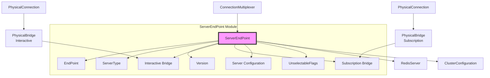
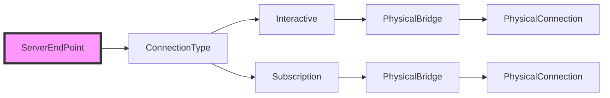
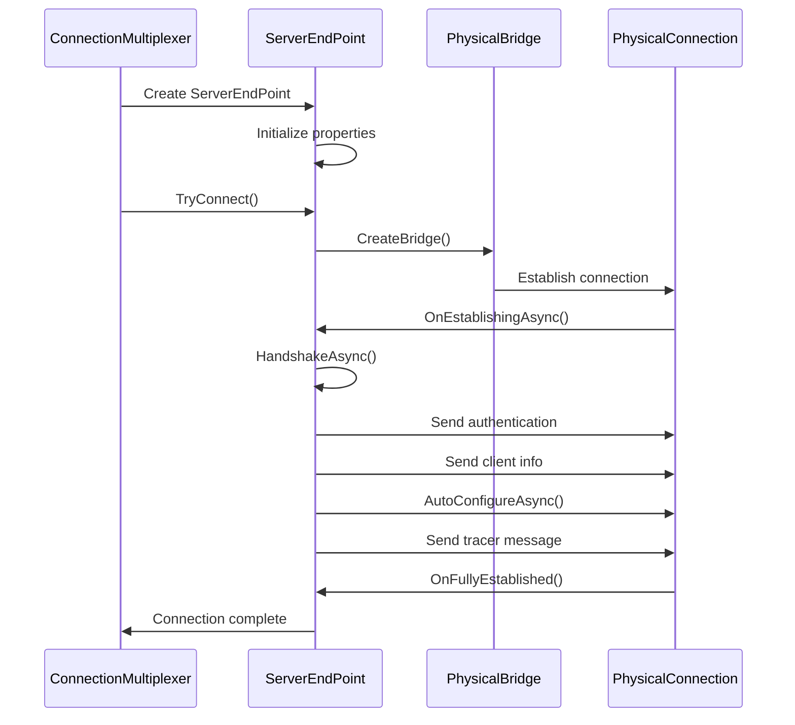
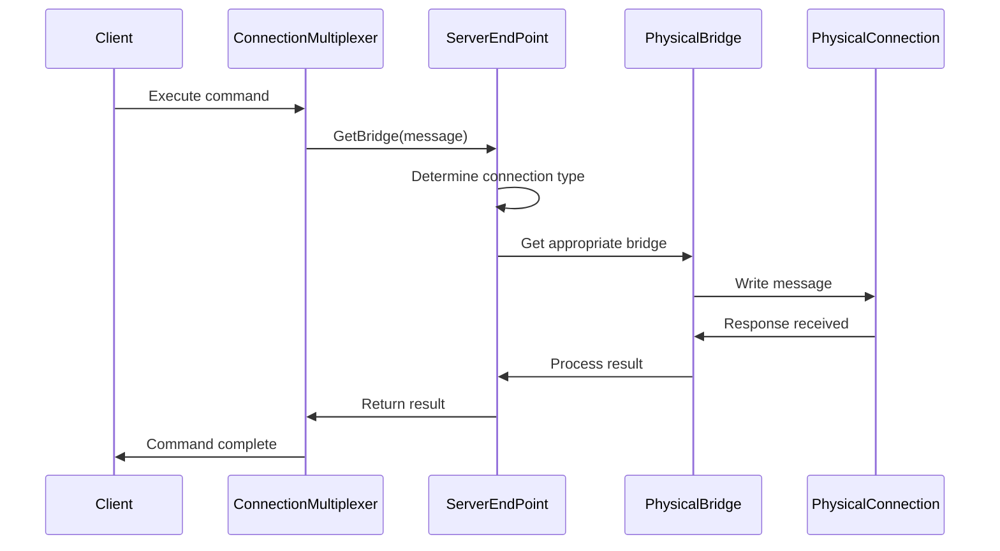
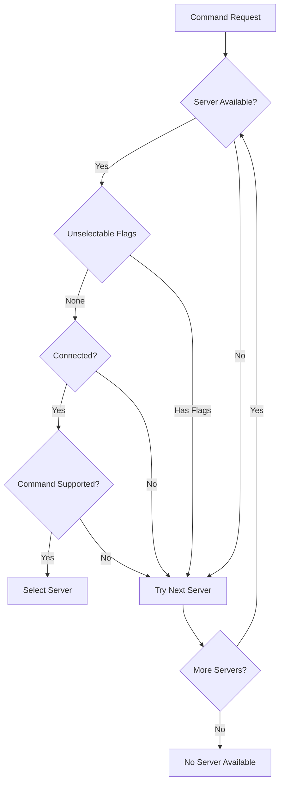
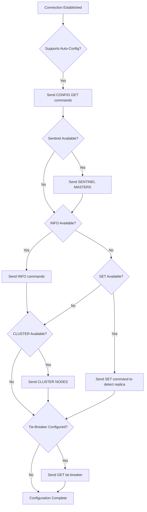

# ServerEndPoint Module Documentation

## Introduction

The ServerEndPoint module is a critical component of the StackExchange.Redis library that represents individual Redis server instances within a connection multiplexer. It serves as the primary abstraction for managing connections to specific Redis servers, handling both interactive and subscription connections, and maintaining server state and configuration.

ServerEndPoint acts as the bridge between the high-level ConnectionMultiplexer and the low-level PhysicalBridge/PhysicalConnection components, providing server-specific functionality while coordinating with the overall connection management system.

## Architecture Overview

### Core Components

The ServerEndPoint module consists of one primary component:

- **ServerEndPoint**: The main class that represents a Redis server endpoint, managing connections, server state, and configuration

### Supporting Components

The module works closely with several related components:

- **PhysicalBridge**: Manages the actual network connection to the server
- **PhysicalConnection**: Represents the low-level TCP connection
- **ConnectionMultiplexer**: The parent component that manages multiple ServerEndPoints
- **RedisServer**: Provides server-specific operations interface
- **ClusterConfiguration**: Manages cluster topology information

## Architecture Diagram

## Component Details

### ServerEndPoint Class

The ServerEndPoint class is the central component that manages all aspects of a Redis server connection:

#### Key Properties

- **EndPoint**: The network endpoint (IP address and port) of the Redis server
- **ServerType**: The type of server (Standalone, Cluster, Twemproxy, Envoyproxy)
- **Version**: The Redis server version
- **IsReplica**: Whether this server is a replica/slave
- **Databases**: Number of databases supported by the server
- **SupportsDatabases**: Whether the server supports database selection
- **SupportsPrimaryWrites**: Whether writes are allowed on this server

#### Connection Management

The ServerEndPoint manages two types of connections:

1. **Interactive Connection**: Used for regular Redis commands
2. **Subscription Connection**: Used for pub/sub operations (RESP2 only)

#### Server State Management

The ServerEndPoint maintains various server state information:

- **Connection State**: Tracks whether the server is connected
- **Unselectable Flags**: Reasons why the server might not be selectable for operations
- **Cluster Configuration**: Node relationships in a cluster setup
- **Script Cache**: Cached Lua scripts for EVALSHA operations

## Data Flow

### Connection Establishment Flow

### Command Execution Flow

## Key Features

### 1. Dual Connection Support

ServerEndPoint supports both interactive and subscription connections, with automatic protocol detection:

- **RESP2**: Uses separate connections for interactive and subscription commands
- **RESP3**: Uses a single connection for all commands

### 2. Cluster Support

In cluster mode, ServerEndPoint:
- Maintains primary/replica relationships
- Updates cluster topology information
- Handles slot assignment and redirection

### 3. Auto-Configuration

The ServerEndPoint automatically configures itself by:
- Detecting server capabilities
- Configuring authentication
- Setting up client information
- Determining server role (primary/replica)

### 4. Connection Health Monitoring

- Heartbeat mechanism to maintain connection health
- Automatic reconnection on connection failure
- Connection state tracking and reporting

## Dependencies

The ServerEndPoint module has dependencies on several other modules:

### ConnectionManagement
- [ConnectionMultiplexer](ConnectionMultiplexer.md): Parent component that manages ServerEndPoints
- [PhysicalBridge](PhysicalBridge.md): Manages actual network connections
- [PhysicalConnection](PhysicalConnection.md): Low-level TCP connection management

### MessageSystem
- [Message](MessageSystem.md): Command message representation and routing

### ResultProcessing
- [ResultProcessor](ResultProcessing.md): Processes responses from Redis server

### Configuration
- [ConfigurationOptions](Configuration.md): Connection configuration settings

## Process Flows

### Server Selection Process

### Auto-Configuration Process

## Error Handling

The ServerEndPoint implements comprehensive error handling:

### Connection Failures
- Tracks last exception for diagnostic purposes
- Implements exponential backoff for reconnection attempts
- Provides detailed connection state information

### Command Failures
- Routes commands to appropriate connections
- Handles command unavailability gracefully
- Provides meaningful error messages

### Configuration Errors
- Validates server capabilities before use
- Gracefully handles missing commands
- Provides fallback mechanisms

## Performance Considerations

### Connection Pooling
- Reuses connections where possible
- Minimizes connection creation overhead
- Implements connection lifecycle management

### Memoization
- Caches frequently accessed properties
- Reduces repeated configuration checks
- Improves hot path performance

### Concurrent Access
- Thread-safe property access
- Lock-free operations where possible
- Efficient synchronization primitives

## Integration Points

### With ConnectionMultiplexer
ServerEndPoint integrates with ConnectionMultiplexer to:
- Participate in server selection algorithms
- Report connection state changes
- Handle reconfiguration events

### With PhysicalBridge
Integration with PhysicalBridge provides:
- Message routing and queuing
- Connection state management
- Heartbeat and health monitoring

### With RedisServer
The RedisServer class provides:
- High-level server operations interface
- Server-specific command execution
- Administrative functionality

## Best Practices

### Server Selection
- Check IsSelectable() before using a server
- Consider server role (primary vs replica) for write operations
- Handle unselectable servers gracefully

### Connection Management
- Use OnConnectedAsync() for connection-dependent operations
- Monitor connection state changes
- Implement proper retry logic

### Configuration
- Allow auto-configuration to complete before critical operations
- Respect server capabilities and limitations
- Handle configuration changes dynamically

## Summary

The ServerEndPoint module is a sophisticated component that provides robust Redis server management capabilities. It handles the complexity of connection management, server discovery, and state tracking while providing a clean interface for higher-level components. Its support for both standalone and cluster modes, along with comprehensive error handling and performance optimizations, makes it a critical foundation for the StackExchange.Redis library's reliability and performance.