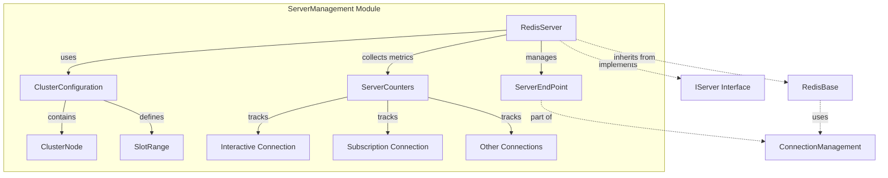
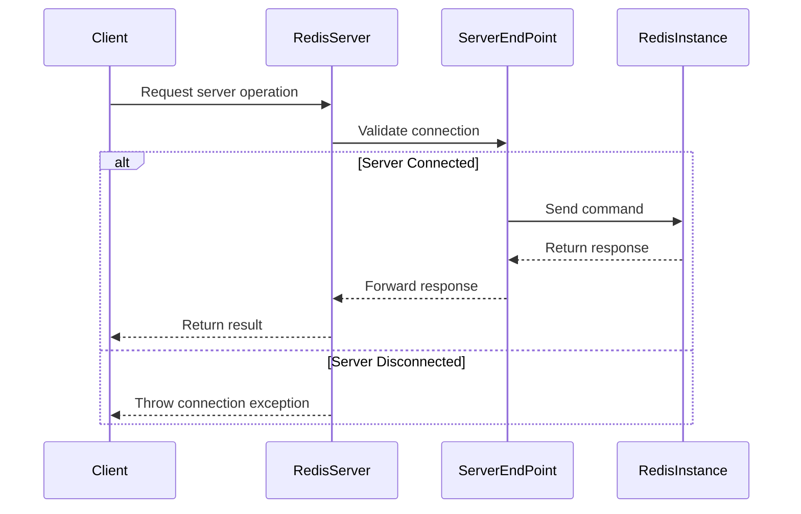

# ServerManagement Module Documentation

## Overview

The ServerManagement module in StackExchange.Redis provides comprehensive server-level operations and management capabilities for Redis servers. This module handles server administration, cluster management, configuration operations, and monitoring functionality. It serves as the primary interface for interacting with Redis server instances beyond basic key-value operations.

## Purpose

The ServerManagement module enables:
- Server administration and configuration management
- Cluster topology management and node discovery
- Server monitoring and performance metrics collection
- Client connection management
- Database-level operations (flush, size, etc.)
- Replication and failover management
- Script management and execution
- Sentinel integration for high availability

## Architecture



## Core Components

### 1. RedisServer
The primary implementation of the `IServer` interface, providing all server-level operations and management functionality. It acts as the main entry point for server administration tasks.

**Key Responsibilities:**
- Execute server commands (INFO, CONFIG, CLIENT, etc.)
- Manage database operations (FLUSHDB, FLUSHALL, DBSIZE)
- Handle replication operations (REPLICAOF, SLAVEOF)
- Perform cluster operations (CLUSTER NODES, CLUSTER SLOTS)
- Manage Lua scripts (SCRIPT LOAD, SCRIPT EXISTS, SCRIPT FLUSH)
- Handle Sentinel operations for high availability
- Monitor server performance and latency

**Detailed Documentation**: [RedisServer.md](RedisServer.md)

### 2. ClusterConfiguration
Manages Redis Cluster topology information, including node discovery, slot allocation, and cluster state management.

**Key Responsibilities:**
- Parse and maintain cluster node information
- Track slot-to-node mappings
- Handle cluster topology changes
- Provide node selection based on slot allocation
- Manage replica relationships

**Detailed Documentation**: [ClusterConfiguration.md](ClusterConfiguration.md)

### 3. ServerCounters
Tracks connection-level metrics and performance counters for individual Redis server instances.

**Key Responsibilities:**
- Monitor connection statistics
- Track outstanding operations
- Collect performance metrics
- Provide server health indicators

**Detailed Documentation**: [ServerCounters.md](ServerCounters.md)

## Data Flow



## Integration with Other Modules

### ConnectionManagement
- **Dependency**: ServerManagement relies on ConnectionManagement for underlying connection handling
- **Integration**: RedisServer uses ServerEndPoint instances to communicate with Redis instances
- **Cross-reference**: See [ConnectionManagement.md](ConnectionManagement.md) for connection details

### DatabaseOperations
- **Dependency**: ServerManagement provides server-level context for database operations
- **Integration**: Database operations use server information for command routing
- **Cross-reference**: See [DatabaseOperations.md](DatabaseOperations.md) for database operations

### MessageSystem
- **Dependency**: ServerManagement creates and processes server-specific messages
- **Integration**: Uses Message.Create() for building server commands
- **Cross-reference**: See [MessageSystem.md](MessageSystem.md) for message handling

### ResultProcessing
- **Dependency**: ServerManagement uses specialized result processors
- **Integration**: Leverages ResultProcessor for parsing server responses
- **Cross-reference**: See [ResultProcessing.md](ResultProcessing.md) for result processing

## Key Features

### Server Administration
- Configuration management (CONFIG GET/SET/REWRITE)
- Client connection management (CLIENT LIST/KILL)
- Database operations (FLUSHDB, FLUSHALL, DBSIZE)
- Server information retrieval (INFO, TIME)

### Cluster Management
- Cluster topology discovery and management
- Slot allocation and node mapping
- Replica relationship management
- Cluster node health monitoring

### Monitoring and Diagnostics
- Performance metrics collection
- Latency monitoring and analysis
- Memory usage statistics
- Slow query log management

### High Availability
- Sentinel integration for automatic failover
- Replication management
- Primary/replica role switching
- Service discovery through Sentinel

## Usage Patterns

### Basic Server Operations
```csharp
// Get server information
var server = redis.GetServer(endpoint);
var info = server.Info();
var config = server.ConfigGet();

// Manage databases
server.FlushDatabase();
var size = server.DatabaseSize();

// Client management
var clients = server.ClientList();
server.ClientKill(endpoint);
```

### Cluster Operations
```csharp
// Get cluster configuration
var clusterConfig = server.ClusterNodes();
var node = clusterConfig.GetBySlot(key);

// Check node status
var isConnected = server.IsConnected;
var features = server.Features;
```

### Monitoring Operations
```csharp
// Performance monitoring
var counters = server.GetCounters();
var slowlog = server.SlowlogGet();

// Latency analysis
var latency = server.LatencyLatest();
var doctor = server.LatencyDoctor();
```

## Performance Considerations

- **Connection Pooling**: ServerManagement leverages connection pooling from ConnectionManagement
- **Async Operations**: All operations have async counterparts for non-blocking execution
- **Batch Processing**: Multiple operations can be batched for improved performance
- **Caching**: Cluster configuration is cached and updated based on cluster state changes

## Error Handling

- **Connection Failures**: Graceful handling of connection issues with appropriate exceptions
- **Command Failures**: Detailed error information from Redis server responses
- **Timeout Handling**: Configurable timeouts for server operations
- **Retry Logic**: Integration with retry policies for transient failures

## Thread Safety

All ServerManagement components are designed to be thread-safe:
- Immutable configuration objects
- Thread-safe counter operations
- Safe concurrent access to server state
- Proper synchronization for shared resources

## Related Documentation

- [ConnectionManagement.md](ConnectionManagement.md) - Connection handling and management
- [DatabaseOperations.md](DatabaseOperations.md) - Database-level operations
- [MessageSystem.md](MessageSystem.md) - Message creation and processing
- [ResultProcessing.md](ResultProcessing.md) - Result processing and parsing
- [Configuration.md](Configuration.md) - Configuration options and settings