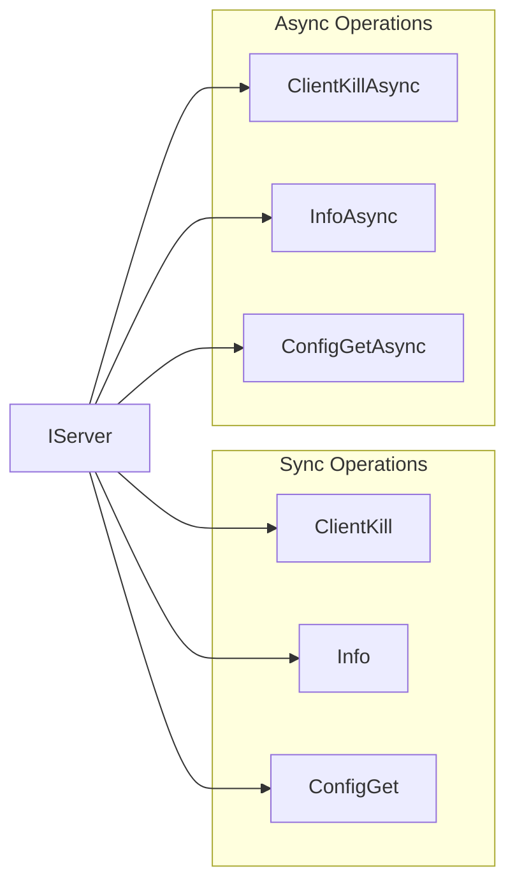

# ServerManagementInterfaces Module Documentation

## Introduction

The ServerManagementInterfaces module provides the core abstraction layer for managing Redis server instances within the StackExchange.Redis library. It defines the `IServer` interface, which serves as the primary contract for interacting with individual Redis servers, whether they are standalone instances, cluster nodes, or sentinel-monitored servers.

This module is essential for server-level operations including configuration management, monitoring, maintenance tasks, and cluster/sentinel operations. It provides a comprehensive API that abstracts the complexity of Redis server management while maintaining full access to Redis server capabilities.

## Architecture Overview

The ServerManagementInterfaces module sits at the heart of the server management layer, providing the contract that concrete implementations must fulfill. It integrates with multiple other modules to provide a complete server management experience.


## Core Components

### IServer Interface

The `IServer` interface is the central component of this module, providing over 100 methods for server management operations. It extends the `IRedis` interface and serves as the primary contract for all server-level operations.

#### Key Responsibilities:
- **Server Information**: Provides access to server metadata, version, type, and capabilities
- **Configuration Management**: Handles runtime configuration changes and retrieval
- **Client Management**: Manages client connections and operations
- **Database Operations**: Controls database-level operations like flushing and key scanning
- **Cluster Operations**: Manages Redis cluster configurations and operations
- **Sentinel Operations**: Provides Redis Sentinel integration for high availability
- **Monitoring and Diagnostics**: Offers comprehensive monitoring and diagnostic capabilities
- **Script Management**: Handles Lua script operations
- **Replication Management**: Manages master-replica relationships

#### Key Properties:


## Component Relationships

### Integration with ConnectionManagement

The ServerManagementInterfaces module works closely with the ConnectionManagement module to provide server instances to clients:


### Integration with ValueTypes

The IServer interface extensively uses value types from the ValueTypes module:

- **RedisValue**: Used for configuration values, command arguments, and return values
- **RedisKey**: Used for key-based operations like `Keys()` and database operations
- **RedisFeatures**: Provides feature detection capabilities for the connected server

### Integration with MessageSystem

Server operations are translated into Redis commands through the MessageSystem:


## Key Functional Areas

### 1. Server Information and Properties

The IServer interface provides comprehensive server information:


### 2. Configuration Management

IServer provides extensive configuration management capabilities:

- **ConfigGet/ConfigSet**: Runtime configuration parameter management
- **ConfigRewrite**: Persist configuration changes to redis.conf
- **ConfigResetStatistics**: Reset server statistics

### 3. Client Management

Comprehensive client connection management:

- **ClientList**: Retrieve information about connected clients
- **ClientKill**: Terminate client connections with various filtering options
- Support for multiple kill patterns (by endpoint, ID, type, or custom filters)

### 4. Database Operations

Database-level management operations:

- **DatabaseSize**: Get key count in specific databases
- **FlushDatabase/FlushAllDatabases**: Clear database contents
- **Keys**: Scan for keys with pattern matching
- **SwapDatabases**: Atomically swap two databases

### 5. Cluster Operations

Redis cluster management:

- **ClusterNodes**: Retrieve cluster topology information
- **ClusterNodesRaw**: Get raw cluster configuration
- Integration with ClusterConfiguration for structured cluster data

### 6. Sentinel Operations

Redis Sentinel integration for high availability:

- **SentinelGetMasterAddressByName**: Discover primary servers
- **SentinelGetReplicaAddresses**: Discover replica servers
- **SentinelFailover**: Trigger manual failovers
- **SentinelMasters/SentinelReplicas**: Monitor server states

### 7. Monitoring and Diagnostics

Comprehensive monitoring capabilities:

- **Info/InfoRaw**: Server statistics and information
- **Time**: Server time synchronization
- **LastSave**: Persistence status monitoring
- **SlowlogGet/SlowlogReset**: Performance monitoring
- **LatencyDoctor/LatencyHistory**: Latency analysis
- **MemoryDoctor/MemoryStats**: Memory usage analysis

### 8. Script Management

Lua script operations:

- **ScriptLoad**: Load scripts for execution
- **ScriptExists**: Check script availability
- **ScriptFlush**: Clear script cache

### 9. Replication Management

Master-replica relationship management:

- **ReplicaOfAsync**: Configure replication relationships
- **MakePrimaryAsync**: Promote replicas to primary
- **Role**: Check replication status

## Async Pattern Implementation

The IServer interface follows the async pattern consistently, providing both synchronous and asynchronous versions of all operations:



## Error Handling and Resilience

The IServer interface integrates with the connection management system to provide resilient operations:

- **Connection State Checking**: `IsConnected` property for connection validation
- **Command Flags**: Support for command flags to control behavior
- **Timeout Handling**: Integration with connection timeout mechanisms
- **Retry Logic**: Works with connection retry policies

## Extension Points

The module provides extension capabilities through the `IServerExtensions` class:

- **Testing Support**: `SimulateConnectionFailure` for testing scenarios
- **Future Extensions**: Pattern for adding additional functionality

## Dependencies on Other Modules

### Direct Dependencies
- **CoreInterfaces**: Extends `IRedis` interface
- **ValueTypes**: Uses `RedisValue`, `RedisKey`, `RedisFeatures`
- **MessageSystem**: Operations generate command messages

### Indirect Dependencies
- **ConnectionManagement**: Concrete implementations use connection infrastructure
- **ServerManagement**: `RedisServer` implements `IServer`
- **ResultProcessing**: Command results are processed by result processors

## Usage Patterns

### Basic Server Operations
```csharp
// Get server instance from multiplexer
var server = multiplexer.GetServer(endpoint);

// Check server status
if (server.IsConnected)
{
    // Get server information
    var info = server.Info();
    var version = server.Version;
    var features = server.Features;
}
```

### Configuration Management
```csharp
// Get configuration
var config = server.ConfigGet("maxmemory");

// Set configuration
server.ConfigSet("maxmemory", "1gb");

// Persist changes
server.ConfigRewrite();
```

### Monitoring Operations
```csharp
// Get server statistics
var stats = server.Info();
var slowLog = server.SlowlogGet(10);

// Memory analysis
var memoryStats = server.MemoryStats();
var memoryDoctor = server.MemoryDoctor();
```

## Best Practices

1. **Connection Validation**: Always check `IsConnected` before critical operations
2. **Async Usage**: Prefer async methods for better scalability
3. **Command Flags**: Use appropriate flags for operation control
4. **Resource Management**: Properly dispose of server references
5. **Error Handling**: Handle connection failures gracefully
6. **Monitoring**: Regularly monitor server health and performance

## Related Documentation

- [ConnectionManagement](ConnectionManagement.md) - Server connection infrastructure
- [ServerManagement](ServerManagement.md) - Concrete server implementations
- [ValueTypes](ValueTypes.md) - Value types used by IServer
- [MessageSystem](MessageSystem.md) - Command message generation
- [ResultProcessing](ResultProcessing.md) - Result processing for server operations

## Summary

The ServerManagementInterfaces module provides the essential abstraction layer for Redis server management in StackExchange.Redis. Through the comprehensive IServer interface, it offers a complete API for server administration, monitoring, and configuration management while maintaining clean separation of concerns and providing both synchronous and asynchronous operation patterns. The module's design enables robust server management capabilities while integrating seamlessly with the broader Redis client architecture.