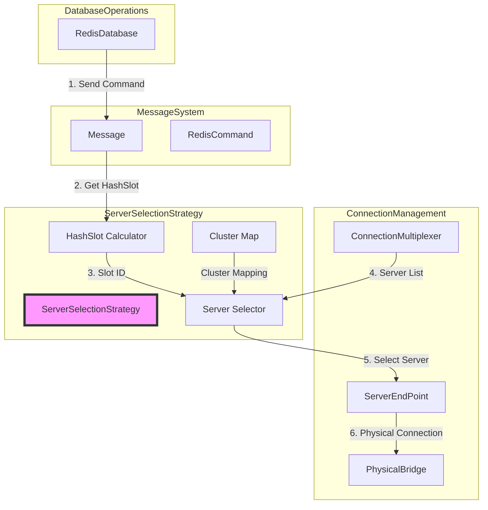
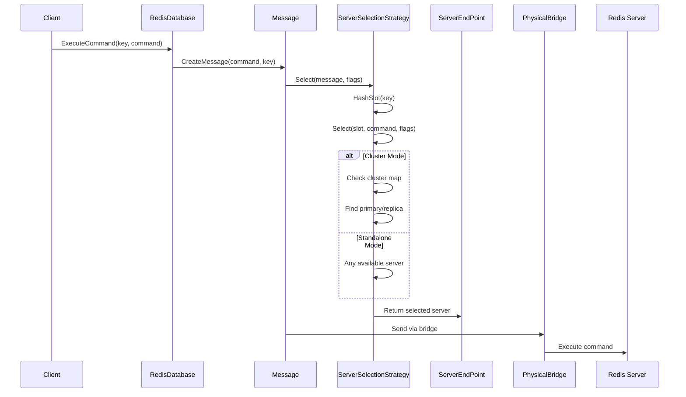
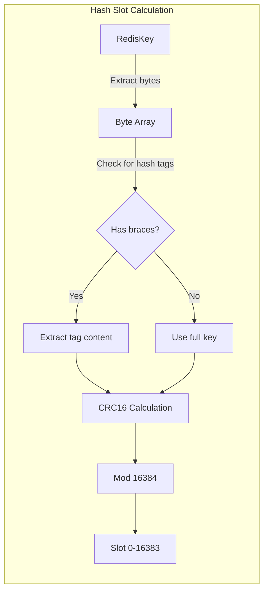
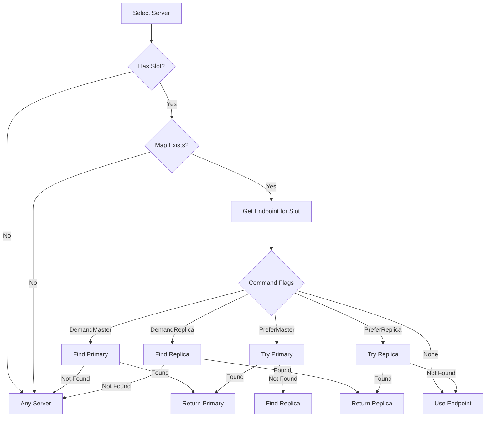
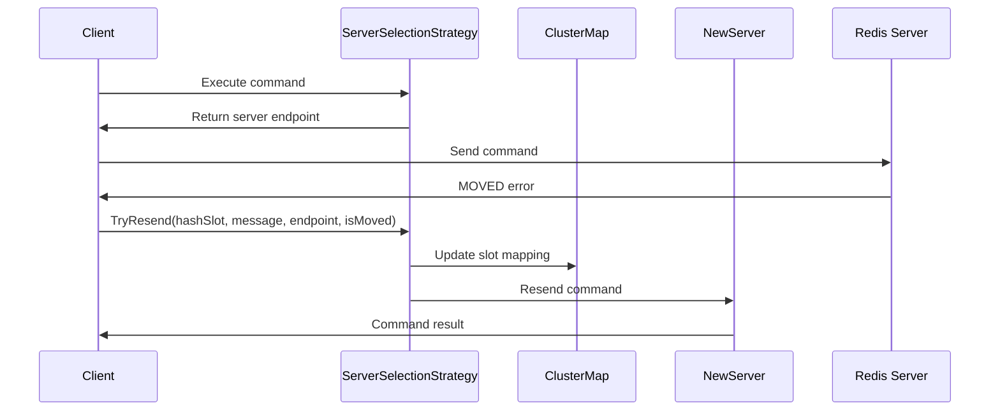
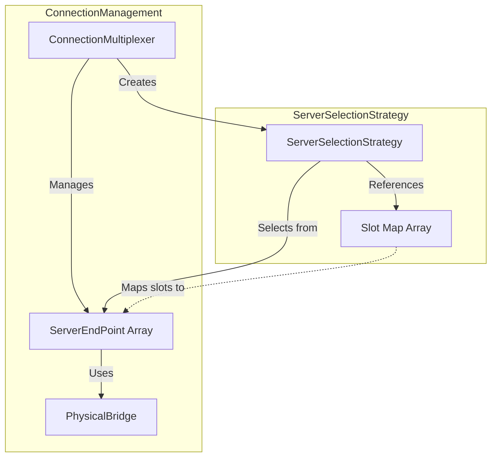

# ServerSelectionStrategy Module

## Introduction

The ServerSelectionStrategy module is a critical component of the StackExchange.Redis library that implements intelligent server selection logic for Redis operations. It determines which Redis server endpoint should handle specific commands based on clustering, replication topology, and command requirements. This module is essential for both standalone Redis instances and clustered deployments, providing optimal routing decisions that ensure high availability and performance.

## Architecture Overview

The ServerSelectionStrategy acts as the routing engine within the Redis connection management system, sitting between the high-level database operations and the physical server connections. It implements Redis Cluster's hash slot algorithm and provides sophisticated server selection logic that considers server roles (primary/replica), availability, and command-specific requirements.



## Core Components

### ServerSelectionStrategy Class

The `ServerSelectionStrategy` class is the main component that implements all server selection logic. It's an internal sealed class that maintains the cluster slot mapping and provides methods for selecting appropriate servers based on various criteria.

#### Key Properties:
- **ServerType**: Determines the Redis deployment type (Standalone, Cluster, Twemproxy)
- **map**: Array of ServerEndPoint references for cluster slot mapping (16,384 slots)
- **anyStartOffset**: Counter for round-robin server selection

#### Core Methods:
- **HashSlot()**: Computes Redis Cluster hash slots for keys and channels
- **Select()**: Main server selection method with multiple overloads
- **TryResend()**: Handles MOVED/ASK redirections in cluster mode
- **UpdateClusterRange()**: Updates slot-to-server mappings

## Data Flow Architecture



## Cluster Hash Slot Algorithm

The module implements Redis Cluster's CRC16-based hash slot algorithm:



### Hash Tag Support
The algorithm supports Redis hash tags for multi-key operations:
- Keys with `{tag}` syntax use only the content between braces for hashing
- This ensures related keys map to the same slot for atomic operations

## Server Selection Logic

### Selection Strategy Matrix

| Server Type | Command Flags | Selection Logic |
|-------------|---------------|-----------------|
| Standalone | Any | Any available server |
| Cluster | DemandMaster | Primary for slot, fallback to any |
| Cluster | PreferMaster | Primary preferred, replica fallback |
| Cluster | DemandReplica | Replica for slot, fallback to any |
| Cluster | PreferReplica | Replica preferred, primary fallback |
| Cluster | None | Primary for slot, fallback to any |

### Primary/Replica Selection



## Cluster Redirection Handling

The module handles Redis Cluster redirections (MOVED and ASK):



## Integration with Connection Management

The ServerSelectionStrategy integrates closely with the [ConnectionMultiplexer](ConnectionMultiplexer.md) and [ServerEndPoint](ServerEndPoint.md) components:



## Performance Considerations

### Memory Management
- Uses `ArrayPool<byte>.Shared` for large key processing to minimize allocations
- Implements stack-allocated spans for keys ≤ 256 bytes
- Maintains a single 16,384-element array for cluster slot mapping

### Thread Safety
- Uses `Interlocked.Increment` for round-robin selection
- Implements lock-based synchronization for cluster map mutations
- Read operations are lock-free for performance

### Optimization Strategies
- Caches CRC16 lookup table as static readonly array
- Uses unsafe code for high-performance CRC16 calculation
- Implements early exit conditions in selection logic

## Error Handling

The module implements comprehensive error handling:

- **MultiSlotException**: Thrown when operations span multiple slots in cluster mode
- **Null Server Handling**: Gracefully falls back to any available server
- **Redirection Failures**: Returns false from TryResend on failure, allowing retry logic

## Configuration Impact

The ServerSelectionStrategy behavior is influenced by:

- **ServerType**: Set based on connection string and server detection
- **CommandFlags**: Per-operation preferences for primary/replica selection
- **Cluster Configuration**: Dynamic updates from CLUSTER NODES/SLOTS commands

## Dependencies

The ServerSelectionStrategy module depends on several other system components:

- **[ConnectionMultiplexer](ConnectionMultiplexer.md)**: Provides server management and event notifications
- **[ServerEndPoint](ServerEndPoint.md)**: Represents individual Redis server instances
- **[Message](MessageSystem.md)**: Carries command information and routing requirements
- **[RedisKey](ValueTypes.md)**: Provides key data for hash slot calculation

## Usage Patterns

### Typical Command Execution Flow
```csharp
// Internal usage within RedisDatabase
var message = Message.Create(command, key);
var server = multiplexer.ServerSelectionStrategy.Select(message);
if (server != null)
{
    return server.ExecuteSync(message);
}
```

### Cluster Scenario Handling
```csharp
// MOVED redirection handling
if (TryResend(hashSlot, message, movedEndpoint, isMoved: true))
{
    // Command successfully resent to new server
}
```

## Monitoring and Diagnostics

The module provides hooks for monitoring:

- **Hash Slot Movement Events**: `OnHashSlotMoved` notifications
- **Trace Output**: Detailed logging for redirection and selection decisions
- **Slot Coverage Metrics**: `CountCoveredSlots()` for cluster health monitoring

This comprehensive server selection system ensures optimal Redis operation routing while maintaining high availability and performance across different deployment scenarios.