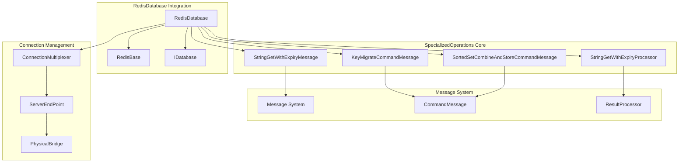
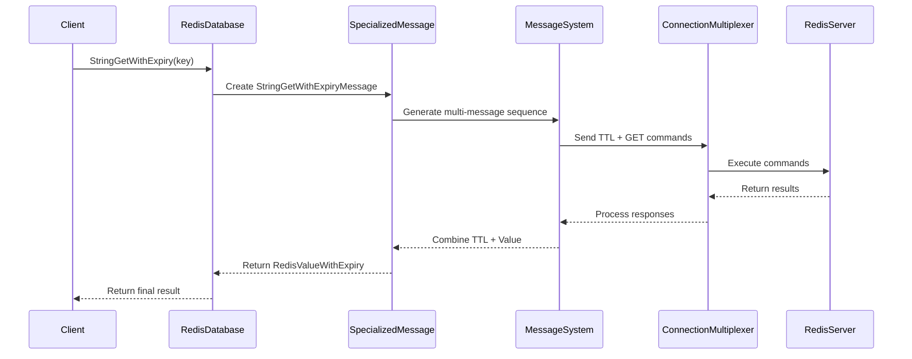
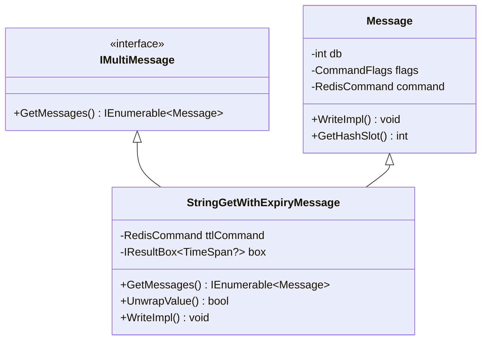
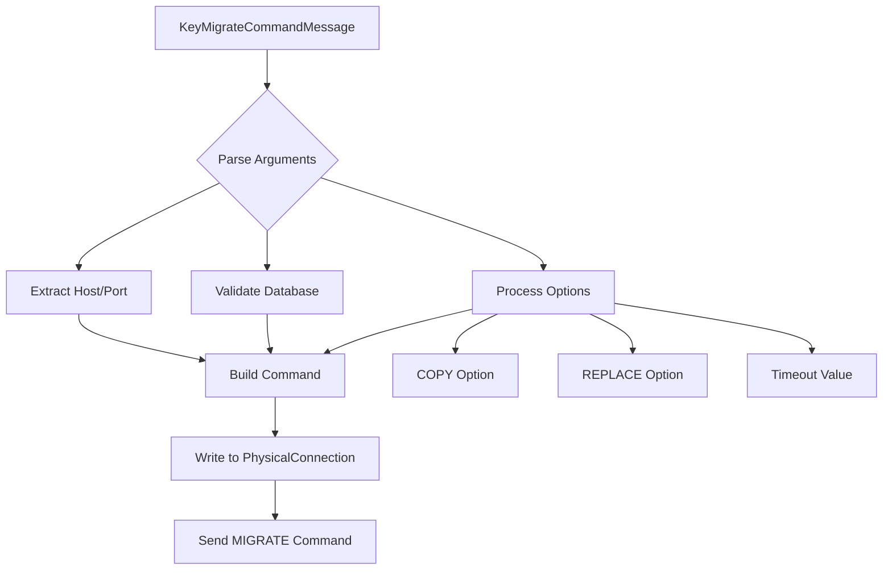
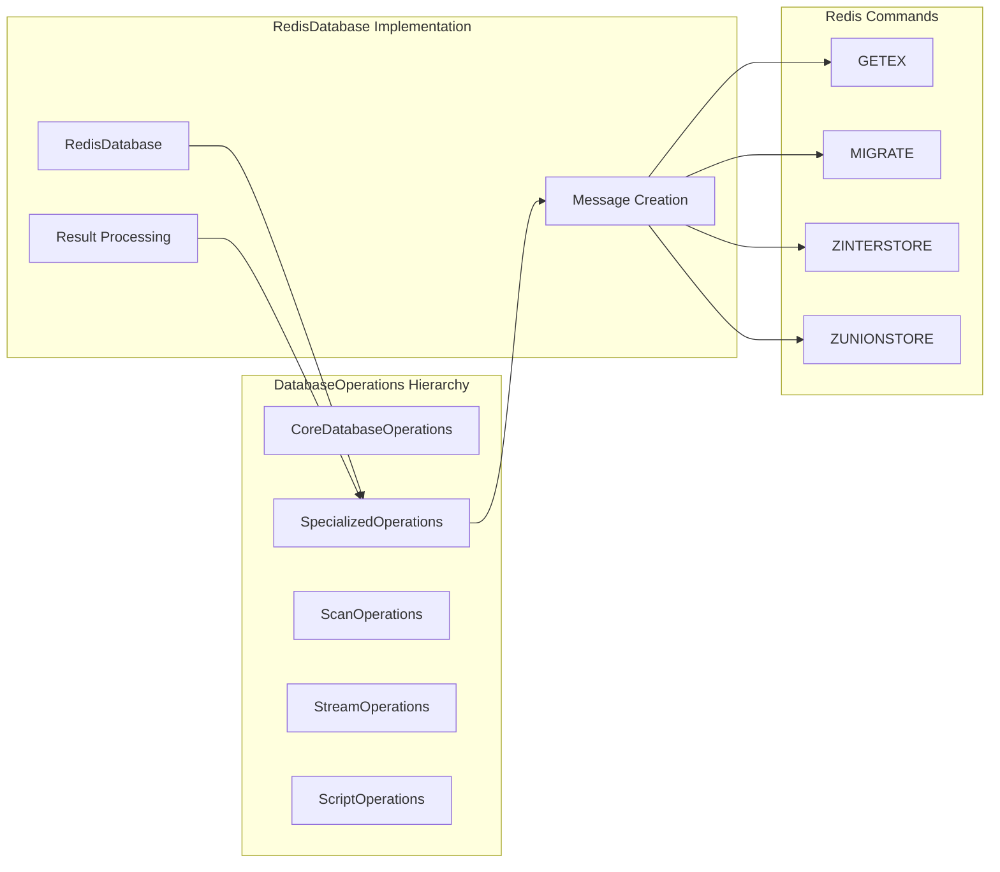
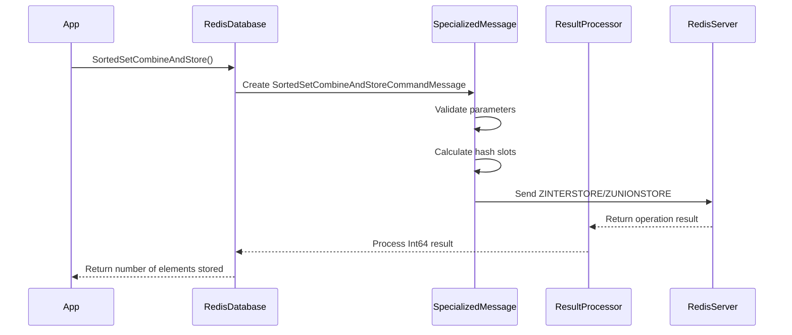

# SpecializedOperations Module Documentation

## Overview

The SpecializedOperations module is a critical component of the StackExchange.Redis library that provides advanced Redis operations beyond basic CRUD functionality. This module specializes in handling complex data operations, atomic operations, and specialized Redis commands that require sophisticated message processing and result handling.

## Purpose and Core Functionality

The SpecializedOperations module serves as the implementation layer for advanced Redis operations within the `RedisDatabase` class. It focuses on four primary areas:

1. **String Operations with Expiry**: Advanced string operations that combine value retrieval with TTL management
2. **Key Migration**: Sophisticated key migration operations between Redis instances
3. **Sorted Set Operations**: Complex sorted set operations including combine-and-store functionality
4. **Specialized Message Processing**: Custom message types and result processors for complex operations

## Architecture and Component Relationships

### Core Components



### Data Flow Architecture



## Key Components Deep Dive

### StringGetWithExpiryMessage

The `StringGetWithExpiryMessage` is a sophisticated multi-message implementation that combines two Redis operations into a single logical operation:

- **Purpose**: Retrieves a string value while simultaneously obtaining its time-to-live (TTL)
- **Implementation**: Uses the `IMultiMessage` interface to send sequential commands
- **Efficiency**: Combines GET and PTTL/TTL commands in a single operation
- **Fallback Strategy**: Automatically selects between PTTL (millisecond precision) and TTL based on server capabilities



### StringGetWithExpiryProcessor

A specialized result processor that handles the complex result combination from the multi-message operation:

- **Function**: Combines the TTL result with the string value result
- **Error Handling**: Properly manages exceptions from either operation
- **Type Safety**: Returns a strongly-typed `RedisValueWithExpiry` structure

### KeyMigrateCommandMessage

Implements the complex Redis MIGRATE command with full protocol support:

- **Protocol Compliance**: Handles all MIGRATE command variations
- **Connection Management**: Manages source and destination server connections
- **Options Support**: Supports COPY, REPLACE, and timeout options
- **Error Handling**: Comprehensive error handling for migration failures



### SortedSetCombineAndStoreCommandMessage

Handles complex sorted set operations with aggregation and weighting:

- **Operations**: Supports ZINTERSTORE, ZUNIONSTORE, and ZDIFFSTORE
- **Weighting**: Full support for weighted operations
- **Aggregation**: Supports SUM, MIN, and MAX aggregation modes
- **Multi-key Support**: Handles operations across multiple keys

## Integration with DatabaseOperations

The SpecializedOperations module integrates seamlessly with the broader DatabaseOperations module:



## Message Processing Flow

### Complex Operation Processing



## Error Handling and Resilience

The SpecializedOperations module implements comprehensive error handling:

### Validation Strategies
- **Parameter Validation**: Extensive parameter validation before command execution
- **Server Capability Checks**: Automatic detection of server capabilities
- **Command Availability**: Checks command availability in the command map

### Exception Handling
- **RedisServerException**: Specialized handling for Redis server errors
- **Connection Failures**: Graceful handling of connection issues
- **Timeout Management**: Proper timeout handling for long-running operations

## Performance Optimizations

### Efficient Message Creation
- **Array Pooling**: Uses `ArrayPool<T>` for temporary allocations
- **Span<T> Usage**: Leverages `Span<T>` for efficient memory operations
- **Minimal Allocations**: Optimized for minimal GC pressure

### Connection Optimization
- **Hash Slot Calculation**: Efficient hash slot calculation for cluster mode
- **Server Selection**: Intelligent server selection based on operation type
- **Pipeline Support**: Full support for pipelined operations

## Dependencies and Interactions

### Core Dependencies
- **[ConnectionManagement](ConnectionManagement.md)**: Provides connection multiplexing and server selection
- **[MessageSystem](MessageSystem.md)**: Supplies message infrastructure and command protocols
- **[ResultProcessing](ResultProcessing.md)**: Offers result processing and type conversion
- **[ValueTypes](ValueTypes.md)**: Provides Redis data type representations

### Interface Implementations
- **IDatabase**: Implements advanced database operations interface
- **IDatabaseAsync**: Provides asynchronous operation support
- **IMultiMessage**: Enables complex multi-command operations

## Usage Patterns and Best Practices

### String Operations with Expiry
```csharp
// Get string value with expiry information
var result = db.StringGetWithExpiry("mykey");
Console.WriteLine($"Value: {result.Value}, Expires in: {result.Expiry}");
```

### Key Migration
```csharp
// Migrate key to different server
var endpoint = new DnsEndPoint("target-server", 6379);
db.KeyMigrate("mykey", endpoint, toDatabase: 1, timeoutMilliseconds: 5000);
```

### Sorted Set Operations
```csharp
// Combine multiple sorted sets with weights
var keys = new[] { "set1", "set2", "set3" };
var weights = new[] { 1.0, 2.0, 3.0 };
var result = db.SortedSetCombineAndStore(SetOperation.Union, "destination", keys, weights);
```

## Advanced Features

### Multi-Message Operations
The module supports complex operations that require multiple Redis commands:

- **Atomic Execution**: Ensures atomic execution of multi-command operations
- **Result Aggregation**: Properly combines results from multiple commands
- **Error Recovery**: Handles partial failures in multi-command sequences

### Server Capability Detection
Automatic detection and utilization of server capabilities:

- **Command Availability**: Dynamic command availability checking
- **Feature Detection**: Automatic detection of Redis server features
- **Fallback Strategies**: Graceful fallback when features are unavailable

## Conclusion

The SpecializedOperations module represents a sophisticated layer of the StackExchange.Redis library that handles complex Redis operations with efficiency, reliability, and performance. Its integration with the broader architecture ensures seamless operation while providing advanced functionality for specialized use cases.

The module's design emphasizes:
- **Performance**: Optimized message processing and minimal allocations
- **Reliability**: Comprehensive error handling and validation
- **Flexibility**: Support for complex multi-command operations
- **Compatibility**: Automatic adaptation to server capabilities

This makes it an essential component for applications requiring advanced Redis functionality beyond basic key-value operations.