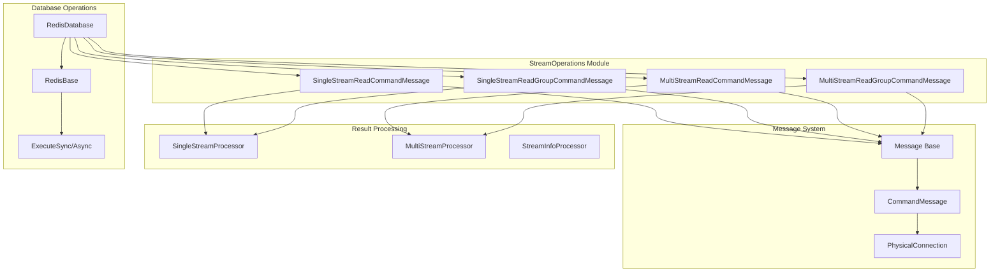
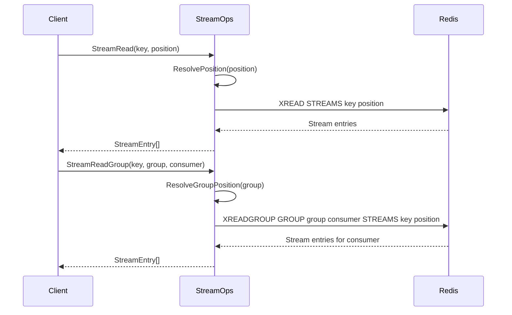
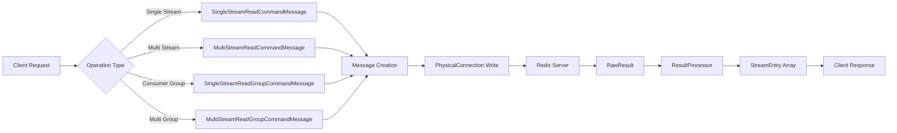
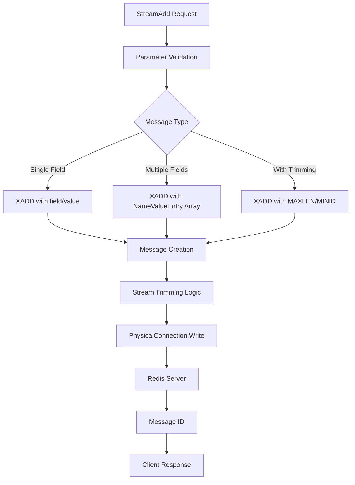
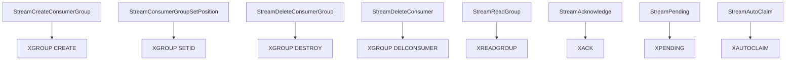
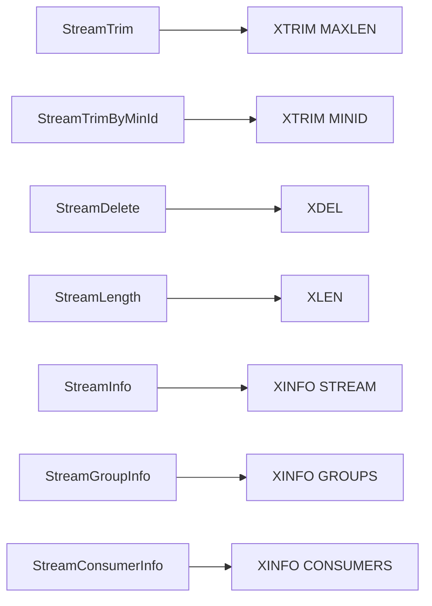
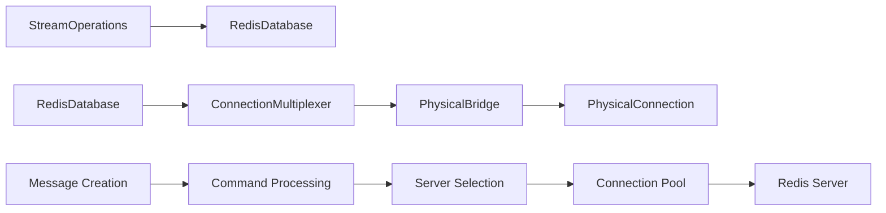
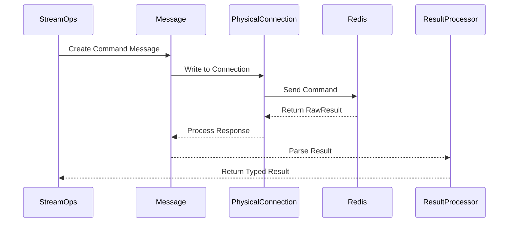

# StreamOperations Module Documentation

## Overview

The StreamOperations module provides comprehensive Redis Stream functionality for the StackExchange.Redis client library. It implements Redis Streams commands for event sourcing, message queuing, and real-time data processing scenarios. The module handles both single-stream and multi-stream operations, consumer group management, and stream trimming capabilities.

## Purpose and Core Functionality

StreamOperations enables developers to:
- Implement event-driven architectures using Redis Streams
- Create producer-consumer patterns with reliable message delivery
- Manage consumer groups for scalable stream processing
- Perform stream trimming and maintenance operations
- Handle both synchronous and asynchronous stream operations

## Architecture

### Component Structure



### Core Components

#### 1. Stream Command Messages

The module implements specialized message classes for different stream operations:

**SingleStreamReadCommandMessage**
- Handles `XREAD` operations for single streams
- Manages stream positioning and count parameters
- Supports both blocking and non-blocking reads

**SingleStreamReadGroupCommandMessage**
- Implements `XREADGROUP` for consumer group operations
- Manages consumer group names and consumer identities
- Handles message acknowledgment tracking

**MultiStreamReadCommandMessage**
- Processes multiple streams in a single `XREAD` operation
- Coordinates stream positions across multiple keys
- Optimizes network round-trips for bulk operations

**MultiStreamReadGroupCommandMessage**
- Extends consumer group functionality to multiple streams
- Manages complex consumer group scenarios
- Handles cross-stream message ordering

#### 2. Stream Position Management



## Data Flow Architecture

### Stream Read Operations



### Stream Write Operations



## Key Features

### 1. Consumer Group Management

The module provides comprehensive consumer group functionality:



### 2. Stream Trimming and Maintenance



### 3. Advanced Stream Operations

- **Stream Range Queries**: `XRANGE` and `XREVRANGE` for historical data access
- **Pending Message Management**: `XPENDING` for monitoring unacknowledged messages
- **Message Claiming**: `XCLAIM` and `XAUTOCLAIM` for handling consumer failures
- **Stream Acknowledgment**: `XACK` for confirming message processing

## Integration with System Architecture

### Connection to DatabaseOperations



### Result Processing Pipeline



## Dependencies

### Internal Dependencies

- **[ConnectionManagement](ConnectionManagement.md)**: Provides connection pooling and server selection
- **[MessageSystem](MessageSystem.md)**: Base message infrastructure and protocol handling
- **[ResultProcessing](ResultProcessing.md)**: Specialized processors for stream data types
- **[ValueTypes](ValueTypes.md)**: Stream-specific data types (StreamEntry, StreamPosition, etc.)

### External Dependencies

- **Redis Server**: Requires Redis 5.0+ for full stream functionality
- **PhysicalConnection**: Low-level network communication layer
- **ServerSelectionStrategy**: Intelligent server routing for cluster scenarios

## Usage Patterns

### Basic Stream Operations

```csharp
// Add messages to stream
var messageId = db.StreamAdd("mystream", "field1", "value1");

// Read from stream
var entries = db.StreamRead("mystream", StreamPosition.Beginning);

// Create consumer group
db.StreamCreateConsumerGroup("mystream", "mygroup", StreamPosition.NewMessages);

// Read as consumer
var groupEntries = db.StreamReadGroup("mystream", "mygroup", "consumer1");

// Acknowledge messages
db.StreamAcknowledge("mystream", "mygroup", messageId);
```

### Advanced Stream Processing

```csharp
// Multi-stream reading
var streams = db.StreamRead(new[] {
    new StreamPosition("stream1", position1),
    new StreamPosition("stream2", position2)
});

// Consumer group with multiple streams
var groupStreams = db.StreamReadGroup(
    new[] {
        new StreamPosition("stream1", StreamPosition.NewMessages),
        new StreamPosition("stream2", StreamPosition.NewMessages)
    },
    "mygroup", "consumer1"
);

// Stream trimming with limits
db.StreamTrim("mystream", 1000, useApproximateMaxLength: true, limit: 100);
```

## Performance Considerations

### Message Batching
- Multi-stream operations reduce network round-trips
- Batch acknowledgment improves throughput
- Stream trimming with limits prevents blocking operations

### Memory Management
- Stream entry parsing uses array pooling
- Large stream reads support pagination via count parameters
- Automatic connection management prevents resource leaks

### Cluster Support
- Stream operations respect Redis Cluster slot allocation
- Multi-stream operations require same-slot keys
- Consumer groups work across cluster nodes

## Error Handling

### Common Exceptions
- `RedisServerException`: Stream doesn't exist, invalid message IDs
- `ArgumentException`: Invalid parameters, wrong operation sequence
- `TimeoutException`: Blocking operations exceeding timeout

### Recovery Patterns
- Consumer group recreation on `BUSYGROUP` errors
- Stream creation with `MkStream` flag
- Position validation before read operations

## Best Practices

1. **Consumer Group Design**: Use meaningful group names and consumer identifiers
2. **Message Acknowledgment**: Always acknowledge processed messages to prevent redelivery
3. **Stream Trimming**: Implement appropriate retention policies to manage memory
4. **Error Handling**: Handle consumer failures with auto-claim mechanisms
5. **Monitoring**: Use `XPENDING` and stream info commands for operational visibility

## Related Documentation

- [DatabaseOperations](DatabaseOperations.md) - General database operation patterns
- [ConnectionManagement](ConnectionManagement.md) - Connection and server management
- [ResultProcessing](ResultProcessing.md) - Stream-specific result processors
- [APIValueTypes](APIValueTypes.md) - Stream data structures and types