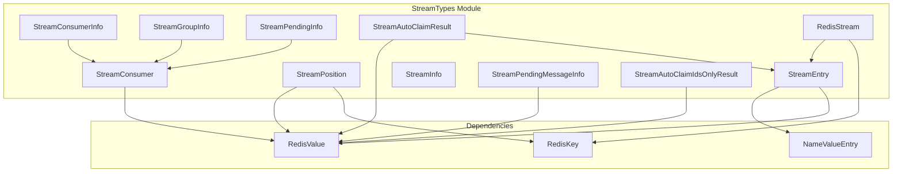
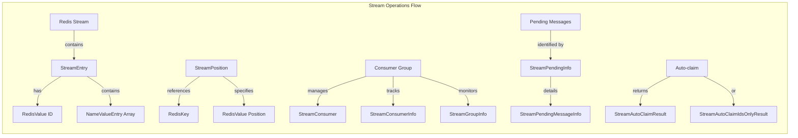
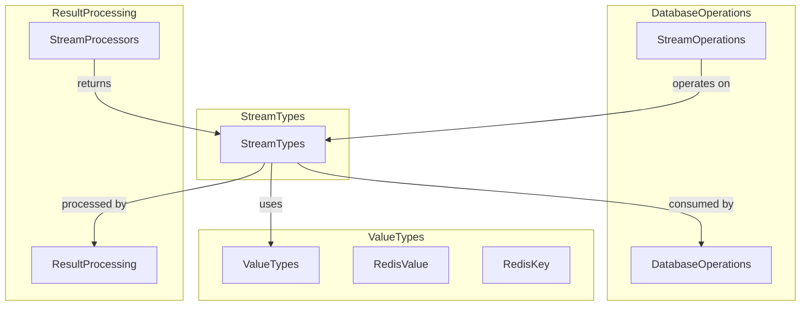
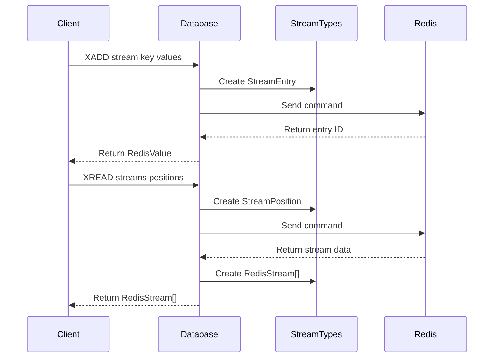

# StreamTypes Module Documentation

## Overview

The StreamTypes module provides the data structures and types necessary for working with Redis Streams, a log-like data structure that allows multiple producers to append messages and multiple consumers to read and process them. This module is part of the broader [APIValueTypes](APIValueTypes.md) ecosystem and specifically handles the complex data types required for stream operations.

## Purpose and Core Functionality

The StreamTypes module serves as the type system foundation for Redis Streams operations, providing:

- **Stream Entry Representation**: Defines how individual messages within streams are structured
- **Stream Position Management**: Handles stream positioning for read operations
- **Consumer Group Support**: Manages consumer information and group metadata
- **Stream Information**: Provides comprehensive stream statistics and metadata
- **Pending Message Tracking**: Handles unacknowledged message management
- **Auto-claim Operations**: Supports message claiming and recovery mechanisms

## Architecture and Component Relationships

### Core Components Structure

### Data Flow Architecture

## Component Details

### StreamEntry
The fundamental unit of data in Redis Streams, representing a single message with a unique ID and associated field-value pairs.

**Key Properties:**
- `Id`: Unique identifier for the stream entry
- `Values`: Array of name-value pairs containing the message data
- `IsNull`: Indicates if the entry is null
- Indexer: Allows direct field access by name

### StreamPosition
Defines the starting point for stream read operations, supporting both absolute positions and special values for reading from beginning or new messages only.

**Key Features:**
- `Beginning`: Read from the start of the stream
- `NewMessages`: Read only new messages
- Command-specific resolution for XREAD, XREADGROUP, and XGROUP operations

### StreamConsumer & StreamConsumerInfo
Represent consumers within consumer groups, tracking their activity and pending message counts.

**StreamConsumer:**
- Basic consumer representation with name and pending message count

**StreamConsumerInfo:**
- Extended consumer information including idle time
- Used by XINFO CONSUMERS command

### StreamGroupInfo
Comprehensive information about consumer groups, including member counts, pending messages, and stream positioning data.

**Properties:**
- Consumer count and pending message statistics
- Last delivered message ID
- Entries read count and lag calculation

### StreamInfo
Complete stream metadata returned by XINFO STREAM command.

**Contains:**
- Stream length and internal structure information
- First and last entries
- Consumer group count
- Radix tree statistics

### Pending Message Types
Specialized types for managing unacknowledged messages:

**StreamPendingInfo:** Overview of pending messages in a group
**StreamPendingMessageInfo:** Detailed information about individual pending messages

### Auto-claim Results
Handle the results of XAUTOCLAIM operations:

**StreamAutoClaimResult:** Full entry data for claimed messages
**StreamAutoClaimIdsOnlyResult:** ID-only results for JUSTID operations

### RedisStream
Container type representing a complete stream with its key and entries.

## Integration with System Architecture

### Module Dependencies

### Stream Operations Integration

The StreamTypes module integrates with the broader Redis client architecture through:

1. **Database Operations**: Stream operations in [DatabaseOperations](DatabaseOperations.md) use these types as parameters and return values
2. **Result Processing**: [ResultProcessing](ResultProcessing.md) module contains specialized processors for converting Redis responses into StreamTypes
3. **Value Types**: Builds upon fundamental [ValueTypes](ValueTypes.md) like RedisValue and RedisKey

### Usage Patterns

## Key Design Decisions

### Immutable Structures
All StreamTypes are implemented as immutable structs, ensuring:
- Thread safety in concurrent scenarios
- Predictable behavior in async operations
- Memory efficiency for large stream processing

### Null Handling
Each type provides static `Null` properties and `IsNull` checks, enabling consistent null handling across the API.

### Internal Constructors
Types use internal constructors to ensure proper initialization while allowing the library to control instantiation.

### Command-Specific Logic
StreamPosition includes command-specific resolution logic, demonstrating tight integration with Redis command semantics.

## Performance Considerations

- **Struct-based Design**: Minimizes heap allocations for high-throughput scenarios
- **Array Reuse**: Null instances use static empty arrays to reduce memory pressure
- **Indexer Optimization**: StreamEntry indexer provides O(n) field lookup with early termination

## Error Handling

The module relies on Redis's built-in error handling at the protocol level. Invalid operations (like using NewMessages with XREAD) throw descriptive exceptions at the client level.

## Future Extensibility

The modular design allows for:
- Additional stream operation types as Redis evolves
- Enhanced metadata support for new XINFO fields
- Extended consumer group functionality

## Related Documentation

- [APIValueTypes](APIValueTypes.md) - Parent module containing StreamTypes
- [DatabaseOperations](DatabaseOperations.md) - Stream operation implementations
- [ResultProcessing](ResultProcessing.md) - Stream result processors
- [ValueTypes](ValueTypes.md) - Fundamental value types used by StreamTypes