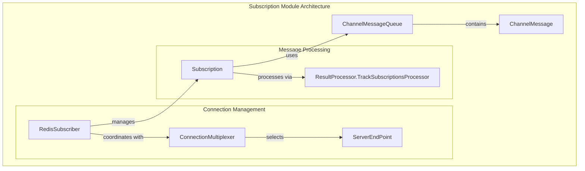
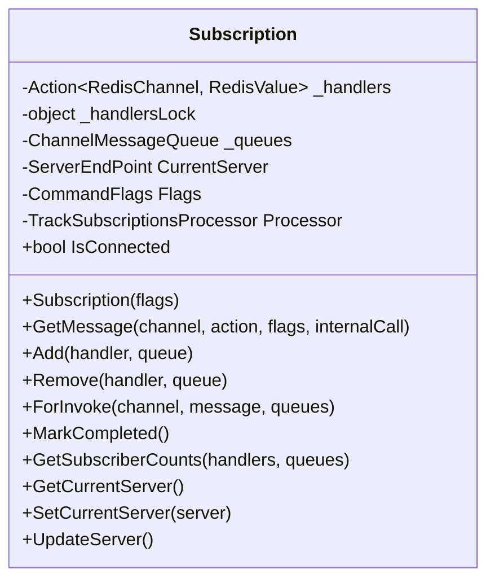
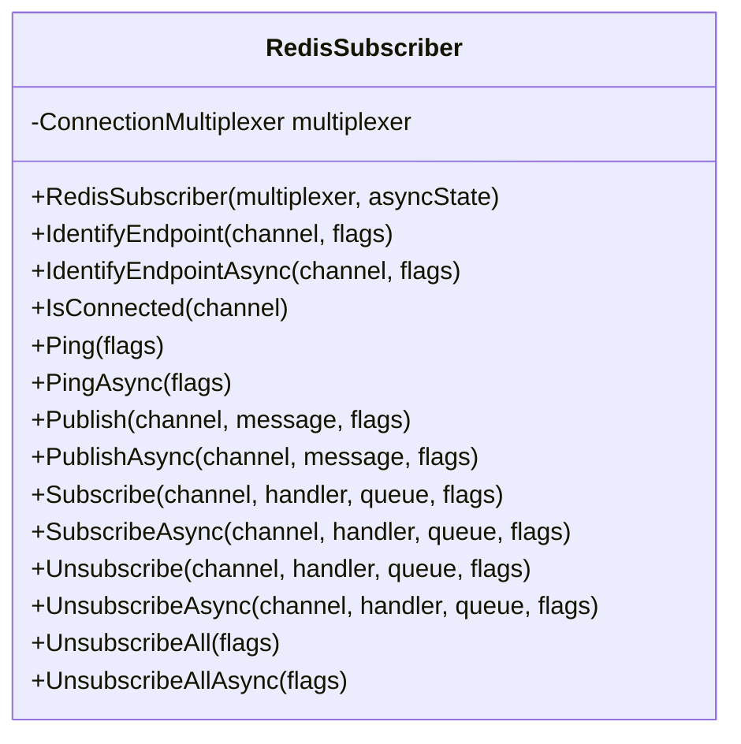
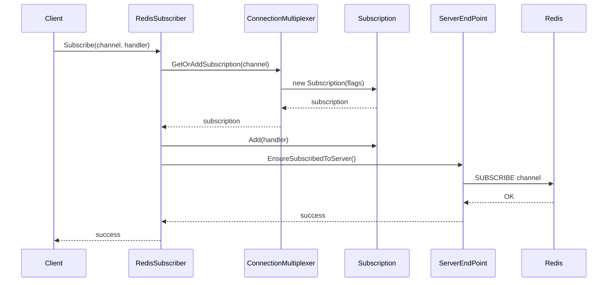
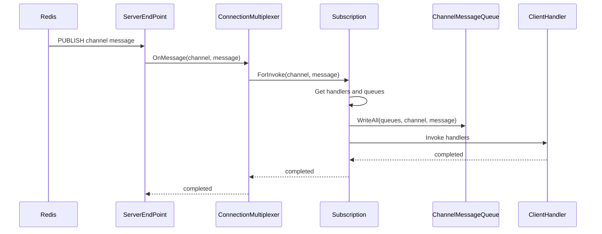
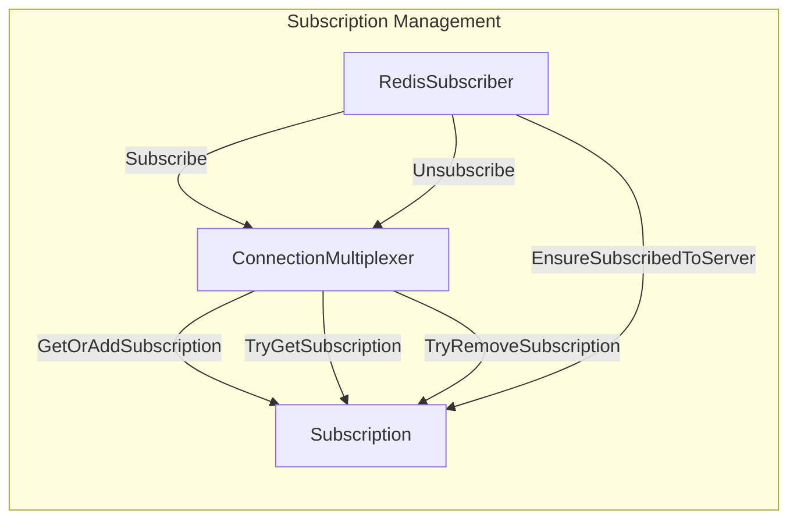
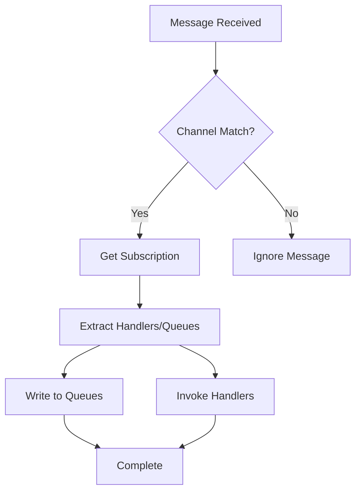
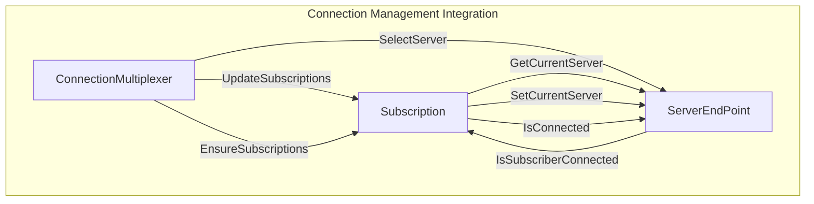
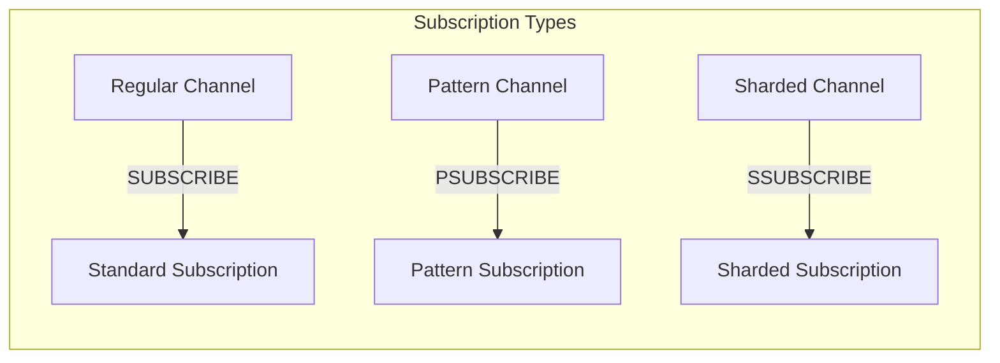
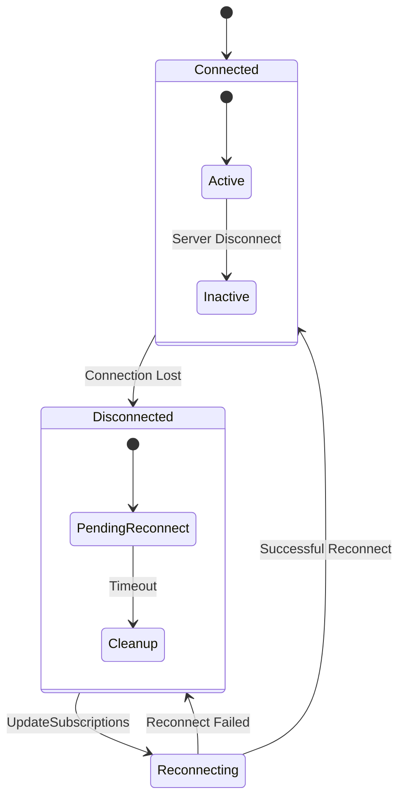

# Subscription Module Documentation

## Introduction

The Subscription module is a core component of the StackExchange.Redis library that manages Redis pub/sub (publish/subscribe) functionality. It provides the infrastructure for handling real-time message broadcasting, channel subscriptions, and message routing within the Redis client. The module enables applications to subscribe to Redis channels, receive published messages, and manage subscription lifecycles efficiently.

## Architecture Overview

The Subscription module is built around a centralized subscription management system that coordinates between multiple components to provide reliable pub/sub functionality. The architecture follows a layered approach with clear separation of concerns between subscription management, message routing, and connection handling.



## Core Components

### Subscription Class

The `Subscription` class is the heart of the module, representing a single subscription to a Redis channel. It manages the lifecycle of subscriptions, handles message routing, and coordinates with the underlying Redis server connections.



**Key Responsibilities:**
- **Subscription Management**: Maintains the list of handlers and message queues for a specific channel
- **Connection State Tracking**: Monitors the connection status to the Redis server hosting the subscription
- **Message Routing**: Routes incoming messages to appropriate handlers and queues
- **Lifecycle Management**: Handles subscription creation, updates, and cleanup

### RedisSubscriber Class

The `RedisSubscriber` class provides the public API for pub/sub operations and coordinates subscription management across the connection multiplexer.



**Key Responsibilities:**
- **API Facade**: Provides the public interface for pub/sub operations
- **Subscription Coordination**: Manages the creation and removal of subscriptions
- **Message Publishing**: Handles the publishing of messages to channels
- **Connection Management**: Ensures subscriptions are properly connected to Redis servers

## Data Flow Architecture

### Subscription Flow



### Message Reception Flow



## Component Interactions

### Subscription Management

The subscription management system coordinates between multiple components to maintain subscription state:



### Message Processing Pipeline

The message processing pipeline ensures efficient routing of messages from Redis to client handlers:



## Connection Management Integration

The Subscription module integrates closely with the ConnectionManagement module to ensure subscriptions remain connected to appropriate Redis servers:



## Subscription Types and Patterns

The module supports different types of subscriptions based on Redis channel patterns:



## Error Handling and Resilience

The Subscription module implements several mechanisms for handling connection failures and ensuring subscription reliability:

### Connection Failure Handling



### Subscription State Management

Each subscription maintains its connection state and can automatically reconnect when the underlying connection is restored:

- **Connected State**: Subscription is active and receiving messages
- **Disconnected State**: Connection lost, subscription pending reconnection
- **Reconnection Process**: Automatically attempts to reconnect when servers become available

## Performance Considerations

### Handler Management

The module uses efficient handler management to minimize overhead:

- **Handler Chaining**: Multiple handlers are chained using delegate combination
- **Lock-Free Operations**: Uses volatile reads for queue access
- **Batch Operations**: Supports variadic commands for bulk operations (TODO)

### Memory Management

- **Message Queuing**: Uses efficient message queuing to prevent memory leaks
- **Handler Cleanup**: Proper cleanup of handlers and queues on unsubscription
- **Connection Pooling**: Reuses connections across multiple subscriptions

## Integration with Other Modules

### ConnectionManagement Module

The Subscription module depends heavily on the ConnectionManagement module for:
- Server selection and connection establishment
- Connection state monitoring
- Server endpoint management

### MessageSystem Module

Integration with the MessageSystem module provides:
- Message creation and formatting
- Command routing for subscription operations
- Protocol-level message handling

### ResultProcessing Module

The ResultProcessing module provides specialized processors for:
- Subscription tracking and management
- Response processing for subscription commands
- Error handling and result interpretation

## API Usage Patterns

### Basic Subscription

```csharp
// Subscribe to a channel with a handler
subscriber.Subscribe("my-channel", (channel, message) => {
    Console.WriteLine($"Received: {message}");
});
```

### Pattern Subscription

```csharp
// Subscribe to pattern-based channels
subscriber.Subscribe("user:*", (channel, message) => {
    Console.WriteLine($"User event on {channel}: {message}");
});
```

### Queue-Based Subscription

```csharp
// Use message queue for async processing
var queue = subscriber.Subscribe("my-channel");
while (await queue.WaitToReadAsync())
{
    if (queue.TryRead(out var message))
    {
        ProcessMessage(message);
    }
}
```

## Thread Safety

The Subscription module is designed to be thread-safe:

- **Handler Management**: Uses locks for handler addition/removal
- **Queue Operations**: Thread-safe queue operations
- **Connection State**: Volatile reads for connection state
- **Subscription Dictionary**: Concurrent dictionary for subscription storage

## Future Enhancements

### Planned Improvements

- **Variadic Commands**: Support for bulk subscription operations to reduce round trips
- **SUNSUBSCRIBE All**: Enhanced API for unsubscribing from all sharded channels
- **Connection Cleanup**: Improved cleanup of stale connections
- **Performance Optimization**: Enhanced handler invocation performance

### Scalability Considerations

- **Subscription Sharding**: Support for distributing subscriptions across multiple servers
- **Message Batching**: Enhanced message batching for high-throughput scenarios
- **Memory Optimization**: Further optimization of memory usage for large-scale deployments

## References

- [ConnectionManagement.md](ConnectionManagement.md) - For connection management details
- [MessageSystem.md](MessageSystem.md) - For message processing architecture
- [ResultProcessing.md](ResultProcessing.md) - For result processing mechanisms
- [CoreInterfaces.md](CoreInterfaces.md) - For interface definitions and contracts