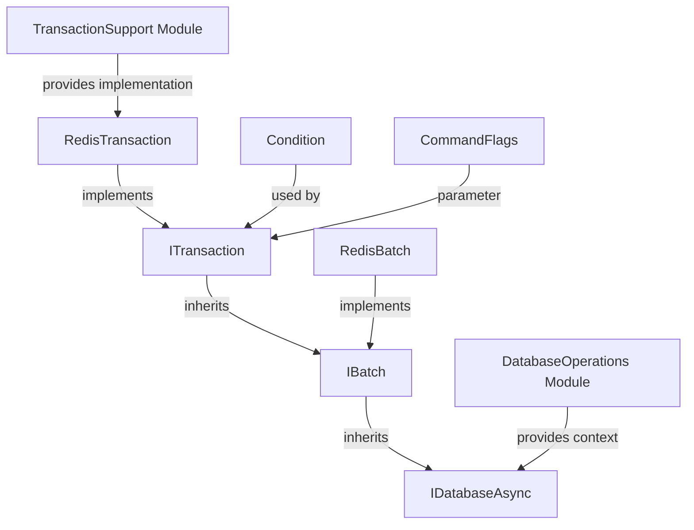

# TransactionBatchInterfaces Module Documentation

## Overview

The TransactionBatchInterfaces module provides the core abstractions for Redis transaction and batch operations in StackExchange.Redis. This module defines the contracts that enable atomic transaction execution and efficient batch command processing, which are fundamental features for maintaining data consistency and optimizing network performance in Redis operations.

## Purpose

The module serves two primary purposes:

1. **Transaction Support**: Provides interfaces for Redis transactions (MULTI/EXEC/DISCARD/WATCH operations) that ensure atomic execution of command sequences
2. **Batch Operations**: Enables efficient grouping of commands to reduce network overhead and improve performance on high-latency connections

## Architecture



## Core Components

### ITransaction Interface
The `ITransaction` interface extends `IBatch` to provide Redis transaction capabilities with support for:
- **Conditional Execution**: Adding preconditions via `AddCondition()`
- **Atomic Execution**: Ensuring all commands succeed or fail together
- **Watch/Unwatch**: Monitoring keys for changes during transaction execution

### IBatch Interface
The `IBatch` interface provides the foundation for batching operations:
- **Command Grouping**: Collecting multiple commands for single network transmission
- **Performance Optimization**: Reducing packet fragmentation on slow connections
- **Non-atomic Execution**: Commands processed individually (unless part of transaction)

## Key Features

### Transaction Capabilities
- **Atomic Operations**: All commands in a transaction execute as a single unit
- **Conditional Logic**: Support for WATCH-based constraints
- **Cluster Compatibility**: Handles hash-slot requirements in clustered environments
- **Error Handling**: Proper rollback on transaction failures

### Batch Optimization
- **Network Efficiency**: Reduces round-trips by grouping commands
- **Connection Utilization**: Optimizes packet transmission
- **Latency Reduction**: Improves overall operation completion time

## Integration with Other Modules

### ConnectionManagement
- Transactions and batches operate within established connections
- Leverage connection pooling and server selection strategies
- Integrate with server endpoint management for cluster scenarios

### DatabaseOperations
- Extend database operations with transaction and batch contexts
- Provide atomic versions of standard Redis commands
- Support for complex multi-step operations

### MessageSystem
- Transaction messages are queued and sent as atomic units
- Batch messages are grouped for efficient transmission
- Integration with command routing and response handling

## Usage Patterns

### Transaction Pattern
```csharp
// Pseudo-code example
var transaction = database.CreateTransaction();
transaction.AddCondition(Condition.KeyExists("key1"));
transaction.StringSetAsync("key2", "value");
transaction.HashSetAsync("key3", "field", "value");
bool committed = await transaction.ExecuteAsync();
```

### Batch Pattern
```csharp
// Pseudo-code example
var batch = database.CreateBatch();
batch.StringSetAsync("key1", "value1");
batch.StringSetAsync("key2", "value2");
batch.HashSetAsync("key3", "field", "value");
batch.Execute(); // All commands sent together
```

## Performance Considerations

### Transaction Overhead
- Transactions require server-side locking during EXEC
- WATCH operations can briefly block connections
- Cluster environments may require key co-location

### Batch Benefits
- Significant improvement on high-latency connections
- Reduced packet fragmentation
- Better throughput for bulk operations

## Error Handling

### Transaction Failures
- Automatic rollback on constraint violations
- Proper cleanup of watched keys
- Exception propagation to caller

### Batch Failures
- Individual command failures don't affect others
- Proper error aggregation and reporting
- Connection state preservation

## Thread Safety

Both `ITransaction` and `IBatch` implementations are designed to be thread-safe for the queuing phase, but execution should be coordinated to prevent race conditions. The interfaces provide both synchronous and asynchronous execution methods to accommodate different usage patterns.

## Related Documentation

- [TransactionSupport](TransactionSupport.md) - Implementation details for transaction functionality including RedisTransaction, QueuedProcessor, TransactionProcessor, and message handling
- [DatabaseOperations](DatabaseOperations.md) - Core database operations that can be batched or transacted
- [ConnectionManagement](ConnectionManagement.md) - Connection handling for transactions and batches
- [MessageSystem](MessageSystem.md) - Message queuing and transmission mechanisms
- [CoreInterfaces](CoreInterfaces.md) - Other core abstractions in the system