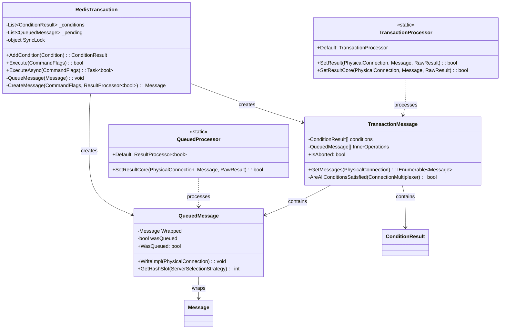
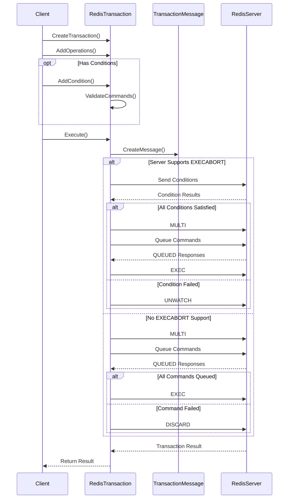
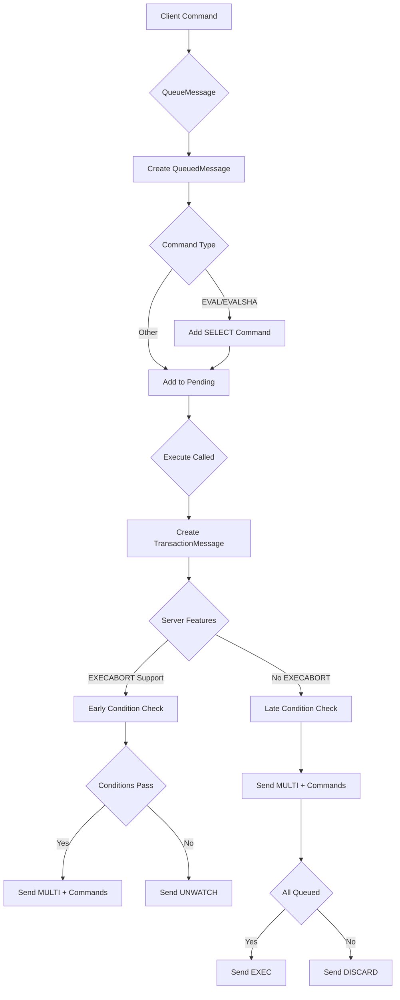

# TransactionSupport Module Documentation

## Overview

The TransactionSupport module provides Redis transaction functionality for StackExchange.Redis, implementing atomic multi-command operations with optional conditional execution. This module enables developers to group multiple Redis commands into a single atomic unit that either executes completely or not at all, ensuring data consistency in concurrent environments.

## Purpose and Core Functionality

The TransactionSupport module serves as the implementation layer for Redis transactions (MULTI/EXEC/DISCARD/WATCH commands), providing:

- **Atomic Command Execution**: Groups multiple Redis commands into atomic units
- **Conditional Transactions**: Supports WATCH-based optimistic locking with preconditions
- **Transaction State Management**: Handles transaction lifecycle from creation to completion
- **Error Handling**: Comprehensive error detection and rollback mechanisms
- **Async/Sync Support**: Full support for both synchronous and asynchronous execution patterns

## Architecture and Component Relationships

### Core Components



### Module Dependencies

```mermaid
graph TD
    TransactionSupport[TransactionSupport Module]
    CoreInterfaces[CoreInterfaces Module]
    MessageSystem[MessageSystem Module]
    ResultProcessing[ResultProcessing Module]
    ConnectionManagement[ConnectionManagement Module]
    DatabaseOperations[DatabaseOperations Module]
    
    TransactionSupport --> CoreInterfaces
    TransactionSupport --> MessageSystem
    TransactionSupport --> ResultProcessing
    TransactionSupport --> ConnectionManagement
    TransactionSupport --> DatabaseOperations
    
    TransactionSupport -.-> |implements| ITransaction
    TransactionSupport -.-> |extends| RedisDatabase
    TransactionSupport -.-> |uses| Message
    TransactionSupport -.-> |uses| ResultProcessor
    TransactionSupport -.-> |uses| ConnectionMultiplexer
    TransactionSupport -.-> |uses| ServerEndPoint
```



## Component Details

### RedisTransaction
The main transaction implementation class that extends `RedisDatabase` and implements the `ITransaction` interface. It manages the transaction lifecycle, condition checking, and command queuing.

**Key Responsibilities:**
- Transaction initialization and validation
- Condition management and evaluation
- Command queuing and execution coordination
- Synchronous and asynchronous execution support

### QueuedMessage
A specialized message wrapper that represents commands queued within a transaction. It tracks whether commands were successfully queued by the Redis server.

**Key Features:**
- Wraps standard Redis messages for transaction context
- Tracks QUEUED response status from Redis
- Maintains command execution state

### TransactionMessage
The core message type that represents the entire transaction operation, containing all conditions and queued commands.

**Advanced Features:**
- Multi-part message generation for complex transaction flows
- Server capability detection (EXECABORT support)
- Conditional execution paths based on server features
- Comprehensive error handling and rollback

### QueuedProcessor
Processes individual QUEUED responses from Redis servers to track command acceptance status.

### TransactionProcessor
Handles the final transaction execution result, processing the EXEC/UNWATCH/DISCARD response and coordinating result distribution to wrapped commands.

## Data Flow and Process Flows

### Transaction Execution Flow



### Message Processing Flow



## Integration with System Architecture

### Connection Management Integration
The TransactionSupport module integrates with the [ConnectionManagement](ConnectionManagement.md) module to:
- Validate server capabilities before transaction creation
- Select appropriate server endpoints for transaction execution
- Handle connection failures and retry logic
- Coordinate with physical connection bridges

### Message System Integration
Transactions leverage the [MessageSystem](MessageSystem.md) for:
- Command serialization and protocol handling
- Message routing and server selection
- Response processing and result coordination
- Error propagation and completion management

### Result Processing Integration
The [ResultProcessing](ResultProcessing.md) module provides:
- Specialized processors for transaction-specific responses
- Result transformation and type conversion
- Error handling and exception generation
- Performance monitoring and metrics

## Key Features and Capabilities

### Conditional Transactions
```csharp
// Example of conditional transaction usage
var transaction = db.CreateTransaction();
var condition = transaction.AddCondition(Condition.KeyExists("key1"));
transaction.StringSetAsync("key2", "value2");
transaction.StringSetAsync("key3", "value3");
bool committed = await transaction.ExecuteAsync();
```

### Server Capability Detection
The module automatically detects Redis server capabilities and adjusts transaction behavior:
- **EXECABORT Support**: Enables early condition checking for better performance
- **WATCH Support**: Validates availability of optimistic locking
- **MULTI/EXEC Support**: Ensures basic transaction functionality

### Comprehensive Error Handling
- **Precondition Failures**: Automatic rollback when conditions aren't met
- **Command Failures**: Graceful handling of individual command errors
- **Connection Failures**: Proper cleanup and resource management
- **Timeout Handling**: Configurable timeouts for transaction operations

## Performance Considerations

### Optimization Strategies
1. **Early Condition Checking**: When EXECABORT is supported, conditions are checked before sending commands
2. **Batch Message Processing**: Multiple commands are sent together to minimize network round trips
3. **Efficient Result Processing**: Streamlined result processing for transaction responses
4. **Memory Management**: Careful management of queued messages and condition tracking

### Scalability Factors
- Transaction size impacts memory usage and network bandwidth
- Condition complexity affects execution time
- Server capabilities determine optimal execution path
- Connection pooling affects transaction throughput

## Best Practices

### When to Use Transactions
- **Atomic Operations**: When multiple commands must succeed or fail together
- **Optimistic Locking**: Using WATCH for concurrency control
- **Data Consistency**: Ensuring related data changes remain consistent

### When to Avoid Transactions
- **High-Volume Operations**: Consider pipelines for bulk operations
- **Simple Operations**: Single commands are more efficient
- **Long-Running Operations**: Transactions should be kept short

### Error Handling Patterns
```csharp
try
{
    var transaction = db.CreateTransaction();
    // Add operations
    bool committed = await transaction.ExecuteAsync();
    if (!committed)
    {
        // Handle transaction failure
    }
}
catch (RedisTransactionException ex)
{
    // Handle transaction-specific errors
}
```

## Related Documentation

- [CoreInterfaces](CoreInterfaces.md) - ITransaction interface definition
- [MessageSystem](MessageSystem.md) - Message handling and protocol implementation
- [ResultProcessing](ResultProcessing.md) - Result processing and transformation
- [ConnectionManagement](ConnectionManagement.md) - Connection handling and server selection
- [DatabaseOperations](DatabaseOperations.md) - Database operation implementations