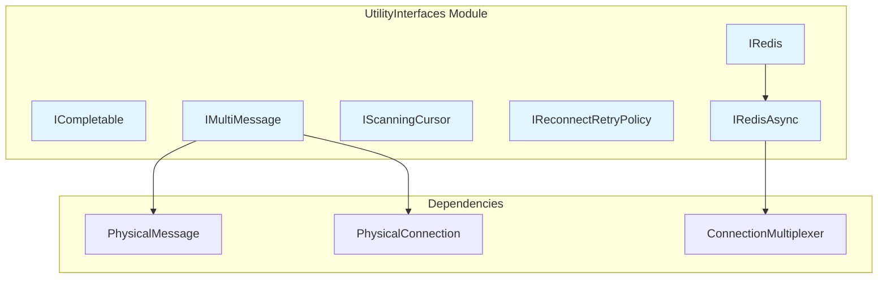
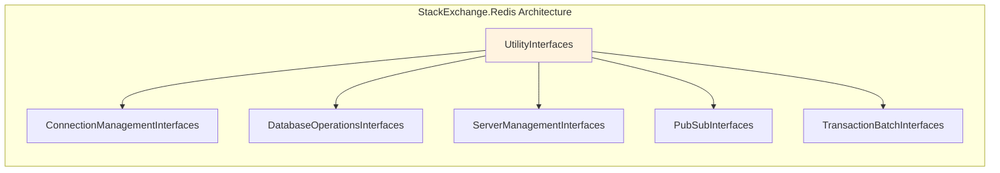

# UtilityInterfaces Module Documentation

## Overview

The UtilityInterfaces module provides essential utility interfaces that form the foundational building blocks of the StackExchange.Redis library. These interfaces define common contracts for completion handling, message management, cursor-based operations, retry policies, and basic Redis operations that are shared across the entire system.

## Purpose

UtilityInterfaces serves as the core abstraction layer that enables:
- **Completion Management**: Standardized completion handling through `ICompletable`
- **Message Processing**: Multi-message support via `IMultiMessage`
- **Cursor Operations**: Resumable scanning operations through `IScanningCursor`
- **Retry Logic**: Configurable reconnection retry policies via `IReconnectRetryPolicy`
- **Common Operations**: Basic Redis operations shared across all connection types through `IRedis` and `IRedisAsync`

## Architecture



## Core Interfaces

### ICompletable
**Purpose**: Internal interface for completion handling and storm logging
- **AppendStormLog**: Appends completion information to a StringBuilder for debugging
- **TryComplete**: Attempts to complete an operation synchronously or asynchronously

*See [CompletionManagement](CompletionManagement.md) for detailed documentation.*

### IMultiMessage
**Purpose**: Internal interface for handling multiple messages in a single operation
- **GetMessages**: Retrieves an enumerable collection of messages for a physical connection

*See [MessageManagement](MessageManagement.md) for detailed documentation.*

### IScanningCursor
**Purpose**: Public interface for resumable, cursor-based scanning operations
- **Cursor**: Represents the active page of results (not the next page)
- **PageSize**: Controls the number of items returned per page
- **PageOffset**: Indicates the offset within the current page

*See [CursorOperations](CursorOperations.md) for detailed documentation.*

### IReconnectRetryPolicy
**Purpose**: Public interface for implementing custom reconnection retry logic
- **ShouldRetry**: Determines if a reconnection attempt should be made based on retry count and elapsed time

*See [RetryPolicies](RetryPolicies.md) for detailed documentation.*

### IRedis
**Purpose**: Public interface providing common synchronous Redis operations
- **Ping**: Tests connection liveness and measures latency
- Inherits from [IRedisAsync](CommonOperations.md) for async operations

### IRedisAsync
**Purpose**: Public interface providing common asynchronous Redis operations
- **Multiplexer**: Provides access to the parent connection multiplexer
- **PingAsync**: Asynchronously tests connection liveness
- **TryWait/Wait/WaitAll**: Provides task synchronization utilities

*See [CommonOperations](CommonOperations.md) for detailed documentation of both IRedis and IRedisAsync.*

## Module Relationships



The UtilityInterfaces module serves as the foundation for all other interface modules in the system:
- **ConnectionManagementInterfaces**: Uses IRedisAsync for basic connection operations
- **DatabaseOperationsInterfaces**: Leverages IRedis and IRedisAsync for database operations
- **ServerManagementInterfaces**: Builds upon IRedis for server-specific operations
- **PubSubInterfaces**: Extends IRedisAsync for pub/sub functionality
- **TransactionBatchInterfaces**: Utilizes completion mechanisms from ICompletable

## Usage Patterns

### Retry Policy Implementation
```csharp
public class CustomRetryPolicy : IReconnectRetryPolicy
{
    public bool ShouldRetry(long currentRetryCount, int timeElapsedMillisecondsSinceLastRetry)
    {
        // Implement custom retry logic
        return currentRetryCount < 3 && timeElapsedMillisecondsSinceLastRetry < 5000;
    }
}
```

### Cursor-Based Scanning
```csharp
public class ScanOperation : IScanningCursor
{
    public long Cursor { get; set; }
    public int PageSize { get; set; } = 100;
    public int PageOffset { get; set; }
}
```

## Integration Points

- **[ConnectionManagement](ConnectionManagement.md)**: Uses ICompletable for connection completion handling
- **[DatabaseOperations](DatabaseOperations.md)**: Implements IRedis and IRedisAsync for database operations
- **[MessageSystem](MessageSystem.md)**: Utilizes IMultiMessage for message batching
- **[ResultProcessing](ResultProcessing.md)**: Works with IScanningCursor for scan result processing

## Key Design Decisions

1. **Minimal Interface Surface**: Each interface focuses on a single responsibility
2. **Internal vs Public**: Critical interfaces like ICompletable and IMultiMessage are internal, while user-facing ones are public
3. **Async-First Design**: IRedis extends IRedisAsync, promoting asynchronous operations
4. **Extensibility**: IReconnectRetryPolicy allows custom retry logic without modifying core code
5. **Performance-Oriented**: IScanningCursor provides efficient pagination for large datasets

## Best Practices

- Implement custom retry policies for specific network conditions
- Use cursor-based scanning for large key spaces to avoid memory issues
- Leverage the async methods for better scalability
- Monitor completion logs for debugging connection issues
- Implement proper error handling when using retry policies