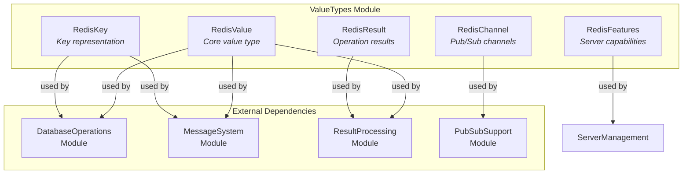
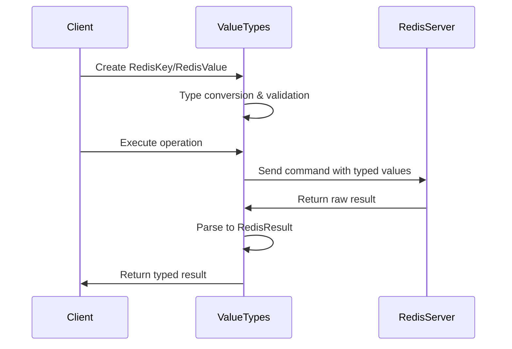

# ValueTypes Module Documentation

## Overview

The ValueTypes module is a fundamental component of the StackExchange.Redis library that provides core data type representations for Redis operations. This module defines the essential value types that are used throughout the Redis client to represent keys, values, results, channels, and feature capabilities.

## Purpose

The ValueTypes module serves as the foundation for data type abstraction in StackExchange.Redis, providing:

- **Type Safety**: Strongly-typed representations of Redis data types
- **Performance Optimization**: Efficient memory management and type conversions
- **Protocol Compatibility**: Support for both RESP2 and RESP3 Redis protocols
- **Developer Experience**: Intuitive APIs for working with Redis data

## Architecture

## Core Components

### 1. RedisValue
The primary value type representing data that can be stored in Redis. Supports multiple underlying types including strings, integers, doubles, and byte arrays with efficient type conversion and memory management.

**Key Features:**
- Multi-type support (string, int, long, double, byte[], bool)
- Implicit conversion operators for seamless type interoperability
- Memory-efficient storage with sentinel objects for common values
- Support for both string and binary data

### 2. RedisKey
Represents keys used to access data in Redis, supporting both string and binary key formats with optional prefix support for key organization.

**Key Features:**
- String and byte array key support
- Prefix-based key organization
- Efficient equality comparison and hashing
- Implicit conversions from common key types

### 3. RedisResult
Abstract representation of Redis operation results, providing type-safe access to single values, arrays, and error responses.

**Key Features:**
- Support for single values and arrays
- Type-safe result interpretation
- Error handling through specialized error results
- RESP2/RESP3 protocol compatibility

### 4. RedisChannel
Represents pub/sub channel names with support for pattern matching and sharded channels.

**Key Features:**
- Pattern-based channel matching (wildcards)
- Sharded channel support for Redis 7.0+
- Auto-detection of pattern channels
- Binary and string channel name support

### 5. RedisFeatures
Provides feature detection capabilities based on Redis server version, enabling conditional logic for version-specific features.

**Key Features:**
- Version-based feature detection
- Comprehensive feature coverage (200+ features)
- Optimized version comparison algorithms
- Extensible feature definition system

## Data Flow

## Integration Points

The ValueTypes module integrates with other StackExchange.Redis modules:

- **[DatabaseOperations](DatabaseOperations.md)**: Uses RedisValue and RedisKey for all data operations
- **[MessageSystem](MessageSystem.md)**: Utilizes RedisValue for message payload encoding
- **[ResultProcessing](ResultProcessing.md)**: Processes RedisResult objects into typed values
- **[PubSubSupport](PubSubSupport.md)**: Uses RedisChannel for channel management

## Performance Considerations

- **Memory Efficiency**: Uses sentinel objects and overlapped storage to minimize allocations
- **Type Conversion**: Optimized conversion paths for common scenarios
- **Caching**: Common values (0-20 integers, empty strings) are cached
- **Zero-Copy Operations**: Supports direct memory access where possible

## Thread Safety

All ValueTypes are immutable and thread-safe:
- RedisValue, RedisKey, RedisChannel, and RedisFeatures are readonly structs
- RedisResult objects are immutable after creation
- Safe for concurrent access across multiple threads

## Version Compatibility

The module supports Redis versions 2.0+ with feature detection through RedisFeatures:
- RESP2 and RESP3 protocol support
- Version-specific feature availability checking
- Backward compatibility maintenance
- Progressive enhancement based on server capabilities