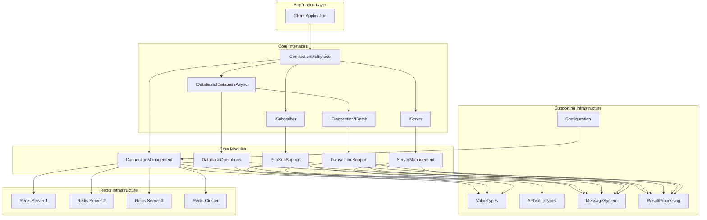

# StackExchange.Redis Repository Overview

StackExchange.Redis is a high-performance, feature-rich .NET client library for Redis that provides comprehensive support for Redis operations including data manipulation, pub/sub messaging, transactions, clustering, and server management. The library is designed as a production-ready Redis client with advanced features like connection pooling, automatic failover, cluster topology management, and comprehensive monitoring capabilities.

## Purpose

The StackExchange.Redis library serves as the primary Redis client for .NET applications, offering:
- **High-Performance Connection Management**: Sophisticated connection pooling and multiplexing
- **Comprehensive Redis Support**: Full support for all Redis data types and operations
- **Cluster and High Availability**: Native Redis Cluster support with automatic failover
- **Production-Ready Features**: Monitoring, metrics, error recovery, and performance optimization
- **Developer-Friendly API**: Intuitive, type-safe interfaces with both synchronous and asynchronous support

## End-to-End Architecture

## Core Module Documentation

### ConnectionManagement
**Path**: `src/StackExchange.Redis/ConnectionMultiplexer.cs`

The ConnectionManagement module is the foundational layer responsible for establishing, maintaining, and orchestrating all network connections to Redis servers. It provides robust connection pooling, automatic failover, cluster topology management, and comprehensive health monitoring.

**Key Components**:
- **ConnectionMultiplexer**: Central orchestrator managing connection pools
- **PhysicalBridge**: Traffic controller between logical operations and physical connections
- **PhysicalConnection**: Low-level TCP/IP communication with Redis servers
- **ServerEndPoint**: Individual Redis server representation
- **ServerSelectionStrategy**: Intelligent server selection and routing logic

[Detailed Documentation](ConnectionManagement.md)

### DatabaseOperations
**Path**: `src/StackExchange.Redis/RedisDatabase.cs`

The DatabaseOperations module provides comprehensive Redis command support across all data types through the `RedisDatabase` class, which implements `IDatabase` and `IDatabaseAsync` interfaces.

**Key Sub-modules**:
- **CoreDatabaseOperations**: Fundamental Redis operations for all data types
- **ScanOperations**: Efficient, non-blocking iteration using SCAN commands
- **StreamOperations**: Comprehensive Redis Streams functionality
- **ScriptOperations**: Lua scripting capabilities
- **SpecializedOperations**: Advanced operations with specialized processing

[Detailed Documentation](DatabaseOperations.md)

### ValueTypes
**Path**: `src/StackExchange.Redis`

The ValueTypes module provides core data type representations for Redis operations, ensuring type safety and protocol compatibility.

**Core Types**:
- **RedisValue**: Primary value type supporting multiple underlying types
- **RedisKey**: Key representation with prefix support
- **RedisResult**: Operation result abstraction
- **RedisChannel**: Pub/sub channel representation
- **RedisFeatures**: Server capability detection

[Detailed Documentation](ValueTypes.md)

### MessageSystem
**Path**: `src/StackExchange.Redis/Message.cs`

The MessageSystem module handles Redis protocol message creation, serialization, and processing, serving as the bridge between high-level operations and low-level protocol communication.

**Key Features**:
- Message factory pattern for different command types
- Hash slot calculation for Redis Cluster support
- Command flags management
- High-integrity mode with checksum validation
- Comprehensive error handling and recovery

[Detailed Documentation](MessageSystem.md)

### ResultProcessing
**Path**: `src/StackExchange.Redis/ResultProcessor.cs`

The ResultProcessing module converts raw Redis server responses into strongly-typed .NET objects, handling protocol parsing, type conversion, and error processing.

**Specialized Processors**:
- **Stream Processors**: Comprehensive Redis Streams support
- **Geospatial Processors**: Geospatial data handling
- **Cluster Processors**: Cluster topology information
- **Array and Collection Processors**: Efficient array processing

[Detailed Documentation](ResultProcessing.md)

### ServerManagement
**Path**: `src/StackExchange.Redis/RedisServer.cs`

The ServerManagement module provides comprehensive server-level operations including administration, cluster management, monitoring, and configuration operations.

**Key Components**:
- **RedisServer**: Primary server operations implementation
- **ClusterConfiguration**: Cluster topology management
- **ServerCounters**: Connection metrics and performance tracking

[Detailed Documentation](ServerManagement.md)

### Configuration
**Path**: `src/StackExchange.Redis/ConfigurationOptions.cs`

The Configuration module manages connection settings, authentication, SSL/TLS configuration, and environment-specific defaults.

**Key Features**:
- Connection string parsing with validation
- SSL/TLS configuration support
- Environment-specific defaults through extensible providers
- Azure Redis optimization

[Detailed Documentation](Configuration.md)

### CoreInterfaces
**Path**: `src/StackExchange.Redis/Interfaces`

The CoreInterfaces module defines the essential contracts that enable consistent Redis operations across the system.

**Interface Groups**:
- **ConnectionManagementInterfaces**: Connection lifecycle management
- **DatabaseOperationsInterfaces**: Data operation contracts
- **ServerManagementInterfaces**: Server administration contracts
- **PubSubInterfaces**: Publish/subscribe operations
- **TransactionBatchInterfaces**: Transaction and batch operations
- **UtilityInterfaces**: Common operation contracts

[Detailed Documentation](CoreInterfaces.md)

### TransactionSupport
**Path**: `src/StackExchange.Redis/RedisTransaction.cs`

The TransactionSupport module implements Redis transaction functionality with atomic multi-command operations and conditional execution.

**Key Features**:
- Atomic command execution with MULTI/EXEC
- Conditional transactions with WATCH-based optimistic locking
- Server capability detection for optimal execution
- Comprehensive error handling and rollback

[Detailed Documentation](TransactionSupport.md)

### PubSubSupport
**Path**: `src/StackExchange.Redis/RedisSubscriber.cs`

The PubSubSupport module provides comprehensive publish/subscribe functionality for real-time message broadcasting and subscription management.

**Key Features**:
- Simple and pattern-based subscriptions
- Sharded pub/sub for Redis Cluster
- Message queue consumption patterns
- Connection resilience with automatic reconnection

[Detailed Documentation](PubSubSupport.md)

### APIValueTypes
**Path**: `src/StackExchange.Redis/APITypes`

The APIValueTypes module provides specialized data structures for complex Redis operations and results.

**Type Categories**:
- **Geospatial Types**: Geographic data handling
- **Stream Types**: Redis Streams comprehensive support
- **Core Data Types**: Fundamental data structures
- **Operation Result Types**: Specialized operation results

[Detailed Documentation](APIValueTypes.md)

## Key Features Summary

- **High Performance**: Connection pooling, pipelining, and optimized memory management
- **Production Ready**: Comprehensive monitoring, metrics, and error recovery
- **Cluster Support**: Full Redis Cluster compatibility with automatic failover
- **Type Safety**: Strongly-typed API with comprehensive error handling
- **Async Support**: Full async/await support throughout the library
- **Extensibility**: Interface-based design with pluggable components
- **Comprehensive Coverage**: Support for all Redis features including streams, geospatial data, and Lua scripting