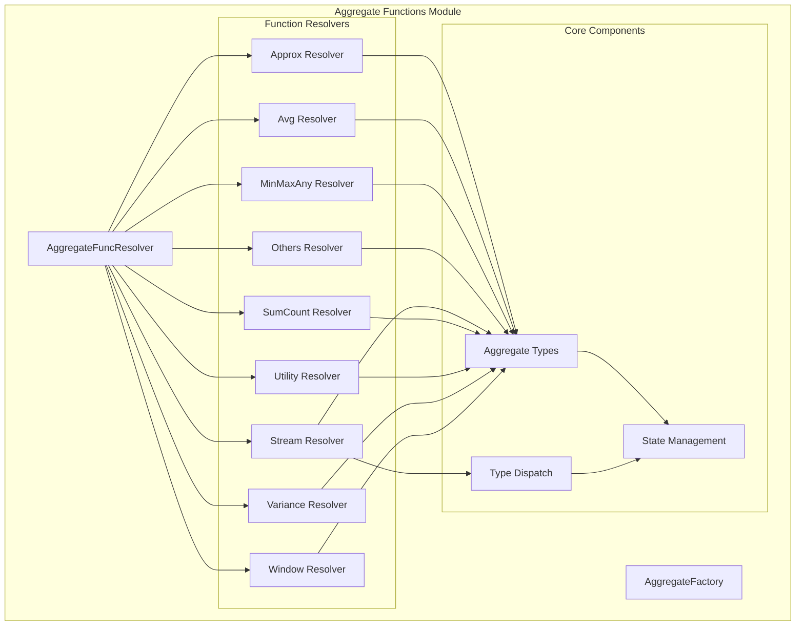
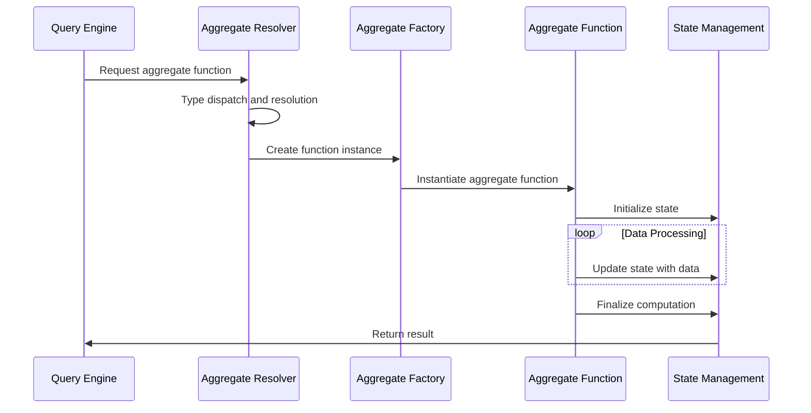

# Aggregate Functions Module

## Overview

The aggregate_functions module is a core component of StarRocks' query execution engine, responsible for implementing and managing all SQL aggregate functions. This module provides the infrastructure for computing aggregate operations across large datasets efficiently, supporting both batch processing and streaming scenarios.

## Purpose and Core Functionality

The aggregate_functions module serves as the central hub for:
- **Function Registration**: Dynamically registering aggregate functions with the query engine
- **Type Dispatch**: Handling different data types for aggregate operations
- **State Management**: Managing intermediate states during aggregate computation
- **Performance Optimization**: Providing specialized implementations for different scenarios
- **Window Functions**: Supporting window-based aggregate operations

## Architecture Overview



## Sub-modules

### 1. [Approximate Functions](aggregate_functions_approx.md)
Handles approximate aggregate functions including:
- HyperLogLog-based distinct counting
- Approximate Top-K operations
- Theta sketch operations

### 2. [Average and Array Functions](aggregate_functions_avg.md)
Implements averaging and array aggregation:
- Standard averaging with decimal precision
- Array aggregation functions
- Map aggregation operations

### 3. [Min/Max/Any Functions](aggregate_functions_minmaxany.md)
Provides basic aggregate operations:
- Minimum and maximum value finding
- Any value selection
- Bitmap operations
- MaxBy/MinBy operations

### 4. [Specialized Functions](aggregate_functions_others.md)
Contains specialized aggregate functions:
- Percentile calculations
- Group concatenation
- Window funnel analysis
- Dictionary merging

### 5. [Streaming Functions](aggregate_functions_stream.md)
Supports streaming/retractable operations:
- Retractable minimum/maximum
- Stream processing capabilities

### 6. [Sum and Count Functions](aggregate_functions_sumcount.md)
Core arithmetic operations:
- Summation with overflow protection
- Distinct counting
- Multi-distinct operations

### 7. [Utility Functions](aggregate_functions_utility.md)
Performance and diagnostic functions:
- Exchange performance metrics
- Histogram generation

### 8. [Variance Functions](aggregate_functions_variance.md)
Statistical operations:
- Variance and standard deviation
- Covariance and correlation
- Population and sample variants

### 9. [Window Functions](aggregate_functions_window.md)
Window-based operations:
- First/last value
- Lead/lag operations
- Ranking functions
- Session numbering

## Data Flow Architecture



## Integration with Query Engine

The aggregate_functions module integrates with other StarRocks components:

- **[Query Execution](query_execution.md)**: Provides aggregate function implementations for execution nodes
- **[SQL Parser/Optimizer](sql_parser_optimizer.md)**: Resolves aggregate functions during query planning
- **[Storage Engine](storage_engine.md)**: Supports push-down operations for efficient processing

## Performance Characteristics

### Optimization Strategies
1. **Type Specialization**: Template-based implementations for different data types
2. **Vectorized Processing**: Batch processing for improved CPU efficiency
3. **Memory Management**: Efficient state management and memory allocation
4. **Parallel Execution**: Support for multi-threaded aggregation

### Scalability Features
- **Distributed Aggregation**: Support for distributed computing environments
- **Incremental Processing**: Efficient updates for streaming data
- **Memory-Efficient States**: Compact state representations

## Usage Examples

### Basic Aggregation
```sql
SELECT COUNT(*), SUM(amount), AVG(price) FROM sales;
```

### Window Functions
```sql
SELECT 
    employee_id,
    salary,
    RANK() OVER (ORDER BY salary DESC) as salary_rank
FROM employees;
```

### Approximate Operations
```sql
SELECT 
    APPROX_COUNT_DISTINCT(user_id) as unique_users,
    APPROX_TOP_K(product_id, 10) as top_products
FROM user_activity;
```

## Future Enhancements

- **GPU Acceleration**: Support for GPU-based aggregation
- **Machine Learning Integration**: Built-in ML aggregation functions
- **Real-time Processing**: Enhanced streaming capabilities
- **Custom Functions**: User-defined aggregate function framework

## References

- [Query Execution Module](query_execution.md)
- [SQL Parser and Optimizer](sql_parser_optimizer.md)
- [Storage Engine](storage_engine.md)
- [Expression System](backend_server.md#expression_system)