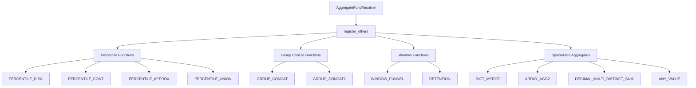
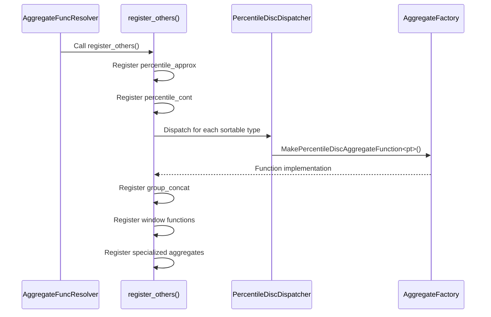
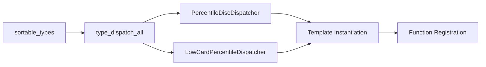
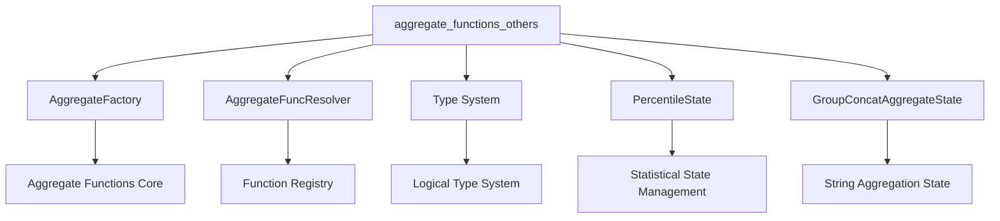

# Aggregate Functions - Others Module

## Introduction

The `aggregate_functions_others` module is a specialized component within StarRocks' aggregate function framework that handles miscellaneous aggregate functions not covered by other specialized resolvers. This module primarily focuses on percentile calculations, group concatenation, and other statistical functions that don't fit into standard categories like sum, count, average, or variance.

## Module Overview

The module serves as a registry and dispatcher for various advanced aggregate functions, including:
- Percentile calculations (PERCENTILE_DISC, PERCENTILE_CONT, PERCENTILE_APPROX)
- Group concatenation functions
- Window funnel analysis
- Retention analysis
- Dictionary merging operations
- Specialized distinct sum operations for decimal types

## Core Architecture

### Component Structure



### Key Components

#### PercentileDiscDispatcher
The `PercentileDiscDispatcher` is a template-based dispatcher that registers percentile discrete functions for various data types. It supports:
- DateTime types
- Date types  
- Arithmetic types
- String types
- Decimal types (all versions)

```cpp
struct PercentileDiscDispatcher {
    template <LogicalType pt>
    void operator()(AggregateFuncResolver* resolver) {
        if constexpr (lt_is_datetime<pt> || lt_is_date<pt> || lt_is_arithmetic<pt> || lt_is_string<pt> ||
                      lt_is_decimal_of_any_version<pt>) {
            resolver->add_aggregate_mapping_variadic<pt, pt, PercentileState<pt>>(
                    "percentile_disc", false, AggregateFactory::MakePercentileDiscAggregateFunction<pt>());
        }
    }
};
```

#### LowCardPercentileDispatcher
Handles low-cardinality percentile optimizations for better performance on datasets with fewer distinct values.

## Function Registration Process

### Registration Flow



### Type Dispatching
The module uses a sophisticated type dispatching system that automatically generates appropriate function implementations for different data types:



## Function Categories

### 1. Percentile Functions

| Function | Description | Input Types | Output Type |
|----------|-------------|-------------|-------------|
| PERCENTILE_DISC | Discrete percentile calculation | All sortable types | Same as input |
| PERCENTILE_CONT | Continuous percentile calculation | DOUBLE, DATETIME, DATE | Same as input |
| PERCENTILE_APPROX | Approximate percentile | BIGINT, DOUBLE | DOUBLE |
| PERCENTILE_APPROX_WEIGHTED | Weighted approximate percentile | BIGINT, DOUBLE | DOUBLE |
| PERCENTILE_UNION | Union of percentile values | PERCENTILE | PERCENTILE |

### 2. Group Concatenation Functions

| Function | Description | Input Types | Output Type |
|----------|-------------|-------------|-------------|
| GROUP_CONCAT | String concatenation with separator | CHAR, VARCHAR | VARCHAR |
| GROUP_CONCAT2 | Enhanced string concatenation | All types | VARCHAR |

### 3. Window and Analysis Functions

| Function | Description | Input Types | Output Type |
|----------|-------------|-------------|-------------|
| WINDOW_FUNNEL | Funnel analysis | INT, BIGINT, DATETIME, DATE | INT |
| RETENTION | User retention analysis | ARRAY | ARRAY |

### 4. Specialized Aggregates

| Function | Description | Input Types | Output Type |
|----------|-------------|-------------|-------------|
| DICT_MERGE | Dictionary merging | All types | Dictionary |
| ARRAY_AGG2 | Array aggregation | All types | ARRAY |
| DECIMAL_MULTI_DISTINCT_SUM | Distinct sum for decimals | DECIMAL variants | DECIMAL128/256 |
| ANY_VALUE | Returns any value from group | All types | Same as input |

## Data Type Support

### Supported Type Categories
- **Arithmetic Types**: All numeric types (TINYINT, SMALLINT, INT, BIGINT, FLOAT, DOUBLE)
- **Date/Time Types**: DATE, DATETIME, TIMESTAMP
- **String Types**: CHAR, VARCHAR
- **Decimal Types**: DECIMAL32, DECIMAL64, DECIMAL128, DECIMAL256
- **Complex Types**: ARRAY (for specific functions)

### Type Constraints
Each function has specific type requirements enforced at compile time through template metaprogramming:

```cpp
if constexpr (lt_is_datetime<pt> || lt_is_date<pt> || lt_is_arithmetic<pt> || 
              lt_is_string<pt> || lt_is_decimal_of_any_version<pt>)
```

## Performance Optimizations

### Low-Cardinality Optimization
The module includes specialized implementations for low-cardinality data that can significantly improve performance when dealing with columns containing few distinct values.

### Template-Based Code Generation
Uses C++ templates to generate optimized code for each data type, eliminating runtime type checking overhead.

### Variadic Function Support
Many functions support variable numbers of arguments, providing flexibility in function usage while maintaining type safety.

## Integration with Query Engine

### Dependency Relationships



### Related Modules
- **[aggregate_functions_approx](aggregate_functions_approx.md)**: Handles approximate aggregate functions
- **[aggregate_functions_avg](aggregate_functions_avg.md)**: Manages average and mean calculations
- **[aggregate_functions_variance](aggregate_functions_variance.md)**: Provides variance and standard deviation functions
- **[query_execution](query_execution.md)**: Integrates with the overall query execution pipeline

## Usage Examples

### Percentile Calculations
```sql
-- Calculate median (50th percentile)
SELECT PERCENTILE_DISC(0.5) WITHIN GROUP (ORDER BY salary) AS median_salary
FROM employees;

-- Calculate 90th percentile with approximation
SELECT PERCENTILE_APPROX(0.9, 100) AS approx_90th_percentile
FROM response_times;
```

### Group Concatenation
```sql
-- Concatenate employee names with comma separator
SELECT department_id, GROUP_CONCAT(name, ', ') AS employee_names
FROM employees
GROUP BY department_id;
```

### Window Funnel Analysis
```sql
-- Analyze user conversion funnel
SELECT user_id, WINDOW_FUNNEL(86400, 'default', event_time, 
    event_type = 'login', 
    event_type = 'browse', 
    event_type = 'purchase') AS funnel_step
FROM user_events
GROUP BY user_id;
```

## Error Handling

### Type Validation
The module performs compile-time type checking through template metaprogramming, ensuring that only valid type combinations are registered.

### Runtime Validation
Additional runtime validation is performed by the underlying aggregate function implementations to handle edge cases like:
- Empty input sets
- NULL value handling
- Invalid percentile values (outside 0-1 range)
- Memory allocation failures

## Future Enhancements

### Planned Functions
- Additional statistical functions (skewness, kurtosis)
- More sophisticated windowing functions
- Enhanced approximate algorithms
- Support for new data types as they are introduced

### Performance Improvements
- Vectorized implementations for better SIMD utilization
- Parallel execution support for large datasets
- Memory-efficient algorithms for memory-constrained environments

## Conclusion

The `aggregate_functions_others` module provides a comprehensive set of specialized aggregate functions that extend StarRocks' analytical capabilities beyond standard SQL aggregates. Through its template-based design and sophisticated type dispatching system, it delivers both flexibility and performance for complex analytical workloads.