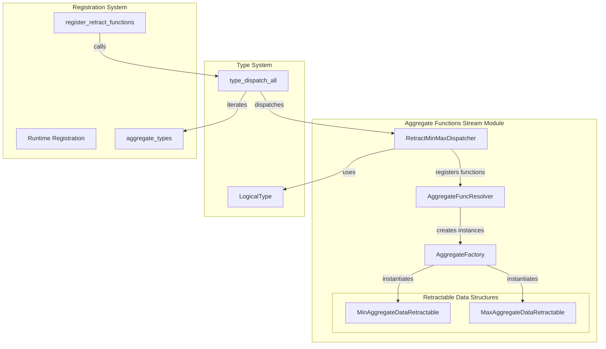
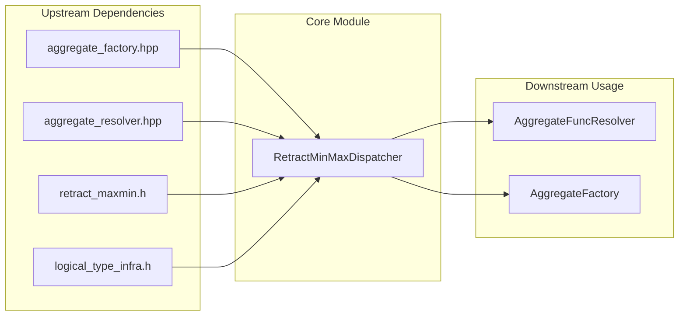
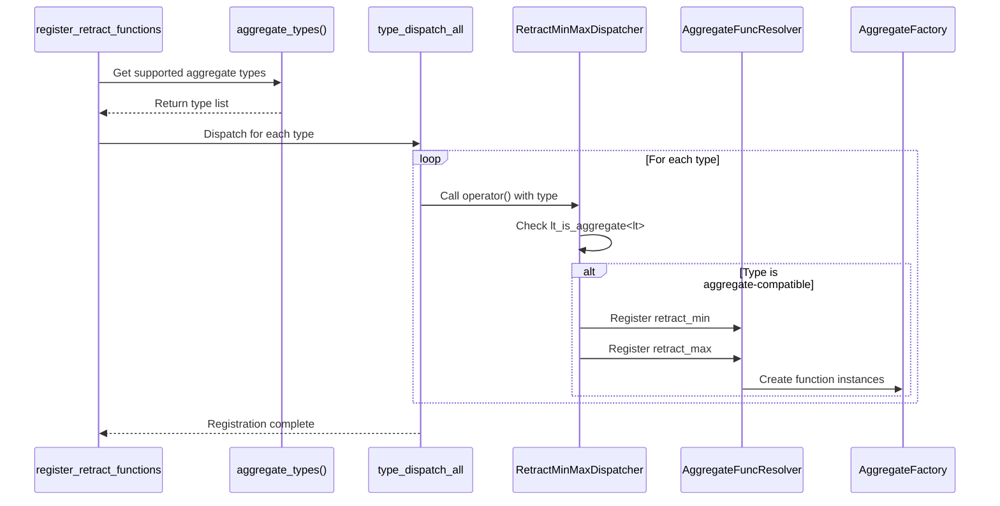
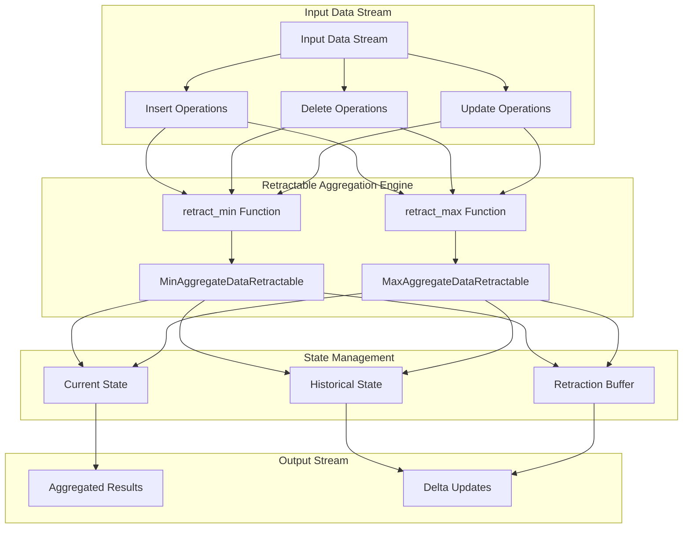

# Aggregate Functions Stream Module

## Introduction

The `aggregate_functions_stream` module is a specialized component within StarRocks' aggregation framework that handles streaming aggregation operations with retraction capabilities. This module provides the infrastructure for computing minimum and maximum values in streaming contexts where data can be retracted or updated, making it essential for real-time analytics and incremental computation scenarios.

## Module Purpose and Core Functionality

The primary purpose of this module is to enable efficient streaming aggregation operations that can handle data retractions - a critical requirement for maintaining accurate aggregate results in streaming data pipelines. The module implements specialized aggregate functions for minimum and maximum operations that can retract previously computed values when underlying data changes.

### Key Capabilities

- **Streaming Min/Max Aggregation**: Provides `retract_min` and `retract_max` aggregate functions
- **Type-Safe Operations**: Supports all aggregate-compatible data types through template-based dispatch
- **Retraction Support**: Enables removal of previously aggregated values when data changes
- **Performance Optimization**: Leverages compile-time type dispatch for optimal performance

## Architecture and Component Relationships

### Core Architecture



### Component Dependencies



## Detailed Component Analysis

### RetractMinMaxDispatcher Structure

The `RetractMinMaxDispatcher` is a template-based functor that serves as the central dispatch mechanism for registering streaming aggregate functions. It implements a type-safe approach to function registration using compile-time type checking.

**Key Characteristics:**
- Template-based design for compile-time type safety
- Uses `lt_is_aggregate<lt>` to ensure only aggregate-compatible types are processed
- Implements function call operator for integration with type dispatch system
- Registers both minimum and maximum retractable aggregate functions

**Function Registration Process:**
```cpp
template <LogicalType lt>
void operator()(AggregateFuncResolver* resolver) {
    if constexpr (lt_is_aggregate<lt>) {
        resolver->add_aggregate_mapping<lt, lt, MinAggregateDataRetractable<lt>>(
                "retract_min", true, AggregateFactory::MakeRetractMinAggregateFunction<lt>());
        resolver->add_aggregate_mapping<lt, lt, MaxAggregateDataRetractable<lt>>(
                "retract_max", true, AggregateFactory::MakeRetractMaxAggregateFunction<lt>());
    }
}
```

### Registration Workflow



## Data Flow and Processing

### Streaming Aggregation with Retraction



## Integration with StarRocks Ecosystem

### Relationship to Query Execution

The aggregate_functions_stream module integrates with the broader query execution framework through the [query_execution](query_execution.md) module, specifically with aggregation components like:

- `AggHashMapVariantTypeTraits`: For hash-based aggregation optimization
- `CompressSerializer`: For efficient data serialization during streaming
- `AllocateState`: For memory management of aggregate states

### Connection to Storage Layer

The module works in conjunction with the [storage_engine](storage_engine.md) module, particularly:

- `ColumnBuilder`: For constructing result columns from aggregate computations
- `MergeIterator`: For combining streaming results with persisted data
- `MemtableFlushTask`: For persisting aggregate states to storage

### Type System Integration

The module leverages StarRocks' type system through integration with [backend_server](backend_server.md) components:

- `ScalarFieldTypeToLogicalTypeMapping`: For type conversion and compatibility
- `LogicalType`: For compile-time type safety and dispatch

## Performance Characteristics

### Compile-Time Optimization

The module achieves high performance through:
- **Template Metaprogramming**: Compile-time type dispatch eliminates runtime overhead
- **Type Filtering**: `lt_is_aggregate<lt>` ensures only valid types are processed
- **Inline Function Registration**: Direct registration without virtual function calls

### Memory Efficiency

- **Minimal Runtime Overhead**: Registration happens once during initialization
- **Type-Safe Storage**: Retractable data structures use type-specific optimizations
- **Efficient State Management**: Separate state tracking for min/max operations

## Usage Patterns and Best Practices

### When to Use Retractable Aggregates

1. **Streaming Analytics**: Real-time dashboards with updating metrics
2. **Incremental Computation**: Continuous aggregation over changing datasets
3. **Data Correction**: Handling late-arriving or corrected data in streams
4. **Windowed Operations**: Sliding or tumbling window aggregations

### Integration Guidelines

```cpp
// Example usage pattern
void setup_streaming_aggregation() {
    AggregateFuncResolver resolver;
    
    // Register retractable functions
    resolver.register_retract_functions();
    
    // Functions are now available for use
    // retract_min(column) and retract_max(column)
}
```

## Error Handling and Edge Cases

### Type Safety

The module handles edge cases through:
- **Compile-time Type Checking**: Prevents registration of incompatible types
- **Runtime Validation**: Ensures function availability before execution
- **Graceful Degradation**: Falls back to standard aggregates when retraction is not needed

### State Consistency

- **Atomic Operations**: Retraction operations maintain state consistency
- **Validation Checks**: Ensures retracted values exist in current state
- **Error Recovery**: Provides mechanisms for state reconstruction when needed

## Future Enhancements

### Potential Extensions

1. **Additional Aggregate Functions**: Support for retractable sum, count, average
2. **Advanced Retraction Strategies**: Multi-level retraction for complex aggregations
3. **Performance Optimizations**: SIMD optimizations for bulk retractions
4. **Memory Management**: Advanced memory pooling for large-scale streaming

### Integration Opportunities

- **Materialized Views**: Integration with [materialized_views](frontend_server.md#materialized_views) for incremental view maintenance
- **Stream Processing**: Enhanced integration with [pipeline_execution](query_execution.md#pipeline_execution)
- **Storage Optimization**: Better integration with [column_serialization](backend_server.md#column_serialization) for state persistence

## Conclusion

The aggregate_functions_stream module represents a critical component in StarRocks' streaming analytics capabilities. By providing efficient, type-safe retractable aggregation functions, it enables real-time analytics scenarios that require accurate incremental computation over changing data streams. The module's template-based design ensures optimal performance while maintaining flexibility for future enhancements and integrations within the StarRocks ecosystem.