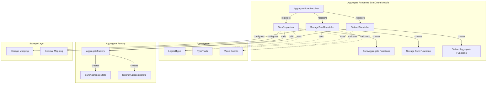
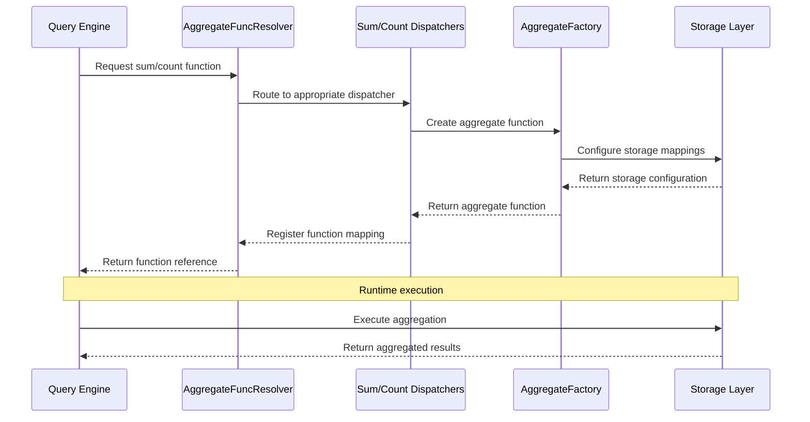
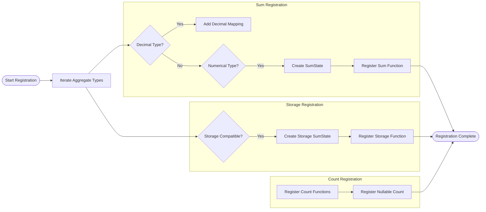

# Aggregate Functions SumCount Module Documentation

## Introduction

The `aggregate_functions_sumcount` module is a core component of StarRocks' aggregation system, responsible for implementing and managing sum and count aggregate functions. This module provides the foundational infrastructure for performing mathematical aggregations and distinct value counting operations across various data types, serving as a critical building block for query execution and data analysis workflows.

The module specializes in handling two primary categories of aggregate functions:
- **Sum Operations**: Mathematical summation across numeric and decimal data types
- **Count Operations**: Row counting and distinct value counting with nullable support

## Architecture Overview



## Core Components

### DistinctDispatcher

The `DistinctDispatcher` is the primary component responsible for registering distinct aggregate functions. It handles the creation of both count distinct and sum distinct operations with support for different implementation versions.

**Key Responsibilities:**
- Registers `multi_distinct_count` and `multi_distinct_count2` functions
- Registers `multi_distinct_sum` and `multi_distinct_sum2` functions
- Manages both legacy (V1) and optimized (V2) distinct implementations
- Handles type-specific aggregation state management

**Implementation Details:**
```cpp
struct DistinctDispatcher {
    template <LogicalType lt>
    void operator()(AggregateFuncResolver* resolver) {
        if constexpr (lt_is_aggregate<lt>) {
            using DistinctState = DistinctAggregateState<lt, SumResultLT<lt>>;
            using DistinctState2 = DistinctAggregateStateV2<lt, SumResultLT<lt>>;
            // Register distinct count and sum functions
        }
    }
};
```

### SumDispatcher

The `SumDispatcher` manages the registration of standard sum aggregate functions, with special handling for decimal types and numeric operations.

**Key Features:**
- Supports decimal128 and decimal256 precision levels
- Handles numeric and decimalv2 type conversions
- Integrates with the aggregate factory for function creation
- Provides proper result type mapping

### StorageSumDispatcher

A specialized dispatcher that handles sum operations specifically for the storage layer, where the result type matches the input type.

**Purpose:**
- Ensures compatibility between storage and computation layers
- Maintains type consistency during aggregation operations
- Provides optimized paths for storage-native operations

## Data Flow Architecture



## Function Registration Process



## Type System Integration

The module integrates deeply with StarRocks' type system to ensure proper handling of different data types:

### Supported Types
- **Numeric Types**: BOOLEAN, TINYINT, SMALLINT, INT, BIGINT, LARGEINT, FLOAT, DOUBLE
- **Decimal Types**: DECIMAL, DECIMALV2, DECIMAL32, DECIMAL64, DECIMAL128, DECIMAL256
- **Aggregate Types**: All types that support aggregation operations

### Type Validation
```cpp
VALUE_GUARD(LogicalType, StorageSumLTGuard, lt_is_sum_in_storage, 
            TYPE_BOOLEAN, TYPE_TINYINT, TYPE_SMALLINT, TYPE_INT,
            TYPE_BIGINT, TYPE_LARGEINT, TYPE_FLOAT, TYPE_DOUBLE, 
            TYPE_DECIMAL, TYPE_DECIMALV2, TYPE_DECIMAL32,
            TYPE_DECIMAL64, TYPE_DECIMAL128);
```

## Dependencies and Integration

### Internal Dependencies
- **[aggregate_factory](aggregate_factory.md)**: Creates concrete aggregate function instances
- **[distinct_aggregate](distinct_aggregate.md)**: Provides distinct aggregation state management
- **[sum_aggregate](sum_aggregate.md)**: Implements sum-specific aggregation logic
- **[type_system](type_system.md)**: Handles logical type mappings and validations

### External Dependencies
- **[query_execution](query_execution.md)**: Integrates with query execution pipeline
- **[storage_engine](storage_engine.md)**: Coordinates with storage layer operations
- **[sql_parser_optimizer](sql_parser_optimizer.md)**: Supports query planning and optimization

## Performance Considerations

### Optimization Strategies
1. **Type-Specific Implementations**: Separate dispatchers for different type categories
2. **Storage Layer Integration**: Direct storage-compatible function variants
3. **Version Management**: Support for both legacy and optimized distinct implementations
4. **Template Metaprogramming**: Compile-time type resolution for performance

### Memory Management
- Efficient state management through `SumAggregateState` and `DistinctAggregateState`
- Proper handling of nullable vs non-nullable operations
- Optimized decimal operations with appropriate precision levels

## Usage Patterns

### Function Registration
```cpp
void register_sumcount_functions() {
    AggregateFuncResolver resolver;
    resolver.register_sumcount();
    resolver.register_distinct();
}
```

### Runtime Execution
The registered functions are invoked during query execution when:
- SUM operations are encountered in SELECT statements
- COUNT operations need aggregation
- DISTINCT modifiers are applied to sum/count operations
- Storage layer aggregations are performed

## Error Handling and Validation

### Type Validation
- Compile-time checks for aggregate type compatibility
- Runtime validation of function mappings
- Proper handling of unsupported type combinations

### State Management
- Safe initialization of aggregation states
- Proper cleanup of temporary aggregation data
- Memory-efficient handling of large distinct sets

## Future Enhancements

### Planned Improvements
1. **Enhanced Decimal Support**: Extended precision handling for financial calculations
2. **Vectorized Operations**: SIMD optimizations for batch processing
3. **Approximate Algorithms**: HyperLogLog integration for approximate distinct counting
4. **GPU Acceleration**: CUDA-based implementations for large-scale aggregations

### Extensibility Points
- Template-based dispatcher architecture allows easy addition of new types
- Factory pattern enables plugin-style function registration
- Modular design supports custom aggregation implementations

## Conclusion

The `aggregate_functions_sumcount` module serves as a foundational component in StarRocks' aggregation ecosystem, providing robust and efficient implementations of sum and count operations. Its careful design balances performance, type safety, and extensibility, making it suitable for a wide range of analytical workloads while maintaining the flexibility needed for future enhancements.

The module's integration with the broader StarRocks architecture ensures seamless operation across query planning, execution, and storage layers, while its template-based design provides the performance characteristics necessary for large-scale data processing scenarios.