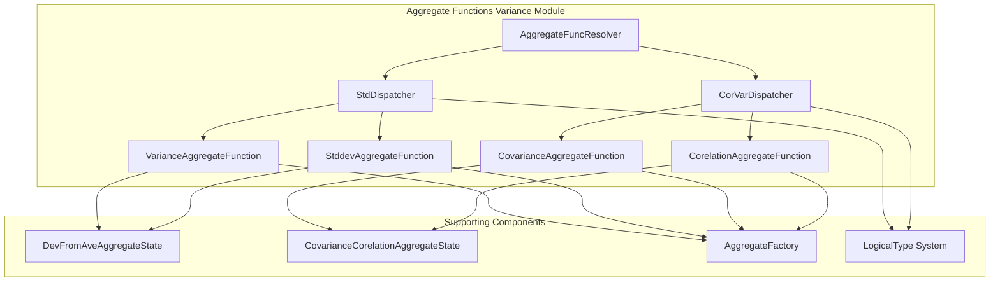
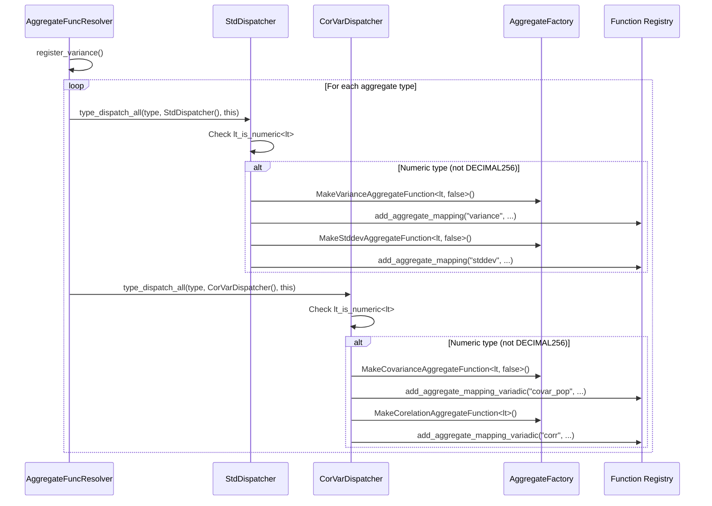
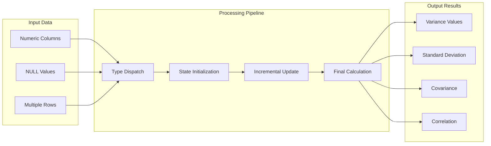
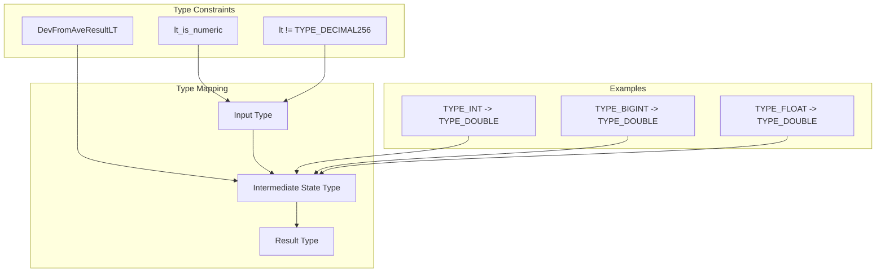
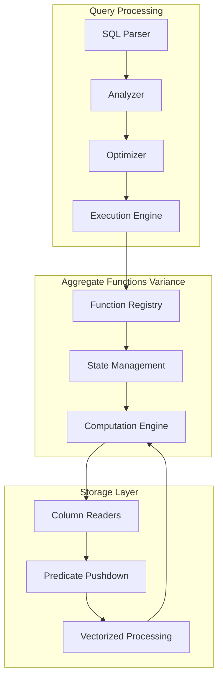

# Aggregate Functions Variance Module

## Introduction

The `aggregate_functions_variance` module is a specialized component within StarRocks' aggregate function system that handles statistical variance and standard deviation calculations. This module provides the core implementation for computing population and sample variance, standard deviation, covariance, and correlation coefficient functions across various numeric data types.

## Module Overview

The module serves as a critical part of StarRocks' analytical capabilities, enabling users to perform advanced statistical analysis directly within the database engine. It implements both single-pass and two-pass algorithms for variance calculations, ensuring accuracy and performance across different data distributions and sizes.

## Core Architecture

### Component Structure

### Key Components

#### StdDispatcher
The `StdDispatcher` is a template-based dispatcher that registers variance and standard deviation aggregate functions for all supported numeric logical types. It handles:

- **Variance Functions**: `variance`, `variance_pop`, `var_pop`, `variance_samp`, `var_samp`
- **Standard Deviation Functions**: `stddev`, `std`, `stddev_pop`, `stddev_samp`
- **Type Safety**: Ensures functions are only registered for numeric types (excluding TYPE_DECIMAL256)
- **State Management**: Uses `DevFromAveAggregateState` for intermediate calculations

#### CorVarDispatcher
The `CorVarDispatcher` handles covariance and correlation functions:

- **Covariance Functions**: `covar_pop`, `covar_samp`
- **Correlation Function**: `corr`
- **Variadic Support**: Handles multiple input columns for bivariate analysis
- **State Management**: Uses `CovarianceCorelationAggregateState` for intermediate results

## Function Registration Process

## Data Flow Architecture

## Supported Functions

### Variance Functions

| Function Name | Description | Algorithm | NULL Handling |
|---------------|-------------|-----------|---------------|
| `variance` | Population variance | Two-pass | Ignored |
| `variance_pop` | Population variance | Two-pass | Ignored |
| `var_pop` | Population variance | Two-pass | Ignored |
| `variance_samp` | Sample variance | Two-pass | Handled via AggNullPred |
| `var_samp` | Sample variance | Two-pass | Handled via AggNullPred |

### Standard Deviation Functions

| Function Name | Description | Algorithm | NULL Handling |
|---------------|-------------|-----------|---------------|
| `stddev` | Population standard deviation | Two-pass | Ignored |
| `std` | Population standard deviation | Two-pass | Ignored |
| `stddev_pop` | Population standard deviation | Two-pass | Ignored |
| `stddev_samp` | Sample standard deviation | Two-pass | Handled via AggNullPred |

### Covariance and Correlation Functions

| Function Name | Description | Input | NULL Handling |
|---------------|-------------|--------|---------------|
| `covar_pop` | Population covariance | Two columns | Ignored |
| `covar_samp` | Sample covariance | Two columns | Handled via AggNullPred |
| `corr` | Pearson correlation coefficient | Two columns | Handled via AggNullPred |

## Type System Integration

The module integrates with StarRocks' logical type system through template metaprogramming:

## State Management

### DevFromAveAggregateState
Used for variance and standard deviation calculations:
- Stores running sum of values
- Stores running sum of squared values
- Maintains count of non-null values
- Enables two-pass algorithm implementation

### CovarianceCorelationAggregateState
Used for covariance and correlation calculations:
- Stores running sums for both variables
- Stores running sum of products
- Maintains counts and means
- Supports both population and sample calculations

## Performance Considerations

### Algorithm Selection
- **Two-pass algorithm**: Used for better numerical stability
- **Single-pass option**: Available for memory-constrained scenarios
- **Incremental updates**: Supports streaming computation

### Memory Management
- **State size**: Optimized for cache efficiency
- **Alignment**: Proper memory alignment for SIMD operations
- **Null handling**: Minimal overhead for NULL value processing

### Optimization Strategies
- **Template specialization**: Compile-time optimization for specific types
- **Vectorization**: Support for SIMD operations where applicable
- **Branch prediction**: Minimized conditional branches in hot paths

## Error Handling and Edge Cases

### NULL Value Handling
- **Population functions**: NULL values are ignored in calculations
- **Sample functions**: Special NULL predicates handle edge cases
- **All NULL inputs**: Returns NULL result

### Numerical Stability
- **Large values**: Uses Welford's algorithm for numerical stability
- **Small variances**: Special handling for near-zero results
- **Overflow protection**: Intermediate calculations use wider types

### Edge Cases
- **Single value**: Returns NULL for sample functions
- **All identical values**: Returns 0.0 for variance
- **Missing values**: Proper handling of incomplete data

## Integration with Query Engine

## Dependencies

### Internal Dependencies
- **Aggregate Factory**: [`aggregate_factory` module](aggregate_factory.md)
- **Type System**: [`logical_type` module](logical_type.md)
- **State Management**: [`variance` and `covariance` implementations](variance.md)

### External Dependencies
- **C++ Standard Library**: Template metaprogramming support
- **StarRocks Type System**: Runtime type dispatch mechanism

## Testing and Validation

### Unit Testing
- **Accuracy tests**: Comparison with reference implementations
- **Edge case testing**: Boundary conditions and special values
- **Performance benchmarks**: Throughput and memory usage validation

### Integration Testing
- **End-to-end SQL testing**: Full query pipeline validation
- **Type compatibility**: Cross-type operation verification
- **NULL handling**: Comprehensive NULL scenario testing

## Future Enhancements

### Planned Features
- **Streaming variance**: Online algorithm for continuous data
- **Approximate algorithms**: Sketch-based methods for large datasets
- **GPU acceleration**: CUDA implementations for massive parallelism

### Performance Improvements
- **SIMD optimization**: Vectorized computation for modern CPUs
- **Memory pooling**: Reduced allocation overhead
- **Cache optimization**: Improved data locality

## References

- [Aggregate Factory Module](aggregate_factory.md) - Factory pattern implementation for aggregate functions
- [Variance Implementation](variance.md) - Core variance calculation algorithms
- [Covariance Implementation](covariance.md) - Bivariate statistical functions
- [Logical Type System](logical_type.md) - Type system integration details
- [Query Execution Engine](query_execution.md) - Integration with query processing pipeline