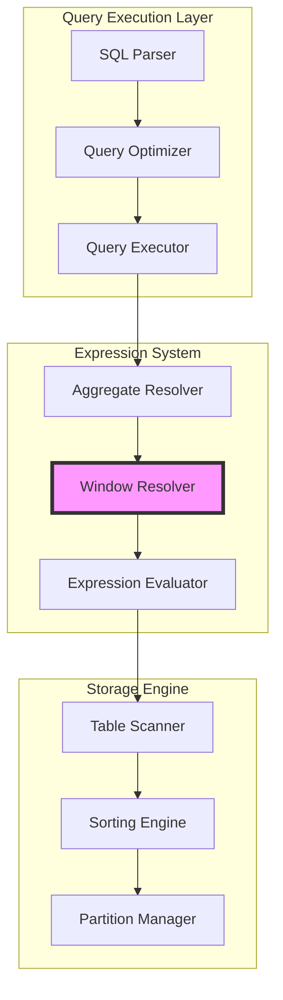
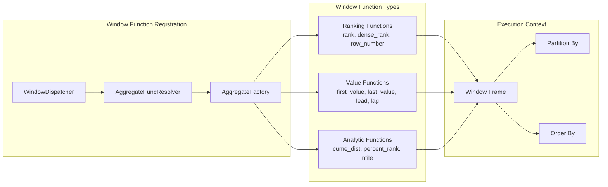
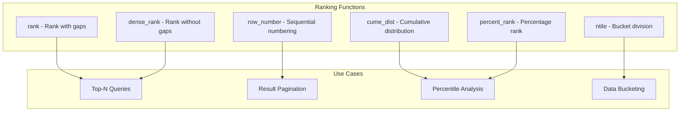
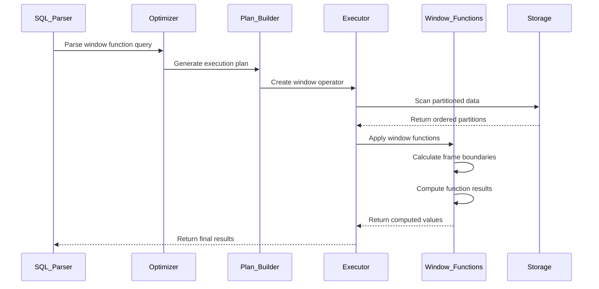
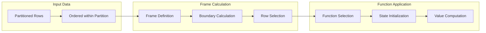
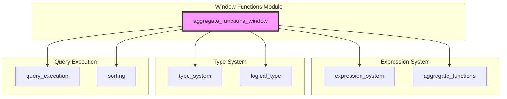

# Window Aggregate Functions Module

## Introduction

The `aggregate_functions_window` module provides the core implementation of window functions in StarRocks, a distributed MPP (Massively Parallel Processing) database system. Window functions are analytical functions that perform calculations across a set of table rows related to the current row, enabling advanced analytical queries without the need for self-joins or subqueries.

This module is responsible for registering and managing all window-specific aggregate functions, including ranking functions, value functions, and analytical functions that operate over ordered partitions of data.

## Architecture Overview

### Module Position in System Architecture



### Window Function Architecture



## Core Components

### WindowDispatcher

The `WindowDispatcher` is a template-based function dispatcher that registers window functions for different data types. It uses compile-time type dispatching to generate optimized implementations for each supported logical type.

**Key Responsibilities:**
- Type-specific window function registration
- Template-based code generation for performance
- Support for aggregate-compatible types and object types
- Conditional compilation for type safety

**Supported Functions:**
- `first_value` / `first_value_in` (with ignore nulls)
- `last_value` / `last_value_in` (with ignore nulls)
- `lead` / `lead_in` (with ignore nulls)
- `lag` / `lag_in` (with ignore nulls)

### AggregateFuncResolver

The `AggregateFuncResolver` manages the registration and resolution of all aggregate functions, including window functions. It maintains a registry mapping function names to their implementations.

**Registration Process:**
```cpp
void register_window() {
    // Register type-specific window functions
    for (auto type : aggregate_types()) {
        type_dispatch_all(type, WindowDispatcher(), this);
    }
    
    // Register ranking and analytic functions
    add_aggregate_mapping_notnull<TYPE_BIGINT, TYPE_BIGINT>("rank", true, 
        AggregateFactory::MakeRankWindowFunction());
    // ... additional registrations
}
```

## Window Function Categories

### 1. Ranking Functions



**Implementation Details:**
- All ranking functions return `TYPE_BIGINT` or `TYPE_DOUBLE`
- Operate over the entire partition without frame specification
- Maintain ordering state during execution
- Support `ORDER BY` clause for ranking criteria

### 2. Value Functions

**First/Last Value Functions:**
- `first_value(column)` - First value in the window frame
- `first_value_in(column)` - First non-null value
- `last_value(column)` - Last value in the window frame
- `last_value_in(column)` - Last non-null value

**Lead/Lag Functions:**
- `lead(column, offset, default)` - Access subsequent rows
- `lag(column, offset, default)` - Access preceding rows
- Support for ignore nulls variants (`lead_in`, `lag_in`)

### 3. Analytic Functions

**Advanced Analytics:**
- `cume_dist()` - Cumulative distribution (0,1]
- `percent_rank()` - Relative rank percentage [0,1)
- `ntile(n)` - Divide into n buckets
- `session_number()` - Session identification

## Data Flow Architecture

### Query Processing Pipeline



### Window Frame Processing



## Integration with Other Modules

### Dependency Relationships



### Key Dependencies

1. **[expression_system](expression_system.md)**: Provides base expression evaluation framework
2. **[aggregate_functions](aggregate_functions.md)**: Supplies aggregate function implementations
3. **[type_system](type_system.md)**: Defines data type mappings and conversions
4. **[logical_type](logical_type.md)**: Provides type dispatch infrastructure
5. **[query_execution](query_execution.md)**: Integrates with execution pipeline
6. **[sorting](sorting.md)**: Handles ordering requirements for window functions

## Performance Considerations

### Optimization Strategies

1. **Template-Based Code Generation**: Uses C++ templates to generate type-specific implementations at compile time, eliminating runtime type dispatch overhead.

2. **Vectorized Execution**: Operates on columnar data in batches for better CPU cache utilization and SIMD instruction usage.

3. **Memory Management**: Efficient state management for window frames to minimize memory allocations during execution.

4. **Partition Pruning**: Leverages partition information to reduce the data volume processed by window functions.

### Execution Complexity

| Function Type | Time Complexity | Space Complexity | Description |
|---------------|-----------------|------------------|-------------|
| Ranking | O(n log n) | O(n) | Requires sorting within partitions |
| First/Last Value | O(n) | O(1) | Single pass with frame tracking |
| Lead/Lag | O(n) | O(k) | k = maximum offset value |
| Analytic | O(n) | O(1) | Single pass with state maintenance |

## Usage Examples

### Basic Window Functions

```sql
-- Ranking functions
SELECT 
    employee_id,
    department_id,
    salary,
    RANK() OVER (PARTITION BY department_id ORDER BY salary DESC) as salary_rank,
    DENSE_RANK() OVER (PARTITION BY department_id ORDER BY salary DESC) as dense_rank,
    ROW_NUMBER() OVER (PARTITION BY department_id ORDER BY salary DESC) as row_num
FROM employees;

-- Value functions
SELECT 
    employee_id,
    department_id,
    salary,
    FIRST_VALUE(salary) OVER (PARTITION BY department_id ORDER BY hire_date) as first_salary,
    LAST_VALUE(salary) OVER (PARTITION BY department_id ORDER BY hire_date ROWS BETWEEN UNBOUNDED PRECEDING AND UNBOUNDED FOLLOWING) as last_salary,
    LAG(salary, 1) OVER (PARTITION BY department_id ORDER BY hire_date) as prev_salary,
    LEAD(salary, 1) OVER (PARTITION BY department_id ORDER BY hire_date) as next_salary
FROM employees;

-- Analytic functions
SELECT 
    employee_id,
    department_id,
    salary,
    CUME_DIST() OVER (PARTITION BY department_id ORDER BY salary) as salary_percentile,
    PERCENT_RANK() OVER (PARTITION BY department_id ORDER BY salary) as percent_rank,
    NTILE(4) OVER (PARTITION BY department_id ORDER BY salary) as salary_quartile
FROM employees;
```

### Advanced Window Frame Specifications

```sql
-- Moving average with frame specification
SELECT 
    date,
    revenue,
    AVG(revenue) OVER (
        ORDER BY date 
        ROWS BETWEEN 6 PRECEDING AND CURRENT ROW
    ) as seven_day_avg
FROM daily_revenue;

-- Session-based analysis
SELECT 
    user_id,
    event_time,
    SESSION_NUMBER() OVER (PARTITION BY user_id ORDER BY event_time) as session_id
FROM user_events;
```

## Error Handling and Edge Cases

### Null Value Handling

- Window functions respect SQL standard null handling
- `first_value_in` and `last_value_in` variants ignore null values
- Ranking functions treat nulls according to `ORDER BY` clause specification

### Frame Boundary Conditions

- Empty frames return null for value functions
- Single-row partitions handle ranking functions correctly
- Offset functions (lead/lag) return null for out-of-bound access

### Type Compatibility

- Window functions support all aggregate-compatible types
- Type-specific optimizations for primitive types
- Object type support for complex data types (JSON, ARRAY, MAP)

## Future Enhancements

### Planned Features

1. **Additional Window Functions**: Support for more analytical functions like `ratio_to_report`, `stddev` variants
2. **Performance Optimizations**: Enhanced vectorization and parallel execution strategies
3. **Frame Extensions**: Support for more complex frame specifications (RANGE with intervals)
4. **Memory Optimization**: Improved memory management for large window frames

### Integration Opportunities

1. **Materialized Views**: Integration with [materialized_views](materialized_views.md) for pre-computed window function results
2. **Query Optimization**: Enhanced cost-based optimization for window function queries
3. **Distributed Execution**: Improved distributed window function execution strategies

## References

- [Expression System](expression_system.md) - Base expression evaluation framework
- [Aggregate Functions](aggregate_functions.md) - General aggregate function implementations
- [Type System](type_system.md) - Data type management and conversions
- [Query Execution](query_execution.md) - Query execution pipeline integration
- [Sorting](sorting.md) - Ordering and sorting infrastructure