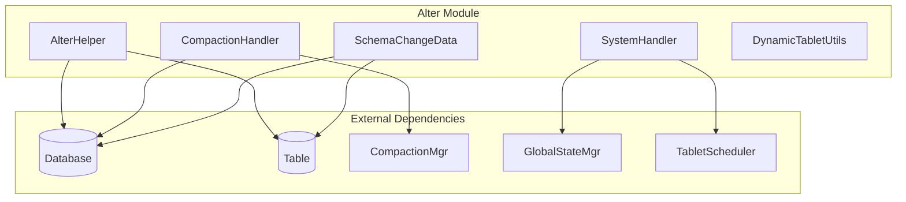
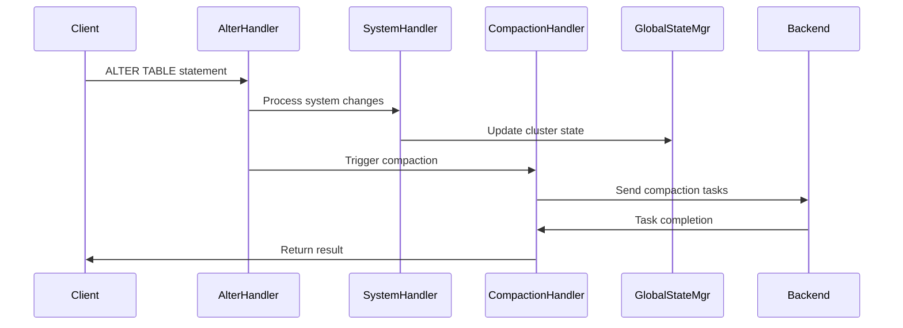

# Alter Module Documentation

## Overview

The **alter** module is a critical component of StarRocks that handles all database schema modification operations and system-level changes. It provides the infrastructure for modifying table structures, managing system resources, and coordinating backend operations across the distributed system.

## Purpose and Core Functionality

The alter module serves as the central orchestrator for:
- **Schema Changes**: Modifying table structures, adding/dropping columns, changing data types
- **System Management**: Adding/removing backend nodes, managing cluster topology
- **Compaction Control**: Triggering and managing data compaction operations
- **Dynamic Tablet Management**: Handling tablet splitting and distribution

## Architecture Overview

## Sub-modules and Components

### 1. Schema Change Management
**Core Component**: `SchemaChangeData.Builder`

Handles complex schema modification operations with support for:
- Column addition, removal, and modification
- Index management and bloom filter configuration
- Sort key configuration
- Compute resource allocation

**Key Features**:
- Builder pattern for complex schema changes
- Support for shadow columns during transitions
- Timeout management for long-running operations
- GIN (Generalized Inverted Index) support

**Detailed Documentation**: [Schema Change Management](schema_change_management.md)

### 2. System Management
**Core Component**: `SystemHandler.Visitor`

Manages cluster topology and system-level operations:
- Frontend node management (add/drop followers and observers)
- Backend node lifecycle (add/drop/decommission)
- Broker service management
- Compute node operations

**Key Features**:
- Visitor pattern for handling different alter clauses
- Decommission safety checks
- Resource capacity validation
- Automatic backend cleanup

**Detailed Documentation**: [System Management](system_management.md)

### 3. Compaction Control
**Core Component**: `CompactionHandler`

Orchestrates data compaction operations:
- Manual compaction triggering
- Partition-level compaction control
- Backend task coordination
- Shared-data mode support

**Key Features**:
- Support for both shared-nothing and shared-data modes
- Batch task management
- Partition filtering capabilities
- Integration with compaction manager

**Detailed Documentation**: [Compaction Control](compaction_control.md)

### 4. Schema Analysis Utilities
**Core Component**: `AlterHelper`

Provides utilities for analyzing schema changes:
- Column modification detection
- Dropped column identification
- Complex type handling (struct columns)
- Shadow column management

**Detailed Documentation**: [Schema Analysis Utilities](schema_analysis_utilities.md)

### 5. Dynamic Tablet Management
**Core Component**: `DynamicTabletUtils`

Supports dynamic tablet operations:
- Tablet splitting calculations
- Power-of-two validation
- Split count optimization
- Configuration-based limits

**Detailed Documentation**: [Dynamic Tablet Management](dynamic_tablet_management.md)

## Data Flow Architecture

## Integration Points

### With Storage Engine
- Coordinates with [storage_engine](storage_engine.md) for tablet management
- Integrates with compaction policies and execution
- Manages schema changes at the storage layer

### With Query Execution
- Works with [query_execution](query_execution.md) for plan invalidation
- Coordinates with runtime filters during schema changes
- Manages execution state during alterations

### With Catalog Management
- Integrates with [catalog](catalog.md) for metadata updates
- Coordinates with partition management
- Updates table statistics and metadata

## Key Design Patterns

### 1. Visitor Pattern
The `SystemHandler.Visitor` implements the visitor pattern to handle different types of alter clauses uniformly while maintaining type safety.

### 2. Builder Pattern
`SchemaChangeData.Builder` uses the builder pattern to handle complex schema modifications with many optional parameters.

### 3. Synchronized Operations
Critical operations are synchronized to prevent race conditions when processing multiple alter statements simultaneously.

## Error Handling and Safety

### Validation Mechanisms
- **Capacity Checks**: Validates disk space and backend availability before decommissioning
- **Replication Validation**: Ensures sufficient replicas exist after backend removal
- **Schema Validation**: Validates column compatibility and type constraints
- **Timeout Management**: Prevents indefinite blocking on long-running operations

### Recovery Mechanisms
- **Rollback Support**: Provides mechanisms to cancel in-progress operations
- **State Consistency**: Maintains consistent state across distributed components
- **Logging**: Comprehensive logging for audit and debugging purposes

## Performance Considerations

### Optimization Strategies
- **Batch Processing**: Groups related operations for efficiency
- **Parallel Execution**: Leverages multiple backends for distributed operations
- **Incremental Updates**: Minimizes metadata update overhead
- **Resource Pooling**: Reuses computational resources where possible

### Monitoring and Metrics
- Operation completion rates
- Resource utilization during alterations
- Error rates and failure patterns
- Performance impact on concurrent queries

## Configuration and Tuning

### Key Configuration Parameters
- `alter_table_timeout_second`: Timeout for table alteration operations
- `dynamic_tablet_max_split_count`: Maximum tablet split operations
- `drop_backend_after_decommission`: Automatic backend cleanup policy

### Tuning Recommendations
- Monitor system resources during large schema changes
- Schedule major alterations during low-traffic periods
- Configure appropriate timeouts based on data size
- Balance between operation speed and system stability

## Security and Access Control

### Permission Requirements
- ALTER privileges on target tables
- SYSTEM-level permissions for cluster modifications
- Resource management permissions for compute operations

### Audit Trail
- All alteration operations are logged
- Change history is maintained in metadata
- User attribution for all modifications

## Future Enhancements

### Planned Improvements
- Online schema changes with zero downtime
- Enhanced rollback capabilities
- Improved progress reporting
- Automated optimization recommendations

### Extensibility Points
- Plugin architecture for custom alteration types
- Integration with external orchestration tools
- Support for complex multi-table operations
- Enhanced monitoring and alerting capabilities

## Related Documentation

- [Storage Engine](storage_engine.md) - Data storage and compaction
- [Query Execution](query_execution.md) - Query processing and optimization
- [Catalog Management](catalog.md) - Metadata and schema management
- [Frontend Server](frontend_server.md) - System coordination and management