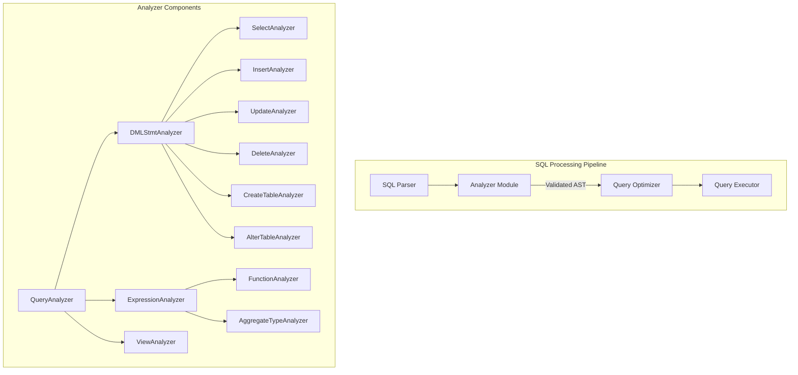
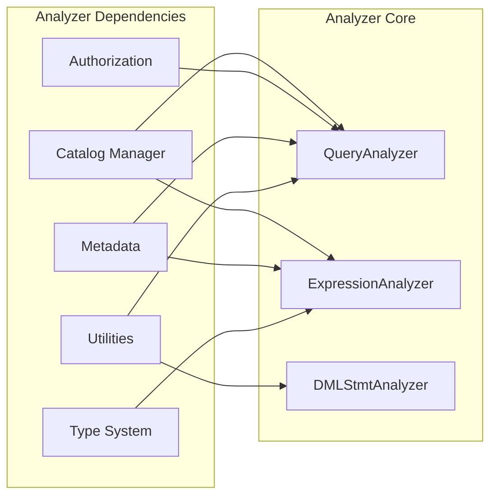
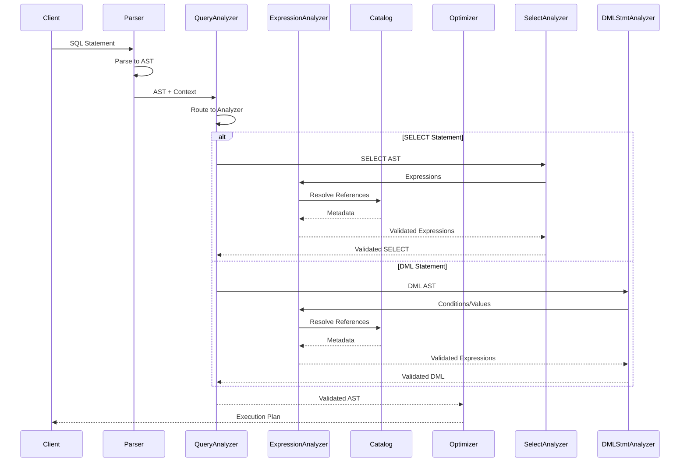
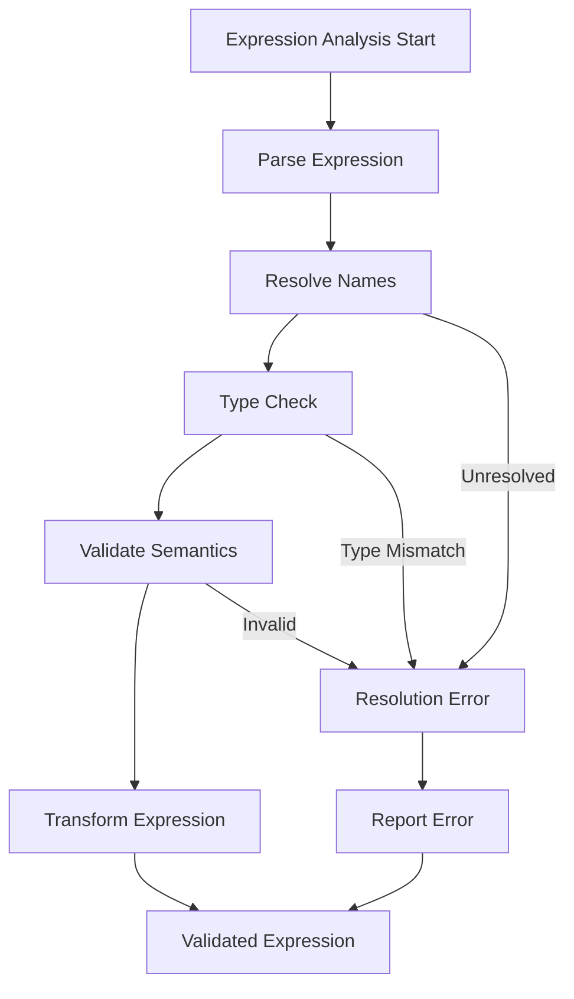

# Analyzer Module Documentation

## Overview

The **Analyzer** module is a critical component of StarRocks' SQL processing pipeline, responsible for semantic analysis and validation of SQL statements. It transforms parsed abstract syntax trees (AST) into validated, semantically correct representations that can be processed by the optimizer and execution engine.

## Purpose and Core Functionality

The Analyzer module serves as the bridge between the SQL Parser and the Optimizer, performing essential tasks including:

- **Semantic Validation**: Validates SQL statements against database schema and metadata
- **Name Resolution**: Resolves table names, column references, and function names
- **Type Checking**: Ensures type compatibility in expressions and operations
- **Privilege Checking**: Validates user permissions for database operations
- **Query Analysis**: Analyzes complex queries including subqueries, joins, and aggregations
- **Statement Transformation**: Transforms SQL statements into normalized forms

## Architecture

### High-Level Architecture

### Component Dependencies

## Core Components

### QueryAnalyzer
The main entry point for SQL statement analysis, providing comprehensive semantic validation for all types of SQL statements.

**Key Responsibilities:**
- Statement routing to specialized analyzers
- Context management and scope handling
- Overall validation coordination
- Error reporting and diagnostics

**Core Components:**
- `QueryAnalyzer.Visitor`: Main visitor pattern implementation for AST traversal
- Context management for nested queries
- Integration with catalog and metadata services

### ExpressionAnalyzer
Handles the analysis of SQL expressions, ensuring type correctness and semantic validity.

**Key Responsibilities:**
- Type inference and checking
- Function resolution and validation
- Column reference resolution
- Expression transformation

**Core Components:**
- `ExpressionAnalyzer.ResolveSlotVisitor`: Resolves column references and slot bindings
- Function call validation and overload resolution
- Type conversion and casting logic
- Subexpression analysis

### DML Statement Analyzers
Specialized analyzers for different Data Manipulation Language operations.

#### SelectAnalyzer
Analyzes SELECT statements including complex queries with joins, subqueries, and set operations.

**Key Features:**
- `SelectAnalyzer.SlotRefTableNameCleaner`: Cleans and validates table/column references
- Join analysis and validation
- Subquery correlation analysis
- Aggregation and grouping validation
- Window function analysis

#### InsertAnalyzer
Validates INSERT statements and ensures data type compatibility.

**Key Features:**
- Target table validation
- Column list validation
- Value list analysis
- Type compatibility checking
- Partition-aware insertion validation

#### UpdateAnalyzer
Analyzes UPDATE statements with complex conditions and expressions.

**Key Features:**
- Target table and column validation
- Update expression analysis
- WHERE clause validation
- Multi-table update support
- Constraint checking

#### DeleteAnalyzer
Validates DELETE statements and ensures referential integrity.

**Key Features:**
- Target table validation
- WHERE clause analysis
- Cascade deletion logic
- Partition-aware deletion
- Constraint validation

### DDL Statement Analyzers
Handle Data Definition Language operations for schema management.

#### CreateTableAnalyzer
Validates CREATE TABLE statements including column definitions and constraints.

**Key Features:**
- Column definition validation
- Data type checking
- Constraint analysis
- Partition specification validation
- Distribution key validation
- Index creation logic

#### AlterTableStatementAnalyzer
Analyzes ALTER TABLE operations for schema modifications.

**Key Features:**
- Column addition/modification/deletion
- Constraint management
- Partition operations
- Index management
- Schema change validation

### Specialized Analyzers

#### FunctionAnalyzer
Validates function calls including user-defined functions (UDFs).

**Key Features:**
- Function existence validation
- Argument type checking
- Return type inference
- UDF security validation
- Aggregate function analysis

#### AggregateTypeAnalyzer
Specialized analyzer for aggregate functions and GROUP BY operations.

**Key Features:**
- Aggregate function validation
- GROUP BY clause analysis
- HAVING clause validation
- Aggregate expression checking
- Window function analysis

#### ViewAnalyzer
Handles CREATE VIEW and ALTER VIEW operations.

**Key Features:**
- View definition validation
- Base table dependency checking
- Column list validation
- View expansion logic
- Recursive view detection

## Data Flow

### Statement Analysis Flow

### Expression Analysis Flow

## Integration with Other Modules

### Dependencies

#### Catalog Module
- **Purpose**: Provides metadata about tables, columns, and database objects
- **Integration**: Analyzer queries catalog for table schemas, column types, and constraints
- **Key Components**: [Catalog Manager](../catalog.md), [Column Management](../catalog.md#column-management)

#### Authorization Module
- **Purpose**: Validates user permissions for database operations
- **Integration**: Analyzer checks privileges before allowing operations
- **Key Components**: [Authentication & Authorization](../frontend_server.md#authentication_authorization)

#### Parser Module
- **Purpose**: Provides parsed AST representation of SQL statements
- **Integration**: Analyzer receives AST from parser and performs semantic validation
- **Key Components**: [Parser Module](../sql_parser_optimizer.md#parser)

#### Type System
- **Purpose**: Provides type information and conversion rules
- **Integration**: Analyzer uses type system for expression validation and inference
- **Key Components**: [Type System](../storage_engine.md#schema_and_types)

### Downstream Dependencies

#### Optimizer Module
- **Purpose**: Receives validated AST for query optimization
- **Integration**: Analyzer provides normalized and validated AST to optimizer
- **Key Components**: [Optimizer](../sql_parser_optimizer.md#optimizer)

#### Execution Engine
- **Purpose**: Executes validated and optimized query plans
- **Integration**: Analyzer ensures statements are executable and valid
- **Key Components**: [Query Execution](../query_execution.md)

## Key Features

### Advanced Analysis Capabilities

1. **Complex Query Analysis**
   - Multi-table join analysis
   - Subquery correlation detection
   - Set operation validation (UNION, INTERSECT, EXCEPT)
   - Window function analysis
   - Common Table Expression (CTE) support

2. **Type System Integration**
   - Automatic type inference
   - Implicit type conversion
   - Complex type handling (ARRAY, MAP, STRUCT)
   - User-defined type support

3. **Security and Privilege Checking**
   - Fine-grained privilege validation
   - Role-based access control
   - Column-level security
   - Function execution permissions

4. **Schema Evolution Support**
   - Backward compatibility checking
   - Schema change validation
   - Version-aware analysis
   - Metadata consistency validation

### Performance Optimizations

1. **Caching Mechanisms**
   - Metadata caching for frequently accessed objects
   - Expression analysis result caching
   - Function resolution caching

2. **Incremental Analysis**
   - Partial re-analysis for modified statements
   - Dependency tracking for invalidation
   - Lazy evaluation for complex expressions

3. **Parallel Processing**
   - Independent expression analysis
   - Concurrent metadata lookups
   - Parallel validation for large statements

## Error Handling and Diagnostics

### Error Categories

1. **Semantic Errors**
   - Undefined tables or columns
   - Type mismatches
   - Invalid function calls
   - Privilege violations

2. **Schema Errors**
   - Missing database objects
   - Incompatible schema changes
   - Constraint violations
   - Invalid references

3. **Configuration Errors**
   - Invalid system settings
   - Unsupported features
   - Resource limitations

### Diagnostic Information

The analyzer provides detailed error messages including:
- Error location (line and column numbers)
- Suggested corrections
- Related object information
- Contextual help

## Configuration and Tuning

### Analyzer Settings

Key configuration parameters:
- `enable_strict_type_check`: Enforces strict type checking
- `enable_complex_type_support`: Enables complex type analysis
- `max_expression_depth`: Limits expression nesting depth
- `max_join_tables`: Maximum tables allowed in joins
- `enable_view_expansion`: Controls view expansion behavior

### Performance Tuning

1. **Metadata Cache Size**: Adjust cache size for frequently accessed metadata
2. **Analysis Timeout**: Set timeouts for complex statement analysis
3. **Parallelism Level**: Configure concurrent analysis threads
4. **Memory Limits**: Set memory limits for analysis operations

## Best Practices

### For Developers

1. **Use Parameterized Queries**: Leverage prepared statement support
2. **Validate Early**: Perform validation at application level
3. **Handle Errors Gracefully**: Implement proper error handling
4. **Monitor Performance**: Track analysis time and resource usage

### For Administrators

1. **Regular Schema Updates**: Keep statistics and metadata current
2. **Monitor Error Logs**: Track common analysis errors
3. **Tune Cache Settings**: Optimize cache configuration
4. **Review Privileges**: Regular audit of user permissions

## Future Enhancements

### Planned Features

1. **Enhanced Type Inference**: Improved automatic type detection
2. **Machine Learning Integration**: ML-based query analysis
3. **Real-time Validation**: Live query validation during development
4. **Cross-database Analysis**: Enhanced multi-database query support

### Performance Improvements

1. **Incremental Analysis**: Faster re-analysis of modified queries
2. **Distributed Analysis**: Parallel analysis across multiple nodes
3. **Smart Caching**: Intelligent cache management
4. **Query Plan Caching**: Reuse analysis results for similar queries

## Conclusion

The Analyzer module is a foundational component of StarRocks' SQL processing system, providing essential semantic validation and analysis capabilities. Its robust architecture, comprehensive feature set, and tight integration with other system components ensure reliable and efficient SQL statement processing. Through continuous enhancement and optimization, the Analyzer module maintains StarRocks' position as a high-performance analytical database system.

The module's design emphasizes extensibility, performance, and accuracy, making it well-suited for handling the complex analytical workloads that StarRocks is designed to support. As the system evolves, the Analyzer module continues to adapt and improve, incorporating new features and optimizations to meet growing analytical demands.