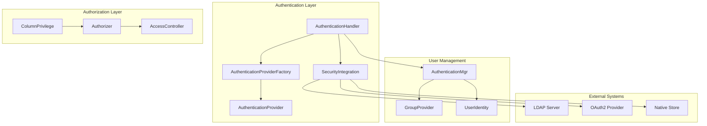

# Authentication and Authorization Module

## Overview

The Authentication and Authorization module is a critical security component of the StarRocks system that manages user authentication, access control, and privilege management. This module ensures secure access to database resources by implementing comprehensive authentication mechanisms and fine-grained authorization controls.

## Purpose

The module serves as the primary security gateway for the StarRocks system, providing:

- **User Authentication**: Multi-method user verification including native authentication, LDAP, OAuth2, and other security integrations
- **Access Control**: Fine-grained permission management for databases, tables, columns, and system operations
- **Group Management**: Integration with external group providers for role-based access control
- **Security Integration**: Pluggable authentication providers for enterprise security systems
- **Privilege Validation**: Real-time validation of user permissions during query execution

## Architecture



## Core Components

### AuthenticationHandler
The main entry point for user authentication, implementing a chain of responsibility pattern that supports multiple authentication methods:
- Native authentication using stored credentials
- Security integration authentication (LDAP, OAuth2, etc.)
- Group resolution and validation
- User property application

### AuthenticationProviderFactory
Factory pattern implementation for creating authentication providers based on authentication plugin types. Supports extensible authentication mechanisms.

### ColumnPrivilege
Specialized component for column-level privilege checking during query execution. Analyzes query plans to determine accessed columns and validates permissions accordingly.

## Sub-modules

### Authentication Management
Handles user authentication through multiple mechanisms:
- **Native Authentication**: Traditional username/password authentication
- **Security Integration**: External authentication systems (LDAP, OAuth2)
- **Group Provider Integration**: External group resolution
- **Authentication Chaining**: Configurable authentication method priority

For detailed information, see [authentication_management.md](authentication_management.md)

### Authorization Control
Manages access control and privilege validation:
- **Column-level Security**: Fine-grained column access control
- **Table-level Permissions**: Table access management
- **System Privileges**: Administrative and system operation permissions
- **Role-based Access**: Integration with role-based security models

For detailed information, see [authorization_control.md](authorization_control.md)

## Integration Points

### Query Execution Integration
The module integrates with the query execution pipeline to validate permissions at runtime:
- Column access validation during query planning
- Table permission checking for DML operations
- System privilege validation for administrative commands

### External System Integration
Supports integration with enterprise security systems:
- LDAP/Active Directory integration
- OAuth2/OIDC authentication
- Custom authentication providers
- Group provider extensibility

## Security Features

### Multi-factor Authentication
- Support for multiple authentication methods
- Configurable authentication chains
- Fallback mechanisms for authentication failures

### Fine-grained Access Control
- Column-level permission checking
- Dynamic permission validation
- Integration with query optimization

### Audit and Compliance
- Authentication event logging
- Access control validation
- Security integration tracking

## Configuration

The module supports extensive configuration options:
- Authentication method priority
- Security integration settings
- Group provider configuration
- Permission caching settings

## Dependencies

This module integrates with several other StarRocks modules:
- [sql_parser_optimizer](sql_parser_optimizer.md) - For query analysis and permission validation
- [frontend_server](frontend_server.md) - For user session management
- [query_execution](query_execution.md) - For runtime permission checking

## Usage Examples

### Authentication Flow
```
1. User connects to StarRocks
2. AuthenticationHandler receives credentials
3. Native authentication attempted first
4. If failed, security integration authentication
5. Group resolution performed
6. User properties applied
7. Session established with validated permissions
```

### Authorization Flow
```
1. Query submitted to system
2. ColumnPrivilege analyzes query plan
3. Required permissions determined
4. Authorizer validates permissions
5. Query executed or denied based on permissions
```

## Performance Considerations

- Authentication results are cached to minimize overhead
- Permission validation is integrated with query planning
- Group resolution can be cached based on configuration
- Security integration calls are optimized with timeouts

## Security Best Practices

1. **Use strong authentication methods** - Prefer LDAP or OAuth2 over native authentication
2. **Implement principle of least privilege** - Grant minimal necessary permissions
3. **Regular audit** - Monitor authentication and authorization events
4. **Secure configuration** - Properly configure authentication chains and providers
5. **Group management** - Use external group providers for centralized access control