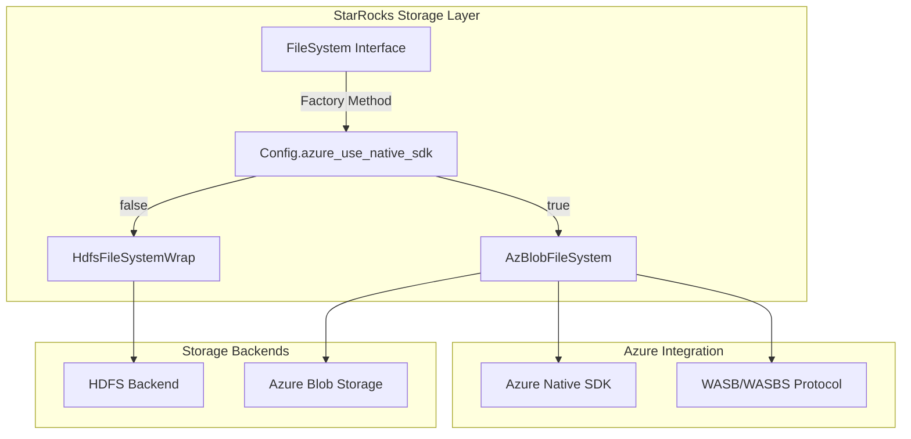
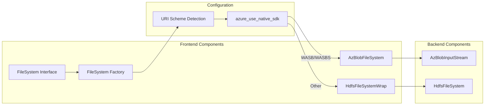
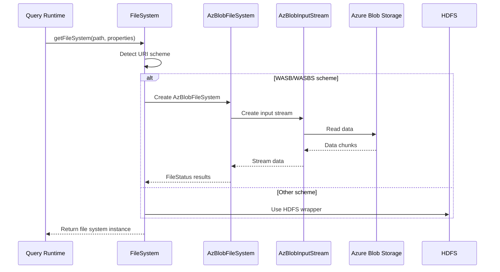
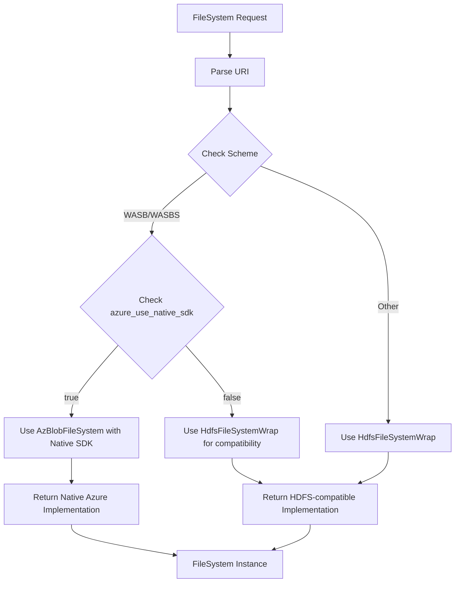

# Azure Blob Integration Module

## Introduction

The Azure Blob Integration module provides seamless integration between StarRocks and Microsoft Azure Blob Storage, enabling the system to read and write data stored in Azure Blob containers. This module implements a unified file system abstraction that allows StarRocks to treat Azure Blob Storage as a first-class storage backend alongside traditional HDFS and other cloud storage systems.

The module is designed to handle Azure's WASB (Windows Azure Storage Blob) and WASBS (secure) protocols, providing both native Azure SDK integration and HDFS-compatible access patterns. This dual approach ensures optimal performance and compatibility across different deployment scenarios and configuration preferences.

## Architecture Overview

### High-Level Architecture



### Component Relationships



## Core Components

### FileSystem Interface

The `FileSystem` interface serves as the primary abstraction point for all file system operations within StarRocks. It provides a unified API that hides the complexity of different storage backends from the rest of the system.

**Key Responsibilities:**
- Factory pattern implementation for creating appropriate file system instances
- URI scheme detection and routing
- Configuration-based backend selection
- Common operations abstraction (glob listing, property retrieval)

**Factory Method Logic:**
```java
public static FileSystem getFileSystem(String path, Map<String, String> properties) throws StarRocksException {
    WildcardURI pathUri = new WildcardURI(path);
    String scheme = pathUri.getUri().getScheme();
    
    if (Config.azure_use_native_sdk &&
        (scheme.equalsIgnoreCase(HdfsFsManager.WASB_SCHEME) || 
         scheme.equalsIgnoreCase(HdfsFsManager.WASBS_SCHEME))) {
        return new AzBlobFileSystem(properties);
    } else {
        return new HdfsFileSystemWrap(properties);
    }
}
```

### AzBlobFileSystem Implementation

The `AzBlobFileSystem` class provides the concrete implementation for Azure Blob Storage operations. It leverages either the native Azure SDK or HDFS-compatible APIs based on configuration and URI schemes.

**Key Features:**
- Native Azure SDK integration for optimal performance
- WASB/WASBS protocol support
- Azure-specific authentication and configuration handling
- Seamless fallback to HDFS-compatible mode when needed

### AzBlobInputStream

Located in the backend server module, `AzBlobInputStream` provides efficient streaming capabilities for reading data from Azure Blob Storage.

**Capabilities:**
- Buffered input streaming
- Azure-specific optimization
- Integration with StarRocks' columnar data processing pipeline
- Error handling and retry mechanisms

## Data Flow Architecture

### Read Operations Flow



### Configuration-Driven Backend Selection



## Integration Points

### Frontend Server Integration

The Azure Blob Integration module integrates with the frontend server through the [filesystem](frontend_server.md#filesystem) component, providing:

- **Unified Storage Abstraction**: Single interface for multiple storage backends
- **Configuration Management**: Centralized configuration through `Config.azure_use_native_sdk`
- **URI Scheme Handling**: Automatic detection and routing based on URI patterns
- **Property Management**: HDFS property extraction and conversion for backend usage

### Backend Server Integration

In the backend, the module integrates with the [file_systems](backend_server.md#file_systems) component through:

- **AzBlobInputStream**: Efficient data streaming from Azure Blob Storage
- **Native SDK Integration**: Direct Azure SDK usage for optimal performance
- **Error Handling**: Azure-specific error handling and retry logic
- **Performance Optimization**: Azure-optimized read patterns and caching

### Configuration Integration

The module leverages the [common_config](frontend_server.md#common_config) system for:

- **Feature Toggles**: `azure_use_native_sdk` configuration option
- **Authentication**: Azure credential management through configuration
- **Performance Tuning**: Azure-specific performance parameters
- **Compatibility Settings**: Fallback mechanisms and compatibility options

## Key Features

### 1. Dual Mode Operation

The module supports two operational modes:

- **Native Azure SDK Mode**: Direct integration with Azure SDK for optimal performance
- **HDFS-Compatible Mode**: Standard HDFS interface for compatibility with existing tools

### 2. Automatic URI Scheme Detection

Automatically detects and routes requests based on URI schemes:
- `wasb://` - Azure Blob Storage (unencrypted)
- `wasbs://` - Azure Blob Storage (SSL/TLS encrypted)
- Other schemes - Routed to appropriate handlers

### 3. Configuration-Driven Behavior

Runtime behavior is controlled through configuration:
- `azure_use_native_sdk`: Enable/disable native Azure SDK usage
- Azure authentication and connection parameters
- Performance and caching settings

### 4. Unified Error Handling

Consistent error handling across different storage backends:
- Azure-specific error translation
- Retry mechanisms for transient failures
- Graceful fallback to alternative access methods

## Dependencies

### Internal Dependencies

- **[frontend_server](frontend_server.md)**: Core server functionality and configuration management
- **[backend_server](backend_server.md)**: Backend execution and data processing
- **[common_config](frontend_server.md#common_config)**: Configuration management system
- **[filesystem](frontend_server.md#filesystem)**: File system abstraction layer

### External Dependencies

- **Azure Storage SDK**: Native Azure Blob Storage integration
- **Hadoop Azure Support**: HDFS-compatible Azure access
- **Apache Thrift**: Cross-language service communication

## Usage Patterns

### Basic File Operations

```java
// Get file system instance
FileSystem fs = FileSystem.getFileSystem("wasbs://container@account.blob.core.windows.net/path", properties);

// List files
List<FileStatus> files = fs.globList("wasbs://container@account.blob.core.windows.net/data/*.parquet", true);

// Get properties
THdfsProperties props = fs.getHdfsProperties("wasbs://container@account.blob.core.windows.net");
```

### Configuration Setup

```properties
# Enable native Azure SDK
azure_use_native_sdk=true

# Azure authentication settings
azure_account_name=your_account_name
azure_account_key=your_account_key
```

## Performance Considerations

### Native SDK Advantages

When `azure_use_native_sdk=true`:
- Direct Azure API calls for reduced latency
- Azure-optimized connection pooling
- Native Azure retry and error handling
- Better integration with Azure-specific features

### HDFS-Compatible Mode

When `azure_use_native_sdk=false`:
- Standard HDFS interface compatibility
- Tool ecosystem compatibility
- Simplified deployment and configuration
- Fallback for environments without native SDK support

## Security Features

### Authentication Methods

- **Account Key**: Traditional Azure account key authentication
- **SAS Tokens**: Shared Access Signature tokens
- **Managed Identity**: Azure Managed Identity integration
- **Service Principal**: Azure Active Directory service principal

### Transport Security

- **WASBS Protocol**: SSL/TLS encryption for data in transit
- **Certificate Validation**: Proper certificate chain validation
- **Network Isolation**: Support for Azure Virtual Network integration

## Error Handling and Monitoring

### Error Categories

- **Authentication Errors**: Invalid credentials or expired tokens
- **Network Errors**: Connectivity issues and timeouts
- **Storage Errors**: Container not found, access denied, etc.
- **Configuration Errors**: Invalid settings or missing parameters

### Monitoring Integration

- **Metrics Collection**: Azure-specific performance metrics
- **Logging**: Detailed operation logging for troubleshooting
- **Health Checks**: Storage backend health monitoring
- **Alerting**: Proactive issue detection and notification

## Future Enhancements

### Planned Features

- **Azure Data Lake Gen2 Support**: Integration with ADLS Gen2
- **Multi-Region Support**: Cross-region replication and failover
- **Advanced Caching**: Intelligent data caching strategies
- **Cost Optimization**: Storage tier management and lifecycle policies

### Performance Improvements

- **Parallel Operations**: Concurrent request optimization
- **Smart Prefetching**: Predictive data loading
- **Compression Integration**: Azure-native compression support
- **Bandwidth Optimization**: Network throughput maximization

## Related Documentation

- [Frontend Server](frontend_server.md) - Core server functionality and configuration
- [Backend Server](backend_server.md) - Backend execution and data processing
- [File System Integration](frontend_server.md#filesystem) - General file system abstraction
- [Common Configuration](frontend_server.md#common_config) - Configuration management system
- [HDFS Integration](hdfs_integration.md) - HDFS-specific integration details
- [Connector Framework](frontend_server.md#connector_framework) - General connector architecture