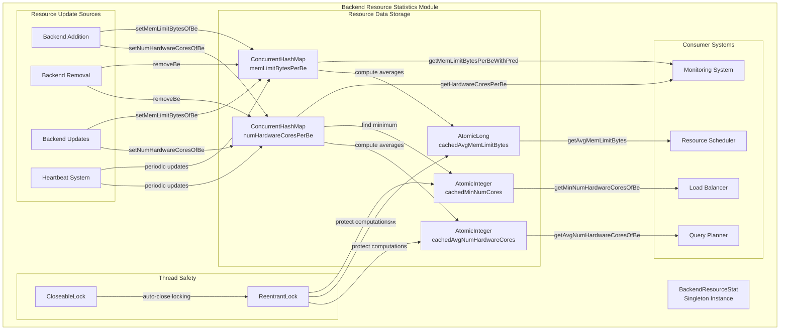
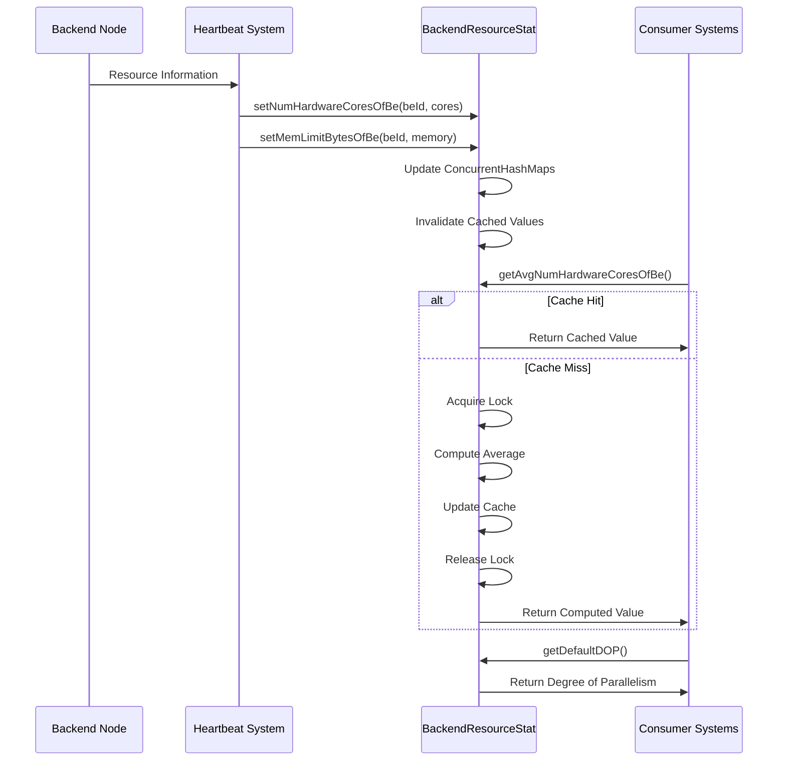
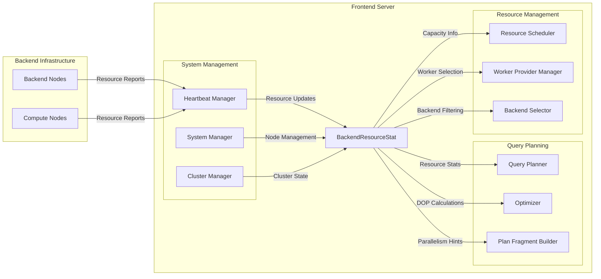

# Backend Resource Statistics Module

## Introduction

The Backend Resource Statistics module is a critical component of the StarRocks system that provides centralized resource monitoring and management for all backend (BE) and compute nodes. This module maintains real-time statistics about hardware resources across the cluster, enabling intelligent resource allocation, query optimization, and load balancing decisions.

The module serves as the authoritative source for CPU core counts and memory limits across all backend nodes, providing both instantaneous values and computed averages that are essential for the query planner and resource scheduler to make informed decisions about query execution strategies.

## Architecture Overview



## Core Components

### BackendResourceStat Singleton

The `BackendResourceStat` class implements the Singleton pattern to ensure a single, consistent source of resource truth across the entire frontend system. The singleton instance is accessed through `BackendResourceStat.getInstance()` and maintains all resource statistics in memory with thread-safe operations.

**Key Responsibilities:**
- Maintain CPU core counts for each backend node
- Track memory limits for each backend node  
- Compute and cache average resource values
- Provide thread-safe access to resource statistics
- Support filtering and predicate-based queries

### Resource Data Structures

#### CPU Core Tracking
```java
private final ConcurrentHashMap<Long, Integer> numHardwareCoresPerBe = new ConcurrentHashMap<>();
private final AtomicInteger cachedAvgNumHardwareCores = new AtomicInteger(ABSENT_CACHE_VALUE);
private final AtomicInteger cachedMinNumCores = new AtomicInteger(ABSENT_CACHE_VALUE);
```

The module uses a `ConcurrentHashMap` to store CPU core counts indexed by backend ID, with atomic cached values for frequently accessed computed statistics. This design allows for lock-free reads of individual values while ensuring consistency for computed averages.

#### Memory Limit Tracking
```java
private final ConcurrentHashMap<Long, Long> memLimitBytesPerBe = new ConcurrentHashMap<>();
private final AtomicLong cachedAvgMemLimitBytes = new AtomicLong(ABSENT_CACHE_VALUE);
```

Similar to CPU tracking, memory limits are stored in a concurrent map with cached average values. The use of atomic variables ensures visibility of changes across threads without requiring full synchronization.

### Thread Safety Mechanisms

The module employs a multi-layered approach to thread safety:

1. **Concurrent Data Structures**: `ConcurrentHashMap` for individual value storage
2. **Atomic Variables**: For cached computed values
3. **ReentrantLock**: For protecting complex computations
4. **CloseableLock**: For automatic resource management during locking

This design minimizes lock contention while ensuring data consistency during concurrent updates and computations.

## Data Flow Architecture



## Key Features and Capabilities

### Resource Aggregation Functions

The module provides several aggregation functions that compute cluster-wide resource statistics:

#### Average CPU Cores
```java
public int getAvgNumHardwareCoresOfBe()
```
Computes the average number of hardware cores across all backend nodes, with intelligent caching to avoid repeated calculations.

#### Minimum CPU Cores
```java
public int getMinNumHardwareCoresOfBe()
```
Determines the minimum number of cores available on any backend node, useful for capacity planning and bottleneck identification.

#### Average Memory Limits
```java
public long getAvgMemLimitBytes()
```
Calculates the average memory limit across all backend nodes, providing insight into cluster memory capacity.

### Degree of Parallelism (DOP) Calculation

The module implements sophisticated logic for determining optimal degrees of parallelism:

#### Query DOP
```java
public int getDefaultDOP()
```
Returns the default degree of parallelism for queries, calculated as `max(1, avg_cores / 2)` to balance resource utilization and query performance.

#### Sink DOP
```java
public int getSinkDefaultDOP()
```
Provides specialized DOP calculation for data loading operations, with different algorithms based on cluster size:
- Small clusters (≤24 cores): `max(1, avg_cores / 3)`
- Large clusters (>24 cores): `min(32, avg_cores / 4)`

This differentiated approach accounts for the different resource characteristics of query execution versus data loading operations.

### Filtering and Querying

The module supports predicate-based filtering of resource data:

```java
public Map<Long, Integer> getHardwareCoresPerBe(Predicate<Long> pred)
public Map<Long, Long> getMemLimitBytesPerBeWithPred(Predicate<Long> pred)
```

These methods allow consumer systems to query resource information for specific subsets of backend nodes, enabling fine-grained resource management and analysis.

## Integration with StarRocks System

### Dependency Relationships



### Update Triggers

Resource statistics are updated in response to several system events:

1. **Backend Addition**: When new backend nodes join the cluster
2. **Backend Removal**: When nodes leave or fail
3. **Resource Changes**: When hardware configurations are modified
4. **Periodic Heartbeats**: Regular updates from the heartbeat system

### Consumer Systems

The resource statistics are consumed by multiple subsystems:

- **Query Planner**: Uses average core counts for parallelization decisions
- **Resource Scheduler**: Leverages memory limits for resource allocation
- **Load Balancer**: Considers minimum core counts for capacity planning
- **Monitoring System**: Tracks resource utilization trends

## Performance Characteristics

### Caching Strategy

The module employs an intelligent caching strategy that balances accuracy with performance:

- **Cache Invalidation**: Cached values are invalidated immediately when underlying data changes
- **Lazy Computation**: Averages are only computed when requested and cache is stale
- **Lock Minimization**: Individual value reads are lock-free
- **Batch Operations**: Multiple updates can be processed without cache recomputation

### Memory Efficiency

Resource data is stored using primitive-based collections to minimize memory overhead:

- `ConcurrentHashMap<Long, Integer>` for CPU cores (8 bytes key + 4 bytes value)
- `ConcurrentHashMap<Long, Long>` for memory limits (8 bytes key + 8 bytes value)
- Atomic caches for computed values (4-8 bytes each)

### Scalability Considerations

The module is designed to scale with cluster size:

- **O(1)** individual value lookups
- **O(n)** average computations (where n = number of backends)
- **O(n)** filtering operations
- **O(1)** cache hits for computed values

## Error Handling and Resilience

### Default Values

The module provides sensible defaults when resource information is unavailable:

```java
private static final int DEFAULT_CORES_OF_BE = 1;
private static final long DEFAULT_MEM_LIMIT_BYTES = 0L;
```

These defaults ensure that the system can continue operating even with incomplete resource information, though with potentially suboptimal performance.

### Data Consistency

The module maintains consistency through:

- **Atomic Updates**: Individual value changes are atomic
- **Cache Coherence**: Cached values are invalidated before data changes
- **Lock Ordering**: Consistent lock acquisition order prevents deadlocks
- **Exception Safety**: Operations maintain invariants even on failure

## Monitoring and Observability

### Logging

The module provides comprehensive logging for debugging and monitoring:

```java
LOG.info("set numHardwareCores [{}] of be [{}], current cpuCores stats: {}", numCores, be, numHardwareCoresPerBe);
LOG.info("update avgNumHardwareCoresOfBe to {}, current cpuCores stats: {}", avg, numHardwareCoresPerBe);
```

These logs enable tracking of resource changes and statistical computations over time.

### Metrics Exposure

Resource statistics are exposed through:

- **JMX Beans**: For external monitoring systems
- **System Tables**: Via the information schema
- **Admin APIs**: For programmatic access
- **Prometheus Metrics**: For time-series monitoring

## Future Enhancements

### Planned Features

1. **GPU Resource Tracking**: Support for GPU memory and core counts
2. **Network Bandwidth Monitoring**: Track inter-node network capacity
3. **Storage Statistics**: Include disk space and IOPS information
4. **Historical Trending**: Maintain time-series data for capacity planning

### Performance Optimizations

1. **Lock-Free Algorithms**: Further reduce synchronization overhead
2. **Hierarchical Caching**: Multi-level cache for complex computations
3. **Incremental Updates**: Avoid full recomputation for small changes
4. **Compression**: Reduce memory footprint for large clusters

## Related Documentation

- [System Information Management](system_info.md) - Overview of system information components
- [Query Execution](query_execution.md) - How resource statistics are used in query planning
- [Resource Scheduling](query_scheduler.md) - Resource allocation and scheduling strategies
- [Backend Server](backend_server.md) - Backend node management and resource reporting
- [Frontend Server](frontend_server.md) - Frontend coordination and system management

## Conclusion

The Backend Resource Statistics module is a foundational component that enables StarRocks to make intelligent decisions about resource allocation and query execution. Its thread-safe, high-performance design ensures that accurate resource information is always available to support optimal cluster operation and query performance. The module's comprehensive API and integration points make it a central hub for resource-aware decision making throughout the StarRocks system.