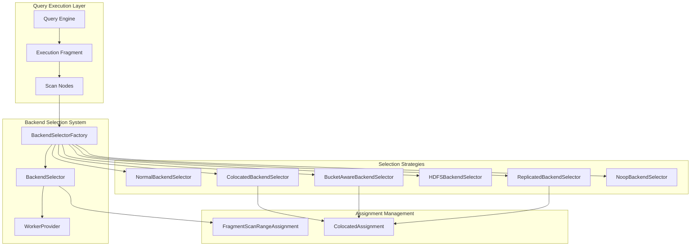
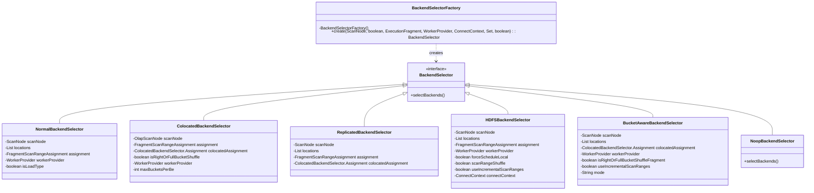
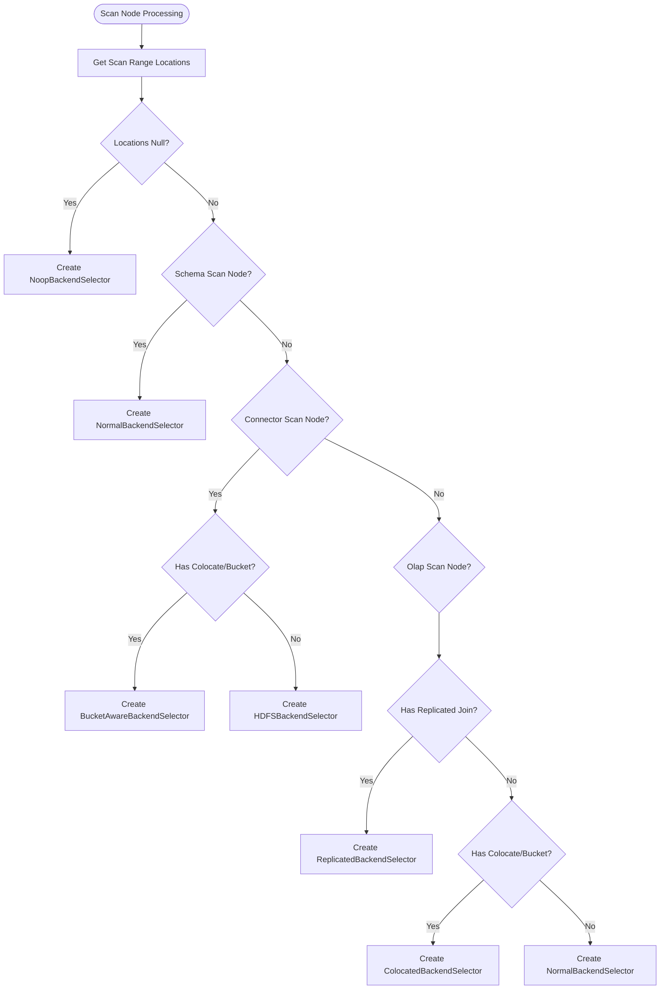
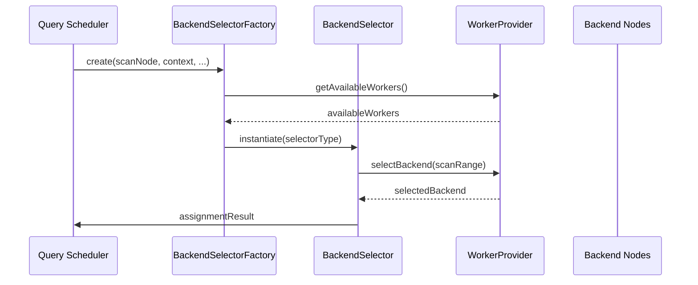

# Backend Selection System Documentation

## Introduction

The Backend Selection System is a critical component of StarRocks' query execution framework responsible for intelligently assigning scan ranges to appropriate backend nodes. This system optimizes query performance by considering factors such as data locality, load balancing, colocation constraints, and replication strategies. The system ensures efficient resource utilization while maintaining query correctness across distributed compute nodes.

## System Overview

The Backend Selection System operates at the intersection of query planning and execution, making runtime decisions about where to execute scan operations. It analyzes scan node characteristics, fragment properties, and cluster topology to determine optimal backend assignments for each scan range.

### Core Architecture

## Component Architecture

### BackendSelectorFactory

The `BackendSelectorFactory` serves as the central factory for creating appropriate backend selectors based on scan node characteristics and execution context. It implements a strategy pattern to instantiate the most suitable selector type for each scenario.

## Selection Strategy Logic

### Decision Flow

## Key Components

### 1. BackendSelectorFactory

**Purpose**: Central factory for creating backend selectors
**Key Responsibilities**:
- Analyze scan node type and properties
- Determine appropriate selection strategy
- Instantiate corresponding backend selector
- Handle incremental scan range configuration

**Key Parameters**:
- `scanNode`: The scan node requiring backend assignment
- `isLoadType`: Indicates if this is a load operation
- `execFragment`: Execution fragment containing assignment context
- `workerProvider`: Provider of available backend workers
- `connectContext`: Session context with configuration
- `destReplicatedScanIds`: Set tracking replicated scan IDs
- `useIncrementalScanRanges`: Flag for incremental processing

### 2. Selection Strategies

#### NormalBackendSelector
- **Use Case**: Standard scan operations without special constraints
- **Strategy**: Simple round-robin or load-based assignment
- **Applicable To**: Schema scan nodes, basic OlapScanNodes

#### ColocatedBackendSelector
- **Use Case**: Colocated joins and bucket shuffle operations
- **Strategy**: Maintains data locality for join operations
- **Key Feature**: Preserves bucket-to-backend mappings

#### ReplicatedBackendSelector
- **Use Case**: Replicated join scenarios
- **Strategy**: Leverages data replication for parallel execution
- **Optimization**: Reduces data movement by utilizing replicas

#### HDFSBackendSelector
- **Use Case**: External table scans (Hive, Iceberg, etc.)
- **Strategy**: Considers HDFS block locality and network topology
- **Features**: 
  - Local scheduling preference
  - Scan range shuffling for load balancing
  - Incremental scan range support

#### BucketAwareBackendSelector
- **Use Case**: Connector scans with colocation/bucket constraints
- **Strategy**: Combines connector awareness with bucket optimization
- **Configuration**: Lake bucket assignment mode support

#### NoopBackendSelector
- **Use Case**: Scenarios with no scan ranges
- **Strategy**: No-op implementation for edge cases

## Integration Points

### WorkerProvider Integration

### Execution Fragment Coordination

The backend selection system integrates closely with execution fragments to:
- Access colocation assignments
- Manage scan range assignments
- Coordinate with fragment scheduling
- Handle bucket shuffle constraints

## Configuration and Tuning

### Session Variables

Key session variables that influence backend selection:

- `connector_incremental_scan_range_number`: Controls incremental scan range processing
- `force_schedule_local`: Enforces local scheduling preference
- `hdfs_backend_selector_scan_range_shuffle`: Enables scan range shuffling
- `lake_bucket_assign_mode`: Configures lake table bucket assignment strategy
- `max_buckets_per_be_to_use_balancer_assignment`: Limits buckets per backend for balancing

### Performance Considerations

1. **Locality Optimization**: The system prioritizes local data access when possible
2. **Load Balancing**: Distributes work across available backends
3. **Colocation Preservation**: Maintains data locality for join operations
4. **Incremental Processing**: Supports incremental scan range assignment for large datasets

## Error Handling

The system handles various error scenarios:
- **Null Locations**: Returns NoopBackendSelector when no scan ranges exist
- **Invalid Configurations**: Throws StarRocksException for invalid parameters
- **Worker Unavailability**: Delegates to WorkerProvider for availability management

## Dependencies

The backend selection system depends on:
- [Query Scheduler System](query_scheduler.md): For execution fragment coordination
- [Worker Provider System](worker_provider_system.md): For backend availability
- [Connector Framework](connector_framework.md): For external table support
- [Session Management](session_management.md): For configuration access

## Related Documentation

- [Query Execution Architecture](query_execution.md)
- [Colocation and Join Optimization](colocation_join_optimization.md)
- [External Table Processing](external_tables.md)
- [Load Balancing Strategies](load_balancing.md)

## Future Enhancements

Potential areas for improvement:
1. **Machine Learning Integration**: Predictive backend selection based on historical performance
2. **Dynamic Rebalancing**: Runtime reassignment based on actual performance metrics
3. **Multi-Cloud Awareness**: Cloud-provider-specific optimization strategies
4. **Cost-Based Selection**: Incorporate resource cost into selection decisions