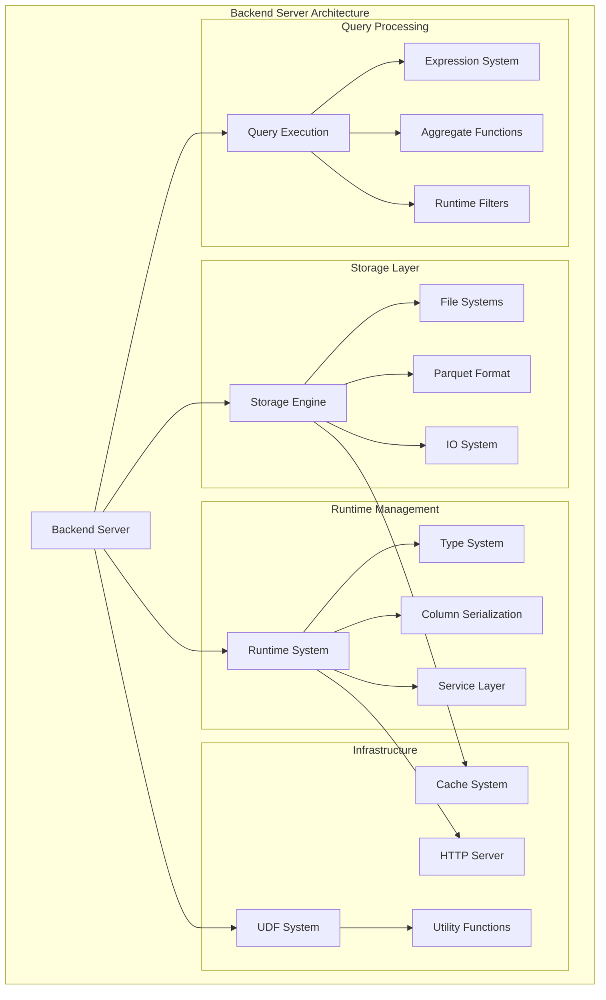
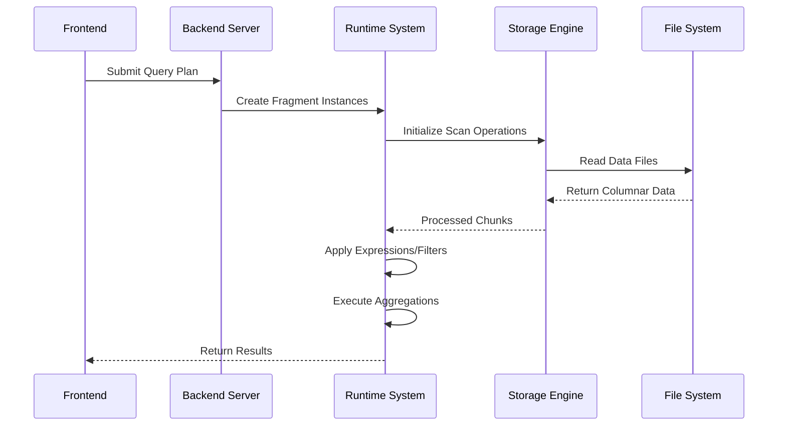

# Backend Server Module Documentation

## Overview

The `backend_server` module is the core execution engine of StarRocks, responsible for distributed query processing, data storage operations, and runtime management. It serves as the computational backbone that executes query plans, manages data ingestion, and coordinates with the storage engine to provide high-performance analytical processing capabilities.

## Purpose

The backend server module provides:
- **Query Execution**: Distributed execution of query fragments with vectorized processing
- **Data Storage**: Columnar storage management with compression and indexing
- **Runtime Coordination**: Fragment lifecycle management and inter-node communication
- **Expression Evaluation**: Comprehensive SQL expression processing with JIT compilation
- **File System Abstraction**: Unified interface for local and cloud storage systems
- **Data Format Support**: Native support for Parquet, ORC, and other analytical formats
- **User-Defined Functions**: Multi-language UDF support (Java, Python)
- **Performance Optimization**: Runtime filters, caching, and adaptive execution

## Architecture

## Core Components

### 1. Query Processing Subsystem

**Expression System** - Comprehensive SQL expression evaluation with:
- Vectorized arithmetic, string, and date/time operations
- JSON and geographic function support
- JIT compilation for performance-critical paths
- Runtime filter generation and application

**Aggregate Functions** - Complete aggregation framework supporting:
- Standard aggregates (SUM, AVG, COUNT, MIN/MAX)
- Approximate algorithms (HyperLogLog, Top-K)
- Window functions and streaming operations
- Statistical functions (variance, correlation)

**Runtime Filters** - Dynamic predicate pushdown optimization:
- Bloom filter-based join optimization
- Distributed filter coordination
- Adaptive filter selection based on data characteristics

### 2. Storage Layer

**Storage Engine** - Columnar storage with advanced features:
- Multi-version concurrency control (MVCC)
- Compression and encoding optimization
- Primary key and unique key support
- Partitioned and distributed tables

**File Systems** - Unified storage abstraction:
- Local POSIX filesystem
- Cloud storage (S3, Azure Blob)
- HDFS distributed filesystem
- Memory-based storage for testing

**Parquet Format** - Native Parquet support with:
- Columnar reading and writing
- Encoding optimization (dictionary, delta, RLE)
- Predicate pushdown and page indexes
- Schema evolution and type conversion

**IO System** - High-performance I/O with caching:
- Multi-tier caching (block cache, peer cache)
- Async I/O operations
- Performance profiling and monitoring
- Adaptive read-ahead strategies

### 3. Runtime Management

**Runtime System** - Query execution coordination:
- Fragment lifecycle management
- Inter-node data streaming
- Memory management and limits
- Load channel coordination

**Type System** - Comprehensive type support:
- Scalar types (numeric, string, date/time)
- Complex types (arrays, maps, structs)
- Type compatibility and conversion
- Schema evolution support

**Column Serialization** - Efficient data serialization:
- Columnar data format optimization
- Compression and encoding
- Cross-platform compatibility
- Memory-efficient operations

### 4. Infrastructure Services

**UDF System** - Multi-language user-defined functions:
- Java UDF with JNI integration
- Python UDF via Arrow Flight
- Security isolation and resource management
- Dynamic function registration

**HTTP Server** - REST API and monitoring:
- Metrics exposure (Prometheus-compatible)
- Stream load operations
- Health checks and status reporting
- Multi-format data ingestion

**Utility Functions** - System support utilities:
- System metrics and monitoring
- Compression algorithms
- Threading and synchronization
- Debugging and profiling tools

## Data Flow Architecture

## Performance Characteristics

- **Vectorized Execution**: Batch processing with SIMD optimizations
- **Memory Efficiency**: Columnar storage with compression ratios up to 10:1
- **Distributed Processing**: Linear scalability across cluster nodes
- **Adaptive Execution**: Runtime optimization based on data characteristics
- **Zero-copy Operations**: Minimal data movement for local operations

## Integration Points

The backend server integrates with:
- **[Frontend Server](frontend_server.md)**: Receives query plans and returns results
- **[Storage Engine](storage_engine.md)**: Provides data persistence and retrieval
- **[Query Execution](query_execution.md)**: Executes distributed query fragments
- **[SQL Parser/Optimizer](sql_parser_optimizer.md)**: Receives optimized execution plans

## Configuration and Tuning

Key configuration parameters include:
- Memory limits and allocation strategies
- Thread pool sizes for different operations
- Cache sizes and eviction policies
- Compression and encoding preferences
- Network and I/O timeout settings

## Monitoring and Observability

The backend server provides comprehensive monitoring through:
- Runtime profiles for query execution analysis
- System metrics for resource utilization
- Performance counters for operation tracking
- Error logging and diagnostic information

This module serves as the computational heart of StarRocks, enabling high-performance analytical processing through its sophisticated architecture and comprehensive feature set.