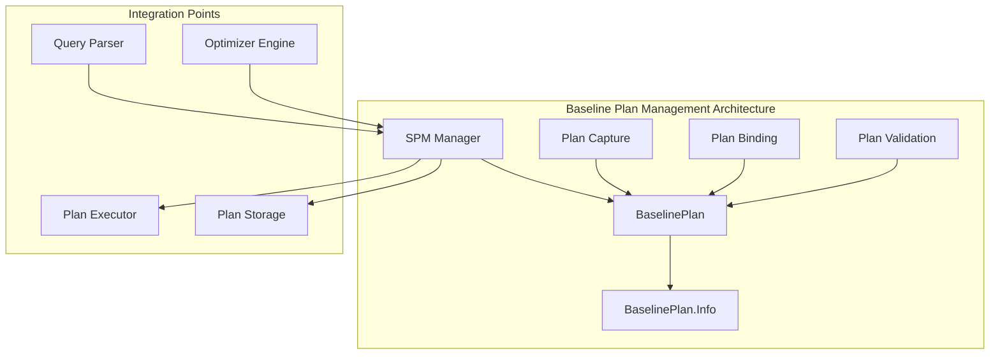
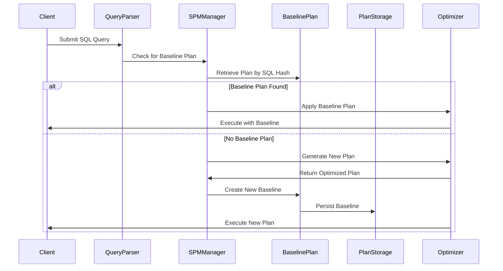
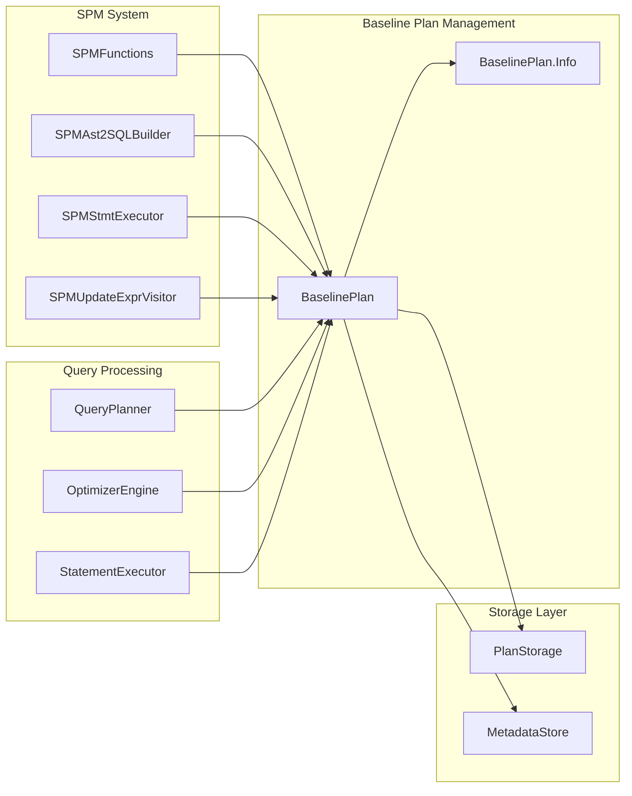
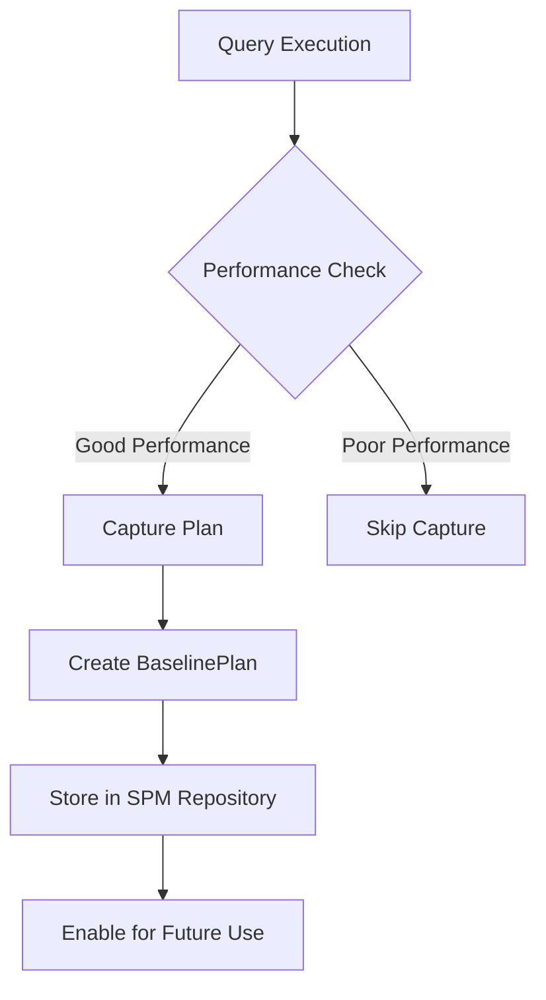
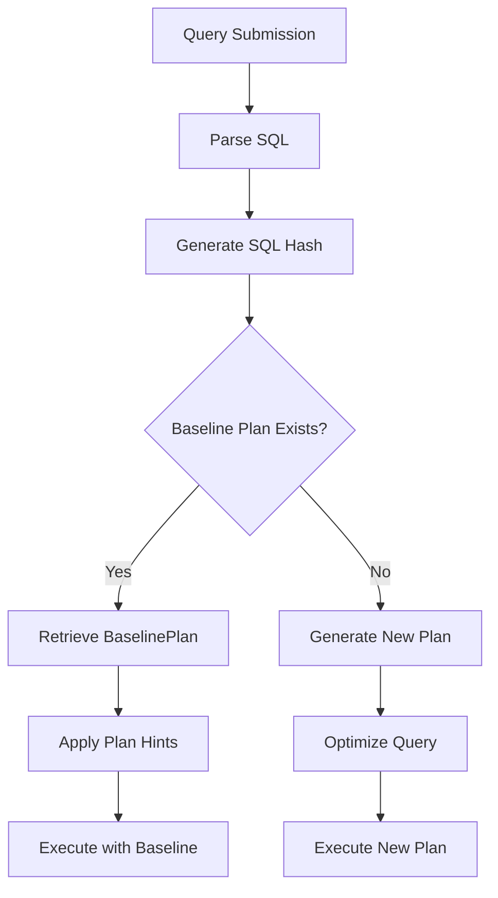

# Baseline Plan Management Module

## Introduction

The baseline plan management module is a critical component of StarRocks' SQL Plan Management (SPM) system that provides plan stability and performance optimization capabilities. This module manages baseline execution plans for SQL queries, ensuring consistent query performance by preventing plan regressions and enabling plan evolution control.

The module serves as the foundation for capturing, storing, and managing execution plans that have been identified as optimal baselines. It provides mechanisms for plan binding, version control, and performance tracking to maintain query execution consistency across system changes and data growth.

## Architecture Overview

## Core Components

### BaselinePlan Class

The `BaselinePlan` class is the central entity that represents a baseline execution plan with the following key attributes:

- **Plan Identification**: Unique ID and SQL hash for fast lookup
- **SQL Binding**: Original SQL with and without SPM functions
- **Execution Plan**: Optimized plan with hints for consistent execution
- **Performance Metrics**: Cost estimates and execution statistics
- **Lifecycle Management**: Enable/disable flags, global/local scope, and timestamps

### BaselinePlan.Info Class

The nested `Info` class provides serialization support for baseline plan metadata:

- **Replay Tracking**: Manages replay IDs and SQL hash bindings for plan validation
- **Persistence Support**: Implements `Writable` interface for metadata storage
- **Version Control**: Tracks plan evolution and binding history

## Data Flow Architecture

## Component Relationships

## Key Features

### Plan Binding and Matching

The module implements sophisticated SQL matching algorithms that:
- Normalize SQL queries for consistent comparison
- Generate hash-based identifiers for fast plan lookup
- Support parameterized queries with placeholder binding
- Handle SQL transformations while preserving semantic equivalence

### Performance Tracking

Baseline plans maintain comprehensive performance metrics:
- **Cost Estimates**: Optimizer-calculated execution costs
- **Execution Time**: Historical query performance data
- **Update Timestamps**: Track plan creation and modification times
- **Source Tracking**: Distinguish between user-created and system-captured plans

### Plan Lifecycle Management

The module provides complete lifecycle management:
- **Creation**: Automatic capture from optimized queries or manual creation
- **Validation**: Verification of plan effectiveness and correctness
- **Evolution**: Controlled updates to adapt to data changes
- **Retirement**: Archival of obsolete or underperforming plans

## Integration with SPM System

The baseline plan management module integrates seamlessly with the broader SPM ecosystem:

### Plan Capture Process

### Plan Application Process

## Configuration and Management

### Plan Sources

Baseline plans can originate from two sources:
- **USER**: Manually created plans by database administrators
- **CAPTURE**: Automatically captured plans from query execution

### Scope and Control

Plans support different scope levels:
- **Global Plans**: Apply across all sessions and users
- **Local Plans**: Session-specific or user-specific plans
- **Enable/Disable**: Dynamic control over plan usage

### Performance Optimization

The module includes several optimization features:
- **Hash-based Indexing**: Fast plan retrieval using SQL hash codes
- **Cost-based Selection**: Intelligent plan choice based on estimated costs
- **Replay Validation**: Verification of plan effectiveness through execution replay

## Error Handling and Recovery

### Plan Validation

The system implements comprehensive validation mechanisms:
- **Syntax Validation**: Ensure plan SQL remains syntactically correct
- **Semantic Validation**: Verify plan compatibility with current schema
- **Performance Validation**: Confirm plan maintains expected performance levels

### Recovery Mechanisms

When baseline plans become invalid:
- **Automatic Fallback**: Revert to optimizer-generated plans
- **Alert Generation**: Notify administrators of plan validation failures
- **Graceful Degradation**: Maintain system functionality despite plan issues

## Monitoring and Observability

### Metrics Collection

The module provides extensive monitoring capabilities:
- **Plan Usage Statistics**: Track how often each baseline plan is used
- **Performance Comparison**: Monitor baseline vs. optimizer-generated plans
- **Success/Failure Rates**: Measure plan application effectiveness

### Administrative Interface

Database administrators can:
- **View Baseline Plans**: Inspect stored plans and their metadata
- **Modify Plan Status**: Enable, disable, or delete baseline plans
- **Performance Analysis**: Compare baseline plan performance over time
- **Import/Export**: Transfer baseline plans between systems

## Security Considerations

### Access Control

The module implements security measures:
- **Plan Authorization**: Control who can create and modify baseline plans
- **SQL Injection Prevention**: Validate and sanitize all SQL inputs
- **Audit Logging**: Track all baseline plan operations

### Data Protection

Sensitive information is protected through:
- **SQL Redaction**: Remove sensitive data from stored SQL statements
- **Access Logging**: Record all access to baseline plan metadata
- **Encryption Support**: Optional encryption for stored plan data

## Performance Characteristics

### Scalability

The baseline plan management system is designed for high performance:
- **O(1) Plan Lookup**: Hash-based indexing for constant-time retrieval
- **Minimal Overhead**: Low impact on query compilation time
- **Efficient Storage**: Compact representation of plan metadata

### Resource Usage

The module maintains minimal resource footprint:
- **Memory Efficiency**: Optimized data structures for plan storage
- **CPU Optimization**: Fast hash computation and comparison algorithms
- **Storage Efficiency**: Compressed plan representation and metadata

## Future Enhancements

### Planned Features

The baseline plan management module is designed to support future enhancements:
- **Machine Learning Integration**: Automatic plan optimization using ML algorithms
- **Cross-System Plan Sharing**: Synchronize baseline plans across cluster nodes
- **Advanced Analytics**: Deeper insights into plan performance patterns
- **Automated Plan Evolution**: Self-managing plan updates based on performance trends

### Extensibility

The modular architecture supports easy extension:
- **Plugin Architecture**: Support for custom plan management strategies
- **API Integration**: RESTful APIs for external tool integration
- **Event System**: Comprehensive event notification for plan lifecycle events

## Related Documentation

For more information about related components, see:
- [spm.md](spm.md) - SQL Plan Management overview
- [sql_parser_optimizer.md](sql_parser_optimizer.md) - Query parsing and optimization
- [frontend_server.md](frontend_server.md) - Frontend server architecture
- [query_execution.md](query_execution.md) - Query execution framework

## Conclusion

The baseline plan management module provides a robust foundation for SQL plan stability and performance optimization in StarRocks. Through its comprehensive plan lifecycle management, sophisticated matching algorithms, and seamless integration with the broader SPM ecosystem, it enables database administrators to maintain consistent query performance while providing the flexibility to adapt to changing system conditions and data characteristics.