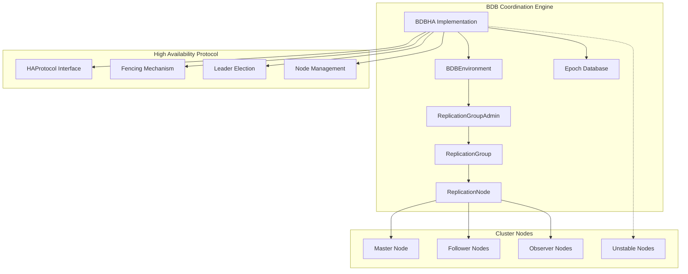
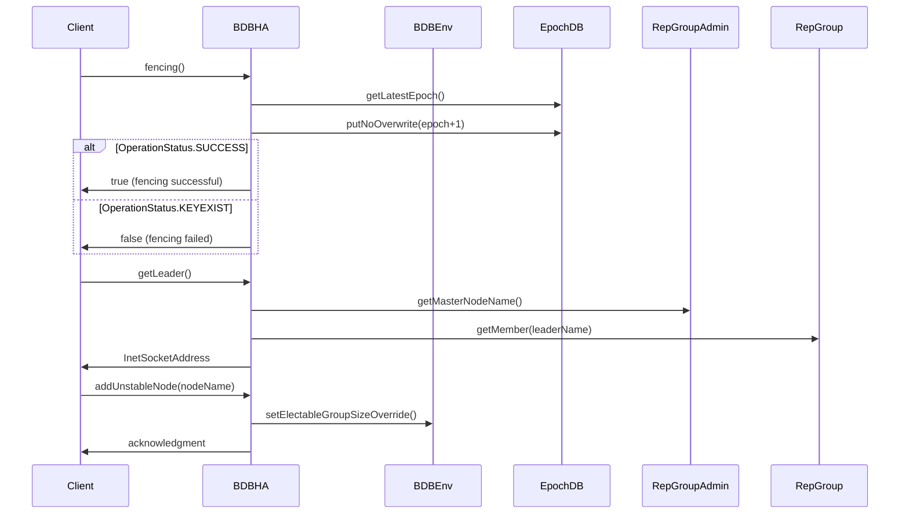
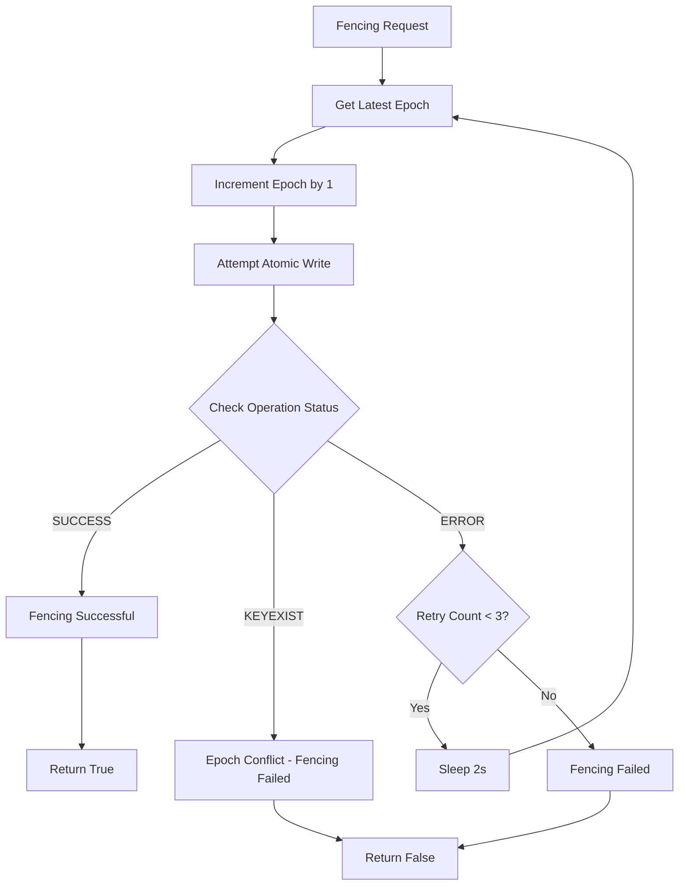
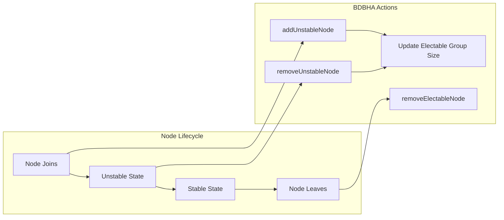
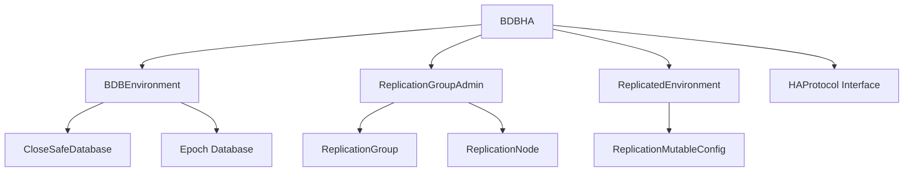

# BDB Coordination Engine Module

## Introduction

The BDB Coordination Engine module provides high availability coordination services for StarRocks clusters using Oracle Berkeley DB Java Edition (BDB JE) as the underlying replication mechanism. This module implements the `HAProtocol` interface to manage cluster membership, leader election, and node coordination in distributed environments.

## Architecture Overview

## Core Components

### BDBHA Class

The `BDBHA` class is the main implementation of the `HAProtocol` interface, providing high availability coordination services through BDB JE replication.

**Key Responsibilities:**
- Leader election and discovery
- Node membership management
- Fencing mechanism for split-brain prevention
- Unstable node tracking and management
- Cluster topology management

**Core Methods:**

## Data Flow

### Fencing Process

### Node Management Flow

## Key Features

### 1. Leader Election and Discovery

The module provides reliable leader election through BDB JE's built-in replication group management:

- **Automatic Leader Election**: BDB JE automatically elects a master node from electable nodes
- **Leader Discovery**: Provides methods to discover current leader and cluster topology
- **Observer Support**: Distinguishes between electable nodes and observer nodes

### 2. Fencing Mechanism

Implements a distributed fencing mechanism to prevent split-brain scenarios:

- **Epoch-based Fencing**: Uses monotonically increasing epoch numbers
- **Atomic Operations**: Ensures only one node can succeed in fencing
- **Retry Logic**: Implements retry mechanism with exponential backoff
- **Conflict Detection**: Detects and handles epoch conflicts

### 3. Unstable Node Management

Sophisticated handling of nodes in transition states:

- **Unstable Node Tracking**: Maintains set of nodes joining the cluster
- **Dynamic Group Size Adjustment**: Adjusts electable group size based on unstable nodes
- **Replication State Awareness**: Prevents premature inclusion in quorum calculations

### 4. Cluster Topology Management

Comprehensive cluster membership management:

- **Node Addition/Removal**: Dynamic addition and removal of cluster nodes
- **Address Updates**: Support for updating node hostnames and ports
- **Conflict Resolution**: Automatic detection and resolution of node conflicts

## Dependencies

## Integration Points

### Frontend Server Integration

The BDB Coordination Engine integrates with the [frontend_server](frontend_server.md) module through:

- **State Management**: Coordinates with `StateChangeExecutor` for cluster state transitions
- **Server Lifecycle**: Participates in server initialization and graceful shutdown
- **Configuration Management**: Works with cluster configuration for HA settings

### Journal System Integration

Integrates with the [journal](journal.md) system through:

- **BDBEnvironment**: Uses BDB JE for both coordination and journaling
- **Epoch Management**: Maintains epoch database for fencing operations
- **Replication Coordination**: Ensures journal replication consistency

## Configuration and Deployment

### BDB Environment Configuration

The module requires proper BDB JE environment setup:

- **Replication Group**: Pre-configured replication group with node definitions
- **Network Configuration**: Proper hostname and port configuration for all nodes
- **Quorum Settings**: Appropriate electable group size configuration

### High Availability Setup

For production deployment:

1. **Minimum Nodes**: At least 3 electable nodes for proper quorum
2. **Observer Nodes**: Optional observer nodes for read scalability
3. **Network Requirements**: Reliable network connectivity between nodes
4. **Storage Requirements**: Persistent storage for BDB databases

## Error Handling and Recovery

### Exception Handling

The module handles various BDB JE exceptions:

- **MasterStateException**: When attempting operations on master node
- **MemberNotFoundException**: When specified node is not found
- **UnknownMasterException**: When master node cannot be determined

### Recovery Mechanisms

- **Retry Logic**: Automatic retry for transient failures
- **State Reconciliation**: Periodic reconciliation of cluster state
- **Conflict Resolution**: Automatic resolution of node conflicts

## Monitoring and Observability

### Logging

Comprehensive logging for all coordination operations:

- **Fencing Operations**: Detailed logging of fencing attempts and results
- **Node State Changes**: Logging of node additions, removals, and state transitions
- **Error Conditions**: Detailed error logging for troubleshooting

### Metrics

Integration with StarRocks metrics system for:

- **Cluster Health**: Node health and availability metrics
- **Fencing Performance**: Fencing operation success/failure rates
- **Leader Changes**: Leader election frequency and duration

## Security Considerations

### Network Security

- **Secure Communication**: BDB JE replication over secure channels
- **Authentication**: Node authentication through BDB JE mechanisms
- **Access Control**: Restricted access to coordination services

### Data Integrity

- **Epoch Validation**: Ensures epoch sequence integrity
- **Atomic Operations**: Uses atomic database operations for consistency
- **Replication Consistency**: Maintains consistency across replicated data

## Performance Characteristics

### Latency

- **Fencing Operations**: Typically sub-millisecond for local operations
- **Leader Discovery**: Network-dependent, typically under 100ms
- **Node Management**: O(1) for most operations

### Scalability

- **Node Count**: Supports up to dozens of nodes in replication group
- **Observer Scaling**: Observer nodes don't affect write performance
- **Geographic Distribution**: Supports multi-datacenter deployments

## Future Enhancements

### Planned Improvements

- **Dynamic Reconfiguration**: Support for dynamic replication group reconfiguration
- **Advanced Monitoring**: Enhanced metrics and alerting capabilities
- **Performance Optimization**: Reduced coordination overhead
- **Cloud Integration**: Better support for cloud-native deployments

### Extensibility

- **Plugin Architecture**: Support for custom coordination protocols
- **Multi-Protocol Support**: Ability to support multiple HA backends
- **API Evolution**: Backward-compatible API evolution