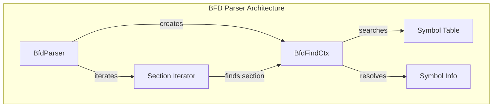

# BFD Parser Sub-module

## Overview

The BFD (Binary File Descriptor) parser sub-module provides symbol resolution and debugging capabilities for the StarRocks system. It enables runtime symbol lookup, stack trace enhancement, and binary analysis functionality.

## Core Components

### BfdFindCtx Structure

The `BfdFindCtx` structure serves as the primary context for symbol lookup operations:

```cpp
struct BfdFindCtx {
    BfdFindCtx(bfd_symbol** syms_, bfd_vma pc_) : syms(syms_), pc(pc_) {}
    
    bool found{false};
    bfd_symbol** syms;
    bfd_vma pc;
    const char* file_name{nullptr};
    const char* func_name{nullptr};
    unsigned int lineno{0};
};
```

This structure encapsulates:
- Symbol table reference for lookup operations
- Program counter address to resolve
- Result storage for file name, function name, and line number
- Status tracking for the lookup operation

## Architecture



## Key Features

### 1. Symbol Resolution
- Resolves program counter addresses to function names
- Provides source file and line number information
- Supports function name demangling for C++ symbols

### 2. Multi-Architecture Support
- x86_64 architecture support with ELF64 format
- ARM64 architecture support
- Runtime architecture detection and configuration

### 3. Thread Safety
- Mutex-protected operations for concurrent access
- Static initialization with architecture-specific settings
- Safe symbol table access across multiple threads

## Implementation Details

### Symbol Lookup Process

1. **Initialization**: The parser initializes BFD library and sets target architecture
2. **Section Iteration**: Iterates through binary sections to find containing section
3. **Symbol Search**: Uses BFD's `bfd_find_nearest_line` to locate symbol information
4. **Demangling**: Applies C++ name demangling for readable function names
5. **Result Assembly**: Compiles file name, function name, and line number

### Memory Management
- Automatic cleanup of BFD resources
- Symbol table memory management
- Proper resource deallocation on parser destruction

## Usage Patterns

### Stack Trace Enhancement
The BFD parser integrates with the stack trace system to provide enhanced debugging information:

```cpp
// Example usage pattern (conceptual)
BfdParser* parser = BfdParser::create();
if (parser) {
    std::string file_name, func_name;
    unsigned int line_no;
    parser->decode_address(pc_address, &file_name, &func_name, &line_no);
}
```

### Binary Analysis
Supports analysis of the running binary for debugging and profiling purposes.

## Performance Characteristics

- **Symbol Lookup**: O(log n) for symbol table search
- **Memory Usage**: Proportional to symbol table size
- **Initialization**: One-time cost during parser creation
- **Thread Safety**: Minimal lock contention for concurrent lookups

## Error Handling

- Graceful fallback when symbol information is unavailable
- Proper error reporting for malformed binaries
- Safe handling of missing debug symbols

## Integration Points

The BFD parser integrates with:
- [Stack Utilities](stack_util.md) for enhanced stack traces
- System monitoring for performance profiling
- Debugging infrastructure for development builds

This sub-module provides essential debugging and profiling capabilities that enhance the observability and maintainability of the StarRocks system.