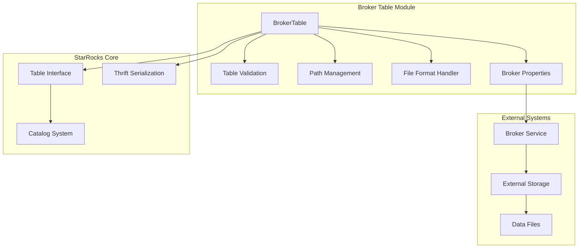
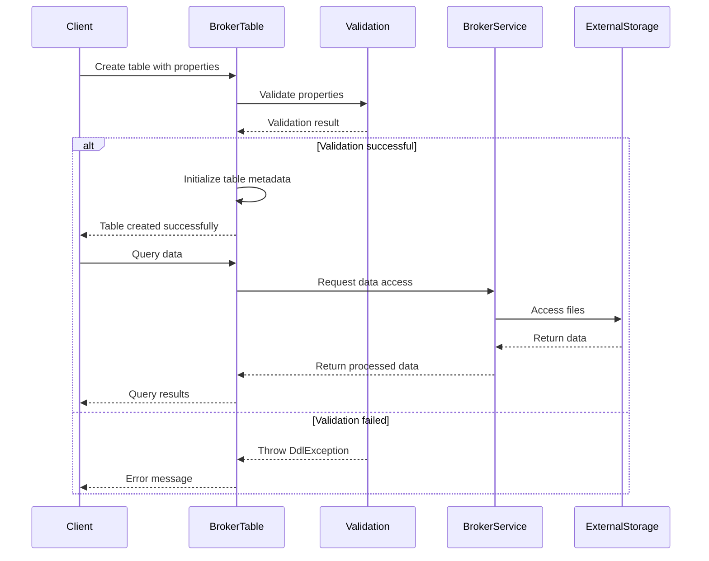

# Broker Table Module Documentation

## Introduction

The broker_table module provides functionality for managing external tables that access data through broker services. Broker tables enable StarRocks to read data from external storage systems (like HDFS, S3, or other file systems) through a broker abstraction layer, supporting various file formats including CSV and Parquet.

## Core Functionality

The broker_table module serves as a bridge between StarRocks and external storage systems, providing:

- **External Data Access**: Unified interface for accessing data from various external storage systems
- **File Format Support**: Support for CSV and Parquet file formats with configurable parsing options
- **Path Management**: Support for multiple file paths with URL encoding for special characters
- **Broker Integration**: Integration with StarRocks broker services for secure data access
- **Schema Validation**: Validation of table properties and configuration parameters

## Architecture

### Component Overview

### Key Components

#### BrokerTable Class
The main class that extends the base Table class and implements broker-specific functionality:

- **Property Management**: Handles broker name, file paths, column/row delimiters, and file format
- **Validation Logic**: Validates all required properties during table creation
- **Path Encoding**: Manages URL encoding for special characters in file paths
- **Writable Detection**: Determines if the table supports write operations

#### Property Validation
The module validates several key properties:

- **broker_name**: Required property specifying the broker service to use
- **path**: Required property containing comma-separated file paths
- **column_separator**: Optional column delimiter (defaults to tab)
- **line_delimiter**: Optional row delimiter (defaults to newline)
- **format**: Optional file format (csv or parquet)

## Data Flow

## Integration Points

### Catalog Integration
The BrokerTable integrates with StarRocks' catalog system through the base Table class, providing:
- Table metadata management
- Schema information
- Thrift serialization for distributed execution

### Broker Service Integration
The module works with StarRocks' broker services to:
- Authenticate with external storage systems
- Handle file system operations
- Manage data transfer and security

### Query Engine Integration
Through the Table interface and Thrift serialization, broker tables integrate with:
- Query planning and optimization
- Distributed execution framework
- Result set processing

## Configuration and Usage

### Table Creation
Broker tables are created with specific properties that define:
- Broker service to use
- File paths to access
- Data format specifications
- Parsing parameters

### Path Management
The module supports:
- Multiple file paths separated by commas
- URL encoding for special characters (comma and percent)
- Wildcard patterns for write operations
- Path validation and normalization

### File Format Support
Currently supported formats:
- **CSV**: With configurable column and row delimiters
- **Parquet**: Columnar storage format

## Error Handling

The module implements comprehensive error handling for:
- Missing required properties
- Invalid broker names
- Malformed file paths
- Unsupported file formats
- Encoding issues with special characters

## Dependencies

The broker_table module depends on several other StarRocks components:

- **Catalog System**: For table metadata management ([catalog.md](catalog.md))
- **Thrift Framework**: For serialization and RPC communication
- **Common Utilities**: For string processing and validation ([common_utilities.md](common_utilities.md))
- **Planner Components**: For query execution integration ([planner_nodes.md](planner_nodes.md))

## Security Considerations

The module handles security through:
- Broker authentication mechanisms
- Path validation to prevent directory traversal
- Property sanitization and validation
- Secure handling of broker credentials

## Performance Considerations

Key performance aspects:
- Efficient path encoding/decoding
- Minimal overhead in table metadata operations
- Optimized Thrift serialization
- Lazy evaluation of expensive operations

## Future Enhancements

Potential areas for improvement:
- Additional file format support (ORC, JSON)
- Advanced filtering pushdown
- Parallel data access optimization
- Enhanced error reporting and diagnostics