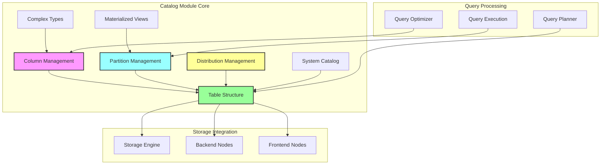

# Catalog Module Overview

## Purpose

The `catalog` module is the central metadata management system in StarRocks, responsible for organizing, storing, and managing all database objects including tables, columns, partitions, indexes, and materialized views. It serves as the authoritative source of truth for the entire system's schema information and provides the foundation for query planning, optimization, and execution.

## Architecture



## Core Components

### 1. Column Management (`column_management`)
Manages column metadata, types, and statistics:
- **Column Core**: Column definition and validation
- **Column Identity**: Unique column identification with case-insensitive handling
- **Column Statistics**: Statistics collection for query optimization
- **Type System**: Comprehensive type support including primitives and complex types

### 2. Partition Management (`partition_management`)
Handles table partitioning and materialized view partition synchronization:
- **Partition Core**: Individual partition metadata management
- **Partition Information**: Partition scheme definitions and boundaries
- **Partition Key**: Key value management and validation
- **MV Partition Integration**: Base table partition tracking for materialized views

### 3. Distribution Management (`distribution_management`)
Manages data distribution strategies across the cluster:
- **Distribution Info**: Hash and random distribution configurations
- **Distribution Builder**: Centralized distribution creation
- **Colocation Support**: Enables optimal data placement for joins

### 4. Table Structure (`table_structure`)
Provides table schema definition and management:
- **SchemaInfo Builder**: Table schema construction
- **Index Management**: Various index types for different access patterns
- **Tablet Management**: Data partitioning units for distributed storage
- **Scalar Functions**: Built-in and user-defined function support

### 5. Complex Types (`complex_types`)
Supports advanced data types for modern analytical workloads:
- **MapType**: Key-value pair structures
- **StructType**: Named field structures
- **Type Serialization**: JSON and Thrift support
- **Field Selection**: Subfield pruning and optimization

### 6. System Catalog (`system_catalog`)
Implements information schema and system metadata:
- **InternalCatalog**: Default catalog implementation
- **SystemTable**: Framework for system table creation
- **SystemId**: Centralized identifier management
- **MySQL Compatibility**: Standard information schema support

### 7. Materialized Views (`materialized_views`)
Manages pre-computed query results and automatic refresh:
- **MaterializedView**: Core MV functionality
- **MaterializedIndexMeta**: Index metadata management
- **BasePartitionInfo**: Partition-level tracking
- **Refresh Management**: Multiple refresh strategies

## Key Features

### Schema Management
- Comprehensive metadata validation and consistency checking
- Schema evolution support with backward compatibility
- Version management for schema changes
- Cross-component metadata synchronization

### Performance Optimization
- Column statistics for query cost estimation
- Partition pruning for efficient data access
- Index optimization for various query patterns
- Materialized view acceleration

### Extensibility
- Plugin architecture for custom catalog extensions
- Connector framework for external data sources
- User-defined function support
- Flexible type system

### High Availability
- Metadata persistence and recovery
- Replication across frontend nodes
- Consistent metadata views
- Failure handling and restoration

## Integration Points

The catalog module integrates with all major StarRocks components:

- **Storage Engine**: Provides schema information for data organization
- **Query Engine**: Supplies metadata for query planning and optimization
- **SQL Parser**: Validates DDL statements and type definitions
- **Connectors**: Manages external table metadata
- **Scheduler**: Coordinates metadata updates and maintenance

## Usage Patterns

### Table Creation
```sql
CREATE TABLE users (
    id BIGINT,
    name VARCHAR(100),
    properties MAP<STRING, STRING>,
    address STRUCT<street:STRING, city:STRING>
) PARTITION BY RANGE(id) (
    PARTITION p1 VALUES LESS THAN (1000),
    PARTITION p2 VALUES LESS THAN (2000)
) DISTRIBUTED BY HASH(id) BUCKETS 10;
```

### Materialized View Creation
```sql
CREATE MATERIALIZED VIEW user_summary
REFRESH ASYNC
AS SELECT city, COUNT(*) as user_count
FROM users
GROUP BY city;
```

### System Information Queries
```sql
-- Query table metadata
SELECT * FROM information_schema.tables WHERE table_schema = 'mydb';

-- Check partition information
SHOW PARTITIONS FROM users;

-- View materialized view status
SHOW MATERIALIZED VIEWS;
```

## Best Practices

1. **Schema Design**: Use appropriate data types and consider query patterns
2. **Partitioning**: Choose partition keys based on query filters and data distribution
3. **Distribution**: Select distribution columns for optimal join performance
4. **Statistics**: Keep column statistics updated for accurate query planning
5. **Materialized Views**: Create MVs for frequently used complex queries

## Related Documentation

- [Storage Engine](../storage_engine.md) - Underlying data storage mechanisms
- [Query Execution](../query_execution.md) - Query processing and optimization
- [SQL Parser & Optimizer](../sql_parser_optimizer.md) - Query analysis and planning
- [Frontend Server](../frontend_server.md) - Catalog service hosting and management