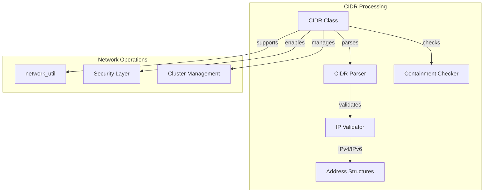

# CIDR Processing Sub-module

## Overview

The CIDR (Classless Inter-Domain Routing) processing sub-module provides network address range management and validation capabilities. It enables IP address containment checking, CIDR notation parsing, and network range operations essential for network security and cluster management.

## Core Components

### in_addr Structure Integration

The sub-module leverages the standard `in_addr` structure for IPv4 address representation and extends support for IPv6 through `in6_addr`. The `CIDR` class provides a unified interface for both IPv4 and IPv6 CIDR operations.

## Architecture



## Key Features

### 1. CIDR Notation Parsing
- Supports standard CIDR notation (e.g., "192.168.1.0/24")
- IPv4 and IPv6 CIDR format support
- Automatic network family detection
- Robust error handling for malformed input

### 2. IP Address Containment
- Efficient subnet membership testing
- Cross-family compatibility checking
- Bitmask-based network comparison
- Optimized for frequent containment checks

### 3. Network Family Support
- Dual-stack IPv4/IPv6 support
- IPv4-mapped IPv6 address handling
- Automatic address family detection
- Consistent API across address families

## Implementation Details

### CIDR Parsing Algorithm

```cpp
// Conceptual parsing flow
bool CIDR::reset(const std::string& cidr_str) {
    // 1. Split on '/' to separate address and prefix length
    // 2. Parse IP address using inet_pton() for appropriate family
    // 3. Validate and parse prefix length
    // 4. Store network address and prefix length
    // 5. Return success/failure status
}
```

### Containment Checking

The containment algorithm uses bitwise operations for efficiency:

```cpp
bool CIDR::contains(const CIDR& ip) const {
    // 1. Check address family compatibility
    // 2. Verify prefix length constraints
    // 3. Compare network portions using bitmask
    // 4. Return containment result
}
```

## Usage Patterns

### Network Security
```cpp
// Example: IP whitelist validation
CIDR allowed_range("10.0.0.0/8");
CIDR client_ip(client_address);
if (allowed_range.contains(client_ip)) {
    // Allow access
}
```

### Cluster Management
```cpp
// Example: Node network validation
CIDR cluster_network("172.16.0.0/12");
for (const auto& node : cluster_nodes) {
    if (cluster_network.contains(node.ip_address)) {
        // Node is in valid network range
    }
}
```

## Performance Characteristics

- **CIDR Parsing**: O(n) where n is the length of the CIDR string
- **Containment Check**: O(1) using optimized bitwise operations
- **Memory Usage**: Minimal overhead per CIDR instance
- **Scalability**: Efficient for large-scale network operations

## Error Handling

- Comprehensive input validation
- Graceful handling of malformed CIDR strings
- Clear error messages for debugging
- Safe fallback behavior for invalid input

## Security Considerations

- Input sanitization for network strings
- Protection against CIDR notation attacks
- Validation of prefix length bounds
- Safe handling of special IP addresses

## Integration Points

The CIDR sub-module integrates with:
- [Network Utilities](network_util.md) for address resolution
- Security modules for access control
- Cluster management for network validation
- Configuration systems for network policies

This sub-module provides essential network range management capabilities that support secure and efficient network operations throughout the StarRocks system.