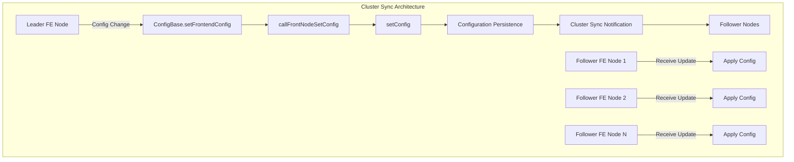
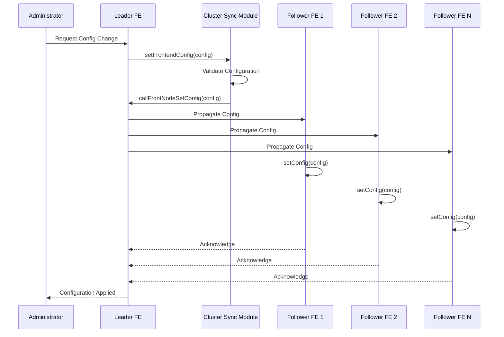
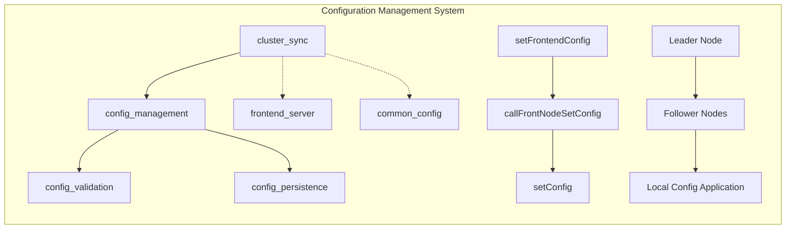
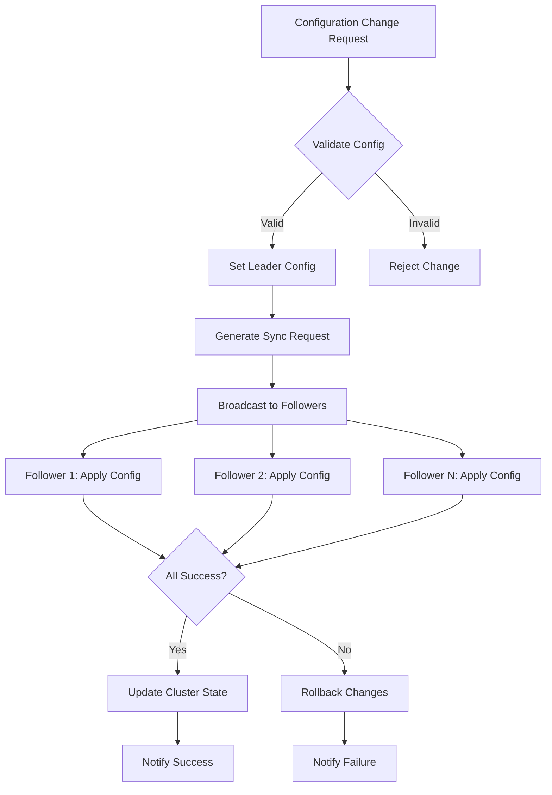

# Cluster Sync Module Documentation

## Introduction

The cluster_sync module is a critical component of StarRocks' configuration management system, responsible for synchronizing configuration changes across all Frontend (FE) nodes in a cluster. This module ensures configuration consistency and enables dynamic configuration updates without requiring cluster restarts, which is essential for maintaining high availability and operational flexibility in distributed environments.

## Architecture Overview

The cluster_sync module operates as part of the broader configuration management system within the frontend_server module. It provides mechanisms for propagating configuration changes from the leader FE node to all follower nodes, ensuring cluster-wide consistency.

## Core Components

### Configuration Synchronization Interface

The module provides three primary configuration synchronization methods:

#### 1. setFrontendConfig
- **Purpose**: Sets configuration parameters at the frontend level
- **Scope**: Cluster-wide configuration changes
- **Responsibility**: Initiates the synchronization process across all FE nodes

#### 2. callFrontNodeSetConfig
- **Purpose**: Internal method for coordinating configuration updates
- **Scope**: Inter-node communication for config propagation
- **Responsibility**: Handles the RPC communication between FE nodes

#### 3. setConfig
- **Purpose**: Applies configuration changes locally on each node
- **Scope**: Local node configuration application
- **Responsibility**: Validates and applies configuration updates

## Data Flow Architecture

## Component Relationships

## Integration with System Architecture

The cluster_sync module integrates with several key system components:

### Frontend Server Integration
- **Purpose**: Provides the infrastructure for inter-node communication
- **Components**: RPC layer, node discovery, cluster state management
- **Reference**: [frontend_server.md](frontend_server.md)

### Configuration Management Integration
- **Purpose**: Validates and persists configuration changes
- **Components**: Config validation, persistence mechanisms
- **Reference**: [common_config.md](common_config.md)

### System State Management
- **Purpose**: Maintains cluster state consistency
- **Components**: State synchronization, failure handling
- **Reference**: [frontend_server.md#state_management](frontend_server.md)

## Process Flow

### Configuration Update Process

### Error Handling and Recovery

The cluster_sync module implements robust error handling mechanisms:

1. **Partial Failure Handling**: If some followers fail to apply configuration, the system can rollback changes or retry based on configuration policy
2. **Network Partition Handling**: Implements timeout mechanisms and retry logic for network failures
3. **Configuration Validation**: Ensures configuration consistency before propagation
4. **Rollback Capabilities**: Can revert changes if cluster-wide application fails

## Key Features

### 1. Atomic Configuration Updates
- Ensures all-or-nothing configuration application across the cluster
- Prevents configuration inconsistency during updates

### 2. Dynamic Configuration Support
- Allows runtime configuration changes without cluster restart
- Maintains service availability during configuration updates

### 3. Configuration Validation
- Validates configuration before propagation
- Prevents invalid configurations from being applied cluster-wide

### 4. Failure Resilience
- Handles node failures during configuration updates
- Implements retry mechanisms for transient failures

## Dependencies

The cluster_sync module depends on several system components:

### Direct Dependencies
- **ConfigBase**: Provides configuration validation and persistence
- **Frontend Server**: Provides inter-node communication infrastructure
- **RPC Layer**: Enables communication between FE nodes

### Indirect Dependencies
- **System State Management**: For cluster state consistency
- **Authentication/Authorization**: For configuration change permissions
- **Logging System**: For audit trails and troubleshooting

## Configuration Synchronization Patterns

### 1. Leader-Follower Pattern
- Leader node coordinates all configuration changes
- Followers apply changes locally after validation
- Ensures consistency across the cluster

### 2. Two-Phase Commit
- Prepare phase: Validate configuration on all nodes
- Commit phase: Apply configuration if all validations pass
- Rollback capability if any node fails

### 3. Event-Driven Updates
- Configuration changes trigger synchronization events
- Asynchronous processing for better performance
- Status tracking and notification mechanisms

## Performance Considerations

### 1. Network Efficiency
- Batched configuration updates when possible
- Compression for large configuration sets
- Efficient RPC protocols for inter-node communication

### 2. Concurrency Control
- Lock-free mechanisms where possible
- Optimistic concurrency control for configuration updates
- Conflict resolution strategies

### 3. Scalability
- Linear scalability with cluster size
- Efficient broadcast mechanisms
- Minimal overhead for configuration synchronization

## Security Considerations

### 1. Authentication
- Configuration changes require proper authentication
- Integration with cluster authentication system
- Audit logging for all configuration changes

### 2. Authorization
- Role-based access control for configuration management
- Granular permissions for different configuration types
- Integration with cluster authorization framework

### 3. Encryption
- Secure transmission of configuration data
- Encryption of sensitive configuration parameters
- Secure storage of configuration information

## Monitoring and Observability

### 1. Metrics Collection
- Configuration change frequency
- Synchronization success/failure rates
- Synchronization latency metrics

### 2. Logging
- Detailed audit logs for configuration changes
- Error logging for synchronization failures
- Performance metrics for optimization

### 3. Health Checks
- Cluster configuration consistency checks
- Node synchronization status monitoring
- Alert mechanisms for synchronization failures

## Best Practices

### 1. Configuration Management
- Use version control for configuration changes
- Test configuration changes in non-production environments
- Implement gradual rollout strategies for critical changes

### 2. Monitoring
- Monitor synchronization metrics regularly
- Set up alerts for synchronization failures
- Maintain audit trails for compliance

### 3. Troubleshooting
- Use cluster logs for diagnosis
- Implement configuration rollback procedures
- Maintain documentation of configuration changes

## Related Documentation

- [Frontend Server Module](frontend_server.md) - For cluster management and inter-node communication
- [Common Config Module](common_config.md) - For configuration validation and persistence
- [System Utilities](system_utilities.md) - For underlying infrastructure support

## Conclusion

The cluster_sync module is essential for maintaining configuration consistency in StarRocks clusters. It provides robust mechanisms for propagating configuration changes while ensuring high availability and operational flexibility. The module's design emphasizes reliability, performance, and security, making it suitable for production environments where configuration consistency is critical.