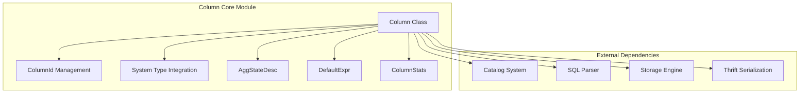
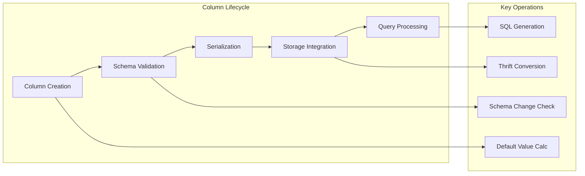
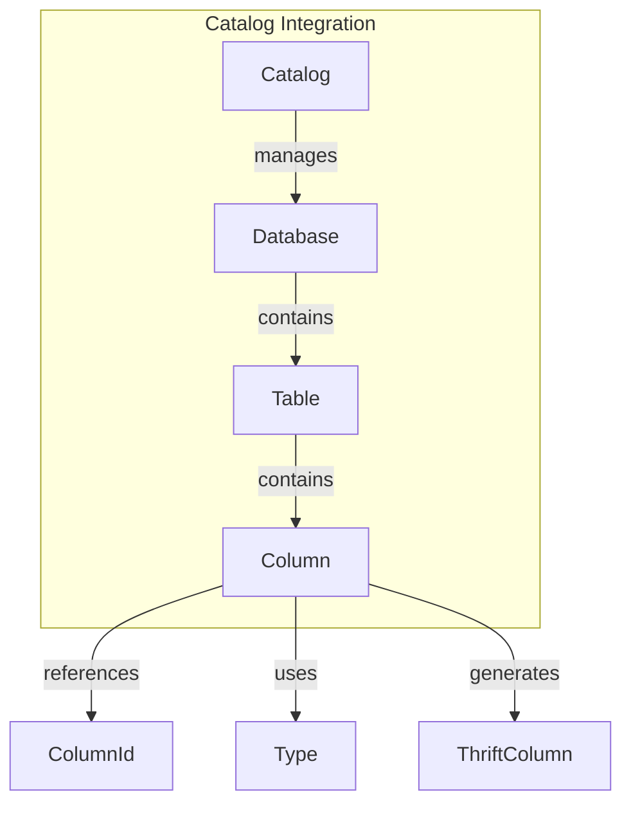
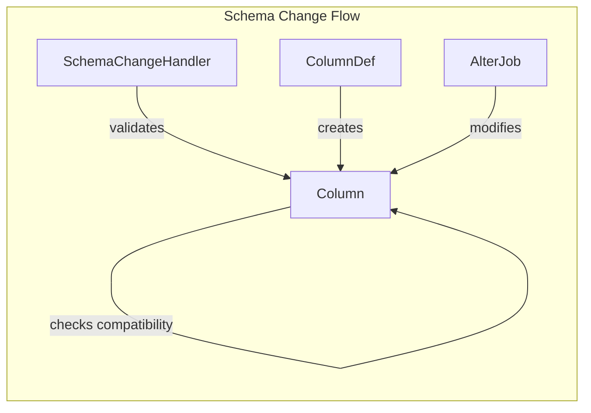
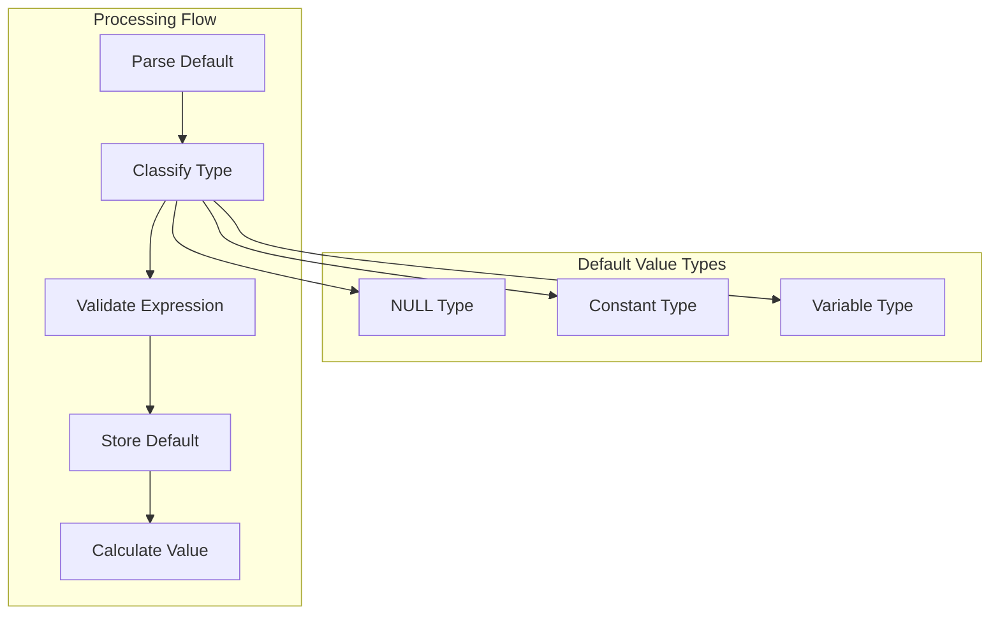
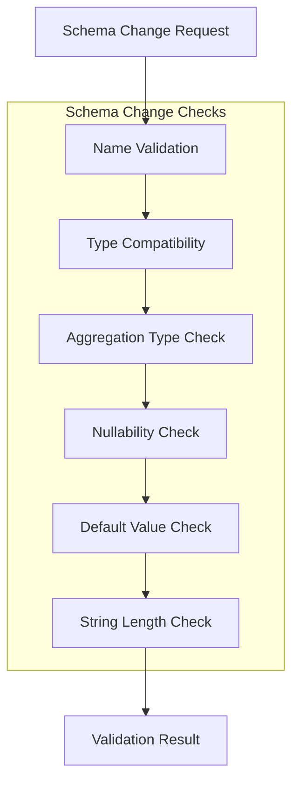

# Column Core Module Documentation

## Introduction

The `column_core` module is the foundational component of StarRocks' column management system, providing the core `Column` class that represents column metadata throughout the database system. This module serves as the central abstraction for column-related information, handling everything from basic column properties to complex aggregation states and generated column expressions.

## Core Functionality

### Primary Responsibilities

The `Column` class in this module is responsible for:

- **Column Metadata Management**: Storing and managing all column-related metadata including names, types, constraints, and properties
- **Schema Evolution Support**: Enabling safe schema changes through compatibility checking and validation
- **Aggregation State Handling**: Managing complex aggregation types and intermediate result states
- **Generated Column Support**: Handling computed columns with expression-based definitions
- **Default Value Management**: Supporting both constant and expression-based default values
- **Serialization/Deserialization**: Providing persistence capabilities for column metadata

### Key Features

#### Column Identity Management
- **Logical Name vs Column ID**: Maintains separation between user-visible column names and internal persistent identifiers
- **Unique ID Assignment**: Each column receives a unique identifier for internal reference
- **Name Change Support**: Allows column renaming while preserving internal references through column IDs

#### Type System Integration
- **Complex Type Support**: Handles nested types (arrays, maps, structs) and primitive types
- **Aggregation Type Management**: Supports various aggregation functions (SUM, MAX, MIN, REPLACE, etc.)
- **AGG_STATE_UNION**: Special handling for aggregate function states with intermediate results

#### Constraint and Property Management
- **Nullability Control**: Manages NULL/NOT NULL constraints
- **Key Column Designation**: Tracks whether columns are part of the primary key
- **Auto-increment Support**: Handles auto-incrementing column properties
- **Comment Storage**: Maintains column descriptions and documentation

## Architecture

### Component Structure



### Data Flow Architecture



## Component Relationships

### Integration with Catalog System

The `Column` class integrates deeply with the catalog system:



### Schema Change Integration



## Key Components Deep Dive

### Column Class Structure

The `Column` class contains several key attribute groups:

#### Identity Attributes
- `name`: Logical column name (user-visible)
- `columnId`: Persistent internal identifier
- `uniqueId`: Unique column identifier
- `physicalName`: Physical column name in storage (for column mapping)

#### Type and Constraint Attributes
- `type`: Column data type information
- `aggregationType`: Aggregation function type
- `aggStateDesc`: Aggregate state descriptor for complex aggregations
- `isKey`: Whether column is part of primary key
- `isAllowNull`: NULL constraint
- `isAutoIncrement`: Auto-increment property

#### Default Value System
- `defaultValue`: Constant default value
- `defaultExpr`: Expression-based default value
- Support for both constant and variable expressions (like `now()`, `uuid()`)

#### Advanced Features
- `generatedColumnExpr`: Expression for computed columns
- `defineExpr`: Expression for materialized view columns
- `stats`: Column statistics for optimization
- `comment`: Column documentation

### Default Value Management

The module implements a sophisticated default value system:



### Schema Change Validation

The module provides comprehensive schema change validation:



## System Integration

### Storage Engine Integration

The `Column` class provides Thrift serialization for storage engine communication:

- **TColumn Conversion**: Converts column metadata to Thrift format
- **Index Flag Management**: Sets bitmap index and bloom filter flags
- **Aggregation Type Mapping**: Maps internal aggregation types to Thrift equivalents

### Query Engine Integration

- **SQL Generation**: Generates SQL representations for queries
- **Expression Handling**: Manages column expressions for computed columns
- **Statistics Integration**: Provides column statistics for query optimization

### Materialized View Support

- **Define Expression Management**: Handles expressions for materialized view columns
- **Dependency Tracking**: Tracks column dependencies for generated columns
- **Schema Compatibility**: Ensures materialized view schema compatibility

## Dependencies

### Internal Dependencies

- **[column_identity](column_identity.md)**: Column ID management and case-insensitive comparison
- **[type_system](type_system.md)**: Type definitions and validation
- **[column_statistics](column_statistics.md)**: Column statistics and metadata

### External Dependencies

- **Catalog System**: Table and database metadata management
- **SQL Parser**: Expression parsing and validation
- **Storage Engine**: Physical column representation and indexing
- **Thrift Framework**: Cross-service communication

## Usage Patterns

### Column Creation

```java
// Basic column creation
Column col = new Column("user_id", Type.BIGINT, true); // key column

// Column with constraints
Column col = new Column("username", Type.VARCHAR, false, "User name field");

// Column with default value
Column col = new Column("created_at", Type.DATETIME, false, 
    new ColumnDef.DefaultValueDef(true, new StringLiteral("CURRENT_TIMESTAMP")));
```

### Schema Validation

```java
// Check schema compatibility
public void validateSchemaChange(Column newColumn) throws DdlException {
    existingColumn.checkSchemaChangeAllowed(newColumn);
}
```

### Serialization

```java
// Convert to Thrift for storage engine
TColumn tColumn = column.toThrift();

// SQL generation for queries
String sql = column.toSql(idToColumnMap);
```

## Performance Considerations

### Memory Efficiency
- **Lazy Initialization**: Statistics and expressions are initialized on demand
- **String Interning**: Column names and IDs use string interning for memory efficiency
- **Object Pooling**: Reuses column objects where possible

### Serialization Performance
- **Gson Optimization**: Custom Gson serialization for complex objects
- **Thrift Caching**: Caches Thrift representations when possible
- **Minimal Copying**: Reduces object copying during serialization

## Error Handling

### Validation Errors
- **Schema Change Errors**: Detailed error messages for incompatible schema changes
- **Type Validation**: Comprehensive type checking and validation
- **Expression Validation**: Syntax and semantic validation for column expressions

### Exception Types
- `DdlException`: For schema definition and modification errors
- `IllegalArgumentException`: For invalid constructor parameters
- `IOException`: For serialization/deserialization errors

## Future Enhancements

### Planned Features
- **Enhanced Type System**: Support for more complex data types
- **Improved Statistics**: More detailed column statistics
- **Expression Optimization**: Better optimization for generated column expressions
- **Schema Versioning**: Enhanced schema version management

### Extension Points
- **Custom Aggregation Types**: Plugin system for custom aggregation functions
- **Type Plugins**: Extensible type system for custom data types
- **Validation Plugins**: Custom validation rules for schema changes

## Conclusion

The `column_core` module provides the foundational column abstraction for the entire StarRocks system. Its comprehensive design handles everything from basic column properties to complex aggregation states and generated columns, while maintaining strong integration with the catalog system, storage engine, and query processor. The module's robust validation system ensures schema consistency and data integrity throughout the database lifecycle.