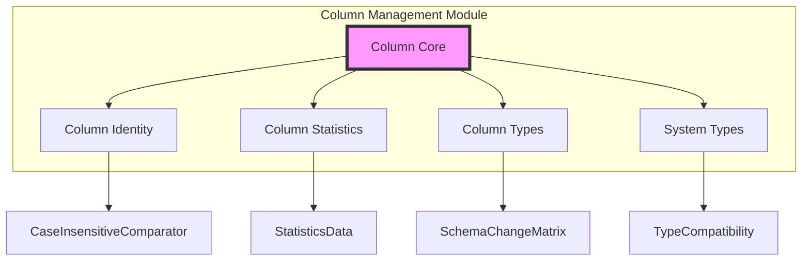

# Column Management Module

## Overview

The column_management module is a core component of StarRocks' catalog system, responsible for managing column metadata, types, and statistics. This module provides the foundational data structures and operations for defining, validating, and manipulating column definitions within tables.

## Purpose

The column_management module serves as the central authority for:
- Column metadata definition and validation
- Data type management and compatibility checking
- Column statistics collection and management
- Schema change support and validation
- Column identity management through unique identifiers

## Architecture



## Core Components

### 1. Column Core (`Column`)
The central class representing column metadata with support for:
- Column identification and naming
- Data type specification
- Aggregation type configuration
- Default value management
- Generated column expressions
- Schema change validation

### 2. Column Identity (`ColumnId`)
Manages unique column identification with:
- Case-insensitive column name handling
- Persistent column identity across renames
- Comparator implementations for sorting

### 3. Column Statistics (`ColumnStats`)
Handles column-level statistics including:
- Distinct value counts
- Null value tracking
- Average and maximum size metrics
- Statistics derivation from expressions

### 4. Column Types (`ColumnType`)
Provides type validation and schema change support:
- Type compatibility matrix
- Schema change validation rules
- Decimal type special handling

### 5. System Types (`Type`)
Comprehensive type system with:
- Primitive and complex type support
- Type compatibility and casting rules
- Assignment compatibility checking
- Nested type depth validation

## Key Features

### Schema Change Support
The module implements comprehensive schema change validation:
- Type compatibility checking
- Aggregation type preservation
- Default value consistency validation
- String length constraint enforcement

### Type System
Supports extensive type system including:
- Primitive types (numeric, string, date/time)
- Complex types (arrays, maps, structs)
- Special types (JSON, bitmap, HLL)
- Decimal types with precision and scale

### Statistics Management
Provides column-level statistics for query optimization:
- Cardinality estimation
- Data size metrics
- Null value analysis
- Expression-based statistics derivation

## Integration Points

The column_management module integrates with:
- **Catalog System**: Provides column metadata for table definitions
- **Query Optimizer**: Supplies column statistics for cost estimation
- **Storage Engine**: Defines column types and constraints
- **SQL Parser**: Validates column definitions in DDL statements

## Sub-modules

The column_management module consists of several specialized sub-modules:

### [Column Core](column_core.md)
Manages the fundamental column metadata and operations including column definition, validation, and schema change support.

### [Column Identity](column_identity.md)
Handles column identification and naming conventions with case-insensitive comparison and persistent identity management.

### [Column Statistics](column_statistics.md)
Provides comprehensive statistics collection and management for query optimization and cost estimation.

### [Type System](type_system.md)
Implements the complete type system and compatibility rules including primitive types, complex types, and casting rules.

## Usage Examples

### Column Creation
```java
Column column = new Column("user_id", Type.BIGINT, true, null, null, false, null, "User identifier");
```

### Schema Change Validation
```java
column.checkSchemaChangeAllowed(newColumn);
```

### Statistics Collection
```java
ColumnStats stats = ColumnStats.fromExpr(expression);
```

## Best Practices

1. **Column Naming**: Use consistent naming conventions and leverage case-insensitive comparisons
2. **Type Selection**: Choose appropriate types considering storage efficiency and query performance
3. **Statistics Updates**: Regularly update column statistics for optimal query planning
4. **Schema Changes**: Validate schema changes thoroughly before implementation

## Related Documentation

- [Catalog Management](catalog.md)
- [Table Structure Management](table_structure.md)
- [Schema Change Management](schema_change.md)
- [Query Optimization](query_optimizer.md)