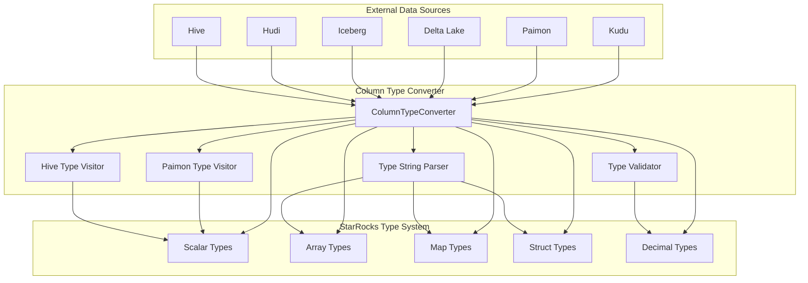
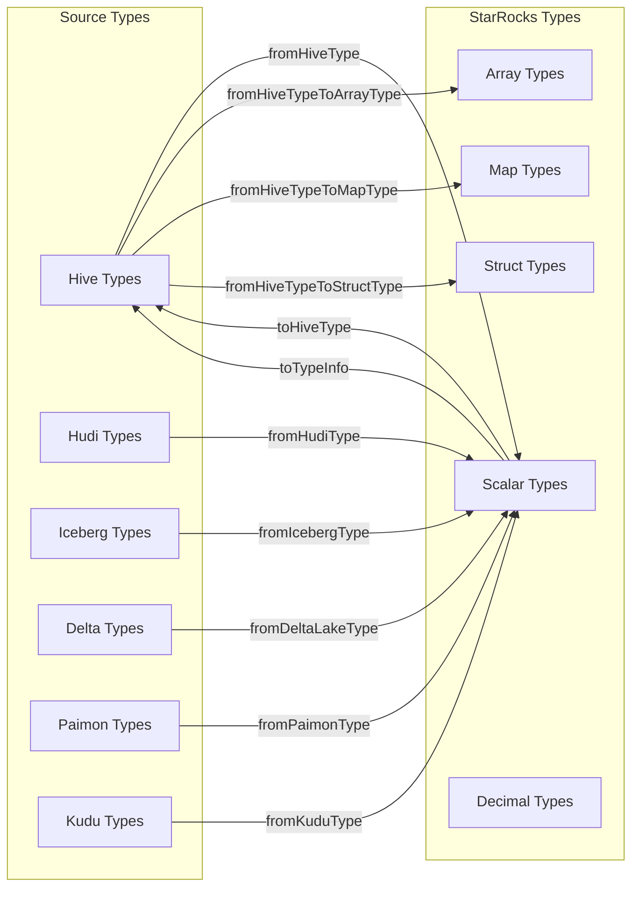
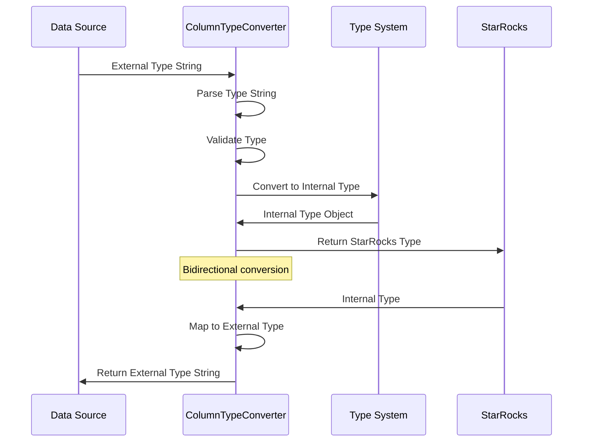
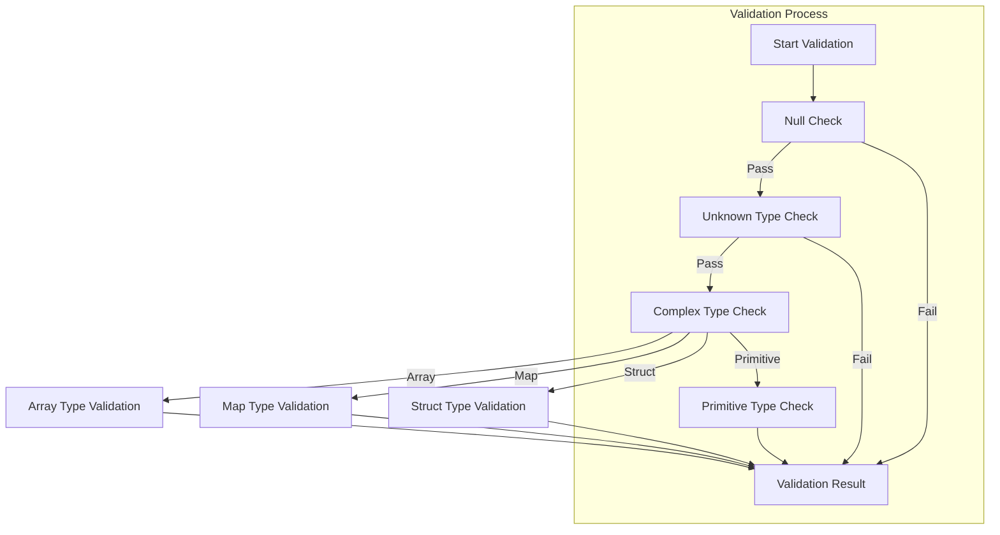
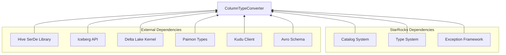

# Column Type Converter Module

## Introduction

The Column Type Converter module is a critical component of StarRocks' connector framework that handles type conversion between external data sources and StarRocks' internal type system. This module enables seamless data integration by providing bidirectional type mapping capabilities across multiple data formats and storage systems.

## Architecture Overview



## Core Components

### ColumnTypeConverter Class

The `ColumnTypeConverter` class serves as the central hub for all type conversion operations. It provides static methods for converting between external data source types and StarRocks internal types.

#### Key Responsibilities:
- **Bidirectional Type Mapping**: Convert from external types to StarRocks types and vice versa
- **Complex Type Support**: Handle nested structures like arrays, maps, and structs
- **Type Validation**: Ensure type compatibility between different systems
- **Format-Specific Logic**: Implement specialized conversion logic for each data source

## Type Conversion Matrix



## Data Flow Architecture



## Supported Data Sources

### 1. Hive Type Conversion

The module provides comprehensive support for Hive data types through `fromHiveType()` and `toHiveType()` methods.

**Supported Hive Types:**
- Primitive: TINYINT, SMALLINT, INT, BIGINT, FLOAT, DOUBLE, DECIMAL, BOOLEAN, STRING, VARCHAR, CHAR, DATE, TIMESTAMP, BINARY
- Complex: ARRAY, MAP, STRUCT

**Key Features:**
- Pattern-based type string parsing using regex
- Support for parameterized types (DECIMAL, VARCHAR, CHAR)
- Complex type decomposition and reconstruction

### 2. Hudi Type Conversion

Specialized conversion for Hudi's Avro-based type system through `fromHudiType()` and `fromHudiTypeToHiveTypeString()`.

**Key Features:**
- Avro schema processing with logical type support
- Union type handling with nullability
- Custom timestamp and date logical types
- MOR (Merge On Read) specific optimizations

### 3. Iceberg Type Conversion

Handles Apache Iceberg's type system through `fromIcebergType()` method.

**Supported Features:**
- Nested complex types (List, Map, Struct)
- UUID and Binary type support
- Timestamp with timezone handling
- Decimal precision scaling

### 4. Delta Lake Type Conversion

Converts Delta Lake kernel types via `fromDeltaLakeType()` method.

**Special Features:**
- Column mapping mode support (ID, NAME)
- Delta-specific data types
- Metadata preservation for struct fields

### 5. Paimon Type Conversion

Implements visitor pattern for Paimon type conversion through `PaimonToHiveTypeVisitor`.

**Capabilities:**
- Row type to Struct conversion
- Local timestamp handling
- Binary and varbinary support

### 6. Kudu Type Conversion

Handles Kudu column schema types through `fromKuduType()` method.

**Features:**
- UNIXTIME_MICROS to DATETIME conversion
- Type attributes handling (precision, scale)
- VARCHAR length preservation

## Type Validation System



## Utility Functions

### String Parsing Utilities

The module includes sophisticated string parsing capabilities:

- **`getTypeKeyword()`**: Extract base type from complex type strings
- **`getPrecisionAndScale()`**: Parse decimal type parameters
- **`splitByFirstLevel()`**: Handle nested type structures
- **Regex Patterns**: Pre-compiled patterns for type string matching

### Type Information Conversion

- **`toTypeInfo()`**: Convert StarRocks types to Hive TypeInfo objects
- **Format-specific utilities**: Handle length constraints and type parameters

## Error Handling

The module implements comprehensive error handling:

- **`StarRocksConnectorException`**: Custom exception for type conversion failures
- **Validation failures**: Detailed error messages for unsupported type combinations
- **Pattern matching errors**: Specific error reporting for malformed type strings

## Integration Points

### Connector Framework Integration

The Column Type Converter integrates with the broader connector framework:

- **Metadata Discovery**: Used during table schema discovery
- **Query Planning**: Type compatibility checking during query optimization
- **Data Loading**: Type conversion during data ingestion
- **Schema Evolution**: Handling schema changes in external tables

### Dependencies



## Performance Considerations

### Optimization Strategies

1. **Static Method Design**: All conversion methods are static for minimal overhead
2. **Pattern Compilation**: Regex patterns are pre-compiled as static constants
3. **Visitor Pattern**: Used for complex type hierarchies (Paimon)
4. **Early Validation**: Type validation occurs before conversion attempts
5. **Immutable Collections**: Uses Guava's ImmutableList for thread safety

### Memory Management

- **String Interning**: Type strings are processed efficiently
- **Object Reuse**: Visitor pattern instances are singletons
- **Stream Processing**: Uses Java streams for collection processing

## Usage Examples

### Basic Type Conversion

```java
// Convert Hive type to StarRocks type
Type starrocksType = ColumnTypeConverter.fromHiveType("array<struct<a:int,b:string>>");

// Convert StarRocks type to Hive type
String hiveType = ColumnTypeConverter.toHiveType(ScalarType.createType(PrimitiveType.BIGINT));
```

### Complex Type Handling

```java
// Convert Hudi Avro schema
Schema avroSchema = // ... get Avro schema
Type convertedType = ColumnTypeConverter.fromHudiType(avroSchema);

// Convert Iceberg type
org.apache.iceberg.types.Type icebergType = // ... get Iceberg type
Type starrocksType = ColumnTypeConverter.fromIcebergType(icebergType);
```

### Type Validation

```java
// Validate type compatibility
boolean isCompatible = ColumnTypeConverter.validateColumnType(type1, type2);

// Check column equality
boolean columnsEqual = ColumnTypeConverter.columnEquals(column1, column2);
```

## Future Enhancements

### Planned Features

1. **Additional Data Sources**: Support for more external systems
2. **Enhanced Validation**: More sophisticated type compatibility checking
3. **Performance Optimization**: Caching mechanisms for frequent conversions
4. **Schema Evolution**: Better handling of schema changes over time

### Extensibility

The module is designed for easy extension:

- **Visitor Pattern**: Easy to add new data source support
- **Static Methods**: Simple to add new conversion functions
- **Modular Design**: Clear separation of concerns

## Related Documentation

- [Connector Framework Documentation](connector_framework.md)
- [Type System Documentation](type_system.md)
- [Catalog System Documentation](catalog.md)
- [Query Execution Documentation](query_execution.md)

## Conclusion

The Column Type Converter module is a foundational component that enables StarRocks to seamlessly integrate with various external data sources. Its comprehensive type mapping capabilities, robust error handling, and extensible design make it essential for the connector framework's success in providing unified data access across heterogeneous storage systems.