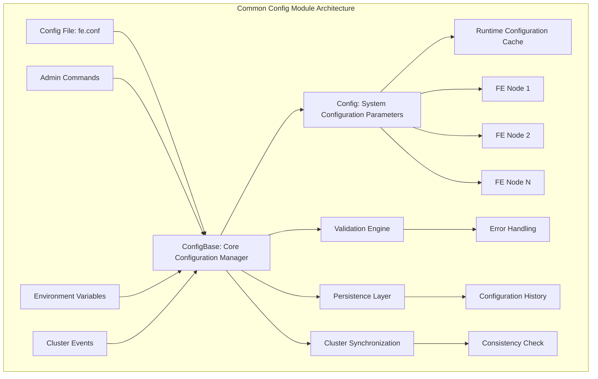
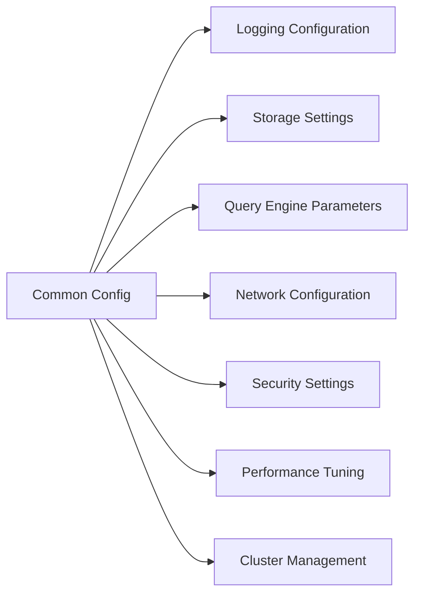
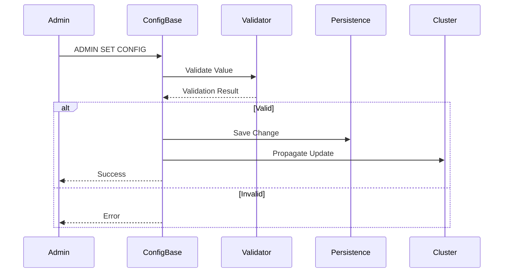

# Common Config Module Overview

## Purpose

The `common_config` module serves as the centralized configuration management system for StarRocks Frontend (FE) nodes. It provides a unified interface for loading, validating, persisting, and dynamically updating system-wide configuration parameters across the entire cluster. This module ensures configuration consistency, enables runtime modifications without system restarts, and maintains backward compatibility across different StarRocks versions.

## Architecture

## Core Components

### 1. Config Management (`config_management`)
- **Config Class**: Main configuration container with 500+ system parameters
- **ConfigBase Class**: Core configuration management functionality including loading, validation, and persistence
- **Features**: Runtime updates, cluster synchronization, environment variable substitution

### 2. System Constants (`system_constants`)
- **FeConstants**: System-wide constants (quotas, bloom filters, version info)
- **SchemaConstants**: Schema validation constants
- **Id**: Type-safe identity management system

### 3. Version Management (`version_management`)
- **StarRocksFEMetaVersion**: Metadata version tracking and compatibility management
- **Version History**: Tracks significant metadata format changes across releases

### 4. Status Handling (`status_handling`)
- **Status Class**: Unified error and status representation
- **Error Codes**: Standardized TStatusCode enum for consistent error reporting
- **Multi-format Support**: Thrift and Protocol Buffer conversion

## Key Features

### Configuration Categories

### Runtime Modification Flow

## Integration Points

The `common_config` module integrates with all major StarRocks components:

- **Frontend Server**: Provides configuration to all FE services and operations
- **Query Execution**: Supplies query engine configuration parameters
- **Storage Engine**: Manages storage-related configurations
- **SQL Parser & Optimizer**: Controls SQL processing configurations
- **Backend Server**: Coordinates with BE configuration through RPC

## Configuration Validation

The module implements comprehensive validation:
- Type checking for all configuration values
- Range validation for numeric parameters
- Interdependency validation between related configurations
- Security validation for sensitive parameters

## Cluster Consistency

Ensures configuration consistency across all FE nodes through:
- Automatic propagation of configuration changes
- Conflict resolution for concurrent updates
- Rollback capability for failed updates
- Synchronization status monitoring

## References to Core Components

For detailed documentation of sub-modules, see:
- [Config Management](config_management.md) - Detailed configuration system documentation
- [System Constants](system_constants.md) - System-wide constants and definitions
- [Version Management](version_management.md) - Metadata version management
- [Status Handling](status_handling.md) - Error and status management