# Common Utilities Module Documentation

## Overview

The `common_utilities` module provides a comprehensive set of utility functions and helper classes that are used throughout the StarRocks system. These utilities serve as the foundational building blocks for various system operations, including data processing, network communication, logging, and system management.

## Purpose and Scope

The common utilities module is designed to provide:

- **Cross-cutting functionality** used by multiple system components
- **Standardized implementations** for common operations
- **Performance optimizations** through efficient utility functions
- **System-wide consistency** in handling common tasks
- **Security features** for credential management and data protection

## Architecture Overview

```mermaid
graph TB
    subgraph "Common Utilities Module"
        AU[Arrow Utilities]
        CU[Compression Utils]
        CHR[Consistent Hash Ring]
        DU[Date Utils]
        DBU[Debug Utils]
        DC[DNS Cache]
        HL[HTTP Log Builder]
        KU[Kafka Utils]
        LU[List Utils]
        LP[Load Priority]
        LO[Log Utils]
        NU[Net Utils]
        PU[Parse Utils]
        PHR[Plain Hash Ring]
        PN[Platform Name]
        PRU[Proc Result Utils]
        PU2[Pulsar Utils]
        QSF[Query Statistics Formatter]
        RU[Range Utils]
        RP[Runtime Profile]
        RPP[Runtime Profile Parser]
        SSU[SR String Utils]
        SCR[SQL Credential Redactor]
        SU[SQL Utils]
        STU[String Utils]
        TU[Thread Utils]
        TU2[Time Utils]
        UU[UUID Utils]
        U[General Utils]
        WQ[Write Quorum]
    end
    
    AU --> |"Data Conversion"| DS[Data Structures]
    CU --> |"Compression"| IO[IO Operations]
    CHR --> |"Load Balancing"| DIST[Distributed Systems]
    DU --> |"Time Processing"| TS[Timestamp Handling]
    DBU --> |"Debugging"| LOG[Logging Systems]
    DC --> |"Network Resolution"| NET[Network Layer]
    HL --> |"HTTP Logging"| WEB[Web Services]
    KU --> |"Kafka Integration"| MSG[Message Systems]
    LU --> |"List Operations"| COLL[Collections]
    LP --> |"Priority Management"| SCHED[Scheduling]
    LO --> |"Logging"| AUDIT[Audit Systems]
    NU --> |"Network Utils"| COMM[Communication]
    PU --> |"Parsing"| PARS[Parser Components]
    PHR --> |"Hashing"| HASH[Hash Operations]
    RP --> |"Profiling"| PERF[Performance]
    RPP --> |"Profile Parsing"| ANAL[Analysis]
    SCR --> |"Security"| SEC[Security Layer]
    TU2 --> |"Time Management"| TIME[Time Services]
    UU --> |"ID Generation"| ID[ID Management]
```

## Core Functionality

### Data Processing Utilities

#### Arrow Utilities ([`arrow_utilities.md`](arrow_utilities.md))
Provides integration with Apache Arrow for efficient columnar data processing:
- **ArrowUtil**: Creates and manages Arrow vector schema roots and VarChar vectors
- Memory management through BufferAllocator
- Single schema root creation for simple data structures

#### Compression Utilities ([`compression_utils.md`](compression_utils.md))
Handles data compression and decompression operations:
- **CompressionUtils**: Supports multiple compression formats (LZ4, Snappy, Zlib, ZSTD, GZIP, BZIP2)
- String compression/decompression with GZIP
- Connector-specific compression type mappings
- Compression type validation and discovery

#### Date/Time Utilities ([`date_time_utils.md`](date_time_utils.md))
Comprehensive date and time processing functionality:
- **DateUtils**: Extensive date formatting and parsing capabilities
- Unix datetime formatter support
- Multiple date format patterns and validation
- Timezone-aware datetime processing
- Custom date format builders

#### Compression Utilities ([`compression_utils.md`](compression_utils.md))
Handles data compression and decompression operations:
- **CompressionUtils**: Supports multiple compression formats (LZ4, Snappy, Zlib, ZSTD, GZIP, BZIP2)
- String compression/decompression with GZIP
- Connector-specific compression type mappings
- Compression type validation and discovery

#### Date/Time Utilities ([`date_time_utils.md`](date_time_utils.md))
Comprehensive date and time processing functionality:
- **DateUtils**: Extensive date formatting and parsing capabilities
- Unix datetime formatter support
- Multiple date format patterns and validation
- Timezone-aware datetime processing
- Custom date format builders

### System Utilities

#### Debug Utilities ([`debug_utils.md`](debug_utils.md))
Provides debugging and diagnostic capabilities:
- **DebugUtil**: Performance metrics, memory usage tracking, time formatting
- Unique ID formatting and stack trace utilities
- Byte size formatting with human-readable units
- Query ID extraction for debugging contexts

#### Network Utilities ([`network_utils.md`](network_utils.md))
Network communication and connectivity utilities:
- **NetUtils**: IP address validation, port checking, hostname resolution
- IPv4/IPv6 support with proper formatting
- Subnet and CIDR operations
- Network interface enumeration

#### Time Utilities ([`time_utils.md`](time_utils.md))
System time management and timezone handling:
- **TimeUtils**: Timezone conversion, date parsing, time formatting
- System time zone management
- Epoch time conversions
- Time unit conversions and period calculations

### Security and Data Protection

#### SQL Credential Redactor ([`sql_credential_redactor.md`](sql_credential_redactor.md))
Security utility for protecting sensitive information:
- **SqlCredentialRedactor**: Removes credentials from SQL statements
- Support for multiple cloud provider credentials (AWS, Azure, GCP)
- Kafka and database credential protection
- Pattern-based credential detection and redaction

### Data Structure Utilities

#### List Utilities ([`list_utils.md`](list_utils.md))
Advanced list manipulation capabilities:
- **ListUtil**: Efficient list splitting and partitioning
- Round-robin distribution algorithms
- Memory-efficient list operations

#### Range Utilities ([`range_utils.md`](range_utils.md))
Mathematical range operations and validations:
- **RangeUtils**: Range comparison, intersection checking, conflict detection
- Partition key range management
- Range serialization and deserialization
- Complex range matching algorithms

### Performance and Monitoring

#### Runtime Profile ([`runtime_profile.md`](runtime_profile.md))
Comprehensive performance profiling system:
- **RuntimeProfile**: Hierarchical performance counter management
- Profile tree structures with parent-child relationships
- Counter aggregation and merging capabilities
- JSON and text-based profile formatting
- Performance bottleneck identification

#### Runtime Profile Parser ([`runtime_profile_parser.md`](runtime_profile_parser.md))
Profile data parsing and reconstruction:
- **RuntimeProfileParser**: Reconstructs profiles from text output
- Multi-format counter parsing (bytes, units, timers)
- Hierarchical profile structure reconstruction
- Performance data extraction and analysis

### Messaging and Streaming

#### Kafka Utilities ([`kafka_utils.md`](kafka_utils.md))
Apache Kafka integration and management:
- **KafkaUtil**: Kafka partition management, offset tracking
- Broker communication and metadata retrieval
- Routine load integration with Kafka
- Proxy-based Kafka operations for security

#### Pulsar Utilities ([`pulsar_utils.md`](pulsar_utils.md))
Apache Pulsar messaging system integration:
- **PulsarUtil**: Pulsar partition and subscription management
- Backlog monitoring and message tracking
- Proxy-based Pulsar operations
- Integration with StarRocks streaming capabilities

### System Information and Platform

#### Platform Information ([`platform_info.md`](platform_info.md))
System platform detection and information:
- **PlatformName**: Operating system and architecture detection
- Platform-specific configuration support
- System property management

#### UUID Utilities ([`uuid_utils.md`](uuid_utils.md))
Unique identifier generation and management:
- **UUIDUtil**: High-performance UUID generation using UUIDv7
- Thread-local UUID factories for performance
- TUniqueId conversion utilities
- Time-based UUID generation

### Load Management and Scheduling

#### Load Priority ([`load_priority.md`](load_priority.md))
Load balancing and priority management:
- **LoadPriority**: Configurable load priority levels
- Priority-based task scheduling
- Load distribution algorithms

#### Write Quorum ([`write_quorum.md`](write_quorum.md))
Distributed write consistency management:
- **WriteQuorum**: Quorum-based write operations
- Consistency level configuration
- Write operation validation

### String and Text Processing

#### String Utilities ([`string_utils.md`](string_utils.md))
Advanced string manipulation and processing:
- **SRStringUtils**: Random string generation, table/column name comparison
- Case-sensitive and case-insensitive comparisons
- Security-conscious string operations

#### SQL Utilities ([`sql_utils.md`](sql_utils.md))
SQL statement processing and validation:
- **SqlUtils**: SQL prefix extraction, identifier escaping
- Pre-query SQL detection and handling
- SQL statement validation and processing

### Hashing and Distribution

#### Consistent Hash Ring ([`consistent_hash_ring.md`](consistent_hash_ring.md))
Distributed hash ring implementation:
- **ConsistentHashRing**: Virtual node-based consistent hashing
- Node addition and removal support
- Distributed load balancing
- Hash function abstraction

#### Plain Hash Ring ([`plain_hash_ring.md`](plain_hash_ring.md))
Simple hash-based distribution:
- **PlainHashRing**: Basic hash ring implementation
- Simple modulo-based distribution
- Lightweight hashing operations

## Integration Points

The common utilities module integrates with various StarRocks components:

- **Storage Engine**: Compression, serialization, and data format utilities
- **Query Execution**: Performance profiling, timing, and statistics
- **Network Layer**: Connection management, DNS resolution, and protocol handling
- **Security Layer**: Credential protection and data sanitization
- **System Management**: Platform detection, resource monitoring, and configuration

## Performance Considerations

- **Thread Safety**: Most utilities are designed for concurrent access
- **Memory Efficiency**: Optimized data structures and minimal allocations
- **Caching**: Strategic caching for expensive operations (DNS, parsing)
- **Lazy Initialization**: Resources are created only when needed
- **Resource Management**: Proper cleanup and lifecycle management

## Security Features

- **Credential Redaction**: Automatic removal of sensitive data from logs
- **Input Validation**: Comprehensive validation for all external inputs
- **Secure Random Generation**: Cryptographically secure random number generation
- **Network Security**: Safe network operations and connection handling

## Error Handling

- **Graceful Degradation**: Utilities continue operation even with partial failures
- **Comprehensive Logging**: Detailed error information for debugging
- **Exception Translation**: System-specific exceptions converted to standard types
- **Recovery Mechanisms**: Automatic retry and recovery for transient failures

## Dependencies

The common utilities module has minimal external dependencies to maintain system stability:

- **Apache Arrow**: For columnar data processing
- **Google Guava**: For collection utilities and caching
- **Apache Commons**: For network and validation utilities
- **Standard Java Libraries**: For core functionality

This modular design ensures that the common utilities can be reliably used across all StarRocks components while maintaining system performance and security standards.