# Compaction Control Module

## Introduction

The compaction_control module is a critical component of StarRocks' storage management system, responsible for managing and coordinating compaction operations across the database. Compaction is the process of merging multiple smaller data files into larger, more optimized files to improve query performance and reduce storage overhead. This module provides centralized control and scheduling of compaction tasks, ensuring efficient resource utilization while maintaining system stability.

## Overview

The compaction_control module serves as the orchestration layer for all compaction activities in StarRocks. It handles compaction scheduling, resource allocation, conflict resolution, and monitoring of compaction tasks across different storage engines and table types. The module integrates with various storage subsystems including local storage, lake storage, and persistent indexes to provide comprehensive compaction management.

## Architecture

### High-Level Architecture

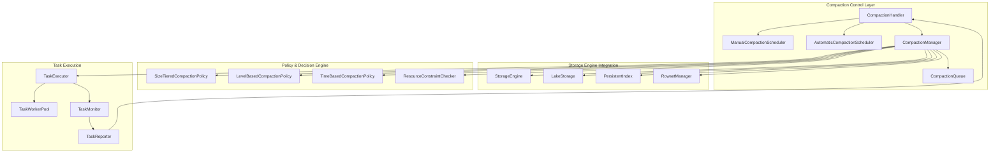

### Component Relationships

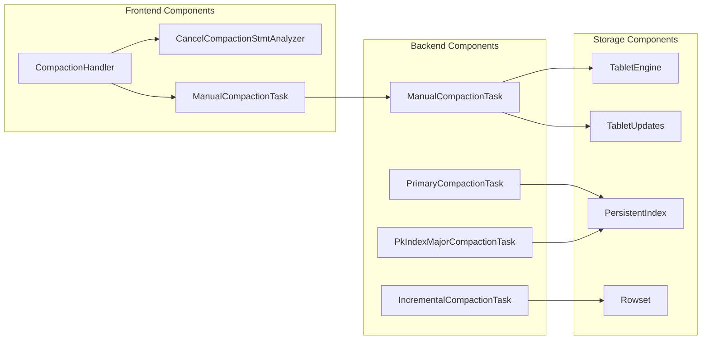

## Core Components

### CompactionHandler

The `CompactionHandler` is the central coordinator for all compaction operations in the frontend. It manages compaction requests, validates compaction eligibility, and coordinates with backend nodes to execute compaction tasks.

**Key Responsibilities:**
- Process manual compaction requests from users
- Coordinate automatic compaction scheduling
- Handle compaction cancellation requests
- Monitor compaction progress and status
- Resolve compaction conflicts and resource contention

**Integration Points:**
- Interfaces with the ALTER system for schema change coordination
- Communicates with backend nodes via RPC for task execution
- Integrates with the transaction manager for consistency guarantees
- Works with the metadata system for tablet state management

### Compaction Policies

The module implements multiple compaction strategies to optimize for different workloads and storage patterns:

#### Size-Tiered Compaction Policy
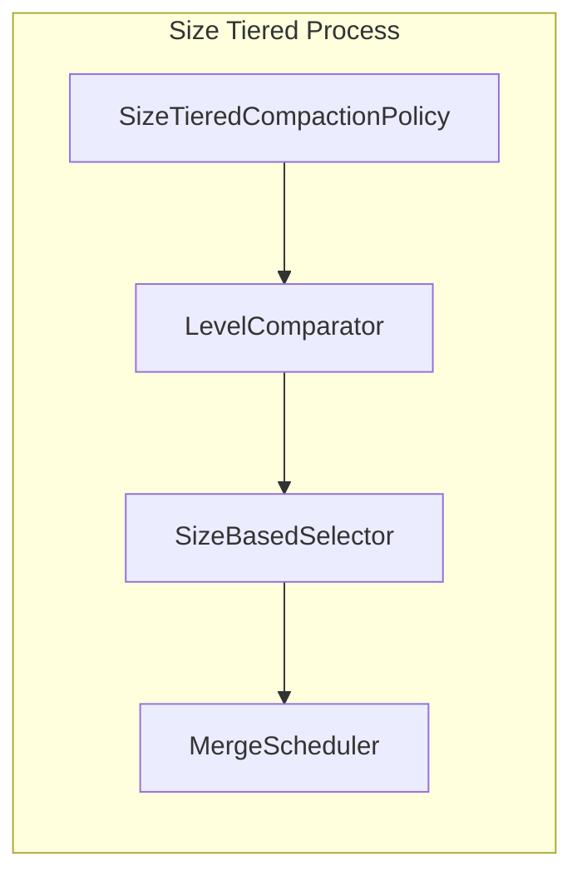

- Groups rowsets by size tiers
- Merges similarly-sized rowsets together
- Optimizes for write-heavy workloads
- Minimizes write amplification

#### Lake Storage Compaction Policy
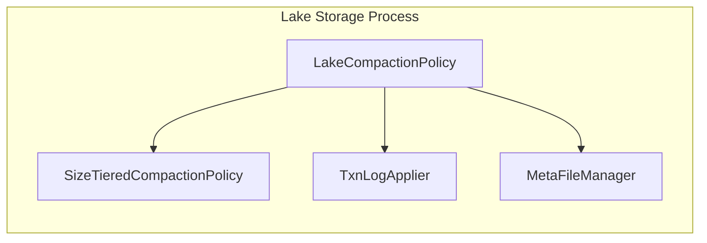

- Specialized compaction for lake storage format
- Handles transactional consistency
- Manages metadata updates during compaction
- Supports cloud-native storage patterns

### Task Management System

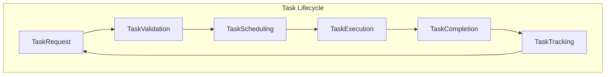

**Task Types:**
- **ManualCompactionTask**: User-initiated compaction operations
- **PrimaryCompactionTask**: Compaction for primary key tables
- **IncrementalCompactionTask**: Incremental compaction for append-only data
- **PkIndexMajorCompactionTask**: Major compaction for persistent indexes

## Data Flow

### Compaction Request Flow

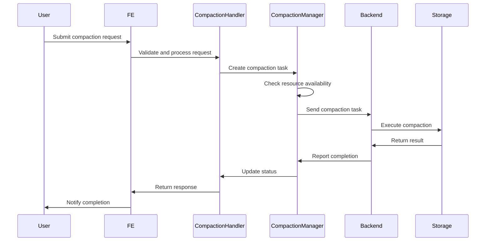

### Compaction Decision Flow

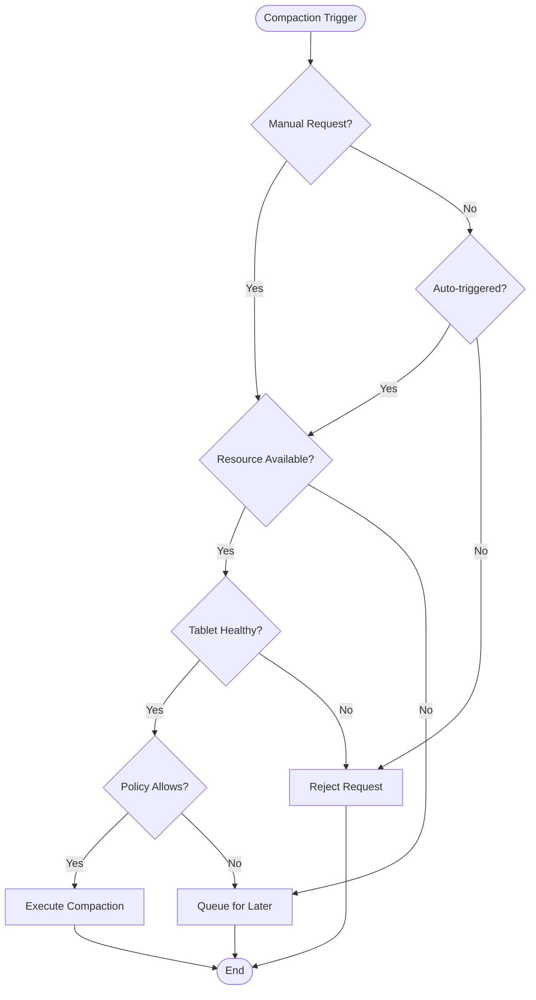

## Integration with Storage Engine

### Tablet-Level Compaction

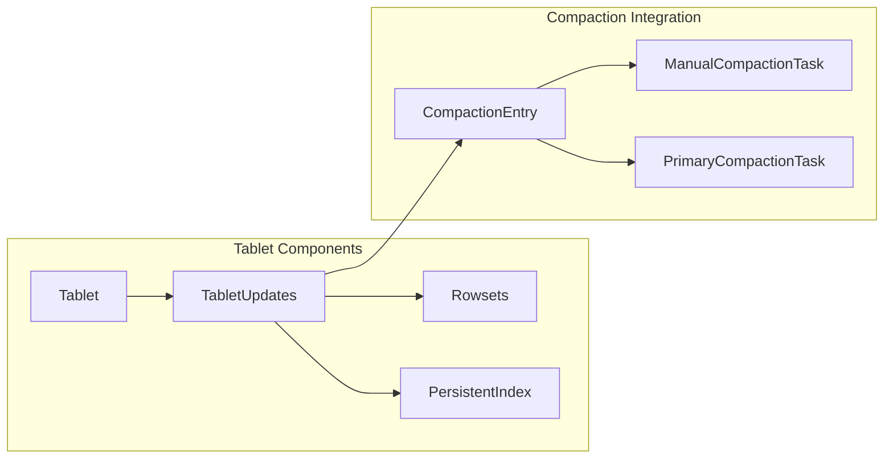

The compaction_control module integrates deeply with the tablet management system:

- **TabletUpdates**: Manages versioned data updates and compaction state
- **Rowset Management**: Handles rowset lifecycle during compaction
- **Persistent Index**: Coordinates index compaction with data compaction
- **Version Graph**: Maintains consistency across compaction operations

### Resource Management

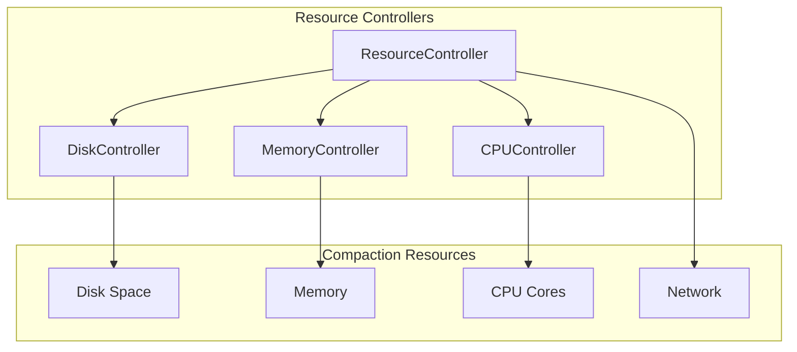

## Configuration and Monitoring

### Key Configuration Parameters

- `compaction_max_memory`: Maximum memory allocation for compaction operations
- `compaction_task_queue_size`: Size of the compaction task queue
- `compaction_check_interval_seconds`: Interval for checking compaction eligibility
- `max_compaction_concurrency`: Maximum concurrent compaction tasks
- `compaction_trace_threshold`: Threshold for tracing slow compactions

### Monitoring and Metrics

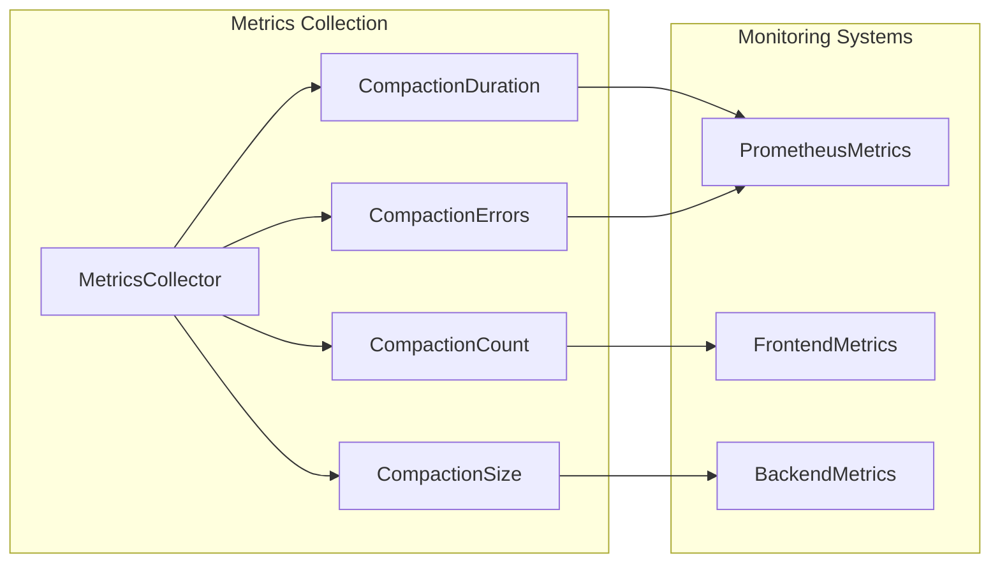

## Error Handling and Recovery

### Compaction Failure Scenarios

1. **Resource Exhaustion**: Automatic backoff and retry with reduced resource allocation
2. **Disk Space Issues**: Pre-compaction space validation and cleanup procedures
3. **Version Conflicts**: Conflict resolution through version graph analysis
4. **Network Failures**: Retry mechanisms with exponential backoff
5. **Data Corruption**: Validation checks and rollback capabilities

### Recovery Mechanisms

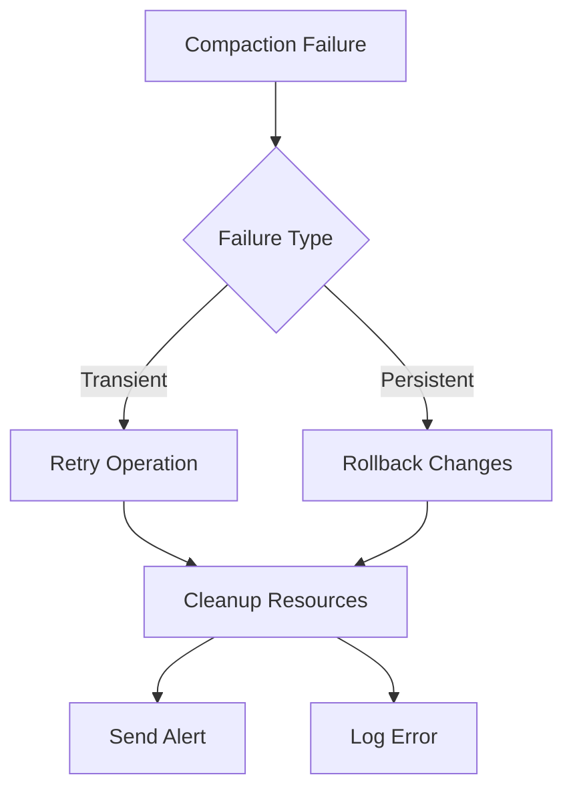

## Performance Optimization

### Compaction Scheduling Strategies

1. **Time-based Scheduling**: Off-peak hours for large compactions
2. **Size-based Scheduling**: Priority to larger compactions for better ROI
3. **Query-pattern Scheduling**: Optimize based on query access patterns
4. **Resource-aware Scheduling**: Balance with other system workloads

### Optimization Techniques

- **Incremental Compaction**: Process only changed data segments
- **Parallel Compaction**: Utilize multiple cores for large compactions
- **Smart Filtering**: Skip unnecessary data during compaction
- **Compression Optimization**: Choose optimal compression algorithms

## Security and Access Control

### Permission Model

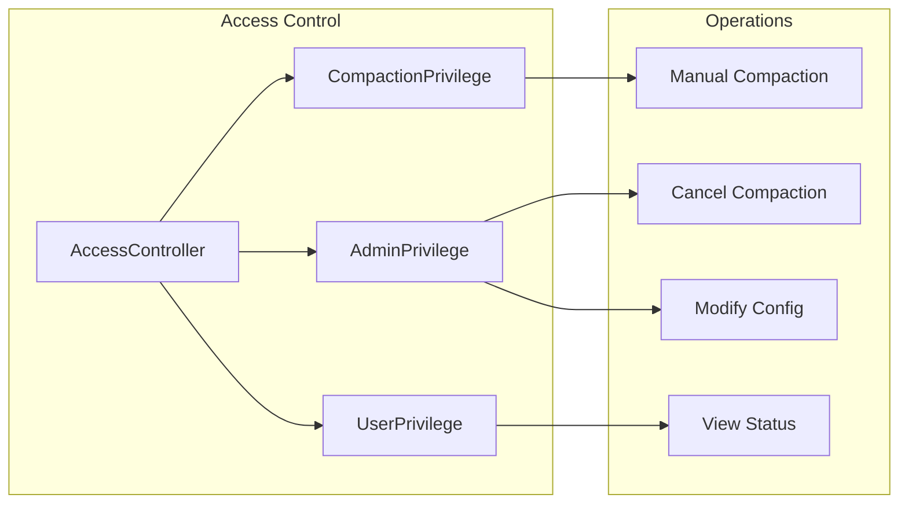

## Dependencies

### Internal Dependencies

- **[storage_engine](storage_engine.md)**: Core storage management and tablet operations
- **[alter](alter.md)**: Schema change coordination and resource management
- **[transaction](transaction.md)**: Transaction consistency during compaction
- **[query_scheduler](query_scheduler.md)**: Resource allocation and task scheduling

### External Dependencies

- **RPC Framework**: Communication with backend nodes
- **Metadata Service**: Tablet and partition metadata management
- **Metrics System**: Performance monitoring and alerting
- **Configuration Service**: Dynamic configuration management

## Best Practices

### Operational Guidelines

1. **Monitor Compaction Metrics**: Regular monitoring of compaction duration, frequency, and success rates
2. **Resource Planning**: Ensure adequate disk space and memory for compaction operations
3. **Schedule Management**: Balance automatic and manual compaction to avoid resource conflicts
4. **Error Response**: Implement proper alerting and response procedures for compaction failures

### Performance Tuning

1. **Policy Selection**: Choose appropriate compaction policy based on workload characteristics
2. **Concurrency Control**: Adjust compaction concurrency based on system resources
3. **Threshold Tuning**: Optimize compaction triggers for your specific use case
4. **Monitoring Setup**: Implement comprehensive monitoring for proactive issue detection

## Future Enhancements

### Planned Improvements

1. **Machine Learning Integration**: Predictive compaction scheduling based on access patterns
2. **Cloud-Native Optimization**: Enhanced support for cloud storage patterns
3. **Real-time Compaction**: Support for continuous compaction in streaming scenarios
4. **Cross-Table Compaction**: Optimization opportunities across related tables

### Scalability Enhancements

- **Distributed Coordination**: Improved coordination across large clusters
- **Hierarchical Management**: Multi-level compaction management for better scalability
- **Adaptive Policies**: Self-tuning compaction policies based on system feedback
- **Resource Isolation**: Better isolation between compaction and query workloads