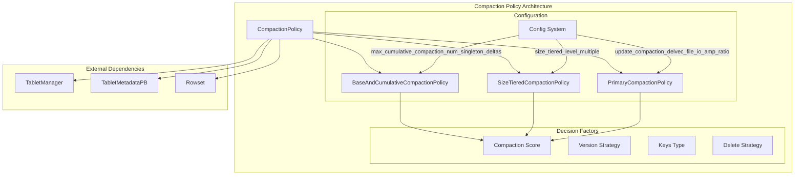
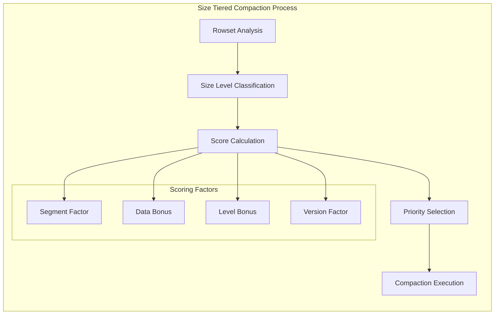
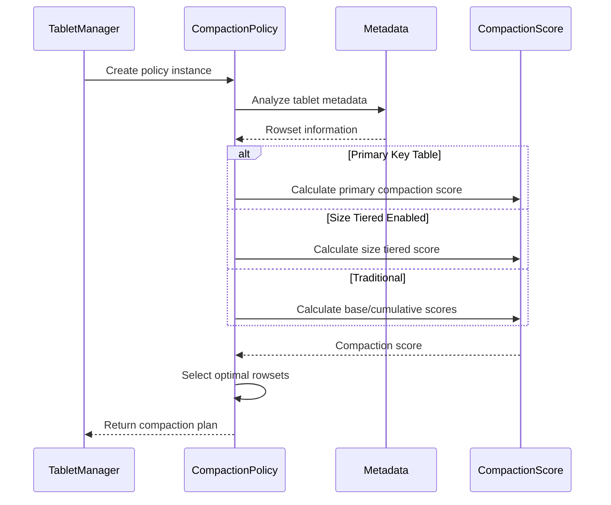
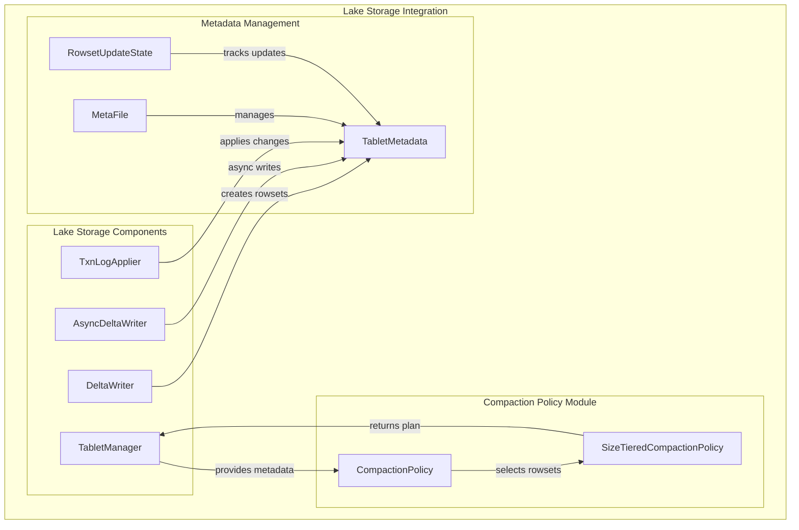

# Compaction Policy Module

## Introduction

The compaction_policy module is a critical component of StarRocks' lake storage architecture that manages data compaction strategies for optimizing storage efficiency and query performance. This module implements intelligent algorithms to determine when and how to merge small data files (rowsets) into larger, more efficient files, balancing write amplification with read performance.

## Architecture Overview

The compaction policy module serves as the decision-making engine for the lake storage system's compaction operations. It analyzes tablet metadata, evaluates various compaction strategies, and selects the optimal set of rowsets to compact based on configurable criteria and data characteristics.



## Core Components

### 1. CompactionPolicy (Abstract Base Class)

The foundation class that defines the interface for all compaction strategies:

- **Purpose**: Provides a unified interface for different compaction algorithms
- **Key Methods**:
  - `pick_rowsets()`: Selects rowsets for compaction
  - `choose_compaction_algorithm()`: Determines the compaction execution method
  - `create()`: Factory method for creating appropriate policy instances

### 2. SizeTieredCompactionPolicy

Implements a size-tiered compaction strategy that groups rowsets by size levels:



**Key Features**:
- Groups rowsets into size-based levels
- Calculates compaction scores considering segment count, data size, and version pressure
- Supports both duplicate and aggregate/unique key tables with different optimization strategies
- Handles delete predicates intelligently

**Scoring Algorithm**:
```
score = segment_num + data_bonus + level_bonus + version_limit_bonus
```

### 3. BaseAndCumulativeCompactionPolicy

Traditional compaction strategy separating base and cumulative compaction:

- **Base Compaction**: Compacts rowsets below the cumulative point
- **Cumulative Compaction**: Compacts rowsets above the cumulative point
- Uses segment count and version position as primary decision factors

### 4. PrimaryCompactionPolicy

Specialized policy for primary key tables with delete vector support:

- Considers delete vector file I/O amplification
- Supports real-time compaction strategy
- Calculates scores based on both segment numbers and SSTable counts

## Data Flow and Decision Process



## Configuration and Tuning

The module provides extensive configuration options for fine-tuning compaction behavior:

### Size Tiered Configuration
- `size_tiered_level_multiple`: Size multiplier between levels (default: 5)
- `size_tiered_min_level_size`: Minimum level size threshold
- `size_tiered_level_num`: Maximum number of size levels
- `enable_size_tiered_compaction_strategy`: Enable/disable size tiered strategy

### Compaction Limits
- `max_cumulative_compaction_num_singleton_deltas`: Maximum segments for cumulative compaction
- `max_base_compaction_num_singleton_deltas`: Maximum segments for base compaction
- `tablet_max_versions`: Maximum allowed versions per tablet
- `enable_lake_compaction_use_partial_segments`: Enable partial segment compaction

### Primary Key Specific
- `update_compaction_delvec_file_io_amp_ratio`: Delete vector I/O amplification factor

## Integration with Lake Storage

The compaction policy module integrates seamlessly with the lake storage architecture:



## Performance Considerations

### Scoring Optimization
- **Segment-based scoring**: Prioritizes reducing segment count for better read performance
- **Size-based bonuses**: Encourages merging similarly sized files to minimize write amplification
- **Version pressure handling**: Automatically increases priority when approaching version limits

### Algorithm Selection
- **Horizontal Compaction**: Used when storage paths are unavailable or for simple cases
- **Vertical Compaction**: Applied for wide tables with many columns
- **Cloud Native Index Compaction**: Specialized for index-only operations

## Error Handling and Monitoring

The module includes comprehensive error handling and logging:

- **Score Calculation Failures**: Falls back to zero score on calculation errors
- **Metadata Validation**: Validates tablet metadata before processing
- **Debug Logging**: Detailed logging at various verbosity levels for troubleshooting
- **Performance Metrics**: Tracks compaction scores and decision factors

## Dependencies

### Internal Dependencies
- [lake_storage](lake_storage.md): Core lake storage management
- [storage_engine](storage_engine.md): General storage utilities and configurations
- [tablet_management](tablet_management.md): Tablet lifecycle management

### External Dependencies
- Tablet metadata management system
- Configuration management framework
- Logging and monitoring infrastructure

## Future Enhancements

Potential areas for improvement include:

1. **Machine Learning Integration**: Adaptive scoring based on historical performance
2. **Workload-Aware Policies**: Different strategies for different workload patterns
3. **Predictive Compaction**: Proactive compaction based on data growth patterns
4. **Multi-dimensional Scoring**: Incorporating more factors like query patterns and resource availability

## Conclusion

The compaction_policy module represents a sophisticated approach to data compaction in lake storage environments. By implementing multiple strategies and providing extensive configuration options, it enables StarRocks to maintain optimal storage efficiency and query performance across diverse workload patterns and data characteristics. The modular design allows for easy extension and adaptation to future requirements while maintaining backward compatibility with existing deployments.