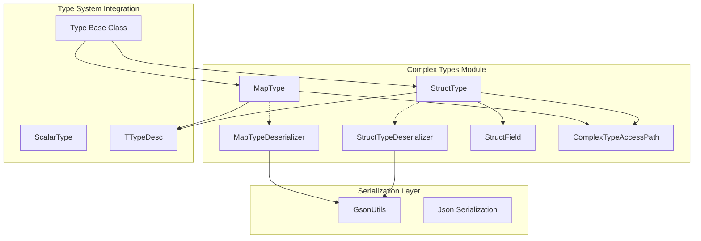

# Complex Types Module Documentation

## Overview

The `complex_types` module is a core component of the StarRocks type system that provides support for complex data types, specifically Map and Struct types. This module enables the database to handle nested and semi-structured data, which is essential for modern analytical workloads involving JSON, nested objects, and key-value pairs.

## Purpose and Scope

The complex_types module serves as the foundation for:
- **Map Types**: Key-value pair data structures with scalar keys and arbitrarily typed values
- **Struct Types**: Named field structures with multiple subfields of different types
- **Type Serialization/Deserialization**: JSON-based persistence and communication
- **Type Compatibility**: Type checking and validation for complex operations
- **Field Selection**: Pruning and selection of subfields for optimization

## Architecture Overview



## Core Components

### MapType
The `MapType` class represents a map data structure with:
- **Key Type**: Must be a scalar type
- **Value Type**: Can be any type (scalar or complex)
- **Field Selection**: Support for selecting key, value, or all subfields
- **Type Compatibility**: Matching and compatibility checking
- **Serialization**: JSON and Thrift serialization support

For detailed MapType documentation, see [map_type.md](map_type.md).

### StructType
The `StructType` class represents a structured data type with:
- **Named Fields**: Collection of `StructField` objects
- **Field Access**: Direct field access by name or position
- **Type Validation**: Duplicate field name prevention
- **Field Pruning**: Unused subfield removal for optimization
- **Nested Support**: Support for complex nested structures

For detailed StructType documentation, see [struct_type.md](struct_type.md).

### Deserialization Components
- **MapTypeDeserializer**: Custom JSON deserializer for MapType objects
- **StructTypeDeserializer**: Custom JSON deserializer for StructType objects
- **Gson Integration**: Integration with StarRocks' Gson utilities

## Key Features

### 1. Type Safety and Validation
- Comprehensive type checking and validation
- Duplicate field name detection in structs
- Type compatibility verification
- Null safety checks

### 2. Field Selection and Pruning
- Selective field access for optimization
- Subfield pruning to reduce data transfer
- Support for complex access paths
- Field selection propagation to nested types

### 3. Serialization Support
- JSON serialization/deserialization
- Thrift type description generation
- MySQL compatibility layer
- Pretty printing for debugging

### 4. Nested Type Support
- Arbitrary nesting depth (with safety limits)
- Recursive field selection
- Nested type compatibility checking
- Complex type cloning

## Integration with StarRocks Ecosystem

### Frontend Integration
The complex_types module integrates with the StarRocks frontend through:
- **Catalog System**: Type registration and management
- **SQL Parser**: Type parsing and validation
- **Query Optimizer**: Type-aware optimization
- **Analyzer**: Semantic analysis support

### Backend Integration
Integration with the backend includes:
- **Type System**: BE type mapping and conversion
- **Storage Engine**: Complex type storage and retrieval
- **Execution Engine**: Runtime type handling
- **Serialization**: Cross-component type communication

## Usage Examples

### Map Type Definition
```sql
-- Map with string keys and integer values
MAP<VARCHAR(100), INT>

-- Map with complex nested values
MAP<STRING, STRUCT<name:STRING, age:INT>>
```

### Struct Type Definition
```sql
-- Simple struct
STRUCT<name:STRING, age:INT, salary:DOUBLE>

-- Nested struct
STRUCT<
    id:INT,
    info:STRUCT<name:STRING, address:STRING>,
    scores:MAP<STRING, DOUBLE>
>
```

## Performance Considerations

### Memory Efficiency
- Field selection reduces memory usage
- Pruning eliminates unused subfields
- Lazy evaluation for nested structures

### Query Optimization
- Type-aware query planning
- Subfield pushdown for storage engines
- Selective column reading

### Serialization Performance
- Efficient JSON serialization
- Thrift binary protocol support
- Caching of type descriptors

## Dependencies and Relationships

### Related Modules
- **[type_system](type_system.md)**: Base type system integration
- **[catalog](catalog.md)**: Type registration and metadata management
- **[sql_parser_optimizer](sql_parser_optimizer.md)**: Type parsing and optimization
- **[storage_engine](storage_engine.md)**: Storage and retrieval of complex types

### External Dependencies
- **Gson**: JSON serialization library
- **Thrift**: Cross-language serialization framework
- **Apache Commons**: String utilities and validation

## Future Enhancements

### Planned Features
- **Array Type**: Native array type support
- **Union Type**: Support for union types
- **Schema Evolution**: Dynamic schema changes
- **Performance Optimizations**: Further optimization of type operations

### Extensibility
- Plugin architecture for custom types
- Type registry for dynamic type registration
- Custom serialization providers
- Type-specific optimization rules

## Conclusion

The complex_types module is a fundamental component that enables StarRocks to handle modern semi-structured data requirements. Through its robust implementation of Map and Struct types, comprehensive serialization support, and tight integration with the StarRocks ecosystem, it provides the foundation for advanced analytical workloads involving complex data structures.